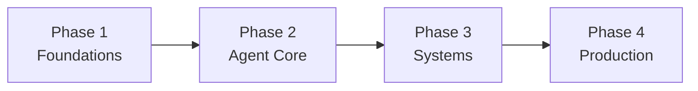

---
hide:
  - navigation
  - toc
---

AI Agent Learning Roadmap

# Learn AI Agents, Step by Step

A simple, ordered path to understand, build, and ship AI agents — from the basics to production.

[Start the Roadmap](roadmap.md){ .md-button .md-button--primary }
[Browse Stages](stages/index.md){ .md-button }

## How It Works

The roadmap has **14 stages**, grouped into **4 simple phases**. Follow them in order.

Phase 1
### Foundations
Prerequisites, LLMs, and prompts.

Phase 2
### Agent Core
Agent loops, tools, MCP, RAG, memory.

Phase 3
### Systems
Multi-agent, evaluation, security.

Phase 4
### Production
Deploy, monitor, and operate.

## Where to Start

- **New to AI agents?** Begin at [Stage 0 - Orientation](stages/00-orientation/index.md).
- **Already use LLM APIs?** Jump to [Stage 2 - LLM Fundamentals](stages/02-llm-fundamentals/index.md).
- **Building agents now?** Go to [Stage 4 - Agent Fundamentals](stages/04-agent-fundamentals/index.md).
- **Shipping to production?** Start at [Stage 11 - Evaluation](stages/11-evaluation-observability/index.md).

## The Learning Standard

!!! quote "Every stage follows the same simple bar"
    Learn the concept. Build one thing. Measure it. Fix one failure. Write down what you learned.

[See the Full Roadmap](roadmap.md){ .md-button .md-button--primary }
