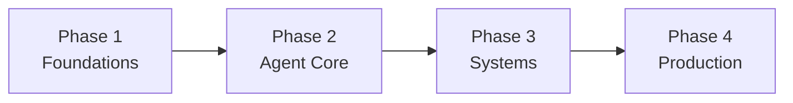

# Roadmap

14 stages, grouped into 4 phases. Follow them in order. This roadmap aligns with the [roadmap.sh AI Agents roadmap](https://roadmap.sh/ai-agents).

## Phase 1 — Foundations

Get the basics right before building agents.

- **[Stage 0 - Orientation](stages/00-orientation/index.md)** — what AI agents are and how to use this site
- **[Stage 1 - Prerequisites](stages/01-prerequisites/index.md)** — backend, APIs, Git, terminal, JSON, streaming
- **[Stage 2 - LLM Fundamentals](stages/02-llm-fundamentals/index.md)** — tokens, context, model choice, cost, controls
- **[Stage 3 - Prompt Engineering](stages/03-prompt-engineering/index.md)** — clear instructions, examples, and prompt testing

## Phase 2 — Agent Core

Build agents that reason and use tools.

- **[Stage 4 - Agent Fundamentals](stages/04-agent-fundamentals/index.md)** — the agent loop, ReAct, planning, stop rules
- **[Stage 5 - Tools and Actions](stages/05-tools-and-actions/index.md)** — tool design, schemas, function calling
- **[Stage 6 - MCP](stages/06-mcp/index.md)** — connect tools with the Model Context Protocol
- **[Stage 7 - RAG and Memory](stages/07-rag-and-memory/index.md)** — retrieval, embeddings, short- and long-term memory
- **[Stage 8 - Agent Architectures](stages/08-agent-architectures/index.md)** — ReAct, RAG, planner-executor, routing
- **[Stage 9 - Building Agents](stages/09-building-agents/index.md)** — direct APIs first, then frameworks

## Phase 3 — Systems

Coordinate, measure, and secure agents.

- **[Stage 10 - Multi-Agent Systems](stages/10-multi-agent-systems/index.md)** — supervisor-worker, handoffs, A2A
- **[Stage 11 - Evaluation and Observability](stages/11-evaluation-observability/index.md)** — tests, metrics, tracing
- **[Stage 12 - Security and Ethics](stages/12-security-ethics/index.md)** — prompt injection, permissions, red teaming

## Phase 4 — Production

Ship and operate real systems.

- **[Stage 13 - Production Deployment](stages/13-production-deployment/index.md)** — APIs, Docker, CI/CD, monitoring, cost

## Completion Standard

!!! failure "Not enough"
    I read articles about AI agents.

!!! success "Done well"
    I built a tool-using agent, tested it with 20 examples, measured cost and latency, fixed two failures, and wrote down the lessons.

---

See the full topic mapping in [Roadmap.sh Alignment](stages/roadmap-sh-alignment.md).
