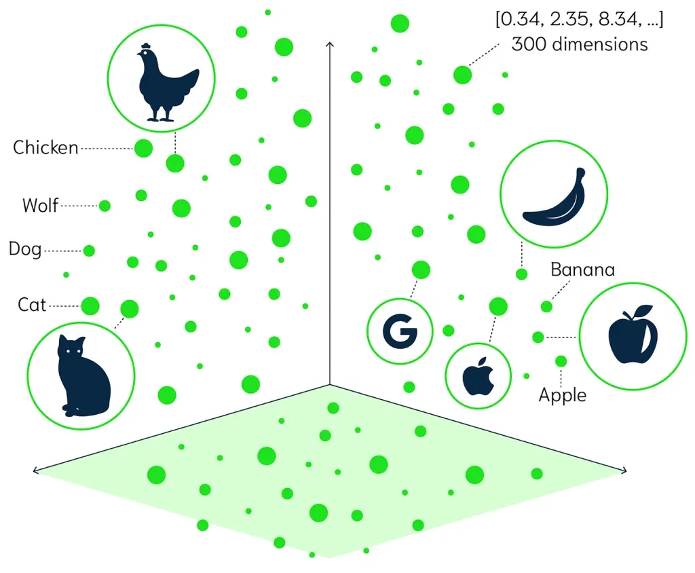
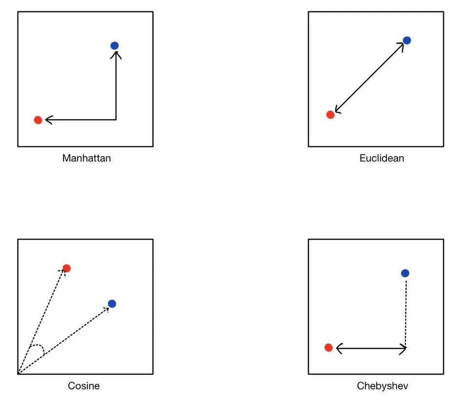
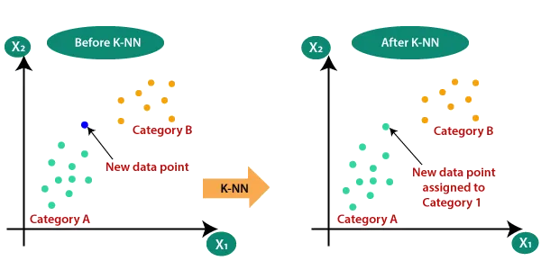
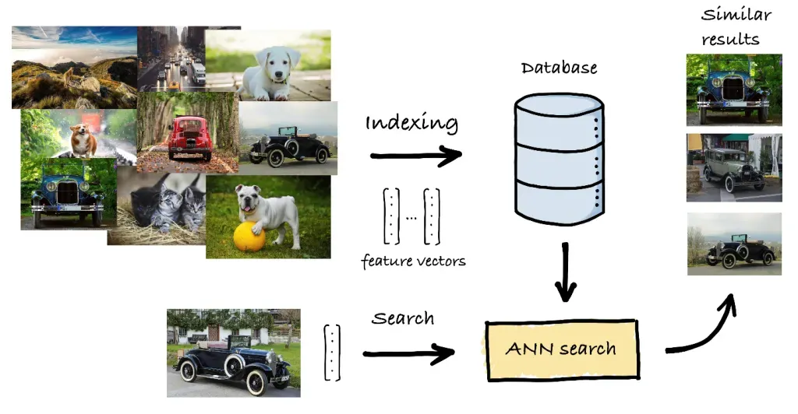

# Embeddings and Vector Search

## Goal

Understand how text can be converted into vectors, how similar vectors are searched, and how this becomes the retrieval layer behind RAG, semantic search, long-term memory, and knowledge tools for AI agents.

By the end of this topic, you should be able to answer:

- What is an embedding?
- Why is vector search different from keyword search?
- What information must be stored with each vector?
- How does an agent use retrieved chunks safely?
- What common mistakes make retrieval quality poor?

## Architecture for AI Agent

Input -> Chunking -> Embedding Model -> Vector Database <- Embedding Model -> Similarity Search -> Relevant Chunks -> LLM -> Output
                                                                  ▲
                                                                  │
                                                             User Query
                 
## What Is an Embedding?

Embeddings are stored in a vector database by first converting data, such as text, images, or audio, into high-dimensional vectors using machine learning models. These vectors, also called embeddings, capture the semantic relationships and patterns within the data. Once generated, each embedding is indexed in the vector database along with its associated metadata, such as the original data (e.g., text or image) or an identifier. The vector database then organizes these embeddings to support efficient similarity searches, typically using techniques like approximate nearest neighbor (ANN) search.

An embedding is a list of numbers that represents meaning.

```text
"How do I reset my password?"
  -> [0.021, -0.338, 0.104, 0.872, ...]
```

Each number is one dimension of the vector. Real embedding models often produce hundreds or thousands of dimensions, such as 384, 768, 1536, or 3072 dimensions depending on the model.

You do not manually decide what each dimension means. The model learns useful dimensions during training. The practical result is:

- similar text produces nearby vectors,
- unrelated text produces distant vectors,
- search can compare meaning instead of only words.



In the picture above, every object is represented as a point in a vector space. Similar concepts are grouped closer together. For example, animal concepts are closer to other animal concepts, and fruit concepts are closer to other fruit concepts.

Source image: [TrueFoundry similarity search article](https://www.truefoundry.com/blog/similarity-search).


## Embedding Models

Embedding models transform data, like text or images, into numerical representations called embeddings. These embeddings capture the semantic meaning and relationships within the data in a vector space. By representing data as vectors, we can perform mathematical operations to determine similarity, cluster related items, and feed the data into machine learning models.

Several models are used to generate these vector embeddings:

- Word2Vec: Transforms words into vectors, capturing their semantic relationships.
- GLoVE (Global Vectors for Word Representation): Another model for converting text into vector form, focusing on the global context of words.
- Universal Sentence Encoder (USE): Creates embeddings for entire sentences, capturing the meaning beyond individual words.
- Convolutional Neural Networks (CNNs) like VGG: Used to generate embeddings for images, capturing visual similarities.

These models are trained on large datasets and tasks, enabling them to produce embeddings that effectively represent the items’ semantic content.

## Chunking

Chunking is the process of splitting documents before embedding them.

A practical starting point for text documents:

- chunk size: 300-800 tokens,
- overlap: 50-150 tokens,
- keep headings and section titles with the chunk,
- avoid cutting tables, code blocks, or procedures in the middle,
- store source metadata for citation and permissions.

Example:

```text
Original document:
  Company IT Handbook

Chunks:
  1. Account setup
  2. Password reset
  3. MFA recovery
  4. Device replacement
```

Chunking is often more important than the choice of vector database. If the relevant answer is split badly or mixed with unrelated text, search quality will suffer even with a strong embedding model.

## What Is Vector Database?

Vector databases are systems specialized in storing, indexing, and retrieving high-dimensional vectors, often used as embeddings for data like text, images, or audio. Unlike traditional databases, they excel at managing unstructured data by enabling fast similarity searches, where vectors are compared to find the closest matches. This makes them essential for tasks like semantic search, recommendation systems, and content discovery. Using techniques like approximate nearest neighbor (ANN) search, vector databases handle large datasets efficiently, ensuring quick and accurate retrieval even at scale.

## What Is Vector Search?

In a traditional vector search use-case, queries are made against a vector database by passing it a query vector, and having the vector database return a configurable list of vectors with the shortest distance ("most similar") to the query vector.

The step-by-step workflow resembles the below:

1. A developer converts their existing dataset (documentation, images, logs stored in R2) into a set of vector embeddings (a one-way representation) by passing them through a machine learning model that is trained for that data type.
2. The output embeddings are inserted into a Vectorize database index.
3. A search query, classification request or anomaly detection query is also passed through the same ML model, returning a vector embedding representation of the query.
4. Vectorize is queried with this embedding, and returns a set of the most similar vector embeddings to the provided query.
5. The returned embeddings are used to retrieve the original source objects from dedicated storage (for example, R2, KV, and D1) and returned back to the user.
In a workflow without a vector database, you would need to pass your entire dataset alongside your query each time, which is neither practical (models have limits on input size) and would consume significant resources and time.

```text
Query:
  "How can I recover my account password?"

Query vector:
  [0.13, 0.44, 0.22, ...]

Nearest stored vectors:
  1. Password Reset Guide
  2. Account Recovery Policy
  3. Login Troubleshooting
```

The vector database does not "understand" the answer like an LLM. It compares numeric vectors and returns the closest matches.

## What Is Similarity Search?

Similarity search is the broader idea behind vector search.

It means:

```text
Find items that are similar to this item.
```

Similarity can mean different things depending on the data:

- similar text meaning,
- similar product behavior,
- similar image appearance,
- similar user activity,
- similar medical case,
- similar code snippet.

The TrueFoundry article gives a useful example: a user might search for `shoes`, `black shoes`, or a specific product name like `Nike AF-1 LV8`. These queries are vague and varied. A good similarity-search system should understand that all of them may belong to the same product area, even though the words and specificity are different.

For AI agents, this matters because user questions are often imprecise:

```text
"I cannot get into my account"
"password reset is broken"
"how do I recover login access?"
```

These should all retrieve login or account-recovery information.

## Similarity Metrics

A similarity metric defines what "close" means.

Common metrics:

- Cosine similarity: compares vector direction; common for text embeddings.
- Dot product: compares direction and magnitude; often used when vectors are normalized.
- Euclidean distance: compares straight-line distance between points.
- Manhattan distance: sums absolute differences across dimensions; useful for grid-like or sparse feature spaces.
- Chebyshev distance: uses the largest coordinate difference; useful in some grid or movement problems, but uncommon for text RAG.



Source image: [TrueFoundry similarity search article](https://www.truefoundry.com/blog/similarity-search).

For beginner RAG systems, the practical choice is usually:

| Data Type | Common Metric | Why |
| --- | --- | --- |
| Text chunks | Cosine similarity | Direction often matters more than vector size |
| Normalized embeddings | Dot product or cosine | Efficient and common in vector databases |
| Image embeddings | Euclidean or cosine | Depends on the model and index |
| Grid-like features | Manhattan or Chebyshev | Useful when movement or coordinate limits matter |

In most beginner RAG systems, use the metric recommended by the embedding model or vector database integration. Do not mix embeddings generated for one metric with an index configured for a different metric unless you understand the effect.

## Performing Similarity Search

### K-Nearest Neighbors (k-NN)

K-Nearest Neighbors (k-NN) is a popular algorithm used to find the closest vectors to a given query vector. Here’s how it works and its pros and cons:

- How it Works: The algorithm calculates the distance between the query vector and all vectors in the dataset. It then selects the ‘k’ nearest vectors (neighbors) based on the specified distance metric (Euclidean, Manhattan, etc.).
- Advantages: Simple to implement and understand; no need for a model training phase.
- Disadvantages: Computationally expensive for large datasets since it involves calculating the distance to every vector.
- Use Cases: Suitable for smaller datasets where exact nearest neighbors are needed, such as in recommendation systems for small user bases.



Source image: [TrueFoundry similarity search article](https://www.truefoundry.com/blog/similarity-search).

### Approximate Nearest Neighbor (ANN)

To address the inefficiency of k-NN with large datasets, Approximate Nearest Neighbor (ANN) methods provide a faster, albeit less precise, alternative. ANN algorithms aim to find a “good guess” of the nearest neighbors, trading off some accuracy for speed.

- Indexing Techniques: ANN algorithms use indexing structures like KD-Trees, Ball Trees, and VP-Trees to partition the vector space and narrow down the search area.
- Hashing Methods: Algorithms like Locality-Sensitive Hashing (LSH) map similar vectors to the same buckets, reducing the search space.
- Clustering: Methods like k-means clustering group vectors, allowing the search to be conducted within a cluster rather than the entire dataset.
- Advantages: Significantly faster than exact k-NN for large datasets; scalable to billions of vectors.
- Disadvantages: May not always find the exact nearest neighbors; depends on the trade-off between speed and accuracy.
- Use Cases: Web search engines, large-scale recommendation systems, real-time similarity search applications.



Source image: [TrueFoundry similarity search article](https://www.truefoundry.com/blog/similarity-search).

## Where Similarity Search Is Used

Similarity search is not only for RAG.

Common applications:

- E-commerce: recommend products similar to a viewed item.
- Image and video search: find visually similar media.
- NLP: find semantically similar documents, emails, or articles.
- Fraud detection: find activity similar to known risky patterns.
- Healthcare: compare medical cases, scans, or genetic sequences.

For AI agent developers, the most important application is semantic retrieval:

```text
user question -> similar knowledge chunks -> grounded LLM answer
```

## What To Store In A Vector Database

A vector alone is not enough. Store the vector with payload metadata.

Example record:

```json
{
  "id": "it-handbook-password-reset-003",
  "text": "To reset your password, open the identity portal...",
  "embedding": [0.021, -0.338, 0.104],
  "metadata": {
    "source": "IT Handbook",
    "url": "https://intranet.example.com/it/password-reset",
    "section": "Password Reset",
    "created_at": "2026-02-10",
    "tenant_id": "company-a",
    "visibility": "employees"
  }
}
```

Important metadata:

- source title,
- source URL or file path,
- page, heading, or line number,
- document version,
- tenant or user access scope,
- timestamps,
- tags or categories,
- language,
- original document ID.

Metadata lets the system filter results, show citations, enforce permissions, and debug bad answers.

## Retrieval Pipeline

A typical ingestion pipeline:

```text
Documents
  -> clean and normalize text
  -> split into chunks
  -> embed each chunk
  -> store vector + text + metadata
  -> build or update vector index
```

A typical query pipeline:

```text
User question
  -> embed question
  -> apply metadata filters
  -> retrieve top-k similar chunks
  -> optionally rerank chunks
  -> place best chunks in LLM context
  -> generate answer with citations
```

For an agent, retrieval can be a tool:

```text
Agent receives task
  -> decides it needs company knowledge
  -> calls search_knowledge_base(query)
  -> reads retrieved chunks
  -> answers or calls another tool
```

## Metadata Filtering

Vector similarity alone is not enough for real applications.

Example:

```text
Query: "What is the refund policy?"
```

Without filters, the system might retrieve:

- refund policy for the wrong country,
- old policy from last year,
- admin-only policy,
- policy from another customer tenant.

Add filters:

```text
country = "Germany"
document_status = "published"
tenant_id = "acme"
visibility in ["public", "customer"]
```

For agents, permission filters are not optional. Never retrieve private chunks and then rely on the LLM to ignore them. Filter before retrieval or inside the vector database query.

## Resources

- [TrueFoundry: What is Similarity Search and How Does It Work?](https://www.truefoundry.com/blog/similarity-search)
- [OpenAI embeddings guide](https://platform.openai.com/docs/guides/embeddings)
- [OpenAI embeddings API reference](https://platform.openai.com/docs/api-reference/embeddings)
- [OpenAI Cookbook: examples with vector databases](https://github.com/openai/openai-cookbook/tree/main/examples/vector_databases)
- [pgvector](https://github.com/pgvector/pgvector)
- [Qdrant filtering concepts](https://qdrant.tech/documentation/concepts/filtering/)
- [Pinecone vector search basics](https://www.pinecone.io/learn/vector-search-basics/)
