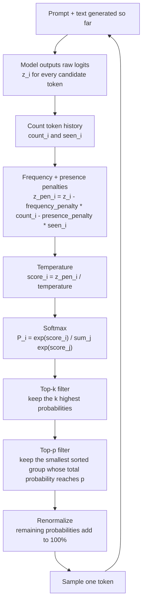

# Generation Controls

## Goal

Learn how temperature, top-p, top-k, frequency penalty, and presence penalty change the way an LLM chooses its next token.

## Purpose

Generation controls decide how an LLM chooses the next token. They do not change what the model knows. They change how focused, risky, repetitive, creative, or stable the model's next-token choices become.

For AI agents, this matters because every token can affect a plan, a tool call, a JSON field, a memory update, or a final answer. A creative setting can help with brainstorming, but the same setting can break a tool call.

## The Simple Mental Model

An LLM writes text one token at a time. At each step, it first gives every possible next token a raw score called a logit.

A logit is not a probability yet. It is the model's internal score for "how well this token fits here."

Imagine the prompt is:

```text
I want to eat a slice of
```

The model might create a tiny version of this logit list:

| Candidate token | Example logit | Beginner meaning |
|---|---:|---|
| pizza | 3.3 | strongest raw score |
| cake | 2.8 | also likely |
| apple | 1.7 | possible, but weaker |
| paper | 1.3 | strange, but not impossible |
| shampoo | 0.5 | very unlikely |

Then softmax turns those logits into probabilities:

| Candidate token | Logit | Probability after softmax | Visual |
|---|---:|---:|---|
| pizza | 3.3 | about 50% | ########## |
| cake | 2.8 | about 30% | ###### |
| apple | 1.7 | about 10% | ## |
| paper | 1.3 | about 7% | # |
| shampoo | 0.5 | about 3% | # |

The actual model has a huge vocabulary, not just five tokens, but this tiny table shows the core idea: logits become probabilities, and then the model samples from those probabilities.

Generation controls edit the logits or probability list before the model chooses one token.

## Application Order Diagram

This diagram shows a beginner-friendly order for applying common generation controls during one next-token step.



Exact order can vary by provider or inference library. Some systems apply top-k before top-p, some expose only a few of these controls, and some add extra controls such as repetition penalty or min-p. The important beginner model is:

1. The model creates raw logits.
2. Frequency and presence penalties adjust logits for tokens already used.
3. Temperature reshapes the logits.
4. Softmax turns logits into probabilities.
5. Top-k and top-p remove unlikely or unwanted candidates.
6. The remaining probabilities are rescaled.
7. The model samples one token and repeats the whole process.

## Core Formulas

Use these formulas as a simple mental model.

First, apply frequency and presence penalties to each candidate token:

```text
count_i = number of times token i has already appeared
seen_i = 1 if count_i > 0, otherwise 0

penalized_logit_i =
    raw_logit_i
    - frequency_penalty * count_i
    - presence_penalty * seen_i
```

Then apply temperature:

```text
temperature_logit_i = penalized_logit_i / temperature
```

Then softmax converts the adjusted logits into probabilities:

```text
probability_i =
    exp(temperature_logit_i)
    / sum(exp(temperature_logit_j) for every candidate token j)
```

Then top-k and top-p choose the allowed set:

```text
top_k_set = the k tokens with the highest probability
top_p_set = the smallest sorted token set whose probability sum reaches top_p

allowed_set = tokens that survive the enabled filters
```

Finally, the probabilities of the allowed tokens are renormalized:

```text
final_probability_i =
    probability_i / sum(probability_j for j in allowed_set)
```

Tokens outside the allowed set get probability `0` for this step.

## Quick Comparison

| Control | Question it answers | Lower or smaller values | Higher or larger values |
|---|---|---|---|
| `temperature` | How strongly should high logits win? | More predictable, focused, repetitive | More varied, creative, risky |
| `top_p` | How much total probability mass should stay available? | Keeps only the safest high-probability group | Allows a wider group of choices |
| `top_k` | How many candidate tokens should stay available? | Keeps only a small fixed number of choices | Allows more ranked choices |
| `frequency_penalty` | Should repeated tokens become less likely each time they repeat? | Allows more repetition | Pushes repeated tokens down more strongly |
| `presence_penalty` | Should any already-used token become less likely? | Allows the model to reuse earlier tokens | Encourages new words or ideas |

## Temperature

Temperature changes how strongly the model prefers the most likely token.

Think of it like a creativity slider:

- `temperature = 0` or near `0`: the model strongly prefers the most likely token. This is useful for tool calls, structured output, math, code, and factual tasks.
- `temperature = 0.3` to `0.7`: the model can vary its wording while usually staying on track.
- `temperature = 0.8` to `1.0+`: the model explores less likely tokens. This can help creative writing and brainstorming, but it can also increase errors, strange wording, or format drift.

### How Temperature Changes Scores

The model first produces raw scores called logits. Temperature divides those scores before probabilities are calculated:

```text
adjusted_score = logit / temperature
```

At exactly `temperature = 0`, providers usually use greedy decoding or a near-greedy mode instead of literally dividing by zero.

Low temperature makes the biggest scores dominate. High temperature makes the scores closer together.

Using the earlier logits:

| Candidate token | Original logit | Adjusted logit at `temperature = 0.2` | Adjusted logit at `temperature = 2.0` |
|---|---:|---:|---:|
| pizza | 3.3 | 16.5 | 1.65 |
| cake | 2.8 | 14.0 | 1.40 |
| apple | 1.7 | 8.5 | 0.85 |
| paper | 1.3 | 6.5 | 0.65 |
| shampoo | 0.5 | 2.5 | 0.25 |

After softmax, those adjusted logits become probabilities:

| Candidate token | Normal, `temperature = 1.0` | Low, `temperature = 0.2` | High, `temperature = 2.0` |
|---|---:|---:|---:|
| pizza | about 50% | about 92% | about 35% |
| cake | about 30% | about 8% | about 27% |
| apple | about 10% | near 0% | about 16% |
| paper | about 7% | near 0% | about 13% |
| shampoo | about 3% | near 0% | about 9% |

Low temperature is like telling the model: "Pick the obvious answer." High temperature is like telling it: "Let unusual options compete."

### Same Prompt, Different Temperature

Prompt:

```text
Write the first sentence of a story about a dragon.
```

| Setting | Example output | Why it happens |
|---|---|---|
| Low, `0.2` | "Once upon a time, a large green dragon lived in a dark cave on top of a mountain." | Safe, common, predictable story words win. |
| Medium, `0.5` | "Deep inside the Whispering Mountains, an ancient dragon guarded a treasure made of glowing blue crystals." | The model still stays normal, but adds more color. |
| High, `1.0` | "Barnaby was a terrible dragon because he sneezed soap bubbles instead of fire." | Less likely ideas get a real chance, so the result becomes surprising. |

## Top-p

Top-p is also called nucleus sampling. It keeps the smallest group of likely tokens whose total probability reaches the chosen `p` value.

If `top_p = 0.80`, the model starts from the most likely token, adds probabilities from top to bottom, and stops when the running total reaches `80%`.

Using the same list:

| Candidate token | Probability | Running total | Keep with `top_p = 0.80`? |
|---|---:|---:|---|
| pizza | 50% | 50% | yes |
| cake | 30% | 80% | yes |
| apple | 10% | 90% | no |
| paper | 7% | 97% | no |
| shampoo | 3% | 100% | no |

Now the model can only choose between `pizza` and `cake`. The other tokens are removed for this step.

### Rescaling After Top-p

After filtering, the kept probabilities must add back up to `100%`.

| Candidate token | Before top-p | After `top_p = 0.80` |
|---|---:|---:|
| pizza | 50% | 62.5% |
| cake | 30% | 37.5% |
| apple | 10% | 0% |
| paper | 7% | 0% |
| shampoo | 3% | 0% |

The model then samples from only the remaining candidates.

### Why Top-p Is Dynamic

Top-p adapts to the model's confidence.

If the model is very sure:

| Candidate token | Probability |
|---|---:|
| spell | 97% |
| wand | 1% |
| potion | 1% |
| table | 1% |

A `top_p` value like `0.90` keeps only `spell`.

If the model is unsure:

| Candidate token | Probability |
|---|---:|
| book | 12% |
| shirt | 11% |
| game | 10% |
| apple | 10% |
| bag | 9% |
| many others | 48% |

The same `top_p = 0.90` keeps many more options. This is why top-p can feel more natural than a fixed cutoff.

## Top-k

Top-k keeps only the top `k` candidate tokens by rank. It does not care how much probability they contain.

If `top_k = 3`, the model keeps exactly the three highest-ranked candidates:

| Candidate token | Probability | Rank | Keep with `top_k = 3`? |
|---|---:|---:|---|
| pizza | 50% | 1 | yes |
| cake | 30% | 2 | yes |
| apple | 12% | 3 | yes |
| burger | 5% | 4 | no |
| socks | 3% | 5 | no |

After filtering, the probabilities are rescaled:

| Candidate token | Before top-k | After `top_k = 3` |
|---|---:|---:|
| pizza | 50% | 54.3% |
| cake | 30% | 32.6% |
| apple | 12% | 13.1% |
| burger | 5% | 0% |
| socks | 3% | 0% |

### The Top-k Weakness

Top-k is simple, but it is blind to confidence.

If the model is very sure, `top_k = 3` is usually fine:

| Candidate token | Probability |
|---|---:|
| spell | 99% |
| wand | 0.5% |
| potion | 0.3% |
| table | 0.2% |

But if the model is confused, a fixed `top_k = 3` can cut away options that are almost equally good:

| Candidate token | Probability |
|---|---:|
| car | 3% |
| book | 3% |
| shirt | 3% |
| dog | 3% |
| apple | 3% |
| game | 3% |

Here, keeping only three candidates is arbitrary. Top-p often handles this kind of uncertainty better because it expands the candidate set when many tokens have similar probability.

## Frequency Penalty

Frequency penalty lowers the logit of a token based on how many times that token has already appeared.

It answers this question:

```text
Has this exact token appeared many times already?
```

The more often the token has appeared, the bigger the penalty becomes.

Formula:

```text
new_logit_i = raw_logit_i - frequency_penalty * count_i
```

Where:

- `count_i` is how many times token `i` has already appeared.
- `frequency_penalty` controls how strongly repetition is punished.

Example:

```text
Text so far: pizza pizza cake

Candidate token: pizza
count_i: 2
raw_logit_i: 3.3
frequency_penalty: 0.4

new_logit_i = 3.3 - 0.4 * 2
new_logit_i = 2.5
```

Because `pizza` appeared twice, it gets pushed down twice. This makes the model less likely to keep repeating `pizza`.

Use frequency penalty when:

- The model repeats the same word or phrase too often.
- A creative response gets stuck in a loop.
- A summary keeps reusing the same wording.
- You want broader vocabulary without changing the whole prompt.

Be careful with high frequency penalty. It can make the model avoid useful repeated words that are actually needed, such as names, technical terms, JSON keys, or code identifiers.

## Presence Penalty

Presence penalty lowers the logit of a token once the token has appeared at least one time.

It answers this question:

```text
Has this token appeared at all?
```

Unlike frequency penalty, presence penalty does not care whether the token appeared once or ten times. It only checks whether the token is present.

Formula:

```text
seen_i = 1 if count_i > 0, otherwise 0

new_logit_i = raw_logit_i - presence_penalty * seen_i
```

Example:

```text
Text so far: pizza pizza cake

Candidate token: pizza
count_i: 2
seen_i: 1
raw_logit_i: 3.3
presence_penalty: 0.6

new_logit_i = 3.3 - 0.6 * 1
new_logit_i = 2.7
```

Even though `pizza` appeared twice, the presence penalty is applied only once because the token is already present.

Use presence penalty when:

- The model keeps returning to the same topic.
- You want more new ideas in brainstorming.
- You want a list to cover different angles instead of repeating one angle.
- A story or dialogue keeps circling the same word choices.

Be careful with high presence penalty. It can push the model away from important words that must repeat, such as a product name, a person's name, a required label, or a precise technical term.

## Frequency Penalty Vs Presence Penalty

These two controls are similar, but they solve different repetition problems.

| Situation | Better control | Why |
|---|---|---|
| The model repeats one word many times | `frequency_penalty` | The penalty grows each time the word repeats. |
| The model keeps returning to the same topic | `presence_penalty` | Any already-used token is discouraged, which nudges the model toward new wording. |
| The model needs exact repeated labels or keys | Use low or no penalty | Penalties may damage required structure. |
| Creative brainstorming feels too narrow | `presence_penalty` or moderate temperature | The model gets a push toward unused ideas. |
| A paragraph has awkward repeated phrasing | `frequency_penalty` | Repeated tokens get progressively less attractive. |

### Combined Penalty Example

Use the combined formula:

```text
penalized_logit_i =
    raw_logit_i
    - frequency_penalty * count_i
    - presence_penalty * seen_i
```

Text so far:

```text
pizza pizza cake
```

Settings:

```text
frequency_penalty = 0.4
presence_penalty = 0.6
```

| Candidate token | Raw logit | Count | Seen | Penalty math | Penalized logit |
|---|---:|---:|---:|---|---:|
| pizza | 3.3 | 2 | 1 | `3.3 - 0.4*2 - 0.6*1` | 1.9 |
| cake | 2.8 | 1 | 1 | `2.8 - 0.4*1 - 0.6*1` | 1.8 |
| apple | 1.7 | 0 | 0 | `1.7 - 0.4*0 - 0.6*0` | 1.7 |

Before penalties, `pizza` clearly wins. After penalties, `pizza`, `cake`, and `apple` are much closer. Temperature and filtering will then decide how strongly these adjusted scores compete.

## Output Length: Max Tokens and Stop Sequences

Temperature, top-p, top-k, and the penalties decide *which* token comes next. Two more controls decide *when generation ends*.

### Max Tokens (Max Length)

`max_tokens` caps how many tokens the model may generate in one response.

| What it does | What it does not do |
| --- | --- |
| Cuts generation off once the limit is reached | Make the model write a concise answer |
| Protects against runaway output, cost, and latency | Summarize or compress the content |

This distinction matters: a low `max_tokens` does not teach the model to be brief. It simply stops generation, which can **truncate the output mid-sentence** (or produce invalid JSON) if set too low. To get a short answer, ask for it in the prompt *and* set a safe limit as a backstop.

### Stop Sequences

A **stop sequence** is a string that makes the model stop generating as soon as it would produce that string. The stop text itself is not included in the output.

```text
Prompt:   List two fruits, one per line, then stop.
stop: ["3."]
Output:   1. apple
          2. banana
```

Stop sequences are useful for ending output at a known boundary, such as:

- a closing delimiter (`</answer>` or a code fence)
- the start of a new role marker, so a chat completion stops before "User:"
- a fixed separator between items

| Control | Ends generation when... | Common use |
| --- | --- | --- |
| `max_tokens` | a token count is reached | safety cap on length, cost, latency |
| stop sequence | a specific string is produced | stop at a delimiter or structural boundary |

Both are safeguards, not quality controls. Use them to bound output, and rely on the prompt and sampling controls for *what* the output says.

## How Controls Work Together

These controls affect different parts of the same pipeline:

| Stage | Control | What it changes |
|---|---|---|
| Raw logits | `frequency_penalty` | Lowers tokens more if they appeared many times. |
| Raw logits | `presence_penalty` | Lowers tokens once if they appeared at all. |
| Adjusted logits | `temperature` | Sharpens or flattens the score differences. |
| Probability list | `top_k` | Keeps a fixed number of highest-ranked tokens. |
| Probability list | `top_p` | Keeps a dynamic group based on total probability mass. |
| Final sampling | Renormalization | Makes the kept probabilities add back up to `100%`. |

Think of the controls like a series of gates:

```text
raw logits
  -> repetition penalties change scores
  -> temperature changes score sharpness
  -> softmax creates probabilities
  -> top-k/top-p remove candidates
  -> renormalization rescales what remains
  -> sampling chooses one token
```

## Should You Change Them Together?

For beginners, change one control at a time. Otherwise, you will not know which control caused the behavior change.

A practical rule:

- If you are experimenting with `temperature`, keep `top_p` high, such as `1.0`, avoid changing `top_k`, and keep penalties at `0`.
- If you are experimenting with `top_p`, keep `temperature` moderate, such as `0.7` to `1.0`.
- If you are experimenting with `frequency_penalty`, keep temperature and top-p stable so you can clearly see whether repetition improves.
- If you are experimenting with `presence_penalty`, test whether the answer gains useful variety or drifts away from the task.
- If you use a local model that exposes `top_k`, start with a common value such as `40` or `50`, then test the result.

Some APIs expose only temperature and top-p. Some local inference engines expose temperature, top-p, top-k, min-p, repetition penalty, and more. Treat every setting as something to test, not something to trust blindly.

## Agent Settings Guide

| Agent job | Suggested starting point | Why |
|---|---|---|
| Tool call arguments | `temperature: 0` to `0.2`, `top_p: 1.0`, penalties: `0` | Tool calls need stable, parseable fields. |
| JSON or structured output | `temperature: 0` to `0.2`, penalties: `0` | Creativity and repetition penalties can break schemas or required keys. |
| Math or code reasoning | `temperature: 0` to `0.3`, penalties: `0` | You want fewer surprising choices and no pressure away from repeated symbols. |
| Customer support | `temperature: 0.2` to `0.5`, small or no penalties | Polite and consistent, but not robotic. |
| Search query rewriting | `temperature: 0` to `0.4`, penalties: `0` | Query expansion needs focus and exact terms may need to repeat. |
| Brainstorming | `temperature: 0.7` to `1.0`, `top_p: 0.9`, optional presence penalty | More variety is useful. |
| Story writing | `temperature: 0.8+`, `top_p: 0.9` to `1.0`, optional frequency penalty | Unusual wording can be a feature, while repetition can be reduced. |

In agent systems, the safest pattern is often to use different settings for different steps:

```text
planner step:      low or medium temperature
tool-call step:    low temperature, no penalties
creative draft:    higher temperature, maybe light penalties
final answer:      medium temperature, usually light or no penalties
```

## Example: Same Question, Different Settings

Prompt:

```text
Do you know who the best football player is?
```

| Style | Settings | Example behavior |
|---|---|---|
| Fact checker | `temperature = 0.1`, `top_p = 0.20`, penalties `0` | Gives a safe answer naming widely discussed players such as Lionel Messi, Cristiano Ronaldo, Pele, and Diego Maradona. |
| Sports fan | `temperature = 0.7`, `top_p = 0.85`, small frequency penalty | Gives a more conversational answer and may compare playing styles or eras without repeating the same phrase too much. |
| Brainstorm list | `temperature = 0.8`, `top_p = 0.9`, moderate presence penalty | May cover different criteria such as trophies, skill, longevity, influence, and peak performance. |
| Uncontrolled | `temperature = 1.8`, `top_p = 1.0`, high penalties | May drift into strange or useless text because almost everything is allowed and the model is pushed away from earlier wording. |

The key idea: penalties change the scores, temperature changes how strongly the model prefers high scores, and top-p/top-k decide which choices are allowed.

## Common Mistakes

| Mistake | Why it hurts |
|---|---|
| Using high temperature for tool calls | The model may invent fields, change formats, or choose the wrong tool. |
| Using frequency or presence penalties for JSON | The model may avoid repeating required keys, labels, or symbols. |
| Lowering every setting at once | You cannot tell which setting fixed or harmed the output. |
| Treating `temperature = 0` as perfectly deterministic | Some systems can still vary because of infrastructure, model routing, floating-point behavior, or provider settings. |
| Using one setting for the whole agent | Planning, tool use, writing, and summarizing often need different behavior. |
| Ignoring evaluation | A setting that feels good on one prompt may fail on edge cases. |

## Mini Lab

Use one prompt and run it several times with different settings.

Prompt:

```text
Write a short answer explaining why an AI agent should validate tool results.
```

Test these settings:

| Run | Temperature | Top-p | Top-k | Frequency penalty | Presence penalty | What to observe |
|---|---:|---:|---:|---:|---:|---|
| A | 0.1 | 1.0 | off | 0 | 0 | Is it stable and precise? |
| B | 0.7 | 0.9 | off | 0 | 0 | Is it still accurate but more natural? |
| C | 1.0 | 1.0 | off | 0 | 0 | Does it become more creative or less focused? |
| D | 0.7 | 0.9 | 40 | 0 | 0 | Does top-k make the style more controlled? |
| E | 0.7 | 0.9 | off | 0.5 | 0 | Does repeated wording decrease? |
| F | 0.7 | 0.9 | off | 0 | 0.5 | Does the answer explore more distinct ideas? |

Record:

- Did the answer stay correct?
- Did the answer keep the requested format?
- Did repeated wording improve or did important terms disappear?
- Did the wording become more helpful or just more random?
- Would this setting be safe for tool calls?

## What To Remember

- Logits are raw next-token scores.
- Frequency penalty lowers tokens more when they have appeared many times.
- Presence penalty lowers tokens once if they have appeared at all.
- Temperature changes the shape of the probability distribution.
- Top-p cuts by total probability mass.
- Top-k cuts by a fixed number of candidates.
- Lower-risk settings are usually better for correctness, tools, schemas, and repeatability.
- Higher-variety settings are usually better for brainstorming, creative writing, and exploration.
- AI agents often need multiple generation profiles, not one global setting.

## Resources

- [Tokenization](../tokenization/index.md)
- [Context Windows](../context-windows/index.md)
- [Prompt Basics](../../03-prompt-engineering/prompt-basics/index.md)
