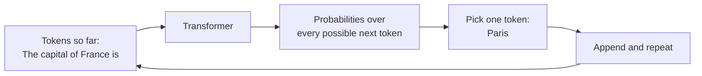
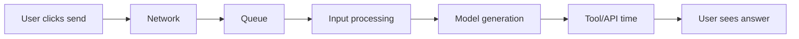
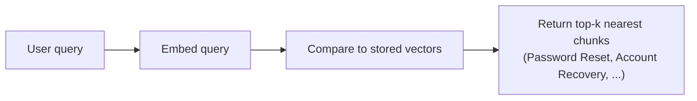
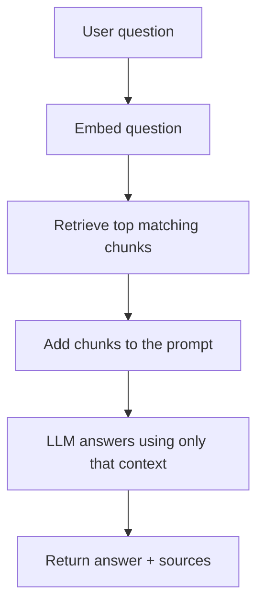

# Junior Interview: LLM Fundamentals

Friendly, entry-level questions for people who are still learning how large language models work. They check whether the **foundations** are there — and they double as a **study guide**: each question has a short rubric (*good answer covers*), a fuller **explanation** with examples and diagrams, and a hint the interviewer can give if the candidate is stuck.

!!! note "How to use this page"
    As an interviewer, ask the question and listen for the ideas in *good answer covers*; the explanation is there to help you follow up and to let learners study. Reading every explanation here should cover most of the Stage 02 basics. See the [QAs](../test/index.md) for quick self-testing.

## 1. In plain words, what is an LLM and what does it actually do?

**Good answer covers:** An LLM is a **transformer** trained to **predict the next token** given the tokens so far. It generates text by picking a token, appending it, and repeating — it is a probability machine over tokens, not a database of facts.

**Explanation:** When you send a prompt, the model does not "look up" an answer. At each step it asks: *given everything so far, what token is most likely next?* It picks one, adds it to the sequence, and asks again. This loop is called **autoregressive generation**. Almost everything an agent does follows from this one behavior: prompting works because better context shifts the likely next token, hallucination happens because a fluent-but-wrong token can still be the most likely one, and outputs vary run to run because the choice is probabilistic.



**Hint if stuck:** What is the one thing the model does over and over to produce each new word?

## 2. What is a token, and why does tokenization matter?

**Good answer covers:** A token is the small unit of text the model actually processes — often a word, part of a word, punctuation, or whitespace. Tokens (not words) are what get counted and billed, so they drive **cost, context limits, and latency**.

**Explanation:** Before text reaches the model, a tokenizer splits it into tokens and maps each to a number (a token ID). A token is **not** the same as a word: `"Tokenization matters."` might split into `["Token", "ization", " matters", "."]`. This is why two strings that look similar to a human can cost different amounts, and why code, JSON, or non-English text can use far more tokens than plain English. The practical rule: never assume tokens equal words — count with the tokenizer for the model you will actually use.

```text
Text:
Tokenization matters.

Possible token pieces:
["Token", "ization", " matters", "."]
```

**Hint if stuck:** Is a token always a whole word? What gets counted when you are billed?

## 3. What is a context window, and what happens if you exceed it?

**Good answer covers:** The context window is the model's **working memory** for one request — the max tokens of input plus generated output it can attend to at once. If the prompt is too big, the app must shrink it (truncate, summarize, retrieve less) or the call fails.

**Explanation:** Context is not just the user's message. It includes the system prompt, conversation history, tool definitions, tool results, retrieved documents, and the model's own output. So a "128k token model" does not give the user 128k of free space — some budget is already spent. When you exceed the limit, something has to go, and cutting carelessly makes agents forget requirements or ignore earlier results. Treat context as a **budget**: decide what earns a place rather than appending everything.

```text
total_token_budget =
  system_and_developer_tokens
  + conversation_tokens
  + retrieved_context_tokens
  + tool_schema_tokens
  + tool_result_tokens
  + expected_output_tokens
```

**Hint if stuck:** Think of it as the model's short-term memory measured in tokens — what fills it up?

## 4. What is a model family, and what does "open vs closed" mean?

**Good answer covers:** A model family is a group of related models from the same creator or architecture (GPT, Claude, Gemini, Llama, Mistral, Qwen), usually with small/medium/large and specialized variants. **Open-weight** means you can download the weights; **closed** means you access it only through an API.

**Explanation:** "Family = what kind of model it is; license = what you are allowed to do with it." Within a family there are sizes (small for routing, large for hard reasoning) and variants (chat, code, vision, embedding). A key beginner trap: **open-weight is not the same as open-source** — you may be able to download a model but still face license restrictions on commercial use, fine-tuning, or redistribution. Always check the exact model card and license for the exact version, not the family name.

| Term | Plain meaning |
| --- | --- |
| Open-weight | You can download the weights and run it yourself |
| Closed-weight | No public weights; you call it through an API |
| License | The rules: commercial use, modification, redistribution, attribution |
| Model card | The doc describing limits, intended use, context length, and license |

**Hint if stuck:** One question is "can I download it?" and another is "what am I allowed to do with it?" — which is which?

## 5. What does temperature do, and when would you set it low vs high?

**Good answer covers:** Temperature controls how strongly the model prefers the most likely token. **Low** (near 0) is focused and predictable — good for tool calls, JSON, and facts. **Higher** (0.8+) is more varied and creative, but riskier.

**Explanation:** The model produces a raw score (logit) for every candidate token; temperature reshapes those scores before they become probabilities. Low temperature makes the top choice dominate ("pick the obvious answer"); high temperature flattens the scores so unusual options can compete ("let unusual options win"). For agents this is critical: a creative setting can help brainstorming but can break a tool call by inventing fields or drifting from the required format.

| Setting | Behavior | Good for |
| --- | --- | --- |
| `temperature 0–0.2` | Focused, stable, repeatable | Tool calls, JSON, math, code |
| `temperature 0.3–0.7` | Varied wording, mostly on track | Support replies, general chat |
| `temperature 0.8+` | Creative, surprising, riskier | Brainstorming, story writing |

**Hint if stuck:** Think of it as a creativity slider — which end do you want for a tool call that must produce clean JSON?

## 6. Besides temperature, what other generation controls should you know?

**Good answer covers:** **max tokens** (caps output length, a safety backstop — it does not make answers concise), **stop sequences** (end generation at a known string), and sampling filters **top-p** (keep the smallest group of tokens reaching probability p) and **top-k** (keep the top k tokens).

**Explanation:** These split into two jobs. Top-p and top-k decide *which* tokens are allowed (top-p adapts to the model's confidence; top-k keeps a fixed number). `max_tokens` and stop sequences decide *when generation ends*. A common mistake: setting `max_tokens` too low to force brevity — it just truncates mid-sentence (or breaks JSON). To get a short answer, ask for it in the prompt *and* set a safe limit as a backstop.

```text
Prompt:   List two fruits, one per line, then stop.
stop: ["3."]
Output:   1. apple
          2. banana
```

**Hint if stuck:** Which controls pick *which* token, and which ones decide *when to stop*?

## 7. How does LLM pricing work, and why are output tokens special?

**Good answer covers:** Hosted APIs usually bill **per token**, separately for **input** (what you send) and **output** (what the model generates). Output is often priced higher and is the main driver of latency because it is generated one token at a time.

**Explanation:** Input tokens include far more than the user's message: system prompt, history, tool schemas, and retrieved docs. Output tokens include the answer, JSON, and tool-call arguments. The shape of a cost estimate is simple:

```text
total_cost =
  (input_tokens / 1,000,000 * input_price_per_1M)
+ (output_tokens / 1,000,000 * output_price_per_1M)
```

The catch for agents: one user request can become **several** paid model calls (plan, interpret, draft, finalize), so cost and latency multiply. Cutting unnecessary output tokens usually reduces cost *and* latency at the same time.

**Hint if stuck:** What two kinds of tokens are billed separately, and which one is generated slowly one at a time?

## 8. What is the tradeoff with latency in an agent, and how can you make it feel faster?

**Good answer covers:** Latency grows with model size, output length, long context, and especially **sequential tool calls**. **Streaming** does not reduce total work but improves *perceived* speed by showing tokens as they arrive.

**Explanation:** The model is only one part of total response time — network, queue, input processing, generation, and tool time all add up, and agent steps that must wait for each other accumulate. Two useful metrics are **time to first token** (when the user sees the first word) and **time to final token** (when the answer is complete). Levers to improve experience: stream the answer, cap output length, route easy tasks to a smaller model, and run independent tools in parallel.



**Hint if stuck:** If total compute can't shrink, how do you still make the user feel like the answer came faster?

## 9. What is an embedding?

**Good answer covers:** An embedding is a **list of numbers (a vector) that represents meaning**. Similar text produces nearby vectors; unrelated text produces distant vectors — so you can compare *meaning* instead of just matching words.

**Explanation:** An embedding model converts text (or images, audio) into a high-dimensional vector — often hundreds or thousands of numbers. You don't decide what each dimension means; the model learns them during training. The practical payoff is that `"How do I reset my password?"` and `"how do I recover login access?"` land close together even though they share few words. This is the foundation under semantic search, RAG, and agent memory.

```text
"How do I reset my password?"
  -> [0.021, -0.338, 0.104, 0.872, ...]
```

**Hint if stuck:** How do you turn the *meaning* of a sentence into something a computer can compare with math?

## 10. What is vector / similarity search, and how is it different from keyword search?

**Good answer covers:** Vector search embeds the query, then finds the **nearest stored vectors** by a similarity metric (often cosine similarity). Unlike keyword search, it matches **meaning**, so it works even when the query and the document use different words.

**Explanation:** The query becomes a vector, and the database returns the closest stored vectors — the most similar chunks. The vector database does not "understand" the answer like an LLM; it just compares numbers and returns close matches. For large datasets, exact nearest-neighbor (k-NN) is slow, so systems use **approximate nearest neighbor (ANN)** for speed. In practice you also store **metadata** (source, URL, permissions) with each vector so you can filter, cite, and enforce access — never retrieve private chunks and hope the LLM ignores them.



**Hint if stuck:** Keyword search needs the same words; what does vector search compare instead?

## 11. What is RAG, and why does it help?

**Good answer covers:** RAG = **Retrieval-Augmented Generation**: search a knowledge source first, add the relevant passages to the prompt, then let the LLM answer. It **grounds** answers in real sources, reducing hallucination and giving access to private or recent data.

**Explanation:** "RAG = search first, answer second." It exists because LLMs don't know your private documents, may lack recent info, and can sound confident while wrong. A RAG app has two pipelines: an **indexing** pipeline (chunk documents, embed them, store vectors + metadata) run ahead of time, and a **question-answering** pipeline (embed the question, retrieve top chunks, put them in the prompt, answer with citations) run per query. A strict prompt — "answer using only the provided context; if it's not there, say you don't know" — reduces unsupported answers, though testing is still needed.



**Hint if stuck:** If the model doesn't know your private docs, what could you fetch and hand it *before* it answers?

## 12. What is the difference between a base model and an instruction-tuned (chat) model?

**Good answer covers:** A **base model** is pretrained to predict the next token — it just autocompletes text. An **instruction-tuned / chat model** has extra training (instruction tuning + alignment) so it follows requests instead of merely continuing them.

**Explanation:** A freshly pretrained transformer is fluent and knowledgeable but only continues the most likely text. Through instruction tuning (fine-tuning on instruction/response pairs) and alignment (training toward helpful, honest, harmless answers), it becomes the assistant you actually talk to. The contrast is concrete: given `Write a haiku about the sea`, a base model might continue with `Write a haiku about the mountains.`, while an assistant model writes the haiku. For agents you almost always want the instruction-tuned/chat variant.

<div class="prompt-compare" markdown="1">
  <section>
    <span class="prompt-compare__label prompt-compare__label--bad">Base model</span>
    <pre><code>Prompt:  Write a haiku about the sea.
Output:  Write a haiku about the mountains.</code></pre>
  </section>
  <section>
    <span class="prompt-compare__label prompt-compare__label--good">Assistant model</span>
    <pre><code>Prompt:  Write a haiku about the sea.
Output:  Endless rolling waves...</code></pre>
  </section>
</div>

**Hint if stuck:** One just *continues* your text; the other *does what you asked* — what training adds that behavior?

## A light warm-up task

> You are building a help-desk assistant that should answer employee questions using the company handbook, and you want it to be accurate and affordable. In plain language, sketch how you would set it up.

Ask the candidate to mention: using **RAG** (chunk and embed the handbook, store vectors, retrieve relevant chunks per question), keeping the prompt within the **context window**, choosing a sensible **model size** and a **low temperature** for grounded answers, and watching **token cost** (input vs output) and **latency**.

**Good answer covers:** retrieve relevant handbook chunks and put them in the prompt (RAG) so answers are grounded; embed both documents and questions for similarity search; use a low temperature so the model sticks to the source; keep total tokens within the context window; and pick a model size and output limit that balance quality against cost and latency.

**Explanation:** A complete answer connects the whole stage: "I'd chunk the handbook, embed each chunk, and store the vectors with metadata. When a user asks a question, I embed it, retrieve the top matching chunks, and add them to the prompt with an instruction to answer only from that context. I'd use an instruction-tuned model at low temperature for grounded, stable answers, cap output tokens, and keep the input within the context window. I'd track input vs output token cost and latency, and route simple questions to a smaller model." This shows the candidate can combine embeddings, vector search, RAG, context budgeting, generation controls, and pricing/latency into one design.

## Source material

These build on the Stage 02 topics: [Transformer Models and LLMs](../transformer-models/index.md), [Tokenization](../tokenization/index.md), [Context Windows](../context-windows/index.md), [Model Families and Licenses](../model-families/index.md), [Generation Controls](../generation-controls/index.md), [Pricing and Latency](../pricing-and-latency/index.md), [Embeddings and Vector Search](../embeddings-vector-search/index.md), and [RAG Basics](../rag-basics/index.md).
