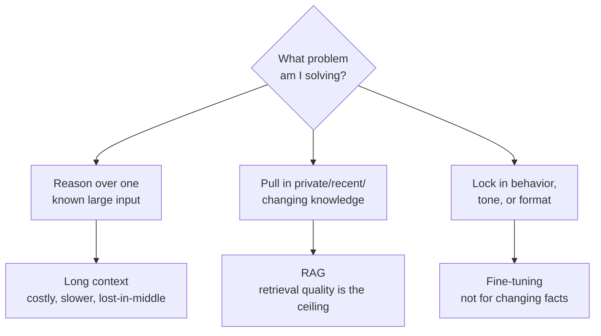
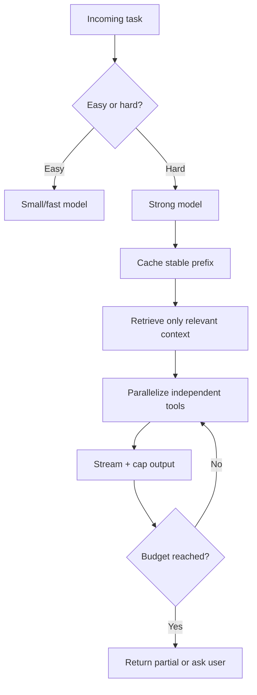
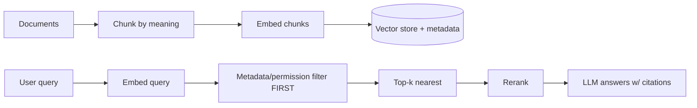

# Senior Interview: LLM Fundamentals

Interview questions for **senior** engineers building on large language models. These are open-ended and meant to be explored with follow-ups — not recited. Each question lists what a strong answer covers, **one sample strong answer** (a complete example), good follow-up probes, and red flags.

!!! note "How to use this page"
    Pick three or four questions and go deep rather than covering all of them. A senior candidate should reason about trade-offs, failure modes, and cost under real constraints — push past definitions into "why," "when not to," and "what breaks at scale." The sample strong answer is *one* good example, not the only acceptable one; credit any reasoning that reaches the same depth. The final item is a hands-on design task. For learners and lighter screens, see the [Junior Interview](../interview-junior/index.md); for quick self-testing, see the [QAs](../test/index.md).

## 1. When do you reach for long context vs RAG vs fine-tuning — and when is each the wrong call?

Probes architectural judgment, not tool enthusiasm.

**Strong answer covers:**

- The three solve different problems: long context reads a *known* large input in one call; RAG pulls the *most relevant* external knowledge into the prompt; fine-tuning changes *behavior/style/format*, not fresh facts.
- Long context is expensive, slower, and suffers lost-in-the-middle; it is not a substitute for retrieval over a large or changing corpus.
- RAG fits private, recent, or frequently changing knowledge and gives citations, but retrieval quality is the ceiling.
- Fine-tuning is for consistent behavior, tone, or output format — not for injecting knowledge that changes, and it carries data, license, and re-training costs.
- They compose: fine-tune for format, RAG for knowledge, long context only when the model must truly reason over one big input.

**Sample strong answer:** "I map each to the problem it actually solves. If the model must reason over one specific large document I already have — say a 200-page contract — long context earns its cost, though I know it's slower, pricier, and the middle can get under-used. If the knowledge is large, private, or changes often, that's RAG: I retrieve only the relevant chunks and get citations for free, but my answer quality is capped by retrieval quality. Fine-tuning I reserve for *behavior* — a consistent format, tone, or a narrow task — never for facts that change, because I'd be retraining forever and still be stale. The wrong calls I see most: stuffing a whole knowledge base into a long context window instead of retrieving, and fine-tuning to 'teach' the model facts that RAG should serve. In practice I compose them — fine-tune for the output shape, RAG for the knowledge, long context only when the task genuinely needs one big input in view."

**Follow-ups:** Why won't fine-tuning fix a knowledge cutoff? When does long context become cheaper than building a retrieval pipeline? Can you combine all three in one feature?

**Red flags:** Treats long context as a drop-in replacement for retrieval; proposes fine-tuning to add fresh knowledge; no notion of retrieval quality as the limiting factor.

## 2. How does tokenization quietly affect cost, limits, and reliability — and what surprises people?

**Strong answer covers:**

- Tokens, not words, are billed and counted against the context limit; English is roughly 1.3–1.5 tokens/word, but code, JSON, and non-English text can be far denser.
- Multilingual penalty: many tokenizers split non-English text into more tokens, so the same meaning costs more and eats more context for some languages.
- Code, base64, repeated markup, long IDs, and emoji tokenize badly and inflate counts.
- Surprises: whitespace and capitalization change token IDs (`red` vs ` Red`); hidden input (system prompt, tool schemas, tool results, special/role tokens) is counted too.
- Practical defense: count with the *target model's* tokenizer, send only relevant fields, and chunk by meaning so an idea isn't split across chunks.

**Sample strong answer:** "The trap is that everyone reasons in words but the model bills and budgets in tokens, and the ratio isn't constant. English is around 1.3 to 1.5 tokens per word, but code, JSON, and especially non-English text are denser — a Japanese or Arabic prompt can cost noticeably more tokens for the same meaning, which is a real fairness and cost issue for multilingual products. People are also surprised that a leading space or capitalization changes the token IDs, and that the 'prompt' is never just the user message — it's the system prompt, tool schemas, prior tool results, and hidden role/special tokens, all counted. So I always count with the exact tokenizer for the model I'll ship on, strip junk like raw HTML or base64 before sending, and chunk by meaning rather than character count so I don't split a procedure across two chunks and wreck retrieval."

**Follow-ups:** Why might a feature be cheaper in English than in another language, and what do you do about it? What hidden inputs inflate token counts in an agent? How does bad tokenization-aware chunking hurt RAG?

**Red flags:** Equates tokens with words; assumes one tokenizer for all models; forgets system/tool/role tokens count; never mentions the multilingual or code density issue.

## 3. Choosing a model family under real constraints — reasoning vs standard, open-weight vs closed. Walk me through it.

**Strong answer covers:**

- Start from constraints, not hype: task difficulty, latency target, cost budget, privacy/data residency, license, and ops capacity.
- Reasoning models spend more compute (and reasoning tokens) for hard multi-step tasks; they cost more and are slower, so they're wasteful for routing or simple extraction.
- Open-weight gives control, private deployment, and fine-tuning, but you own hosting, scaling, safety, and monitoring; closed/API gives frontier quality and managed scaling but less control and provider dependency.
- "Open-weight" is not "open-source" — license still governs commercial use, fine-tuning, and redistribution; check the exact version's model card and license.
- Mixed fleets are normal: small model for routing, embedding model for retrieval, strong model only for the hard step.

**Sample strong answer:** "I refuse to choose by name; I choose by constraints. First the task — does it actually need multi-step reasoning, or is it classification and routing where a small fast model wins? Reasoning models burn extra compute and reasoning tokens, so I reserve them for genuinely hard planning or analysis. Then privacy and ops: if data can't leave our environment or we need to fine-tune, that pushes me toward open-weight — but only if the *exact version's* license allows our use, because open-weight is not open-source and the license, not the download button, decides what I can do commercially. If I want frontier quality without running GPUs, a closed API is fine, accepting provider dependency. The honest answer for most agents is a fleet: a small model routes, an embedding model retrieves, and I pay for a strong reasoning model only on the steps that need it."

**Follow-ups:** When is a reasoning model a waste of money? What's the difference between open-weight and open-source, and why does it matter legally? What operational burden does open-weight add that an API hides?

**Red flags:** "Use the biggest model for everything"; conflates open-weight with open-source; ignores license, privacy, and ops; can't justify a reasoning model's extra cost.

## 4. Temperature and sampling for agents — how do you think about determinism and tool calls?

**Strong answer covers:**

- Generation controls change *how* the next token is chosen, not what the model knows; they edit logits/probabilities before sampling.
- Tool calls, JSON, and structured output want low temperature (0–0.2), top_p 1.0, and no frequency/presence penalties — penalties can drop required repeated keys, labels, or symbols.
- Higher temperature flattens the distribution so unusual tokens compete: good for brainstorming, dangerous for format-critical steps.
- "temperature = 0" is *not* truly deterministic — routing, batching, floating-point, and infra can still vary output; design for that.
- Agents benefit from per-step profiles: low for tool/plan steps, higher for creative drafts.

**Sample strong answer:** "I think of sampling as gates on the next-token distribution — penalties adjust logits for repeated tokens, temperature sharpens or flattens, and top-p/top-k decide which candidates survive. For an agent the default is boring on purpose: tool-call and JSON steps run near temperature 0 with top_p 1.0 and no penalties, because a creative setting invents fields or drifts the format, and frequency/presence penalties will happily suppress a required key or a repeated identifier. I save higher temperature for genuinely creative steps. The thing I won't claim is perfect determinism — even at temperature 0, provider routing, batching, and floating-point can shift a token, so if I need reproducibility I pin the model version, log everything, and validate the output rather than trusting that 'temp 0 means identical every time.' The clean pattern is multiple generation profiles per agent, not one global setting."

**Follow-ups:** Why can't you guarantee identical output at temperature 0? What breaks if you apply a frequency penalty to JSON output? Which steps in an agent deserve different sampling settings?

**Red flags:** Believes temperature 0 is fully deterministic; uses one temperature for the whole agent; applies penalties to structured output; thinks sampling changes what the model knows.

## 5. Controlling cost and latency at scale — what actually moves the needle?

**Strong answer covers:**

- Output tokens dominate latency (generated sequentially) and are often priced higher; trimming output usually cuts cost *and* latency together.
- Agents multiply cost: one user task can be several paid calls (plan, interpret, draft, finalize) plus tool and embedding costs.
- Levers: model routing (small model for easy tasks), prompt caching for stable prefixes, streaming for *perceived* latency, parallelizing independent tools, capping loops/retries, and RAG instead of giant context.
- Measure with the right metrics: time-to-first-token, time-to-final-token, and p95/p99 tail latency — averages hide the painful cases.
- Budgets as guardrails: max input/output tokens, max model/tool calls, max runtime, daily spend alerts.

**Sample strong answer:** "First I attack output tokens, because they're generated one at a time and usually priced higher, so cutting an over-long answer wins on cost and latency at once. Then I respect the agent multiplier — a single request can be four paid calls plus tools and embeddings — so I route easy tasks to a small model and only escalate to a strong one when needed. I lean on prompt caching by putting the stable system prompt and fixed docs first, stream the answer so the user *feels* speed even though total compute is unchanged, and run independent tools in parallel instead of in sequence. For knowledge I prefer RAG over stuffing context. I measure with time-to-first-token, time-to-final-token, and p95 — not the average, because users feel the tail. And I cap loops, tool calls, retries, and daily spend so a bad run can't become a budget incident."

**Follow-ups:** Why does streaming not reduce total cost? What makes prompt caching hit or miss? Why is p95 more useful than average latency here? Where do output tokens hurt twice?

**Red flags:** Optimizes input tokens while ignoring output dominance; no caching/routing/streaming story; reports only average latency; no budget caps on agent loops.

## 6. How does embeddings / vector search fail in production, and how would you evaluate retrieval?

**Strong answer covers:**

- Similarity is not relevance: nearest vectors can be topically close but wrong; cosine distance has no notion of correctness or permissions.
- Chunking is often the real failure — splitting a procedure or table mid-idea, missing headings, or chunks too large/small wreck retrieval regardless of the DB.
- Stale index: documents change but vectors don't; metadata/versioning drift; deleted docs still retrievable.
- Metric/model mismatch (embeddings made for one metric queried under another), and permission leaks if you filter after retrieval instead of before.
- Evaluation: build a labeled query→relevant-doc set; measure recall@k, precision, MRR/nDCG; add rerankers; test on real, messy queries, not toy ones.

**Sample strong answer:** "The first failure is conceptual: similarity is not relevance. The vector DB returns the *closest* chunks, not the *correct* ones, and cosine distance knows nothing about whether a chunk actually answers the question or whether the user is even allowed to see it. The second is chunking — if I split a procedure across two chunks or strip the heading, no embedding model saves me, which is why chunking matters more than the database choice. Then there's staleness: docs get edited or deleted but the index lags, so I version chunks and re-embed on change. Permissions I enforce *before* retrieval with metadata filters — never retrieve private chunks and hope the LLM ignores them. To evaluate, I don't eyeball it: I build a labeled set of queries with their truly relevant documents, then track recall@k, precision, and a ranking metric like MRR or nDCG, add a reranker if precision is weak, and I test on real, sloppy user phrasing because that's where retrieval actually breaks."

**Follow-ups:** Why is "the top result is most similar" not the same as "correct"? How do you keep the index fresh? Where do permission filters belong and why? What metrics tell you retrieval is actually good?

**Red flags:** Assumes high similarity means right answer; blames the vector DB instead of chunking; filters permissions after retrieval; "we'll just eyeball a few queries" with no metrics.

## 7. Managing the context window as it fills up — what's your strategy, and what breaks?

**Strong answer covers:**

- A bigger window is more capacity, not free capacity: long context raises cost and latency and still suffers lost-in-the-middle (facts buried in the middle get under-used).
- Context is a budget shared by system prompt, history, tool schemas, tool results, retrieved chunks, and reserved output space.
- Strategies and their risks: truncation (drops requirements), summarization (loses nuance/verbatim detail), retrieving fewer chunks (may miss evidence), compressing tool output (loses rows).
- Keep exact, must-not-forget state in structured data; summarize only non-critical history; reserve output tokens; place the most important facts where the model attends best.
- Need a fallback when the prompt doesn't fit, prioritized: system/constraints first, then facts, then current request, then relevant retrieval, then recent history.

**Sample strong answer:** "I treat context as a budget, not a closet to stuff. As it fills, the naive move is truncation, but that silently drops a requirement and the agent forgets a constraint. Summarization helps but loses nuance and exact wording, so I never summarize anything that must stay verbatim. I keep the durable, must-not-forget state — goal, constraints, confirmed facts — in *structured* fields rather than hoping it survives a history rollup, and I summarize only old conversational chatter. I also reserve output tokens up front so a long prompt doesn't leave no room to answer. And I respect lost-in-the-middle: a bigger window doesn't mean the model reliably uses a fact buried in the center, so I put the critical instructions and evidence where attention is strongest and keep retrieved context tight. My fallback ordering when it won't fit is system and constraints first, then confirmed facts, then the current request, then relevant retrieval, and conversation history is the first thing I shorten."

**Follow-ups:** What is lost-in-the-middle and how does it change where you place key facts? Which is safer to shorten first — confirmed facts or old chat history? Why reserve output tokens before assembling the prompt?

**Red flags:** Treats a large window as free quality; truncates blindly; summarizes critical verbatim state; unaware of lost-in-the-middle; no fallback prioritization.

## 8. When would you *not* use an LLM at all?

Probes engineering maturity over solutionism.

**Strong answer covers:**

- LLMs are probabilistic next-token predictors, not databases or deterministic functions; they hallucinate, vary run-to-run, cost money, and add latency.
- Skip them when a deterministic rule, regex, lookup, SQL query, or classical ML model is more accurate, cheaper, and auditable.
- Avoid them where correctness must be guaranteed (exact math, financial totals, legal/regulatory determinism) without tools or verification, or where latency/cost can't absorb a model call.
- Even when used, wrap with tools, validation, and grounding rather than trusting recalled facts.

**Sample strong answer:** "I start by remembering what an LLM is — a probability machine over tokens that hallucinates, varies between runs, and costs money and time. So I don't use one where a deterministic solution is better: if the task is 'compute a total,' 'validate an email format,' 'look up a record,' or 'classify with 50 labeled examples,' a SQL query, a regex, or a small classifier is more accurate, cheaper, auditable, and reproducible. I also avoid leaning on the model for exact arithmetic or anything that must be provably correct unless I hand it a tool and verify the result. And I won't pay the latency and cost of a model call on a hot path that a cache or rule handles instantly. The mature stance is: use the LLM for the genuinely language-shaped, ambiguous, open-ended part, and let deterministic code own the parts that have a right answer."

**Follow-ups:** Give a task where regex or SQL beats an LLM. How do you handle exact arithmetic inside an LLM feature? What's the cost of using an LLM where a cache would do?

**Red flags:** Thinks an LLM is the answer to everything; relies on the model for exact math or guaranteed correctness without tools; no awareness of determinism, auditability, or cheaper alternatives.

## 9. Why do LLMs hallucinate, and how do you reduce it in a production feature?

**Strong answer covers:**

- Root cause: the model predicts the *most likely* token, and a fluent-but-wrong token can be most likely; it has a knowledge cutoff and no built-in verification.
- It's a probability machine, not a fact store — confidence in tone is not evidence of correctness.
- Mitigations: ground with RAG and citations, instruct "answer only from provided context; say you don't know," lower temperature, add tools for facts/math, and validate/verify outputs.
- Retrieval quality and prompt strictness matter; none of these fully eliminate hallucination, so evaluation and guardrails remain.

**Sample strong answer:** "Hallucination falls straight out of how the model works: it emits the most probable next token, and sometimes a fluent, confident, wrong token is the most probable one — there's no internal fact-checker, and there's a knowledge cutoff. So I never treat tone as truth. In production I ground the model: RAG to put real source text in the prompt, a strict instruction to answer only from that context and to say 'I don't know' when it's missing, citations so the answer is checkable, and tools for anything factual or numeric instead of recalled memory. I keep temperature low for grounded tasks. But I'm honest that none of this fully removes hallucination — retrieval can miss, and the model can still stray — so I keep an eval set and guardrails rather than declaring it solved."

**Follow-ups:** Why doesn't a confident tone mean the answer is right? How does RAG reduce but not eliminate hallucination? Where do tools belong in a low-hallucination design?

**Red flags:** Thinks prompting alone eliminates hallucination; trusts the model's confidence; no grounding/verification story; treats the model as a knowledge base.

## Hands-on design task

> Design the model, cost, and retrieval strategy for a **production customer-support assistant**. It must answer from a large, frequently updated knowledge base (tens of thousands of articles, multiple languages, per-tenant access), draft replies agents can edit, keep p95 latency under a few seconds, and stay within a tight per-conversation budget.

Ask the candidate to produce, on a whiteboard or in text:

- the **model choice(s)** — routing/small vs reasoning/large, open-weight vs closed — justified by quality, latency, cost, and privacy,
- the **retrieval design**: chunking strategy, embedding + metadata, permission filtering, freshness/re-indexing, and reranking,
- **generation settings** per step (temperature, output caps) and why,
- the **cost/latency plan**: caching, streaming, parallel tools, model routing, and budget caps,
- the **context strategy**: what enters the prompt, in what priority, and the fallback when it doesn't fit,
- how they'd **evaluate** retrieval and answer quality, and handle hallucination, multilingual cost, and stale content.

**What to evaluate:** constraint-first thinking, similarity-vs-relevance awareness, permission-before-retrieval instinct, sensible per-step sampling, real cost/latency levers (output dominance, caching, routing, p95), and an honest evaluation + failure-mode story.

**Sample strong answer (sketch):** "RAG over the knowledge base, not long context or fine-tuned facts — the corpus is huge and changes constantly. I chunk by meaning (keep headings, ~300–800 tokens with small overlap), embed each chunk with metadata including tenant and visibility, and I filter on tenant/permission *before* retrieval so no cross-tenant leak is possible. I re-embed on document change to fight staleness, retrieve top-k, and rerank for precision. A small fast model classifies/routes; only hard or ambiguous tickets escalate to a stronger model, keeping cost and p95 down. Generation runs low temperature with capped output for grounded, editable drafts, and a strict 'answer only from context, cite sources, say you don't know' prompt to limit hallucination. I cache the stable system prompt, stream the draft for perceived speed, run retrieval and any tools in parallel, and cap model calls and spend per conversation. For multilingual cost I count tokens with the target tokenizer and watch denser languages. I evaluate with a labeled query set (recall@k, MRR) for retrieval and a graded answer-quality eval, monitoring p95 latency and per-conversation cost in production. I'd note that none of this eliminates hallucination, so the agent-edits-before-send step is part of the safety design, not just UX."

## Source material

These questions build on the Stage 02 topics: [Transformer Models and LLMs](../transformer-models/index.md), [Tokenization](../tokenization/index.md), [Context Windows](../context-windows/index.md), [Model Families and Licenses](../model-families/index.md), [Generation Controls](../generation-controls/index.md), [Pricing and Latency](../pricing-and-latency/index.md), [Embeddings and Vector Search](../embeddings-vector-search/index.md), and [RAG Basics](../rag-basics/index.md).
