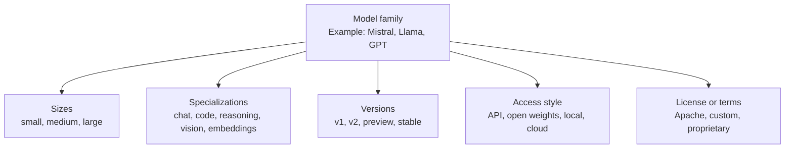
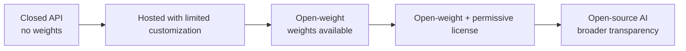
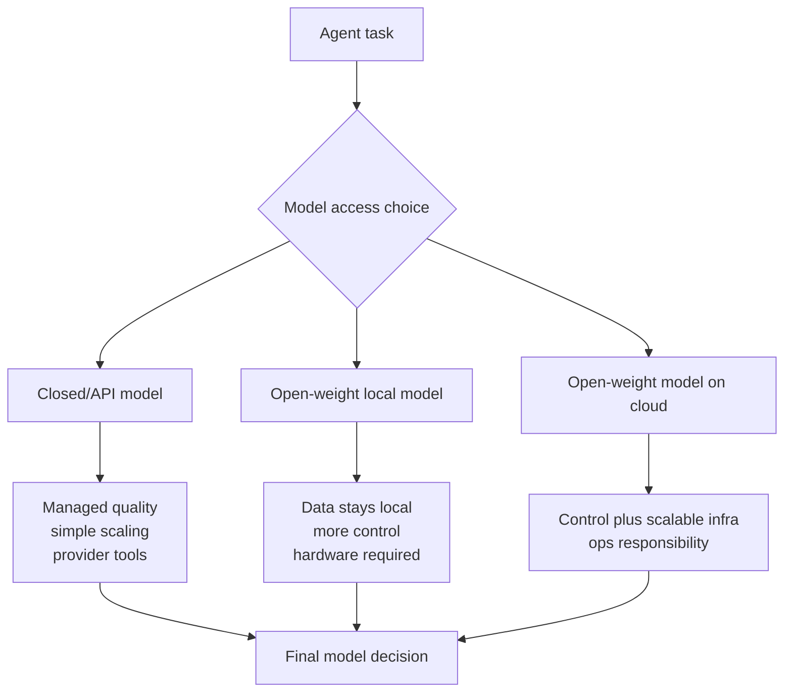
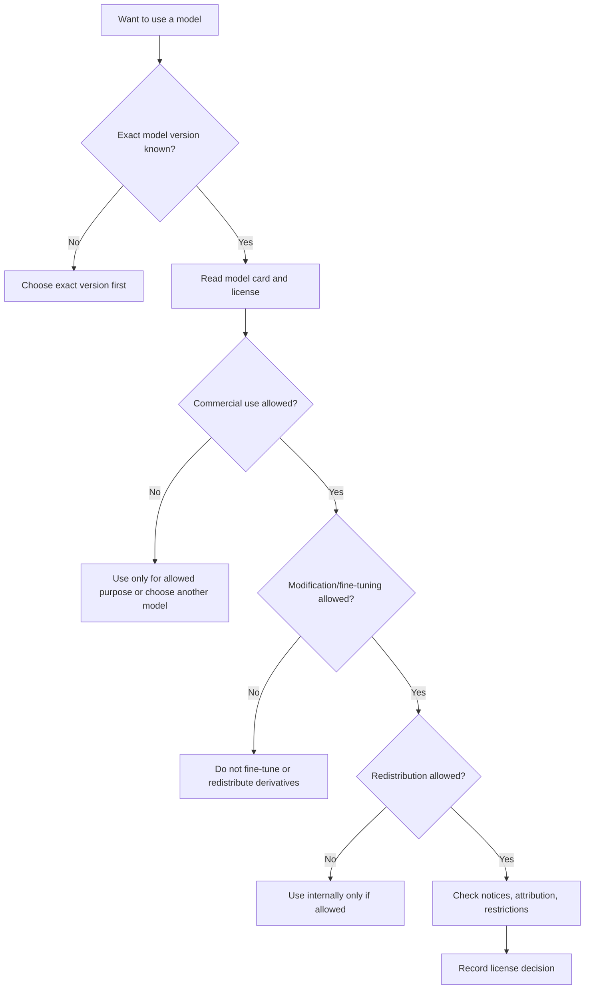
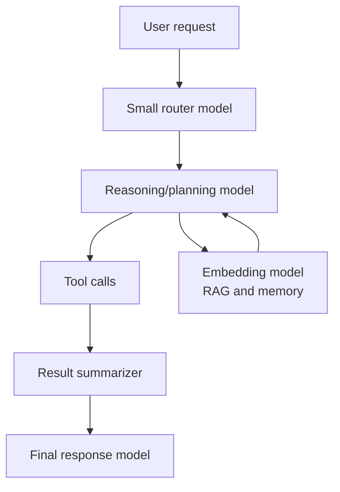

# Model Families and Licenses

<div class="topic-page" markdown="1">

<section class="topic-hero">
  <span class="topic-hero__eyebrow">Stage 02 - LLM Fundamentals</span>
  <p class="topic-hero__lead">Model families help you understand where an LLM comes from, what it is optimized for, and which smaller or larger versions belong together. Licenses explain what you are allowed to do with a model: use it, modify it, redistribute it, fine-tune it, or build commercial products with it.</p>
  <div class="topic-hero__facts">
    <span>Model families</span>
    <span>Open vs closed</span>
    <span>Licenses</span>
    <span>Model cards</span>
    <span>Agent fit</span>
  </div>
</section>

## Goal

Understand how to compare LLM model families and licenses so you can choose models safely and practically for AI agents.

After this lesson, you should be able to explain:

- what a model family is,
- why model families have different sizes and variants,
- how open-weight, open-source, source-available, and closed models differ,
- why model licenses matter for commercial and internal projects,
- how to read a model card before using a model,
- how to choose a model family for an agent task,
- what license questions to ask before shipping a product.

## Before You Start

You do not need to memorize every model name. Model names change frequently.

Start with this simple idea:

```text
A model family tells you what kind of model it is.
A license tells you what you are allowed to do with it.
```

Beginner example:

```text
Model family:
  Llama, GPT, Claude, Gemini, Mistral, Qwen

Model variant:
  small, medium, large, reasoning, code, vision, embedding, instruct

License:
  API terms, Apache 2.0, MIT, GPL, custom community license, proprietary terms
```

Important legal note:

```text
This page teaches engineering concepts.
It is not legal advice.
Always read the exact license and terms for the exact model version you use.
```

### Key Words In Plain English

| Word | Simple Meaning | Beginner Example |
| --- | --- | --- |
| Model family | A group of related models from the same creator or architecture line | GPT family, Claude family, Gemini family |
| Model variant | A specific model inside a family | Fast model, reasoning model, code model |
| Weights | The learned numbers inside a neural network | The downloadable files for an open-weight model |
| Open-weight | Weights are available to download | You can run the model locally if hardware allows |
| Closed-weight | Weights are not public | You call the model through an API |
| License | The rules for using, modifying, or sharing the model | Apache 2.0, MIT, Llama Community License |
| Model card | A document describing model details, limits, risks, and license | Hugging Face model card or provider docs |
| Terms of service | The rules for using a hosted API or product | OpenAI, Anthropic, Google, or cloud provider terms |

## Learning Path

This topic is designed in four parts. Read them in order.

<div class="learning-grid learning-grid--path">
  <a class="learning-card" href="#part-1-understand-model-families">
    <strong>Part 1 - Understand Model Families</strong>
    <span>Learn why models are grouped into families, variants, sizes, and capabilities.</span>
  </a>
  <a class="learning-card" href="#part-2-compare-open-and-closed-models">
    <strong>Part 2 - Compare Open And Closed Models</strong>
    <span>Understand open-weight, open-source, source-available, and closed-weight tradeoffs.</span>
  </a>
  <a class="learning-card" href="#part-3-read-model-licenses">
    <strong>Part 3 - Read Model Licenses</strong>
    <span>Learn what licenses allow, restrict, and require before production use.</span>
  </a>
  <a class="learning-card" href="#part-4-choose-models-for-ai-agents">
    <strong>Part 4 - Choose Models For AI Agents</strong>
    <span>Use capability, cost, latency, privacy, license, and deployment constraints to choose models.</span>
  </a>
</div>

## Part 1: Understand Model Families

A model family is a group of related models built by the same organization or around the same architecture and training approach.

Simple definition:

```text
A model family is a collection of related models
that share a common design, release line, or product ecosystem.
```

Examples:

| Family | Typical Creator | Common Access Style | Notes |
| --- | --- | --- | --- |
| GPT | OpenAI | Hosted API and products; some open-weight releases may exist separately | General, reasoning, multimodal, tool-using models |
| Claude | Anthropic | Hosted API and products | Strong writing, coding, reasoning, and long-context workflows |
| Gemini | Google | Hosted API, Google AI Studio, Vertex AI, products | Multimodal and Google ecosystem integration |
| Llama | Meta | Open-weight downloads plus hosted options from vendors | Common for local, private, and fine-tuned deployments |
| Mistral | Mistral AI | Mix of open models and hosted commercial models | Strong open-weight and API model options |
| Qwen | Alibaba/Qwen | Open-weight models and hosted/cloud options | Strong multilingual and code-capable open model family |
| BLOOM | BigScience | Open-access weights | Research-oriented multilingual model |

These examples change over time. Always check the provider's current model documentation before making a production decision.

### The Basic Model Family Picture



**How to read this diagram:** a model family is not one model. It is a set of related options. You choose the specific variant that fits your task, cost, deployment, and legal constraints.

### Why Families Have Different Sizes

Many model families include small, medium, and large variants.

| Size | Strength | Weakness | Agent Use Case |
| --- | --- | --- | --- |
| Small | Fast, cheap, easier to run locally | Less capable on hard reasoning | Routing, classification, simple tool calls |
| Medium | Balanced cost and quality | May still fail complex tasks | General assistant workflows |
| Large | Better reasoning and quality | More expensive and slower | Complex planning, coding, research, synthesis |
| Specialized | Optimized for one task | Less flexible outside that task | Embeddings, code, vision, speech, moderation |

Beginner rule:

```text
Do not automatically choose the biggest model.
Choose the smallest model that reliably solves the task.
```

### Common Model Variants

| Variant | What It Is For | Example Agent Use |
| --- | --- | --- |
| Base model | Predicts text; not necessarily instruction-following | Research, fine-tuning, experimentation |
| Instruct/chat model | Follows user instructions better | Chat assistants and tool-using agents |
| Reasoning model | Spends more compute on harder reasoning | Multi-step planning, math, coding, analysis |
| Code model | Optimized for code generation and repair | Coding agents, test repair, code review |
| Vision-language model | Understands images plus text | Screenshot agents, document understanding |
| Embedding model | Converts text into vectors | RAG, semantic search, memory retrieval |
| Reranker model | Reorders search results by relevance | Improve RAG result quality |
| Moderation/safety model | Classifies unsafe content | Safety filters and policy enforcement |

### Model Family vs Model Version

These are different concepts.

```text
Family:
  The broad line of related models.

Version:
  A specific release inside that family.

Variant:
  A version optimized for size, speed, reasoning, chat, code, vision, or embedding.
```

Example:

```text
Family:
  Llama

Version:
  Llama 3.1

Variant:
  Llama 3.1 8B Instruct
```

This matters because licenses, capabilities, context windows, and restrictions can differ by version and variant.

## Part 2: Compare Open And Closed Models

Model availability is not just "open" or "closed." There are several levels.

### Openness Spectrum



**How to read this diagram:** more openness usually gives more control and auditability, but also more responsibility for hosting, security, monitoring, and compliance.

### Access Types

| Access Type | What You Get | What You Usually Do Not Get | Example |
| --- | --- | --- | --- |
| Closed hosted API | A service endpoint | Model weights and full training details | Many frontier API models |
| Product-only model | A model inside an app | Direct API or weights | Chat or workspace products |
| Open-weight model | Downloadable weights | Often full training data or training code | Some Llama, Mistral, Qwen, BLOOM models |
| Open-source AI model | Broad freedoms plus required model information under an open AI definition | Still may have practical gaps depending on release | Check OSI-style criteria |
| Research-only release | Access for experiments | Commercial use or redistribution | Some academic models |

### Open-Weight vs Open-Source

These terms are commonly confused.

| Term | Meaning | Beginner Warning |
| --- | --- | --- |
| Open-weight | The model weights are downloadable | The license may still restrict use |
| Open-source software | Source code is available under an OSI-approved software license | Software rules do not automatically solve AI model questions |
| Open-source AI | A broader AI-specific openness concept | Check what data, code, weights, and documentation are provided |
| Source-available | You can see or download something, but rights may be restricted | Not the same as open source |
| Proprietary/closed | Controlled by provider; no public weights | You must follow API/product terms |

Simple rule:

```text
Open weights answer: "Can I download it?"
License answers: "What am I allowed to do with it?"
```

### Tradeoff Chart

| Choice | Pros | Cons | Good Fit |
| --- | --- | --- | --- |
| Closed API model | Easy to start, strong frontier quality, managed scaling | Less control, provider dependency, API costs, no weights | Fast product development and high-quality reasoning |
| Open-weight model | Local control, private deployment, fine-tuning, predictable ownership | Need infrastructure, optimization, monitoring, safety work | Privacy-sensitive or cost-sensitive workloads |
| Small local model | Low latency, offline possible, cheap at scale | Lower quality on hard tasks | Classification, routing, simple extraction |
| Large hosted model | High quality and broad capability | Cost and latency | Complex agent planning and synthesis |
| Specialized model | Efficient for one task | Poor generality | Embeddings, reranking, code, image, moderation |

### Deployment Picture



## Part 3: Read Model Licenses

A license defines what you are legally allowed to do with a model.

It may answer:

- Can I use the model commercially?
- Can I run it internally?
- Can I modify or fine-tune it?
- Can I redistribute the original weights?
- Can I redistribute my fine-tuned version?
- Must I include attribution or notices?
- Are there usage restrictions?
- Are there user-count or revenue thresholds?
- Can I use model outputs to train another model?
- Are there separate API terms?

### Common License Types

| License Type | Simple Meaning | Common Permissions | Common Cautions |
| --- | --- | --- | --- |
| MIT | Very permissive software license | Use, modify, redistribute, commercial use | Keep copyright/license notice |
| Apache 2.0 | Permissive license with patent grant | Use, modify, redistribute, commercial use | Keep notices and follow patent/notice terms |
| BSD | Permissive software license family | Similar to MIT-style use | Follow attribution clauses |
| GPL | Copyleft software license | Use, modify, distribute | Distributed derivatives may need source release |
| RAIL / Responsible AI License | Open access with use restrictions | Often allows broad access with prohibited uses | May not be OSI open-source |
| Custom community license | Provider-specific rules | May allow commercial use with conditions | Read thresholds, restrictions, attribution, output rules |
| Proprietary/API terms | Provider controls service access | Use through product/API | No weights; follow terms, data, and usage policies |

### License Decision Flow



**How to read this diagram:** do not decide from a blog post or model name alone. Decide from the exact model card, license file, and provider terms.

### What To Check In A Model Card

| Section | Why It Matters | Question To Ask |
| --- | --- | --- |
| Model name and version | Avoid using the wrong release | Which exact model am I using? |
| Creator/provider | Trust and support | Who maintains it? |
| License | Legal permissions | What am I allowed to do? |
| Intended use | Product fit | Is my use case covered? |
| Limitations | Reliability and safety | Where does it fail? |
| Training data summary | Privacy and bias review | What data was used, if disclosed? |
| Evaluation results | Quality estimate | What benchmarks are relevant? |
| Hardware requirements | Deployment planning | Can I run it affordably? |
| Context length | Agent design | How much prompt/history/tool output fits? |
| Safety notes | Risk controls | What policies or filters are recommended? |

### Example License Reading

Suppose you want to build an internal support-ticket agent with an open-weight model.

Good checklist:

```text
Exact model:
  Qwen3-8B

License:
  Apache 2.0 according to the model repository

Use case:
  Internal support ticket summarization

Questions:
  - Is commercial/internal use allowed?
  - Can we fine-tune on company tickets?
  - Can we redistribute the fine-tuned model?
  - Do we need attribution or notices?
  - Do company privacy rules allow this training data?
```

Notice that the model license is only one part. Company data policy and privacy rules still matter.

### Common Licensing Mistakes

| Mistake | Why It Is Risky | Better Practice |
| --- | --- | --- |
| Assuming "open" means unrestricted | Some open-weight models have custom restrictions | Read the exact license |
| Checking only the family name | Licenses may differ by version or variant | Check the exact model card |
| Ignoring API terms | Hosted use may have separate rules | Read provider API terms |
| Fine-tuning without checking rights | Derivative models may have restrictions | Confirm modification and redistribution rights |
| Forgetting attribution | Some licenses require notices | Keep license files and notices |
| Mixing incompatible assets | Datasets, code, and model weights may have different licenses | Track every dependency |
| Treating outputs as always unrestricted | Some terms restrict output use for training competitors | Read output and training clauses |

## Part 4: Choose Models For AI Agents

AI agents need models for different jobs. One agent can use multiple model families or variants.

### Agent Model Roles



**How to read this diagram:** an agent does not always need one large model for everything. It may use smaller models for routing, embeddings for retrieval, and stronger models for planning or final synthesis.

### Choosing By Agent Task

| Agent Task | Model Need | Better Fit |
| --- | --- | --- |
| Simple classification | Fast, cheap, consistent | Small hosted or local model |
| Customer support draft | Strong instruction following and tone | General chat/instruct model |
| Coding agent | Code understanding, tool use, long context | Code-capable or strong reasoning model |
| Research agent | Long context, citation handling, synthesis | High-quality general or reasoning model |
| RAG search | Vector representation | Embedding model plus reranker |
| Private document analysis | Data control | Open-weight model in private environment or enterprise API |
| Browser/computer agent | Vision, tool use, planning | Multimodal model with tool support |
| High-risk workflow | Reliability, logs, policy control | Model with strong evals plus strict app guardrails |

### Beginner Model Selection Checklist

Ask these questions before choosing a model:

<div class="visual-checklist">
  <div>
    <strong>Capability</strong>
    <ul>
      <li>Does it follow instructions well?</li>
      <li>Does it support tool calling?</li>
      <li>Does it need reasoning mode?</li>
      <li>Does it need vision, audio, or code skills?</li>
      <li>Does it support the required languages?</li>
    </ul>
  </div>
  <div>
    <strong>Operational fit</strong>
    <ul>
      <li>Can you afford the latency?</li>
      <li>Can you afford the token cost?</li>
      <li>Can you host it if needed?</li>
      <li>Does the license allow your use?</li>
      <li>Can you monitor and evaluate it?</li>
    </ul>
  </div>
</div>

### Weak vs Strong Model Choice

<div class="prompt-compare">
  <section>
    <span class="prompt-compare__label prompt-compare__label--bad">Weak</span>
    <pre><code>Use the biggest model.
It is probably the best.
Licenses do not matter because it is just internal.</code></pre>
    <p>This ignores cost, latency, deployment, privacy, and legal constraints.</p>
  </section>
  <section>
    <span class="prompt-compare__label prompt-compare__label--good">Strong</span>
    <pre><code>Use a small model for routing.
Use an embedding model for retrieval.
Use a stronger reasoning model only for complex cases.
Use an open-weight model only if its license allows our deployment and data policy.</code></pre>
    <p>This matches each model to a specific job and checks operational and license constraints.</p>
  </section>
</div>

### Simple Decision Table

| Requirement | Prefer This | Why |
| --- | --- | --- |
| Fast prototype | Hosted API model | Lowest setup work |
| Strict data residency | Private deployment or enterprise controls | More control over data flow |
| Lowest per-request latency | Small model or local model | Less compute and network overhead |
| Best hard reasoning | Strong reasoning model | Better multi-step problem solving |
| Large-scale cheap classification | Small open-weight model | Cost can be controlled after deployment |
| Product redistribution | Permissive license | Fewer redistribution restrictions |
| Fine-tuning | Open-weight model with modification rights | You need access and license permission |
| Regulated domain | Provider with compliance support or private deployment | Audit and governance needs |

## Summary

Model families help you compare related models. Licenses tell you what you can do with them.

Core rules:

```text
1. Do not choose by model name alone.
2. Choose the exact model version and variant.
3. Read the model card.
4. Read the license and API terms.
5. Match the model to the agent job.
6. Test quality, latency, cost, and safety on real examples.
```

Beginner shortcut:

```text
Family = what kind of model it is.
Variant = which specific version you use.
License = what you are allowed to do.
Model card = what you should know before trusting it.
```

## Practice

Pick three model families and compare them for an AI agent project.

Suggested project:

```text
Build an agent that reads company docs,
answers employee questions,
and drafts support-ticket replies.
```

Create a table:

| Model Family | Access Type | License/Terms | Strength | Weakness | Agent Role |
| --- | --- | --- | --- | --- | --- |
| Family A | API or open-weight | Exact license or terms | Best use | Main risk | Router, planner, RAG, final answer |
| Family B | API or open-weight | Exact license or terms | Best use | Main risk | Router, planner, RAG, final answer |
| Family C | API or open-weight | Exact license or terms | Best use | Main risk | Router, planner, RAG, final answer |

Then answer:

1. Which model would you use for routing?
2. Which model would you use for final answers?
3. Which model would you use for embeddings?
4. Which model can you fine-tune?
5. Which model can you use commercially?
6. Which model has the clearest license for your use case?

## Mini Project

Build a model-selection checklist for your own agent.

It should include:

- task description,
- required modalities,
- required context length,
- tool-calling needs,
- latency target,
- cost budget,
- privacy requirements,
- deployment target,
- candidate model families,
- candidate model variants,
- exact license or API terms,
- model card link,
- test prompts,
- evaluation results,
- final decision.

Suggested scoring table:

| Criterion | Weight | Model A | Model B | Model C |
| --- | --- | --- | --- | --- |
| Task quality | 5 |  |  |  |
| Tool calling | 4 |  |  |  |
| Latency | 3 |  |  |  |
| Cost | 4 |  |  |  |
| Privacy | 5 |  |  |  |
| License fit | 5 |  |  |  |
| Operations | 3 |  |  |  |

Do not pick the model with the most hype. Pick the model with the best evidence for your actual workflow.

## Exit Criteria

You are ready to move on when you can:

- explain model families in plain English,
- distinguish a model family, version, and variant,
- explain open-weight vs closed-weight models,
- explain why open-weight is not always the same as open-source,
- identify common license types,
- read a model card for practical deployment information,
- ask the right license questions before commercial use,
- choose different model variants for different agent roles,
- compare quality, latency, cost, privacy, and license fit.

## Resources

- [OpenAI Models Documentation](https://developers.openai.com/api/docs/models)
- [Anthropic Claude Models Overview](https://platform.claude.com/docs/en/about-claude/models/overview)
- [Google Gemini Models](https://ai.google.dev/gemini-api/docs/models)
- [Mistral AI Models](https://docs.mistral.ai/getting-started/models/)
- [Mistral AI Open Model License FAQ](https://help.mistral.ai/en/articles/347393-under-which-license-are-mistral-s-open-models-available)
- [Meta Llama Model Cards and Licenses](https://github.com/meta-llama/llama-models)
- [Qwen3 GitHub Repository](https://github.com/QwenLM/Qwen3)
- [BigScience BLOOM Model Card](https://huggingface.co/bigscience/bloom)
- [Hugging Face Model Repository Licenses](https://huggingface.co/docs/hub/repositories-licenses)
- [Open Source AI Definition](https://opensource.org/ai/open-source-ai-definition)
- [Apache License 2.0](https://www.apache.org/licenses/LICENSE-2.0)
- [MIT License](https://opensource.org/license/mit/)

</div>
