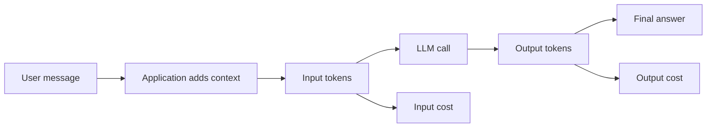
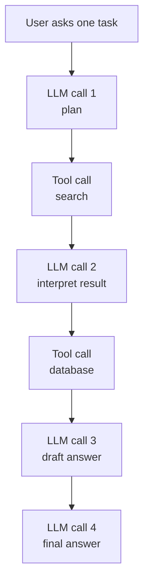
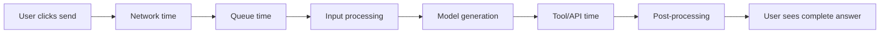
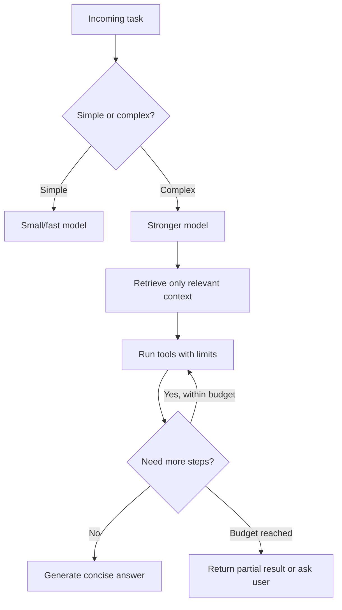

# Pricing and Latency

<div class="topic-page" markdown="1">

<section class="topic-hero">
  <span class="topic-hero__eyebrow">Stage 02 - LLM Fundamentals</span>
  <p class="topic-hero__lead">Pricing tells you how much an LLM call costs. Latency tells you how long the user waits. For AI agents, both can grow quickly because agents may call models many times, use tools, retrieve documents, and generate long answers.</p>
  <div class="topic-hero__facts">
    <span>Input tokens</span>
    <span>Output tokens</span>
    <span>Tool latency</span>
    <span>Streaming</span>
    <span>Budgets</span>
  </div>
</section>

## Goal

Understand how LLM pricing and latency work so you can estimate cost, design faster agent loops, and avoid expensive production surprises.

After this lesson, you should be able to explain:

- what input tokens and output tokens cost,
- why output tokens are often more expensive and slower,
- how agent loops multiply cost and latency,
- how tool calls, RAG, and long context affect response time,
- how to estimate cost before running a workload,
- how to measure latency with useful metrics,
- how to reduce cost and latency without breaking answer quality.

## Before You Start

You do not need to memorize provider prices. Prices change frequently.

Start with this simple idea:

```text
Pricing = how much work the model does.
Latency = how long the work takes.
```

Most hosted LLM APIs price by tokens. A token is a small piece of text or another model input unit. Images, audio, cached context, tool calls, and batch jobs may have special pricing depending on the provider.

Beginner rule:

```text
Long prompts cost more.
Long answers cost more.
More agent steps cost more.
More tools usually make the user wait longer.
```

### Key Words In Plain English

| Word | Simple Meaning | Beginner Example |
| --- | --- | --- |
| Input tokens | Tokens you send to the model | system prompt, user message, history, tool schemas, RAG context |
| Output tokens | Tokens the model generates | final answer, JSON, tool-call arguments |
| Cached input | Reused prompt content billed differently by some providers | repeated system prompt or fixed docs |
| Batch pricing | Lower-cost asynchronous processing on some platforms | overnight document labeling |
| Latency | Total time from request to response | user waits 3 seconds |
| Time to first token | Time until the first streamed token appears | text starts after 800 ms |
| Throughput | How many tokens are generated per second | 60 output tokens/sec |
| Tail latency | Slowest responses, often measured as p95 or p99 | 95% of requests finish under 8 seconds |

## Learning Path

This topic is designed in four parts. Read them in order.

<div class="learning-grid learning-grid--path">
  <a class="learning-card" href="#part-1-understand-llm-pricing">
    <strong>Part 1 - Understand LLM Pricing</strong>
    <span>Learn input, output, cached, batch, and agent-loop costs.</span>
  </a>
  <a class="learning-card" href="#part-2-understand-latency">
    <strong>Part 2 - Understand Latency</strong>
    <span>Break response time into network, queue, inference, generation, and tool time.</span>
  </a>
  <a class="learning-card" href="#part-3-estimate-agent-cost-and-speed">
    <strong>Part 3 - Estimate Agent Cost And Speed</strong>
    <span>Use simple formulas and examples to predict cost and waiting time.</span>
  </a>
  <a class="learning-card" href="#part-4-optimize-production-agents">
    <strong>Part 4 - Optimize Production Agents</strong>
    <span>Reduce tokens, calls, tool delays, and user-perceived waiting without losing quality.</span>
  </a>
</div>

## Part 1: Understand LLM Pricing

LLM providers usually charge based on how many tokens are processed.

Simple definition:

```text
Input cost = cost for tokens sent to the model.
Output cost = cost for tokens generated by the model.
Total model cost = input cost + output cost + any extra feature costs.
```

### Basic Pricing Pipeline



**How to read this diagram:** cost is not only the visible user message. The application may also send system instructions, conversation history, tool definitions, retrieved documents, and previous tool results.

### What Counts As Input

Input tokens can include:

- system instructions,
- developer instructions,
- user message,
- conversation history,
- tool definitions,
- retrieved documents,
- database results,
- file contents,
- images or audio represented as model input units,
- previous agent steps.

Example:

```text
User message:
  "Summarize this issue."

Hidden or app-added input:
  System prompt
  User profile
  Tool schemas
  Issue text
  Previous conversation
  Retrieved documentation
```

The user may see one sentence, but the model may receive thousands of tokens.

### What Counts As Output

Output tokens can include:

- final answer text,
- structured JSON,
- tool-call arguments,
- reasoning summaries if returned by the API,
- citations or source lists,
- long explanations,
- generated code.

Output tokens often matter more for latency because the model usually generates them sequentially.

Beginner rule:

```text
Shorter useful answers are cheaper and faster.
But answers that are too short may be less helpful.
```

### Simple Pricing Formula

Use this formula with the provider's current per-token or per-million-token price.

```text
total_cost =
  (input_tokens / 1,000,000 * input_price_per_1M)
+ (output_tokens / 1,000,000 * output_price_per_1M)
+ extra_feature_costs
```

Example with fake prices:

```text
Input tokens:
  10,000

Output tokens:
  1,000

Fake input price:
  $1.00 per 1M input tokens

Fake output price:
  $5.00 per 1M output tokens

Cost:
  10,000 / 1,000,000 * $1.00 = $0.010
   1,000 / 1,000,000 * $5.00 = $0.005

Total:
  $0.015
```

The numbers above are illustrative. Always use the current pricing page for the model you actually use.

### Pricing Types

| Pricing Type | Meaning | When It Matters |
| --- | --- | --- |
| Input token pricing | Cost for prompt/context tokens | Long prompts, RAG, conversation history |
| Output token pricing | Cost for generated tokens | Long answers, code generation, reports |
| Cached input pricing | Lower or different price for reused context | Repeated system prompts, long fixed documents |
| Batch pricing | Discounted asynchronous processing | Offline jobs that do not need instant answers |
| Fine-tuning pricing | Cost to train or use a fine-tuned model | Custom behavior or domain adaptation |
| Embedding pricing | Cost to create vectors | RAG indexing and semantic search |
| Image/audio pricing | Cost for multimodal input/output | Vision, speech, realtime agents |
| Hosted infrastructure cost | Cost to run open-weight models yourself | GPU servers, storage, monitoring, ops |

### Agent Cost Multiplier

Agents can be expensive because they may call the model many times.



One user request can become several paid model calls.

| User Request Type | Likely Model Calls | Cost Risk |
| --- | --- | --- |
| Simple answer | 1 | Low |
| RAG answer | 1-2 plus embedding/search costs | Medium |
| Research agent | Many calls plus web/tool calls | High |
| Coding agent | Many calls plus test/tool loops | High |
| Multi-agent workflow | Calls multiplied by each agent | Very high |

## Part 2: Understand Latency

Latency is the time a user waits for the system to respond.

Simple definition:

```text
Latency = total response time.
```

For streamed responses, two latency metrics are especially useful:

```text
Time to first token:
  How long before the user sees the first word.

Time to final token:
  How long before the full answer is complete.
```

### Latency Pipeline



**How to read this diagram:** the model is only one part of total latency. Agent tools, databases, retrieval systems, and app post-processing can add significant time.

### Latency Components

| Component | What It Means | Common Cause |
| --- | --- | --- |
| Network time | Request travels between user, app, and provider | Distance, connection, API gateway |
| Queue time | Request waits before processing | Provider load, rate limits, shared capacity |
| Input processing | Model processes prompt/context | Very long prompts or images |
| Generation time | Model creates output tokens | Long answer, slow model, reasoning mode |
| Tool time | Agent waits for tools | Web search, database, file system, browser |
| Post-processing | App validates, parses, filters, or formats | JSON validation, moderation, citation formatting |
| Frontend delay | UI waits before showing progress | No streaming, blocking UI design |

### Why Output Length Slows Responses

Model output is usually generated token by token.

```text
Short answer:
  50 output tokens
  finishes quickly

Long answer:
  2,000 output tokens
  takes longer
```

Practical rule:

```text
If you cut unnecessary output tokens,
you usually cut cost and latency at the same time.
```

### Streaming vs Non-Streaming

| Mode | What User Sees | Benefit | Limitation |
| --- | --- | --- | --- |
| Non-streaming | Nothing until full answer is done | Simpler backend | User waits longer before seeing progress |
| Streaming | Answer appears token by token | Better perceived speed | More frontend/backend complexity |
| Step streaming | Agent shows tool steps and progress | Better trust during long workflows | Must avoid leaking sensitive internals |

Streaming may not reduce total compute time, but it reduces perceived waiting time because the user sees progress earlier.

### Agent Latency Multiplier

Agent latency often grows with sequential steps.

```text
Total agent latency =
  LLM planning time
+ tool call time
+ LLM observation time
+ next tool call time
+ final response time
```

Example:

| Step | Time |
| --- | --- |
| LLM plans next action | 1.2s |
| Search tool runs | 2.0s |
| LLM reads search result | 1.5s |
| Database tool runs | 0.8s |
| LLM writes final answer | 3.0s |
| Total | 8.5s |

If some steps can run in parallel, latency can drop. If every step must wait for the previous step, latency accumulates.

## Part 3: Estimate Agent Cost And Speed

Estimation prevents surprises.

### Cost Estimate Template

Use this before building an agent feature.

```text
Per user task:
  model_calls_per_task = ?
  average_input_tokens_per_call = ?
  average_output_tokens_per_call = ?
  tool_calls_per_task = ?
  embedding_calls_per_task = ?

Per day:
  expected_tasks_per_day = ?

Cost:
  model_cost_per_task = ?
  daily_cost = model_cost_per_task * expected_tasks_per_day
```

### Worked Example: Support Agent

Scenario:

```text
Agent:
  Customer support assistant

Task:
  Read a ticket, search policy docs, draft a reply.
```

Estimated token usage:

| Item | Tokens |
| --- | ---: |
| System instructions | 700 |
| Tool schemas | 500 |
| User/ticket text | 1,200 |
| Retrieved policy chunks | 2,000 |
| Conversation history | 600 |
| Draft answer output | 500 |

Total per model call:

```text
Input tokens:
  700 + 500 + 1,200 + 2,000 + 600 = 5,000

Output tokens:
  500
```

If the agent uses two model calls:

```text
Total input tokens:
  5,000 * 2 = 10,000

Total output tokens:
  500 * 2 = 1,000
```

Then plug those numbers into the provider's current pricing table.

### Latency Estimate Template

Use this before shipping an agent workflow.

```text
total_latency =
  model_call_1_time
+ tool_call_1_time
+ model_call_2_time
+ tool_call_2_time
+ final_model_call_time
+ app_overhead
```

Better estimate:

```text
p50 latency:
  normal user experience

p95 latency:
  slow-but-common worst case

p99 latency:
  rare but painful tail latency
```

For production, p95 is usually more useful than average latency because users notice slow outliers.

### Cost And Latency Budget

| Budget Type | Example | Why It Helps |
| --- | --- | --- |
| Max input tokens | 8,000 per call | Prevents huge prompts |
| Max output tokens | 600 per answer | Controls cost and generation time |
| Max model calls | 3 per user task | Prevents agent loops |
| Max tool calls | 5 per user task | Prevents slow workflows |
| Max runtime | 20 seconds | Protects user experience |
| Max daily spend | $100/day | Protects product budget |
| Max retries | 2 per failed tool | Prevents retry storms |

### Cost Visibility

Log token and timing data for every model call.

Useful fields:

```text
timestamp
user_id or tenant_id
feature_name
model_name
input_tokens
output_tokens
cached_input_tokens
model_call_count
tool_call_count
time_to_first_token_ms
time_to_final_token_ms
total_request_ms
estimated_cost
stop_reason
```

Without this data, cost and latency optimization becomes guesswork.

## Part 4: Optimize Production Agents

Optimization means reducing waste while keeping answer quality.

### Cost And Latency Levers

| Lever | Reduces Cost | Reduces Latency | Risk |
| --- | --- | --- | --- |
| Use smaller model | Yes | Usually yes | Lower quality on hard tasks |
| Shorten output | Yes | Yes | Less detail |
| Trim irrelevant context | Yes | Sometimes | Missing needed evidence |
| Cache repeated prompt parts | Often | Often | Cache misses if prompt changes too much |
| Use batch processing | Often | No for interactive users | Slower completion time |
| Parallelize tools | No direct cost reduction | Yes | More complexity |
| Route easy tasks to cheaper model | Yes | Often | Router mistakes |
| Stop agent loops earlier | Yes | Yes | May stop before task is complete |
| Use RAG instead of huge context | Yes | Often | Retrieval quality matters |

### Weak vs Strong Optimization

<div class="prompt-compare">
  <section>
    <span class="prompt-compare__label prompt-compare__label--bad">Weak</span>
    <pre><code>Use the best model for every request.
Send all conversation history.
Return a very detailed answer.
Let the agent keep working until done.</code></pre>
    <p>This is expensive, slow, and can produce runaway agent loops.</p>
  </section>
  <section>
    <span class="prompt-compare__label prompt-compare__label--good">Strong</span>
    <pre><code>Route simple requests to a small model.
Send only relevant history and retrieved chunks.
Limit final answers to the user's requested format.
Stop after 3 model calls unless approval is given.</code></pre>
    <p>This keeps quality focused while controlling cost and response time.</p>
  </section>
</div>

### Optimization Pattern For Agents



### Practical Techniques

| Technique | How To Apply |
| --- | --- |
| Set output limits | Ask for concise answers and use `max_tokens` where appropriate |
| Reduce low-value context | Summarize old history and remove irrelevant RAG chunks |
| Put static prompt parts first | Helps prompt caching when provider supports it |
| Use model routing | Small model for easy tasks, stronger model for hard tasks |
| Use streaming | Show first tokens quickly |
| Parallelize independent tools | Search multiple sources at the same time |
| Avoid unnecessary tools | Do not search the web for stable facts already in context |
| Add stop criteria | Cap loops, retries, and tool calls |
| Track per-feature cost | Attribute spend to product features |
| Evaluate quality after trimming | Do not optimize blindly |

### Beginner Checklist

<div class="visual-checklist">
  <div>
    <strong>Cost checks</strong>
    <ul>
      <li>Count input tokens</li>
      <li>Count output tokens</li>
      <li>Track model calls per task</li>
      <li>Limit retrieved context</li>
      <li>Use caching where appropriate</li>
      <li>Set daily spend alerts</li>
    </ul>
  </div>
  <div>
    <strong>Latency checks</strong>
    <ul>
      <li>Measure time to first token</li>
      <li>Measure time to final token</li>
      <li>Stream long answers</li>
      <li>Cap output length</li>
      <li>Parallelize safe tools</li>
      <li>Track p95 latency</li>
    </ul>
  </div>
</div>

## Summary

Pricing and latency are core design constraints for AI agents.

Simple rules:

```text
Cost grows with:
  input tokens
  output tokens
  model calls
  tool calls
  special features

Latency grows with:
  model size
  output length
  long context
  sequential tools
  retries
  queues
```

Best beginner habit:

```text
Estimate before building.
Measure after shipping.
Optimize only with real token and latency data.
```

## Practice

Estimate cost and latency for this agent:

```text
Agent:
  Documentation Q&A assistant

Workflow:
  1. User asks a question.
  2. Agent retrieves 4 documentation chunks.
  3. Agent calls an LLM to answer.
  4. Agent cites sources.
```

Fill this table:

| Item | Estimate |
| --- | ---: |
| System prompt tokens |  |
| User question tokens |  |
| Retrieved context tokens |  |
| Conversation history tokens |  |
| Output answer tokens |  |
| Model calls per task |  |
| Tool calls per task |  |
| Expected p50 latency |  |
| Expected p95 latency |  |

Then answer:

1. Which part uses the most tokens?
2. Which part adds the most latency?
3. What can be cached?
4. What can be shortened?
5. What should be logged in production?

## Mini Project

Build a small cost and latency estimator.

It should accept:

- model name,
- input token count,
- output token count,
- current input price,
- current output price,
- model calls per task,
- expected tasks per day,
- average model latency,
- average tool latency,
- tool calls per task.

It should return:

- estimated cost per task,
- estimated daily cost,
- estimated monthly cost,
- estimated latency per task,
- warning if token or cost budget is exceeded,
- suggestion for the biggest optimization opportunity.

Suggested formula:

```python
def estimate_model_cost(
    input_tokens,
    output_tokens,
    input_price_per_1m,
    output_price_per_1m,
    calls_per_task,
):
    cost_per_call = (
        input_tokens / 1_000_000 * input_price_per_1m
        + output_tokens / 1_000_000 * output_price_per_1m
    )
    return cost_per_call * calls_per_task
```

## Exit Criteria

You are ready to move on when you can:

- explain input-token and output-token pricing,
- estimate model cost with a formula,
- explain why agents multiply model costs,
- identify latency components in an LLM app,
- distinguish time to first token and time to final token,
- explain why output length affects latency,
- design token, tool-call, runtime, and spend budgets,
- choose basic optimization techniques for cost and latency,
- log the right fields to debug production cost spikes and slow responses.

## Resources

- [OpenAI API Pricing](https://openai.com/api/pricing/)
- [OpenAI Latency Optimization](https://platform.openai.com/docs/guides/latency-optimization)
- [OpenAI Prompt Caching](https://platform.openai.com/docs/guides/prompt-caching)
- [Anthropic Pricing](https://docs.anthropic.com/en/docs/about-claude/pricing)
- [Anthropic Prompt Caching](https://www.anthropic.com/news/prompt-caching)
- [Gemini Developer API Pricing](https://ai.google.dev/gemini-api/docs/pricing)
- [Gemini Token Counting](https://ai.google.dev/gemini-api/docs/tokens)
- [Gemini Context Caching](https://ai.google.dev/gemini-api/docs/caching)
- [Mistral AI Models and Pricing](https://docs.mistral.ai/getting-started/models/)
- [Tokenization](../tokenization/index.md)
- [Context Windows](../context-windows/index.md)
- [Stopping Criteria](../../04-agent-fundamentals/stopping-criteria/index.md)

</div>
