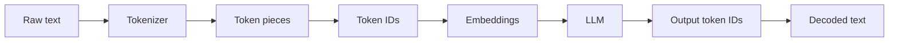

# Tokenization

<div class="topic-page" markdown="1">

<section class="topic-hero">
  <span class="topic-hero__eyebrow">Stage 02 - LLM Fundamentals</span>
  <p class="topic-hero__lead">Tokenization is the step that turns text into the small units an LLM can process. If you understand tokens, you can estimate cost, manage context, debug strange model behavior, and design cleaner prompts for agents.</p>
  <div class="topic-hero__facts">
    <span>Text to tokens</span>
    <span>Tokens to IDs</span>
    <span>Cost and latency</span>
    <span>Agent context design</span>
  </div>
</section>

## Goal

Understand how LLMs split text into tokens, why token counts are not the same as word counts, and how tokenization affects prompts, context, cost, latency, chunking, and agent reliability.

## Learning Path

This topic is designed in four parts. Read them in order.

<div class="learning-grid learning-grid--path">
  <a class="learning-card" href="#part-1-understand-what-tokenization-does">
    <strong>Part 1 - Understand What Tokenization Does</strong>
    <span>Learn how raw text becomes token pieces, token IDs, and model input.</span>
  </a>
  <a class="learning-card" href="#part-2-see-how-modern-tokenizers-split-text">
    <strong>Part 2 - See How Modern Tokenizers Split Text</strong>
    <span>Compare word, character, subword, BPE, WordPiece, Unigram, and SentencePiece.</span>
  </a>
  <a class="learning-card" href="#part-3-connect-tokens-to-cost-context-and-latency">
    <strong>Part 3 - Connect Tokens to Cost, Context, and Latency</strong>
    <span>Use token counts to plan prompts, outputs, tool results, and agent loops.</span>
  </a>
  <a class="learning-card" href="#part-4-debug-tokenization-in-real-projects">
    <strong>Part 4 - Debug Tokenization in Real Projects</strong>
    <span>Use the target model tokenizer, inspect surprising counts, and prevent common mistakes.</span>
  </a>
</div>

## Part 1: Understand What Tokenization Does

An LLM does not directly read text the way humans do. Before text reaches the model, a tokenizer splits it into tokens and maps each token to a number called a token ID.

The model then works with numbers, not raw letters. After generation, the output token IDs are decoded back into readable text.

### The Basic Pipeline



**How to read this diagram:** tokenization is only the early conversion step. It creates token pieces and token IDs. The model later turns those IDs into embeddings and uses them to predict the next token.

### A Token Is Not Always a Word

A token can be:

- a full word
- part of a word
- punctuation
- whitespace
- a symbol
- a byte-level piece
- a special control token used by the model or API

Example:

```text
Text:
Tokenization matters.

Possible token pieces:
["Token", "ization", " matters", "."]
```

This example is illustrative. The exact split depends on the model's tokenizer.

### Why This Matters

Tokenization explains why two strings that look similar to a human can cost different amounts to process.

| Text Pattern | Why Token Count Can Change |
| --- | --- |
| `AI agent` vs `AI-agent` | Punctuation can create different token pieces. |
| `red`, ` Red`, and `Red` | Spaces and capitalization can change token IDs. |
| English prose vs code | Code uses symbols, indentation, and identifiers. |
| English vs Japanese or Arabic | Different languages may use more or fewer tokens per word. |
| Short answer vs detailed answer | Output tokens are billed and counted too. |

The practical rule is simple: **never assume tokens equal words. Count tokens with the tokenizer for the model you will actually use.**

## Part 2: See How Modern Tokenizers Split Text

Modern LLMs usually use subword tokenization. Subword tokenization sits between word-level and character-level tokenization.

### Three Levels of Tokenization

| Method | Example Split | Strength | Weakness |
| --- | --- | --- | --- |
| Word-level | `["unbelievable"]` | Easy to understand | Huge vocabulary; struggles with rare words. |
| Character-level | `["u", "n", "b", ...]` | Can represent any word | Creates long sequences; less meaning per token. |
| Subword-level | `["un", "believ", "able"]` | Handles common and rare words well | Splits are model-specific and not always intuitive. |

Subword tokenization is common because it balances two needs:

- Keep frequent words or phrases compact.
- Break rare words, names, code identifiers, and new terms into known pieces.

### Common Tokenizer Families

You do not need to memorize every algorithm, but you should know what each one is for. The examples below are simplified to show the idea. Real token splits depend on the model's trained vocabulary.

| Tokenizer Family | Core Idea | Simple Example Split | Common Use |
| --- | --- | --- | --- |
| BPE | Start with small units and repeatedly merge frequent adjacent pairs. | `lowest` -> `["low", "est"]` after learning common pieces like `low` and `est`. | Many GPT-style and modern transformer models. |
| Byte-level BPE | Use bytes as the base units so almost any text can be represented. | `café` can be represented safely because the tokenizer can fall back to byte pieces if needed. | Useful for broad text coverage and avoiding unknown characters. |
| WordPiece | Similar to BPE, but chooses merges using a likelihood-based score. | `unwanted` -> `["un", "##want", "##ed"]` in a BERT-style format. | BERT-family models. |
| Unigram | Start with many candidate pieces and remove the least useful ones. | `unbelievable` may become `["un", "believable"]` or `["un", "believ", "able"]`, then the highest-probability split is selected. | Some encoder-decoder and multilingual models. |
| SentencePiece | A tokenizer library that can apply BPE or Unigram directly to raw text, including spaces. | `Hello world` -> `["▁Hello", "▁world"]`, where `▁` represents a space. | Multilingual models and languages without clear word spaces. |

### Simple BPE Example

BPE learns useful pieces from repeated patterns in training text.

Imagine a tiny training set:

```text
hug, hugs, pug, pugs
```

A simple BPE-style process might learn:

```text
Start:
h u g
h u g s
p u g
p u g s

Frequent pair:
u + g -> ug

After merge:
h ug
h ug s
p ug
p ug s
```

The tokenizer has learned that `ug` is a useful piece. Larger real tokenizers do this over huge text corpora and learn thousands of pieces.

### Special Tokens

LLM systems may also use special tokens. These are not normal words. They help structure the model input.

Examples include:

- beginning-of-sequence markers
- end-of-sequence markers
- message role separators
- tool-call separators
- padding tokens for batches
- unknown-token markers in some tokenizers

For agent builders, this matters because the final prompt is not only the visible user message. The model may also receive system instructions, developer instructions, conversation history, tool schemas, tool outputs, and hidden formatting tokens added by the API or framework.

## Part 3: Connect Tokens to Cost, Context, and Latency

Tokenization becomes practical when you connect it to engineering limits.

### The Four Token Counts Developers Must Track

| Count | Meaning | Why It Matters |
| --- | --- | --- |
| Input tokens | Tokens sent to the model. | Affects context usage, cost, and latency. |
| Output tokens | Tokens generated by the model. | Affects cost, response length, and user wait time. |
| Cached tokens | Previously processed tokens reused by some APIs. | Can reduce cost or latency depending on provider behavior. |
| Reasoning tokens | Internal tokens used by some reasoning models. | Can increase total token usage even when the visible answer is short. |

Do not only count the user's message. In an agent system, input tokens can include:

- system prompt
- developer prompt
- user request
- previous messages
- retrieved documents
- tool definitions
- tool results
- examples
- output schemas
- current plan or scratch state

### Token Budget Formula

For one model call, think in this shape:

```text
total_token_budget =
  system_and_developer_tokens
  + conversation_tokens
  + retrieved_context_tokens
  + tool_schema_tokens
  + tool_result_tokens
  + expected_output_tokens
```

The total must fit inside the model's context limit. The context window topic explains that limit in more detail, but tokenization is the measuring system behind it.

### Agent Example

Suppose an agent answers a question using retrieved documents and a calculator tool.

```text
System instructions:     700 tokens
User question:            80 tokens
Conversation history:   900 tokens
Tool definitions:       600 tokens
Retrieved passages:    2200 tokens
Tool result:            300 tokens
Reserved answer space:  700 tokens
```

Estimated total:

```text
700 + 80 + 900 + 600 + 2200 + 300 + 700 = 5480 tokens
```

This estimate helps you decide whether to:

- retrieve fewer passages
- summarize old history
- shrink tool outputs
- reduce answer length
- use a model with a larger context window
- split the task into multiple calls

### Why Token Counts Affect User Experience

More tokens usually means:

- higher cost
- more latency before the answer starts
- longer generation time
- more chance of irrelevant context distracting the model

Fewer tokens can improve speed and cost, but removing the wrong information can reduce answer quality. Good agent design is not "use the fewest tokens possible." It is **use the right tokens for the current step**.

## Part 4: Debug Tokenization in Real Projects

Tokenization problems are common when prompts become long, structured, multilingual, or tool-heavy.

### Use the Correct Tokenizer

Different models can tokenize the same text differently. Always count with the tokenizer for the target model.

Optional Python example:

```python
# pip install tiktoken
import tiktoken

model = "YOUR_MODEL_NAME"
text = "Tokenization matters for cost, context, and latency."

encoding = tiktoken.encoding_for_model(model)
tokens = encoding.encode(text)

print("Token count:", len(tokens))
print("Token IDs:", tokens)
print("Decoded pieces:", [encoding.decode([token]) for token in tokens])
```

If your model does not use `tiktoken`, use the tokenizer provided by that model vendor or the model's Hugging Face tokenizer.

### Common Tokenization Surprises

<div class="visual-checklist">
  <div>
    <strong>Problem patterns</strong>
    <ul>
      <li>Large JSON blobs</li>
      <li>Long code files</li>
      <li>Base64 strings</li>
      <li>HTML with repeated tags</li>
      <li>Tables pasted as raw text</li>
      <li>Logs with timestamps and IDs</li>
      <li>Multilingual content</li>
      <li>Emoji and unusual symbols</li>
    </ul>
  </div>
  <div>
    <strong>Better handling</strong>
    <ul>
      <li>Send only relevant fields</li>
      <li>Summarize or chunk long files</li>
      <li>Do not paste binary-like data</li>
      <li>Strip repeated markup</li>
      <li>Use compact tables</li>
      <li>Keep key log lines only</li>
      <li>Test real languages you support</li>
      <li>Inspect exact token counts</li>
    </ul>
  </div>
</div>

### Weak vs Strong Token-Aware Prompting

<div class="prompt-compare">
  <section>
    <span class="prompt-compare__label prompt-compare__label--bad">Weak</span>
    <pre><code>Here is a full 80-page document and all logs from the last week.
Find the issue.</code></pre>
    <p>This wastes context and may bury the useful facts inside irrelevant text.</p>
  </section>
  <section>
    <span class="prompt-compare__label prompt-compare__label--good">Strong</span>
    <pre><code>Analyze these 25 relevant log lines.
Focus on the payment timeout after deploy 2026-06-01.
Return: likely cause, evidence, next check.</code></pre>
    <p>This gives the model fewer but more useful tokens for the current task.</p>
  </section>
</div>

### Token-Aware Chunking Rules

When splitting documents for RAG or long-document analysis:

- chunk by meaning, not only by character count
- keep headings with the paragraphs they describe
- avoid cutting code blocks in the middle
- reserve room for metadata and citations
- leave output space in the context budget
- test chunks with the same tokenizer used by the target model

Bad chunking can split an important idea across two chunks. Good chunking keeps each chunk useful by itself.

### Checklist for Agent Builders

Before sending a model call, ask:

- Did I count tokens with the correct tokenizer?
- Did I include only context needed for the next step?
- Did I reserve enough output tokens?
- Did I compress tool results into useful facts?
- Did I avoid pasting raw logs, raw HTML, or huge JSON when only a few fields matter?
- Did I test token usage on realistic user inputs, not only small examples?

## Practice

Choose one real prompt from this roadmap project or from an AI app you are building.

1. Count the tokens with the tokenizer for your target model.
2. Identify which parts consume the most tokens.
3. Remove or compress low-value context.
4. Count again.
5. Compare the model's answer before and after the change.

Record:

- original input token count
- improved input token count
- expected output token budget
- answer quality
- latency difference, if available
- what information you removed
- what information you kept

## Mini Project

Build a small token budget inspector.

It should accept:

- system prompt
- user message
- retrieved context
- tool definitions
- tool output
- expected output length

It should return:

- token count for each section
- total estimated tokens
- warning if the request is near the model limit
- suggestion for what to reduce first

Suggested reduction order:

1. raw tool output
2. old conversation history
3. low-ranked retrieved chunks
4. repeated examples
5. overly long formatting instructions

Do not reduce the user's core request, safety rules, or required constraints unless the product has a clear fallback flow.

## Exit Criteria

You are ready to move on when you can:

- explain tokenization in plain English
- explain why tokens are not the same as words
- describe how text becomes token IDs
- compare word, character, and subword tokenization
- explain why BPE-style subword tokenizers are useful
- count tokens using the correct tokenizer for a model
- estimate how tokens affect context, cost, and latency
- debug prompts that are too long or unexpectedly expensive
- design cleaner agent prompts by keeping the right tokens

## Resources

- [NVIDIA: What Are AI Tokens?](https://blogs.nvidia.com/blog/ai-tokens-explained/)
- [DataCamp: Tokenization in NLP](https://www.datacamp.com/blog/what-is-tokenization)
- [OpenAI Help: What are tokens and how to count them?](https://help.openai.com/en/articles/4936856-what-are-tokens-and-how-to-count-them)
- [OpenAI Tokenizer](https://platform.openai.com/tokenizer)
- [Hugging Face: Tokenization algorithms](https://huggingface.co/docs/transformers/tokenizer_summary)
- [Hugging Face Tokenizer Playground](https://huggingface.co/spaces/Xenova/the-tokenizer-playground)
- [Sennrich, Haddow, and Birch: Neural Machine Translation of Rare Words with Subword Units](https://arxiv.org/abs/1508.07909)
- [Kudo and Richardson: SentencePiece](https://arxiv.org/abs/1808.06226)

</div>
