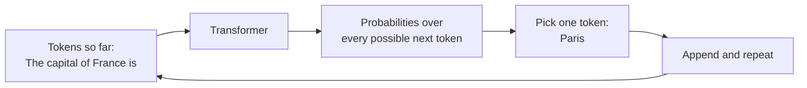
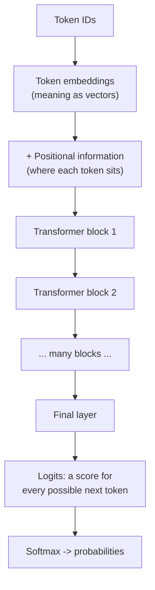
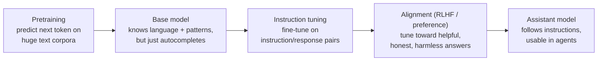

# Transformer Models and LLMs

<div class="topic-page" markdown="1">

<section class="topic-hero">
  <span class="topic-hero__eyebrow">Stage 02 - LLM Fundamentals</span>
  <p class="topic-hero__lead">A large language model is a transformer trained to predict the next token. Once you see that one idea, the rest of an agent stack stops being magic: prompting, context windows, tool calls, and generation controls are all ways of steering a very good next-token predictor. This topic explains what a transformer is, how it works at a high level, and why it became the foundation of modern AI.</p>
  <div class="topic-hero__facts">
    <span>Next-token prediction</span>
    <span>Embeddings</span>
    <span>Attention</span>
    <span>Layers</span>
    <span>Pretrain then align</span>
  </div>
</section>

## Goal

Build an accurate mental model of how large language models (LLMs) work, so you can reason about their strengths and limits when building agents. You should be able to explain what a transformer does, name its core parts, say why attention mattered, and describe how a raw model becomes a helpful assistant.

This topic is conceptual. It does not re-teach tokens ([Tokenization](../tokenization/index.md)), the context limit ([Context Windows](../context-windows/index.md)), or how the final token is sampled ([Generation Controls](../generation-controls/index.md)). It explains the model those topics sit on top of.

## Learning Path

This topic is designed in four parts. Read them in order.

<div class="learning-grid learning-grid--path">
  <a class="learning-card" href="#part-1-see-an-llm-as-a-next-token-predictor">
    <strong>Part 1 - A Next-Token Predictor</strong>
    <span>See the one core behavior that everything else is built on.</span>
  </a>
  <a class="learning-card" href="#part-2-look-inside-the-transformer">
    <strong>Part 2 - Look Inside the Transformer</strong>
    <span>Follow text through embeddings, attention, and stacked layers.</span>
  </a>
  <a class="learning-card" href="#part-3-why-attention-was-the-breakthrough">
    <strong>Part 3 - Why Attention Was the Breakthrough</strong>
    <span>Understand what attention solved that older models could not.</span>
  </a>
  <a class="learning-card" href="#part-4-from-base-model-to-assistant">
    <strong>Part 4 - From Base Model to Assistant</strong>
    <span>Learn how a raw model is trained, aligned, and made useful for agents.</span>
  </a>
</div>

## Part 1: See an LLM as a Next-Token Predictor

At its core, an LLM does one thing: given a sequence of tokens, it predicts the next token. That is the whole job. Everything an agent does is built on top of this single behavior.

When you send a prompt, the model does not "look up" an answer. It repeatedly asks: *given everything so far, what token is most likely to come next?* It picks one, appends it, and asks again. This repeat-until-done process is called **autoregressive generation**.



**How to read this diagram:** the model produces a probability for *every* token in its vocabulary, one token is chosen, and the loop runs again with the new token included. *How* that token is chosen (greedy, temperature, top-p) is covered in [Generation Controls](../generation-controls/index.md).

### One Sentence, Token by Token

```text
Prompt:    The capital of France is
Step 1 ->  The capital of France is Paris
Step 2 ->  The capital of France is Paris.
Step 3 ->  The capital of France is Paris. (stop)
```

The model never sees the future. At each step it only sees the tokens before the current position, which is why it is called a **causal** or **decoder-only** model.

### Why This Framing Matters for Agents

Almost every agent behavior is a consequence of "it predicts the next token."

| Agent concept | Why it follows from next-token prediction |
| --- | --- |
| Prompting works | Better context shifts which next token is most likely. |
| Tool calls are just text | The model emits a structured token sequence your code then executes. |
| Hallucination happens | A fluent-but-wrong token can still be the most likely one. |
| Context window exists | The model can only condition on tokens that fit in the input. |
| Output is probabilistic | The same prompt can produce different tokens run to run. |

If you remember nothing else: **an LLM is a probability machine over tokens, not a database of facts.**

## Part 2: Look Inside the Transformer

The **transformer** is the neural network architecture behind modern LLMs, introduced in the 2017 paper *Attention Is All You Need*. You do not need the math to build agents, but you should know the path text takes through it.



**How to read this diagram:** tokens become vectors, flow through a stack of identical blocks that refine those vectors, and the last layer turns the result into a score for every possible next token.

### The Core Parts

| Part | What it does | Plain-language analogy |
| --- | --- | --- |
| Token embeddings | Turn each token ID into a vector that captures meaning | Give every word a position on a giant "meaning map" |
| Positional encoding | Add information about token order | Tell the model word #1 from word #2 |
| Attention | Let each token look at other tokens and pull in what is relevant | Each word "reads the room" before deciding what it means here |
| Feed-forward layers | Transform each token's vector individually | Per-word thinking after the discussion |
| Stacked blocks | Repeat attention + feed-forward many times | Each layer builds on the last, low-level to high-level |
| Output head | Convert the final vectors into next-token scores (logits) | Score every candidate word |

Embeddings here are the same idea you meet in [Embeddings and Vector Search](../embeddings-vector-search/index.md): meaning represented as a vector. The transformer learns and uses these vectors internally.

### What "Attention" Actually Means

Attention is the heart of the transformer. For each token, the model asks: *which other tokens should I pay attention to in order to understand this one?*

```text
Sentence:
  "The trophy did not fit in the suitcase because it was too big."

Question: what does "it" refer to?
```

To represent `it` correctly, the model must attend back to `trophy`, not `suitcase`. Attention is the mechanism that lets the token `it` pull meaning from the right earlier token. The model does this for every token, in parallel, across many layers — building up an understanding of how all the words relate.

### Parameters, Layers, and "Large"

The "large" in large language model refers mostly to the number of **parameters** — the learned numbers (weights) inside those layers — and the amount of training data.

- More parameters and data generally mean more capability, but also higher cost and latency (see [Pricing and Latency](../pricing-and-latency/index.md)).
- Different sizes of the same architecture form a **model family** (see [Model Families and Licenses](../model-families/index.md)).
- The architecture is what makes it a *transformer*; the parameters are what it *learned*.

## Part 3: Why Attention Was the Breakthrough

Transformers replaced older sequence models like RNNs (recurrent neural networks) and LSTMs. Understanding what they fixed explains why LLMs work as well as they do.

<div class="visual-checklist">
  <div>
    <strong>Older models (RNN / LSTM) struggled with:</strong>
    <ul>
      <li>Reading word by word, in strict order</li>
      <li>Forgetting information from far earlier in the text</li>
      <li>Being slow to train because steps could not be parallelized</li>
      <li>Weak handling of long-range relationships between words</li>
    </ul>
  </div>
  <div>
    <strong>Transformers changed this by:</strong>
    <ul>
      <li>Letting every token attend to every other token directly</li>
      <li>Connecting distant words in a single step, not many</li>
      <li>Processing the whole sequence in parallel during training</li>
      <li>Scaling smoothly to huge datasets and model sizes</li>
    </ul>
  </div>
</div>

The two wins that matter most:

1. **Long-range understanding.** Any token can reach any other token in one attention step, so the model connects ideas that are far apart in the text.
2. **Parallel training.** Because tokens are processed together rather than one-at-a-time, transformers train efficiently on modern hardware (GPUs/TPUs). This is what made training on internet-scale data practical — and that scale is what produced today's capabilities.

### The Catch: Attention Is Not Free

Attention compares tokens with other tokens, so its cost grows quickly as the input gets longer. This is the real reason a **context window** has a limit, and why longer prompts cost more and respond slower.

```text
Short prompt  -> few comparisons  -> cheap, fast
Long prompt   -> many comparisons -> expensive, slower
```

This connects directly to [Context Windows](../context-windows/index.md): a bigger window is more capacity, not free capacity.

## Part 4: From Base Model to Assistant

A freshly trained transformer is not yet the helpful assistant you talk to. It becomes one through stages of training.



**How to read this diagram:** pretraining builds raw language ability; later stages teach the model to follow instructions and behave the way users expect.

### The Stages

| Stage | What happens | Result |
| --- | --- | --- |
| Pretraining | Predict the next token across massive text data | A **base model**: fluent, knowledgeable, but only autocompletes |
| Instruction tuning | Fine-tune on examples of instructions and good responses | The model starts following requests instead of just continuing text |
| Alignment (RLHF / preference tuning) | Train using human or model preferences about which answers are better | More helpful, safer, more consistent behavior |
| Tool / agent tuning *(some models)* | Train on examples of calling tools and using results | Better at structured tool calls and multi-step tasks |

### Base vs Assistant: a Quick Contrast

<div class="prompt-compare">
  <section>
    <span class="prompt-compare__label prompt-compare__label--bad">Base model</span>
    <pre><code>Prompt:  Write a haiku about the sea.
Output:  Write a haiku about the mountains.
         Write a haiku about the city.</code></pre>
    <p>A base model just continues the most likely text. It may extend your instruction instead of following it.</p>
  </section>
  <section>
    <span class="prompt-compare__label prompt-compare__label--good">Assistant model</span>
    <pre><code>Prompt:  Write a haiku about the sea.
Output:  Endless rolling waves
         whisper to the quiet shore —
         salt on evening air</code></pre>
    <p>An instruction-tuned, aligned model understands that you want it to <em>do</em> the task.</p>
  </section>
</div>

### What This Means for Agent Builders

- **Knowledge has a cutoff.** The model only knows what was in its training data. For fresh or private facts, use retrieval ([RAG Basics](../rag-basics/index.md)) or tools, not the model's memory.
- **It predicts, it does not verify.** A confident answer is the *most likely* text, not a *checked* fact. Agents need validation, tools, and grounding.
- **Behavior comes from alignment, not rules.** The model follows instructions because it was trained to, not because it obeys hard logic. Prompts steer it; they do not guarantee it.
- **The architecture sets the limits.** Context size, cost, and latency all trace back to how transformers process tokens.

## Practice

Pick any LLM you can access through a playground or API.

1. Give it a plain continuation prompt (for example: `The three primary colors are`) and watch it autocomplete.
2. Give it a clear instruction (for example: `List the three primary colors as bullet points.`) and compare the behavior.
3. Ask it a question about an event after its knowledge cutoff and notice how it responds.
4. Run the same prompt three times and observe whether the output changes.

Write down:

- where it behaved like a next-token predictor
- where instruction tuning was visible
- one answer that was fluent but possibly wrong
- whether outputs varied between runs, and why that happens

## Mini Project

Write a one-page "How an LLM works" explainer for a teammate who has never used one, in your own words.

It must include:

- a definition of next-token prediction
- a simple diagram of text flowing through embeddings, attention, and layers
- one sentence explaining what attention does
- the difference between a base model and an assistant model
- two concrete implications for building agents (for example: knowledge cutoff, hallucination, context limits)

The goal is to explain the model accurately *without* using the word "magic" and without copying definitions — if you can teach it simply, you understand it.

## Exit Criteria

You are ready to move on when you can:

- explain that an LLM predicts the next token and generates autoregressively
- name the core parts of a transformer: embeddings, positional info, attention, feed-forward layers, output head
- explain in plain language what attention does and why it mattered
- describe why context length affects cost and latency
- outline the path from pretraining to an aligned assistant
- explain why LLMs hallucinate and why they have a knowledge cutoff
- connect this model to tokenization, context windows, and generation controls

## Resources

- [roadmap.sh: AI Agents Roadmap](https://roadmap.sh/ai-agents)
- [Vaswani et al.: Attention Is All You Need](https://arxiv.org/abs/1706.03762)
- [Jay Alammar: The Illustrated Transformer](https://jalammar.github.io/illustrated-transformer/)
- [3Blue1Brown: But what is a GPT? (visual intro)](https://www.3blue1brown.com/lessons/gpt)
- [Hugging Face LLM Course](https://huggingface.co/learn/llm-course)
- [Anthropic: Mapping the mind of a large language model](https://www.anthropic.com/research/mapping-mind-language-model)
- [OpenAI: How GPT models work (API intro)](https://platform.openai.com/docs/guides/text-generation)

</div>
