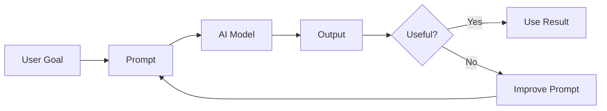
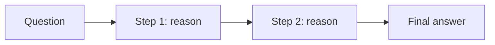
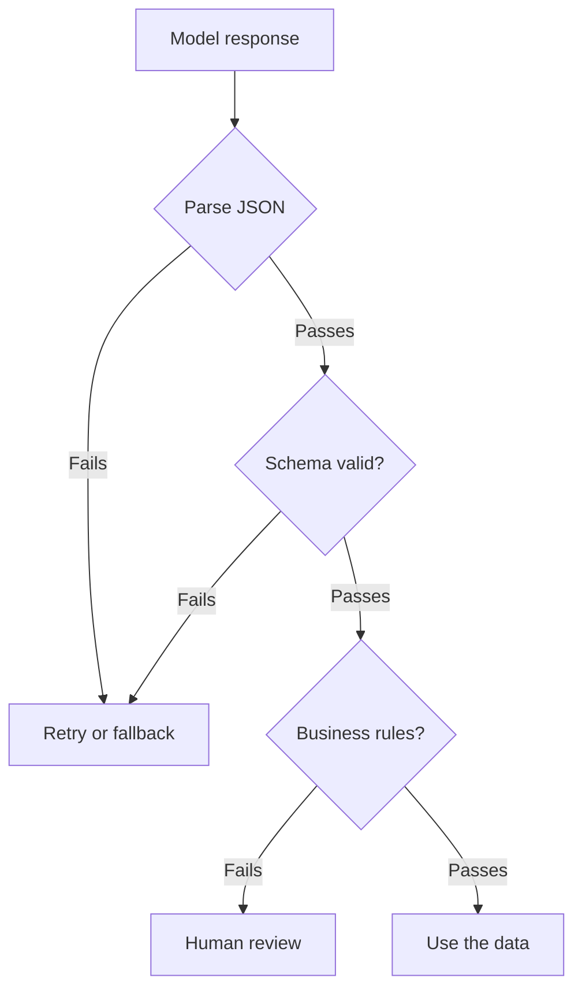

# Junior Interview: Prompt Engineering

Friendly, entry-level questions for people who are still learning prompt engineering. They check whether the **foundations** are there — and they double as a **study guide**: each question has a short rubric (*good answer covers*), a fuller **explanation** with examples and diagrams, and a hint the interviewer can give if the candidate is stuck.

!!! note "How to use this page"
    As an interviewer, ask the question and listen for the ideas in *good answer covers*; the explanation is there to help you follow up and to let learners study. Reading every explanation here should cover most of the Stage 03 basics. See the [QAs](../test/index.md) for quick self-testing.

## 1. In plain words, what is a prompt and what is prompt engineering?

**Good answer covers:** A **prompt** is the input you give a model that tells it what to do (a question, an instruction, data, examples, or a schema). **Prompt engineering** is the practice of writing, testing, and improving prompts so the output is useful and reliable.

**Explanation:** The model only knows what's in the prompt. A vague prompt forces it to guess; a clear prompt gives it a target. Prompt engineering treats this like a small engineering loop — you write a prompt, look at the output, and improve it instead of trusting a single lucky result.



**Hint if stuck:** Think about the only thing the model actually sees before it answers.

## 2. Why does prompt quality matter more for agents than for a simple chatbot?

**Good answer covers:** A chatbot usually answers one message. An **agent** plans steps, calls tools, reads files, and decides when it's done — so a weak prompt can cause wrong tool use, invented facts, unsafe actions, or unclear final answers.

**Explanation:** With more autonomy comes more ways to go wrong. A strong agent prompt defines the **role**, the **goal**, the **tool rules**, the **boundaries**, and the **completion criteria** ("what does done mean?"). If any of those are missing, the agent can behave unpredictably across many steps, not just one reply.

**Hint if stuck:** What can an agent do that a one-shot chatbot can't — and how could each of those go wrong?

## 3. What are the main parts of a good prompt?

**Good answer covers:** Role, task, context, input, constraints, and output format (examples and success criteria when needed). The task should be an **action**, not just a topic.

**Explanation:** A useful prompt is a small instruction package, not just a question. Each part has a job, and naming them makes the request easy to follow and easy to test.

| Prompt Part | What It Does | Example |
| --- | --- | --- |
| Role | Sets perspective | `You are a senior backend reviewer.` |
| Task | The action to perform | `Find bugs in this function.` |
| Context | Background that changes the answer | `This runs in a serverless API.` |
| Input | The data to work on | `Code: {code_block}` |
| Constraints | Rules and limits | `Do not change public API names.` |
| Output format | Makes the answer usable | `Return a Markdown table.` |
| Examples | Shows the pattern | `Input: ... Output: ...` |

**Hint if stuck:** If you wrote a recipe for the model, what sections would it need?

## 4. What does "be specific" mean, and how do you test if a prompt is specific enough?

**Good answer covers:** Specific means stating the exact task, audience, scope, rules, and output — not just the topic. A good test: if two smart people could read the prompt and expect different answers, it's not specific enough.

**Explanation:** `Explain agents.` is too vague — it doesn't say *which* agents, for *whom*, how *deep*, or in what *format*. Adding audience and output rules turns guesswork into a clear target.

<div class="prompt-compare">
  <section>
    <span class="prompt-compare__label prompt-compare__label--bad">Weak</span>
    <pre><code>Explain agents.</code></pre>
  </section>
  <section>
    <span class="prompt-compare__label prompt-compare__label--good">Strong</span>
    <pre><code>Explain AI agents to a beginner developer.
Use 5 bullet points.
Include one simple example.
Mention one common mistake.</code></pre>
  </section>
</div>

**Hint if stuck:** Could two people read your prompt and reasonably expect different answers?

## 5. What's the difference between zero-shot and few-shot prompting? What is a "shot"?

**Good answer covers:** A **shot** is an example of the task. **Zero-shot** = instructions only, no examples. **Few-shot** = a few input/output examples included so the model copies the pattern. Use few-shot for custom labels, a specific style, or an exact format.

**Explanation:** Zero-shot is great for common, simple tasks. Few-shot teaches the model by showing it what good output looks like, which is handy when the task isn't obvious from instructions alone.

```text
ZERO-SHOT
Classify this message as Bug, Billing, or Other:
"The export button does nothing."

FEW-SHOT
Examples:
Message: "I was charged twice."     Category: Billing
Message: "The app crashes on PDF."  Category: Bug
Now classify:
Message: "Please support CSV import."  Category:
```

Keep examples short, correct, and close to real inputs.

**Hint if stuck:** What's the difference between *telling* the model the format and *showing* it the format?

## 6. What is chain-of-thought ("think step by step"), and when should you use it?

**Good answer covers:** Asking the model to work through intermediate reasoning steps before the final answer. It helps on multi-step problems (math, logic, planning). The tradeoff is more tokens, so it costs more and is slower — don't use it for simple lookups.

**Explanation:** For genuinely multi-step tasks, reasoning first often improves accuracy. In a real product you usually keep the detailed reasoning internal and show the user only the final answer plus a short justification.



**Hint if stuck:** When would showing your work help — and when is it just wasted effort?

## 7. What's the difference between a system prompt and a user prompt?

**Good answer covers:** The **system prompt** sets stable behavior (role, tone, boundaries, rules) that stays the same across requests. The **user prompt** carries the current task and changes each time.

**Explanation:** For agents, the system prompt often defines the role, tool-use rules, memory rules, output requirements, and stop conditions. The user prompt is just "the thing to do right now."

```text
System:
You are a documentation assistant for an AI Agents Roadmap.
Use simple English. Do not invent links or APIs.

User:
Explain vector databases for beginners.
```

**Hint if stuck:** Which instruction should stay the same on every request, and which changes per request?

## 8. What is a structured output, and why is it useful for agents?

**Good answer covers:** A response in a predictable shape — usually JSON following a schema — so software can parse it instead of reading prose. Agents use it to extract data, classify, route, and pass clean data to the next step.

**Explanation:** A human-readable paragraph is hard for code to use. A fixed set of named, typed fields is easy to parse, validate, and act on.

```json
{
  "intent": "refund_request",
  "order_id": "10452",
  "urgency": "medium",
  "requires_human_review": true
}
```

A good habit is **schema first, prompt second**: decide the fields your app needs, then write the prompt to fill them. Use enums for fixed choices and make missing data explicit (for example `"order_id": null`).

**Hint if stuck:** If your code, not a person, reads the answer, what shape should the answer be in?

## 9. How do you make structured outputs reliable? Is asking for JSON enough?

**Good answer covers:** No — just asking for JSON is weak. Use a **schema** (provider structured outputs, JSON mode, or Pydantic/Zod), use **enums** for categories, define **null** behavior, and always **validate in code** before trusting the output.

**Explanation:** The model can still add prose, miss a field, return a number as a string, or invent a value. The schema controls the shape; the prompt controls interpretation; your code makes the final safety check.



Treat model output as untrusted data until validation passes.

**Hint if stuck:** Would you trust output your app depends on without checking it in code first?

## 10. What is prompt testing, and why isn't "it worked once" good enough?

**Good answer covers:** Running a prompt against a fixed **test set** of realistic inputs, scoring outputs against clear rules, and keeping a change only when the score improves. Models are non-deterministic, so one good answer doesn't prove the prompt is reliable.

**Explanation:** The test set is the key move — because the inputs stay the same, any change in the scores comes from your prompt change, not luck. A good set covers normal, edge, missing-data, ambiguous, long, short, and hostile inputs. Use checkable rules ("valid JSON", "correct category", "no invented facts"), change one thing at a time, and re-run the **same** set.

```text
write prompt -> run on a test set -> score outputs
-> find failures -> revise -> re-run the SAME set
```

**Hint if stuck:** You wouldn't ship a function after running it once on one input — why ship a prompt that way?

## 11. What are common ways prompts fail, and how do you fix them?

**Good answer covers:** Vague prompts (model guesses), ambiguity, mixing too many tasks, missing output format, and hallucination (invented facts). Fixes: be specific, split tasks, specify the format, add constraints/source rules, and give a missing-data rule.

**Explanation:** Most failures come back to the model lacking a clear target or boundary. A few targeted fixes handle most cases.

| Mistake | Why It Hurts | Fix |
| --- | --- | --- |
| Too vague | Model guesses the goal | Add audience, task, scope, format |
| Too many tasks at once | Output is messy or incomplete | Split into steps |
| No output format | Answer is hard to use | Ask for bullets, JSON, or a table |
| Hallucination | Invents facts when info is missing | Add "use only the source" + a null rule |
| Hostile input | Treats injected text as a command | Treat outside content as data, not instructions |

**Hint if stuck:** When the model gives a bad answer, is it usually missing a clear *target* or a clear *boundary*?

## A light warm-up task

> Write a prompt that reads a customer support message and extracts the fields `intent`, `order_id`, `urgency`, and `requires_human_review` as JSON your app can parse.

Ask the candidate to: name the task clearly, define the fields (with enums and a null rule for missing data), tell the model to use only the message text, and mention validating the JSON in code.

**Good answer covers:** a clear task, a schema with enums (`intent`, `urgency`) and explicit null behavior (`order_id`), an evidence rule ("use only the message"), `requires_human_review` true for money/account issues, and validating the output before trusting it.

**Explanation:** A complete answer looks like: "Task: extract ticket details. Rules: use only the message; if the order ID is missing, set `order_id` to null; choose `intent` and `urgency` from the allowed enums; set `requires_human_review` to true for refunds or account access. Then validate the JSON in code and retry or route to review if it fails." This shows the candidate can combine a clear task, schema-aware design, missing-data handling, and validation — the core of Stage 03.

## Source material

These build on the Stage 03 topics: [Prompt Basics](../prompt-basics/index.md), [Writing Good Prompts](../writing-good-prompts/index.md), [Structured Outputs](../structured-outputs/index.md), and [Prompt Testing](../prompt-testing/index.md).
