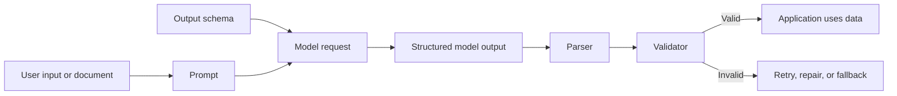
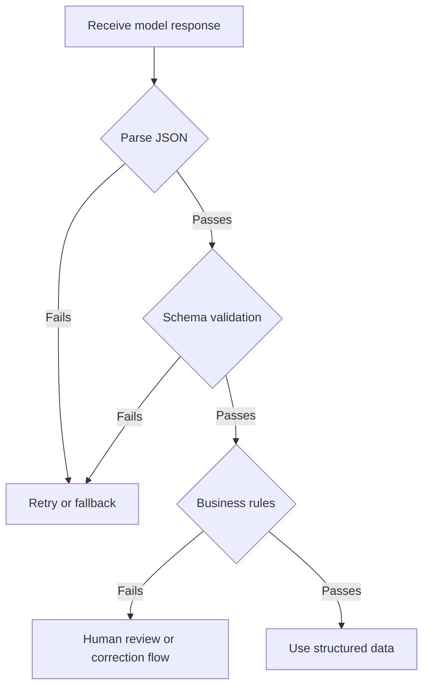

# Structured Outputs

<div class="topic-page topic-page--prompt" markdown="1">

<section class="topic-hero topic-hero--prompt">
  <span class="topic-hero__eyebrow">Stage 03 - Prompt Engineering</span>
  <p class="topic-hero__lead">Structured outputs make an AI model return data in a predictable shape, usually JSON that follows a schema. This matters when your application, workflow, or agent must parse the response and use it safely in code.</p>
  <div class="topic-hero__facts">
    <span>JSON</span>
    <span>Schema</span>
    <span>Validation</span>
    <span>Parsing</span>
    <span>Reliable app data</span>
  </div>
</section>

## Goal

Learn how to design model outputs that software can reliably parse, validate, store, display, or pass to the next step in an agent workflow.

This topic focuses on **final model responses and data extraction**. Tool input schemas are covered later in [Tool Schemas](../../05-tools-and-actions/tool-schemas/index.md).

## Learning Path

This topic is designed in four parts. Read them in order.

<div class="learning-grid learning-grid--path">
  <a class="learning-card" href="#part-1-understand-structured-outputs">
    <strong>Part 1 - Understand Structured Outputs</strong>
    <span>Learn what structured outputs solve and how they differ from plain text and JSON mode.</span>
  </a>
  <a class="learning-card" href="#part-2-design-a-good-output-shape">
    <strong>Part 2 - Design a Good Output Shape</strong>
    <span>Choose fields, types, enums, required values, and missing-data behavior.</span>
  </a>
  <a class="learning-card" href="#part-3-write-prompts-that-support-the-schema">
    <strong>Part 3 - Write Schema-Aware Prompts</strong>
    <span>Give the model the right task, evidence rules, and output expectations.</span>
  </a>
  <a class="learning-card" href="#part-4-validate-and-handle-failures">
    <strong>Part 4 - Validate and Handle Failures</strong>
    <span>Parse, validate, retry, and handle refusals or incomplete outputs safely.</span>
  </a>
</div>

## Part 1: Understand Structured Outputs

A normal model response is written for humans. A structured output is written for software.

Plain text answer:

```text
The customer seems unhappy. They are asking for a refund because the item arrived damaged.
```

Structured output:

```json
{
  "sentiment": "negative",
  "intent": "refund_request",
  "reason": "item_arrived_damaged",
  "needs_human_review": true
}
```

The second response is easier for code to use because every field has a predictable name and type.

### What Structured Outputs Are For

Use structured outputs when the next step is software, not only a human reader.

| Use Case | Example Output |
| --- | --- |
| Data extraction | Pull invoice number, total, date, and vendor from a document. |
| Classification | Classify a support ticket as `billing`, `bug`, `account`, or `other`. |
| Routing | Decide which workflow, queue, or agent should handle the request next. |
| UI rendering | Return cards, table rows, labels, or form fields in a fixed shape. |
| Agent state | Return `next_action`, `confidence`, `missing_info`, and `stop_reason`. |
| API payload preparation | Produce validated data that another service can consume. |

Do not use structured outputs just because JSON looks technical. Use them when software needs dependable fields.

### Prompt-Only JSON vs JSON Mode vs Structured Outputs

These are not the same thing.

| Approach | What You Ask For | Reliability | Best Use |
| --- | --- | --- | --- |
| Prompt-only JSON | "Return JSON." | Weak. The model may add prose, omit fields, or use wrong types. | Quick experiments only. |
| JSON mode | Provider tries to return valid JSON. | Better syntax, but not always your exact schema. | Simple JSON objects where strict shape is less important. |
| Structured outputs | Provider constrains output to a schema. | Strongest option when supported. | Production parsing, extraction, classification, and agent workflows. |

Structured outputs usually rely on a schema such as JSON Schema, Pydantic, or Zod. Some providers use constrained decoding or grammar-based methods so the model is guided toward valid output.

### Structured Output Flow



**How to read this diagram:** the schema is part of the model request, but your application still parses and validates the response before trusting it.

## Part 2: Design a Good Output Shape

A good structured output starts with a good data shape. Do not begin by writing a long prompt. Begin by deciding what your application actually needs.

### Example Task

Task:

```text
Extract support ticket details from a customer message.
```

Customer message:

```text
I was charged twice for order 10452. Please refund the duplicate charge.
```

Useful output:

```json
{
  "intent": "refund_request",
  "order_id": "10452",
  "issue_summary": "Customer reports duplicate charge.",
  "urgency": "medium",
  "requires_human_review": true
}
```

### Schema First, Prompt Second

Design the fields before writing the prompt.

```json
{
  "type": "object",
  "additionalProperties": false,
  "properties": {
    "intent": {
      "type": "string",
      "enum": ["refund_request", "bug_report", "account_help", "general_question", "other"],
      "description": "The main reason the customer is contacting support."
    },
    "order_id": {
      "type": ["string", "null"],
      "description": "The order ID mentioned by the customer, or null if not provided."
    },
    "issue_summary": {
      "type": "string",
      "description": "One short sentence summarizing the issue."
    },
    "urgency": {
      "type": "string",
      "enum": ["low", "medium", "high"],
      "description": "How urgent the issue appears from the message."
    },
    "requires_human_review": {
      "type": "boolean",
      "description": "True when the case involves money, account access, legal risk, or unclear evidence."
    }
  },
  "required": ["intent", "order_id", "issue_summary", "urgency", "requires_human_review"]
}
```

This schema is useful because it defines:

- exact field names
- allowed categories
- missing-data behavior
- required fields
- no unexpected extra fields

### Field Design Rules

| Rule | Good | Weak |
| --- | --- | --- |
| Use domain names | `order_id` | `id` |
| Prefer enums for fixed choices | `"urgency": "high"` | `"urgency": "very important probably"` |
| Make missing data explicit | `"order_id": null` | omit the field randomly |
| Keep summaries short | one sentence | long explanation inside a field |
| Avoid overloaded fields | `intent`, `urgency`, `summary` | `analysis` containing everything |
| Block extra fields when possible | `additionalProperties: false` | accept any field name |

### Required vs Optional

For production workflows, prefer a stable shape. A stable shape is easier to parse than a response where fields appear and disappear.

Good pattern:

```json
{
  "order_id": null,
  "missing_fields": ["order_id"]
}
```

Risky pattern:

```json
{
  "missing_order": true
}
```

The risky pattern changes the shape. The good pattern keeps the same field and makes missing information explicit.

### Keep Schemas Simple

Start with simple schema features:

- `object`
- `array`
- `string`
- `number`
- `integer`
- `boolean`
- `null`
- `enum`
- `required`
- `additionalProperties`

Avoid deep nesting unless the application truly needs it. Deep schemas are harder to prompt, test, debug, and migrate.

## Part 3: Write Prompts That Support the Schema

A schema defines the shape. The prompt defines the task and decision rules.

If the prompt is vague, the model can still fill the schema with poor values.

### Strong Structured Output Prompt

```text
Task:
Extract support ticket details from the customer message.

Rules:
- Use only information found in the customer message.
- Do not invent an order ID.
- If the order ID is missing, set order_id to null.
- Set requires_human_review to true for refunds, payments, account access, legal complaints, or safety concerns.
- Keep issue_summary to one sentence.

Customer message:
{customer_message}
```

The schema controls format. The prompt controls interpretation.

### Weak vs Strong

<div class="prompt-compare">
  <section>
    <span class="prompt-compare__label prompt-compare__label--bad">Weak</span>
    <pre><code>Read this message and return JSON.</code></pre>
    <p>The model has no clear field rules, missing-data behavior, or evidence boundary.</p>
  </section>
  <section>
    <span class="prompt-compare__label prompt-compare__label--good">Strong</span>
    <pre><code>Extract support ticket details.
Use only the message text.
If a value is not present, use null.
Choose intent from the schema enum only.
Set requires_human_review true for payment or refund issues.</code></pre>
    <p>The model knows how to fill the schema and how to avoid inventing values.</p>
  </section>
</div>

### Good Examples to Include

Examples are useful when categories are easy to confuse.

| Customer Message | Expected Fields |
| --- | --- |
| "I forgot my password." | `intent: "account_help"`, `requires_human_review: false` |
| "I was charged twice." | `intent: "refund_request"`, `requires_human_review: true` |
| "The export button crashes." | `intent: "bug_report"`, `requires_human_review: false` |
| "Can I change the font size?" | `intent: "general_question"`, `requires_human_review: false` |

Do not add too many examples. Too many examples can waste tokens and distract the model. Add examples only where the schema choices need clarification.

### Structured Outputs for Agents

Agents often need structured final responses or structured intermediate decisions.

Example agent decision output:

```json
{
  "next_action": "ask_user",
  "reason": "The order ID is required before checking order status.",
  "missing_information": ["order_id"],
  "can_finish": false
}
```

Useful fields for agent workflows:

| Field | Purpose |
| --- | --- |
| `next_action` | Tells the system whether to answer, ask, retrieve, call a tool, or stop. |
| `reason` | Short explanation for logs or debugging. |
| `missing_information` | Facts needed before the next step. |
| `confidence` | Helps route uncertain cases to review. |
| `can_finish` | Prevents premature final answers. |

Keep this separate from tool calling. Structured output describes what the model returns. Tool calling describes how the model asks your application to execute a function.

## Part 4: Validate and Handle Failures

Structured outputs reduce format failures, but they do not remove the need for application validation.

Your code should still check:

- valid JSON
- schema match
- allowed enum values
- required fields
- business rules
- unsafe or impossible values
- provider-specific refusal or safety response fields

### Validation Flow



**How to read this diagram:** schema validation is necessary, but it is not the last check. Your product rules still decide whether the data is safe and useful.

### Provider and Library Patterns

Different providers expose structured outputs differently. The idea is similar: define a schema, send it with the request, parse the result, and validate it.

| Approach | What It Gives You | Watch Out For |
| --- | --- | --- |
| Provider structured output | Strong schema-following when the provider supports it. | Supported schema features vary by provider and model. |
| JSON mode | Valid JSON syntax in many cases. | May not enforce your exact schema. |
| Tool/function calling | Structured arguments for a tool call. | Best for calling functions, not always for final user-facing output. |
| Pydantic/Zod wrappers | Typed objects, validation, retries, cleaner app code. | Still depends on provider support and good schemas. |
| Manual parsing | Full control. | More error handling, retries, and edge cases. |

### Python Validation Example

```python
from typing import Literal
from pydantic import BaseModel, ValidationError


class TicketExtraction(BaseModel):
    intent: Literal[
        "refund_request",
        "bug_report",
        "account_help",
        "general_question",
        "other",
    ]
    order_id: str | None
    issue_summary: str
    urgency: Literal["low", "medium", "high"]
    requires_human_review: bool


def parse_ticket(raw_json: str) -> TicketExtraction:
    try:
        return TicketExtraction.model_validate_json(raw_json)
    except ValidationError as error:
        raise ValueError(f"Model output did not match schema: {error}") from error
```

This example does not depend on one provider. The important idea is that your application treats the model output as untrusted data until validation passes.

### Common Failure Modes

<div class="visual-checklist">
  <div>
    <strong>Common problems</strong>
    <ul>
      <li>Model adds prose before or after JSON</li>
      <li>Field is missing or renamed</li>
      <li>Enum value is almost correct but not exact</li>
      <li>Number is returned as a string</li>
      <li>Missing value is invented instead of set to null</li>
      <li>Schema is too deep or too complex</li>
      <li>Output is valid JSON but wrong for the business rule</li>
    </ul>
  </div>
  <div>
    <strong>Better handling</strong>
    <ul>
      <li>Use provider schema mode when available</li>
      <li>Validate with Pydantic, Zod, or JSON Schema</li>
      <li>Use enums for fixed categories</li>
      <li>Define null behavior clearly</li>
      <li>Set <code>additionalProperties</code> to false when possible</li>
      <li>Keep schemas shallow</li>
      <li>Retry or route to review when validation fails</li>
    </ul>
  </div>
</div>

### Retry and Fallback Strategy

When validation fails, do not blindly continue.

Use a simple decision path:

1. If the failure is minor and safe, retry once with the validation error.
2. If the model refused or safety-filtered the request, handle the refusal separately.
3. If required evidence is missing, ask the user or mark the field as `null`.
4. If the data affects money, permissions, legal risk, or account access, route to human review.
5. If the schema is repeatedly failing, simplify the schema or split the task.

### Production Checklist

Before using a structured output in production:

- Define the schema before writing the prompt.
- Use exact enums for categories.
- Make missing-data behavior explicit.
- Validate every response in code.
- Test realistic edge cases, not only happy paths.
- Log validation failures.
- Version schemas when they change.
- Keep provider limitations in mind.
- Do not put private user data into schema names, enum values, or descriptions.

## A Practical Template

Use this template when designing a structured output task.

```text
Task:
What should the model extract, classify, or produce?

Consumer:
Which part of the application will use this data?

Schema:
- field_name: type, meaning, allowed values, required/null behavior

Evidence rules:
- What information may the model use?
- What should it do when evidence is missing?

Validation rules:
- What schema validator will be used?
- What business rules must pass after schema validation?

Failure behavior:
- Retry?
- Ask the user?
- Route to human review?
- Return a safe fallback?
```

## Practice

Create a structured output for a support-ticket classifier.

Input examples:

```text
I was charged twice for order 10452.
The export button crashes every time I click it.
I forgot my password and cannot log in.
Can I change the color of the dashboard?
```

Your output should include:

- `intent`
- `summary`
- `urgency`
- `requires_human_review`
- `missing_information`

Then test at least ten realistic messages and record:

- whether JSON parsing passed
- whether schema validation passed
- whether the classification was correct
- whether missing data was handled correctly
- whether the output was useful to downstream code

## Mini Project

Build a small extraction pipeline:

1. Accept one customer message.
2. Ask the model for a structured output using your schema.
3. Parse the response.
4. Validate it with Pydantic, Zod, or JSON Schema.
5. If valid, print a normalized ticket object.
6. If invalid, retry once or send the case to review.

Keep the schema small. The goal is to prove that structured outputs can move from prompt result to application data safely.

## Exit Criteria

You are ready to move on when you can:

- explain structured outputs in plain English
- explain the difference between prompt-only JSON, JSON mode, and schema-based structured outputs
- design a small useful schema before writing the prompt
- use enums, nulls, required fields, and `additionalProperties` correctly
- write prompts that support the schema instead of fighting it
- validate model outputs before using them
- handle invalid, refused, incomplete, or unsafe outputs
- explain when structured outputs are better than plain text
- explain when function calling is a better fit than final structured output

## Resources

- [Google Gemini API: Structured output](https://ai.google.dev/gemini-api/docs/structured-output)
- [Claude API Docs: Structured outputs](https://platform.claude.com/docs/en/build-with-claude/structured-outputs)
- [OpenAI API Docs: Structured model outputs](https://platform.openai.com/docs/guides/structured-outputs)
- [Instructor: Structured outputs for LLMs](https://github.com/jxnl/instructor)
- [Vellum: Structured Outputs](https://www.vellum.ai/llm-parameters/structured-outputs)
- [JSON Schema documentation](https://json-schema.org/learn/getting-started-step-by-step)
- [Pydantic documentation](https://docs.pydantic.dev/)
- [Zod documentation](https://zod.dev/)

</div>
