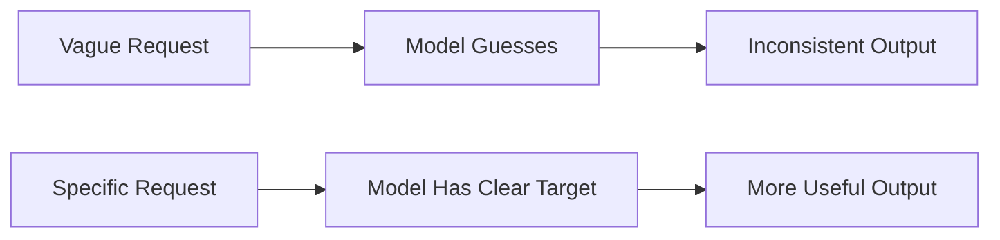
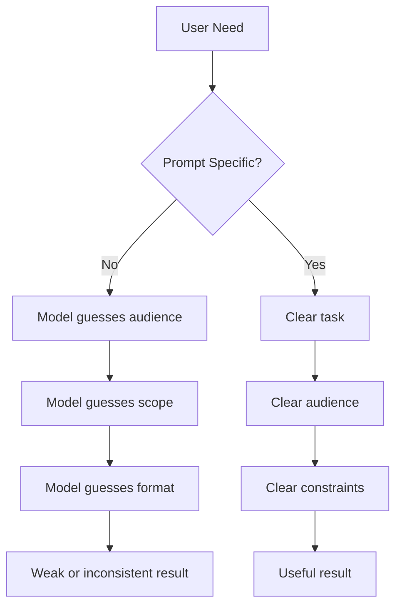
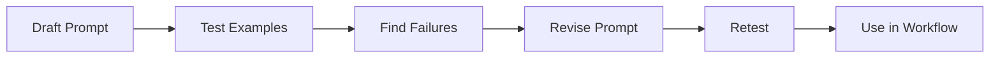

# Writing Good Prompts

<div class="topic-page topic-page--writing-prompts" markdown="1">

<section class="topic-hero topic-hero--prompt">
  <span class="topic-hero__eyebrow">Stage 03 · Prompt Engineering</span>
  <p class="topic-hero__lead">A good prompt is a clear request with enough detail for the model to understand the goal, the audience, the constraints, and the expected output. This guide teaches the practical writing habits that make prompts more reliable.</p>
  <div class="topic-hero__facts">
    <span>Specific goal</span>
    <span>Useful context</span>
    <span>Relevant terms</span>
    <span>Examples</span>
    <span>Testing</span>
    <span>Format control</span>
  </div>
</section>

## Learning Path

This topic is organized into six parts. This version focuses deeply on Part 1: **Be specific in what you want**. The other parts are included as a clear roadmap and will be expanded in later updates.

<div class="learning-grid learning-grid--path">
  <a class="learning-card" href="#part-1-be-specific-in-what-you-want">
    <strong>Part 1 · Be Specific</strong>
    <span>Turn vague requests into clear tasks with purpose, audience, scope, constraints, and success criteria.</span>
  </a>
  <a class="learning-card" href="#part-2-provide-additional-context">
    <strong>Part 2 · Add Context</strong>
    <span>Give the model the background it needs without overloading it with irrelevant details.</span>
  </a>
  <a class="learning-card" href="#part-3-use-relevant-technical-terms">
    <strong>Part 3 · Use Terms</strong>
    <span>Use domain language when it helps precision, but define terms when the meaning could be unclear.</span>
  </a>
  <a class="learning-card" href="#part-4-use-examples-in-your-prompt">
    <strong>Part 4 · Add Examples</strong>
    <span>Show the model the pattern you want when the task has a custom style, label, or format.</span>
  </a>
  <a class="learning-card" href="#part-5-iterate-and-test-your-prompts">
    <strong>Part 5 · Test Prompts</strong>
    <span>Improve prompts by testing normal cases, edge cases, and bad inputs.</span>
  </a>
  <a class="learning-card" href="#part-6-specify-length-format-and-delivery-rules">
    <strong>Part 6 · Control Format</strong>
    <span>Specify length, structure, tone, tables, JSON, bullets, headings, and other delivery rules.</span>
  </a>
</div>

## Why Good Prompt Writing Matters

Large language models are powerful, but they are not mind readers. If your prompt is vague, the model must guess your goal. Sometimes that guess is useful. Often it is too broad, too long, too shallow, or aimed at the wrong audience.

Good prompt writing reduces guessing.



The key idea is simple: **tell the model what success looks like**.

## Part 1: Be Specific in What You Want

This is the most important beginner skill in prompt writing. Being specific means clearly telling the model what task to do, who the output is for, what should be included, what should be excluded, and how the answer will be judged.

### What Specificity Means

Specificity does not mean writing a very long prompt. It means removing unnecessary ambiguity.

| Vague Prompt | Why It Fails | Specific Prompt |
| --- | --- | --- |
| `Explain APIs.` | Audience, depth, and format are unclear. | `Explain REST APIs to a beginner web developer in 5 bullet points. Include one HTTP GET example.` |
| `Make this better.` | "Better" has no clear meaning. | `Improve this paragraph for clarity, remove repeated ideas, and keep the same meaning.` |
| `Write a plan.` | The type of plan is unclear. | `Create a 7-day study plan for learning prompt engineering, with 1 hour of practice per day.` |
| `Review this code.` | The review focus is unclear. | `Review this code for security bugs and missing tests. Return findings ordered by severity.` |
| `Summarize this.` | Length, audience, and purpose are unclear. | `Summarize this for a product manager in 4 bullets. Focus on risks, decisions, and next steps.` |

### Diagram: Specificity Reduces Guessing

This diagram shows why vague prompts create weak results. The model has too many possible directions. A specific prompt narrows the target.



### The Specific Prompt Checklist

When a prompt feels unclear, check these ten details.

| Detail | Question to Ask | Example |
| --- | --- | --- |
| Task | What exactly should the model do? | `Create`, `classify`, `summarize`, `review`, `rewrite` |
| Audience | Who will read or use the answer? | `beginner developer`, `product manager`, `support agent` |
| Purpose | Why do you need the output? | `to decide`, `to teach`, `to debug`, `to publish` |
| Scope | What should be covered? | `authentication only`, `first 3 chapters`, `API errors` |
| Exclusions | What should be avoided? | `Do not discuss pricing.` |
| Constraints | What rules must be followed? | `Use plain English. Keep public API names unchanged.` |
| Input | What data should the model use? | `Use only the text below.` |
| Output format | How should the answer be structured? | `Return a table with columns: issue, risk, fix.` |
| Length | How long should it be? | `Under 200 words`, `exactly 5 bullets` |
| Success criteria | What makes the answer good? | `Actionable, accurate, and easy to copy into a ticket.` |

### A Specific Prompt Formula

Use this formula when you want reliable results:

```text
Task:
{What should the model do?}

Audience:
{Who is this for?}

Purpose:
{Why do you need this?}

Input:
{The content, data, code, or question}

Requirements:
- {What must be included}
- {What must be avoided}
- {Important constraints}

Output format:
{Exact structure, length, or style}
```

### Real Example: Beginner Explanation

Weak prompt:

```text
Explain APIs.
```

Better prompt:

```text
Explain REST APIs to a beginner web developer.

Requirements:
- Use simple English.
- Include the words client, server, request, and response.
- Include one HTTP GET example.
- Mention one common beginner mistake.
- Keep it under 300 words.

Output format:
Use these headings:
1. What It Means
2. Simple Example
3. Common Mistake
```

Why this is better:

- It names the audience.
- It defines the topic more precisely.
- It lists required concepts.
- It controls length.
- It gives a clear output format.

### Real Example: Code Review

Weak prompt:

```text
Review this code.
```

Better prompt:

```text
You are reviewing a backend API change before production release.

Task:
Find bugs, security risks, and missing tests.

Do not comment on style unless it affects correctness.

Return a Markdown table with:
Finding | Severity | Evidence | Suggested Fix

Code:
{code_diff}
```

Why this is better:

- It tells the model what kind of review to perform.
- It prevents low-value style feedback.
- It asks for evidence.
- It returns a format that is easy to scan.

### Real Example: AI Agent Task

Weak prompt:

```text
Help me with this customer ticket.
```

Better prompt:

```text
You are a customer-support AI agent.

Goal:
Draft a reply to the customer ticket.

Ticket:
{ticket_text}

Rules:
- Be polite and concise.
- Do not promise refunds, credits, or account changes.
- If key information is missing, ask one clarifying question.
- Use only the facts in the ticket.

Output format:
1. Customer reply
2. Missing information, if any
3. Internal note for the support team
```

Why this is better:

- It defines the agent role.
- It sets boundaries.
- It prevents unsafe promises.
- It separates customer-facing text from internal notes.

### Specificity Ladder

Use this ladder to improve a prompt step by step.

| Level | Prompt | Quality |
| --- | --- | --- |
| 1 | `Write about onboarding.` | Too broad |
| 2 | `Write about SaaS onboarding.` | Better topic |
| 3 | `Write a short guide about SaaS onboarding for new product managers.` | Clear audience and purpose |
| 4 | `Write a 600-word guide about SaaS onboarding for new product managers. Include activation, friction, lifecycle emails, and one checklist.` | Clear scope and required content |
| 5 | `Write a 600-word guide about SaaS onboarding for new product managers. Use simple language, include activation, friction, lifecycle emails, one checklist, and avoid vendor-specific tools.` | Strong prompt |

### What to Specify First

If you do not have time to write a detailed prompt, specify these four things first:

```text
1. Task: What should the model do?
2. Audience: Who is the answer for?
3. Output: What format should it return?
4. Constraints: What must it include or avoid?
```

Example:

```text
Summarize this incident report for an engineering manager.
Return 5 bullets:
- impact
- root cause
- timeline
- fix
- prevention

Do not add facts that are not in the report.
```

### When Specificity Can Go Too Far

Being specific is good, but over-controlling the prompt can make the answer worse. Avoid specifying details that do not matter.

Bad over-specific prompt:

```text
Write exactly 7 sentences. Each sentence must be 13 words.
Use three commas. Use no word longer than 8 letters.
Explain Kubernetes networking.
```

Better:

```text
Explain Kubernetes networking to a junior backend developer.
Keep it under 250 words.
Use simple language and one request-flow example.
```

Good specificity gives the model direction. Bad specificity creates artificial constraints that distract from the real goal.

### Common Specificity Mistakes

| Mistake | Example | Fix |
| --- | --- | --- |
| Asking for a broad topic | `Teach me AI agents.` | Define level, scope, and output. |
| Hiding the purpose | `Summarize this.` | Say whether the summary is for a decision, study note, report, or email. |
| No audience | `Explain vector databases.` | Say who the explanation is for and what they already know. |
| No boundaries | `Give legal advice.` | Ask for general information and require professional review. |
| No format | `Analyze this ticket.` | Ask for a table, bullets, JSON, or sections. |
| No source rule | `Answer using this document.` | Add `Use only the document below. If missing, say unknown.` |

## Part 2: Provide Additional Context

Context is the background information the model needs to answer correctly. It can include the user's goal, domain, audience, source material, constraints, previous decisions, or application state.

This section will be expanded later. For now, remember this rule:

```text
Add context that changes the answer.
Remove context that does not change the answer.
```

Useful context examples:

- The reader's knowledge level.
- The product or business domain.
- The codebase or framework.
- The user goal.
- Relevant source documents.
- Current constraints or known issues.

Avoid dumping long unrelated information into the prompt. Too much context can make the model focus on the wrong details.

## Part 3: Use Relevant Technical Terms

Technical terms can make prompts more precise when the model and the user share the same meaning.

This section will be expanded later. For now:

- Use correct domain terms when they reduce ambiguity.
- Define terms when they may be unfamiliar.
- Avoid jargon when simple words are enough.
- Prefer exact terms like `JWT authentication`, `RAG`, `vector search`, `rate limit`, or `idempotency` when they matter.

Example:

```text
Review this endpoint for idempotency problems.
Focus on duplicate payment requests, retry behavior, and database transaction safety.
```

## Part 4: Use Examples in Your Prompt

Examples show the model the pattern you want. This is especially useful for custom labels, tone, style, grading, classification, or strict formats.

This section will be expanded later. For now, use examples when:

- The output format is custom.
- The labels are not obvious.
- The tone matters.
- The task is hard to explain with rules alone.

Mini example:

```text
Convert support tickets into this format:

Example:
Ticket: "I was charged twice."
Category: Billing
Priority: High

Now classify:
Ticket: "The export button gives a 500 error."
```

## Part 5: Iterate and Test Your Prompts

A prompt that works once may fail on another input. Treat important prompts like small software artifacts: test them, revise them, and keep examples of failures.

This section will be expanded later. For now, test prompts with:

- Normal inputs.
- Edge cases.
- Missing information.
- Ambiguous language.
- Very short input.
- Very long input.
- Malicious or instruction-like input.



## Part 6: Specify Length, Format, and Delivery Rules

Format rules make the output easier to use. They are especially important when the answer will be copied into documentation, tickets, code, JSON, spreadsheets, or agent workflows.

This section will be expanded later. For now, specify:

- Length: `under 300 words`, `exactly 5 bullets`, `one paragraph`.
- Format: `Markdown table`, `JSON`, `numbered list`, `email draft`.
- Tone: `plain English`, `professional`, `friendly`, `direct`.
- Sections: `Problem`, `Cause`, `Fix`, `Test`.
- Exclusions: `Do not include implementation code`.

Example:

```text
Return a Markdown table with these columns:
Risk | Evidence | Impact | Recommended Fix

Keep each row under 25 words.
```

## Practice

Complete these exercises to prove you understand specificity.

### Exercise 1: Rewrite a Vague Prompt

Rewrite this:

```text
Explain databases.
```

Make it specific by adding:

- Audience.
- Scope.
- Required concepts.
- Length.
- Output format.

### Exercise 2: Create a Specific Code Review Prompt

Write a prompt that reviews a backend API change for:

- correctness
- security
- missing tests
- performance risks

The output should be a table.

### Exercise 3: Improve an Agent Prompt

Rewrite this weak agent prompt:

```text
Help users with support tickets.
```

Add:

- agent role
- goal
- boundaries
- allowed output
- when to ask a clarifying question

## Exit Criteria

You understand this topic when you can:

- Explain why vague prompts produce inconsistent results.
- Turn a broad request into a specific task.
- Identify the audience, purpose, scope, constraints, and output format.
- Write a prompt that reduces guessing.
- Avoid over-specifying details that do not matter.
- Create specific prompts for explanations, code review, and AI agent workflows.

## Further Reading

- [Prompt Engineering Guide](https://www.promptingguide.ai/)
- [Prompt Engineering Guide: Basics of Prompting](https://www.promptingguide.ai/introduction/basics)
- [Prompt Engineering Guide: Elements of a Prompt](https://www.promptingguide.ai/introduction/elements)
- [Prompt Engineering Guide: General Tips for Designing Prompts](https://www.promptingguide.ai/introduction/tips)
- [Prompt Engineering Guide: Examples of Prompts](https://www.promptingguide.ai/introduction/examples)
- [Honorlock: AI Prompting Examples, Templates, and Tips For Educators](https://honorlock.com/blog/education-ai-prompt-writing/)
- [Sixty and Me: How to Ask AI for Anything](https://sixtyandme.com/using-ai-prompts/)
- [God of Prompt: What is Context in Prompt Engineering?](https://www.godofprompt.ai/blog/what-is-context-in-prompt-engineering)
- [MathCo.AI: The Importance of Context for Reliable AI Systems](https://medium.com/mathco-ai/the-importance-of-context-for-reliable-ai-systems-and-how-to-provide-context-009bd1ac7189/)
- [Inspired Nonsense: Context Engineering](https://inspirednonsense.com/context-engineering-why-feeding-ai-the-right-context-matters-353e8f87d6d3)
- [Moveworks: AI Terms Glossary](https://www.moveworks.com/us/en/resources/ai-terms-glossary)
- [Shivam More: 15 Essential AI Agent Terms](https://shivammore.medium.com/15-essential-ai-agent-terms-you-must-know-6bfc2f332f6d)
- [Eastgate Software: AI Agent Examples and Use Cases](https://eastgate-software.com/ai-agent-examples-use-cases-real-applications-in-2025/)

</div>
