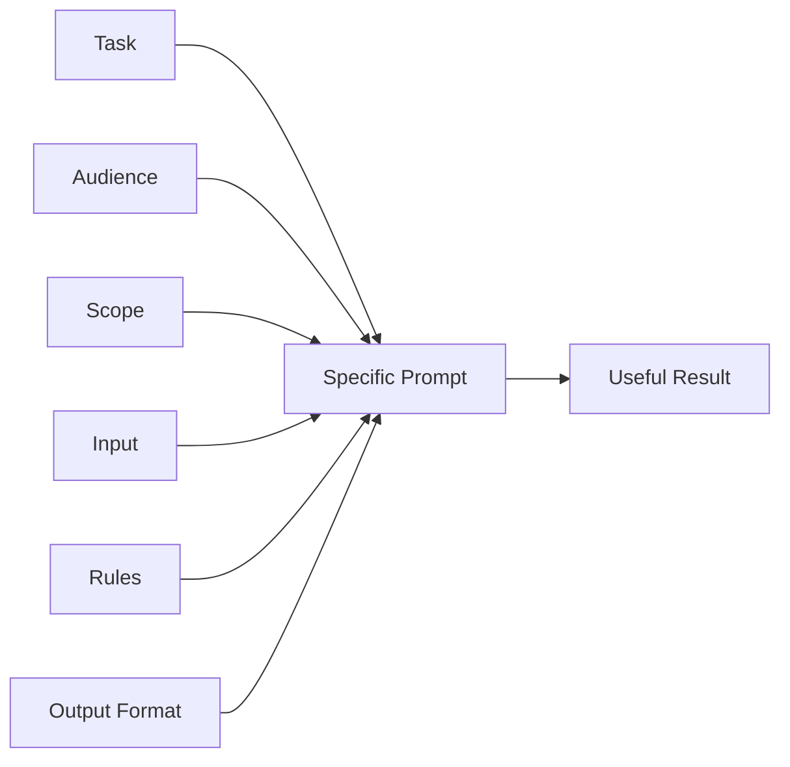
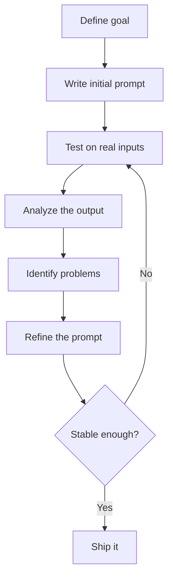

# Writing Good Prompts

<div class="topic-page topic-page--writing-prompts" markdown="1">

<section class="topic-hero topic-hero--prompt">
  <span class="topic-hero__eyebrow">Stage 03 · Prompt Engineering</span>
  <p class="topic-hero__lead">A good prompt tells the model exactly what result you want. This page focuses on one core skill first: making vague requests specific, testable, and useful.</p>
  <div class="topic-hero__facts">
    <span>Specific task</span>
    <span>Clear audience</span>
    <span>Useful scope</span>
    <span>Required output</span>
    <span>Practical examples</span>
  </div>
</section>

## Learning Path

Good prompts are built from six practical habits. This page focuses deeply on **Part 1: Be specific in what you want**.

<div class="learning-grid learning-grid--path">
  <a class="learning-card" href="#part-1-be-specific-in-what-you-want">
    <strong>Part 1 · Be Specific</strong>
    <span>Say exactly what task, audience, scope, constraints, and output you want.</span>
  </a>
  <a class="learning-card" href="#part-2-provide-additional-context">
    <strong>Part 2 · Add Context</strong>
    <span>Give only the background that changes the answer.</span>
  </a>
  <a class="learning-card" href="#part-3-use-relevant-technical-terms">
    <strong>Part 3 · Use Terms</strong>
    <span>Use precise technical words when they reduce confusion.</span>
  </a>
  <a class="learning-card" href="#part-4-use-examples-in-your-prompt">
    <strong>Part 4 · Add Examples</strong>
    <span>Show the model what a good answer looks like.</span>
  </a>
  <a class="learning-card" href="#part-5-iterate-and-test-your-prompts">
    <strong>Part 5 · Test Prompts</strong>
    <span>Check prompts with normal, edge, and bad inputs.</span>
  </a>
  <a class="learning-card" href="#part-6-specify-length-format-and-delivery-rules">
    <strong>Part 6 · Control Format</strong>
    <span>Tell the model the length, format, tone, and structure.</span>
  </a>
</div>

## Part 1: Be Specific in What You Want

Being specific means the model should not need to guess your goal.

Do not only say the topic. Say the exact task, audience, scope, rules, and output.

### The Specific Prompt Builder

Use this diagram as the main mental model for this page. A useful prompt is not just a question. It is a small instruction package.



Each part has a job:

| Part | Meaning | Example |
| --- | --- | --- |
| Task | What the model must do | `Explain`, `summarize`, `review`, `classify`, `rewrite` |
| Audience | Who the answer is for | `beginner developer`, `engineering manager`, `support agent` |
| Scope | What to include or focus on | `REST APIs only`, `security risks only`, `first 3 sections` |
| Input | The data the model should use | `Use the article below`, `Code: {code_diff}` |
| Rules | What must or must not happen | `Do not invent facts`, `Use simple English` |
| Output Format | How the answer should look | `5 bullets`, `Markdown table`, `JSON object` |

### Specificity Rule

Use this rule:

```text
If two smart people could read your prompt and expect different answers, the prompt is not specific enough.
```

Example:

```text
Explain agents.
```

This is too vague because the model does not know:

- whether you mean AI agents, software agents, or business agents
- who the explanation is for
- how deep the answer should be
- whether you want examples
- what format you want

Better:

```text
Explain AI agents to a beginner Python developer.
Keep it under 250 words.
Include:
- a plain-English definition
- one simple workflow example
- one common mistake
```

### Bad Prompt vs Good Prompt

| Bad Prompt | Problem | Good Prompt |
| --- | --- | --- |
| `Explain databases.` | Too broad | `Explain relational databases to a beginner backend developer. Include tables, rows, primary keys, and one SQL SELECT example.` |
| `Summarize this.` | No purpose | `Summarize this incident report for an engineering manager. Focus on impact, root cause, fix, and prevention.` |
| `Review my code.` | No review focus | `Review this API handler for security bugs, missing validation, and missing tests. Ignore style unless it affects correctness.` |
| `Write an email.` | No audience or tone | `Write a polite customer email explaining a delayed shipment. Keep it under 120 words and do not mention internal systems.` |
| `Make it better.` | "Better" is undefined | `Improve clarity, remove repeated ideas, and keep the original meaning.` |

### The 6 Questions to Ask Before Writing a Prompt

Before you send an important prompt, answer these six questions.

| Question | Why It Matters | Example Answer |
| --- | --- | --- |
| What do I want? | Defines the task | `Create a study plan` |
| Who is it for? | Sets depth and tone | `Beginner AI learner` |
| What should it include? | Defines required content | `Daily task, time estimate, practice exercise` |
| What should it avoid? | Prevents unwanted output | `Do not include paid courses` |
| What source should it use? | Reduces invented facts | `Use only the notes below` |
| What format should it return? | Makes output usable | `Markdown table` |

### Prompt Formula

Use this formula for most practical prompts:

```text
Task:
{What should the model do?}

Audience:
{Who is the result for?}

Scope:
{What should be included or focused on?}

Input:
{Text, code, notes, document, ticket, or data}

Rules:
- {Required rule}
- {Required rule}
- {What to avoid}

Output:
{Length, format, tone, and sections}
```

### Example 1: Explanation Prompt

Weak:

```text
Explain APIs.
```

Strong:

```text
Task:
Explain REST APIs.

Audience:
A beginner web developer who knows basic HTTP.

Scope:
Cover client, server, request, response, endpoint, and status code.

Rules:
- Use simple English.
- Include one HTTP GET example.
- Mention one common beginner mistake.
- Do not discuss GraphQL.

Output:
Use 4 short sections:
1. Definition
2. How It Works
3. Example
4. Common Mistake
```

Why it works:

- `REST APIs` is more specific than `APIs`.
- The audience controls the difficulty.
- The scope tells the model what concepts to include.
- The exclusion prevents the answer from becoming too broad.
- The output structure makes the response easy to read.

### Example 2: Summary Prompt

Weak:

```text
Summarize this.
```

Strong:

```text
Task:
Summarize the incident report.

Audience:
Engineering manager.

Scope:
Focus on operational impact and prevention.

Rules:
- Use only the report below.
- Do not add guesses.
- If root cause is missing, write "Root cause not confirmed."

Output:
Return exactly 5 bullets:
- Impact
- Timeline
- Root cause
- Fix applied
- Prevention

Report:
{incident_report}
```

Why it works:

- The model knows the summary is for a manager.
- It knows which details matter.
- It has a rule for missing information.
- The output is predictable.

### Example 3: Code Review Prompt

Weak:

```text
Review this code.
```

Strong:

```text
Task:
Review this backend API change before production release.

Focus:
- security bugs
- missing validation
- database transaction risks
- missing tests

Rules:
- Do not comment on naming or style unless it affects correctness.
- Quote the exact line or behavior that supports each finding.
- If there are no high-risk issues, say so clearly.

Output:
Return a Markdown table:
Finding | Severity | Evidence | Suggested Fix

Code:
{code_diff}
```

Why it works:

- It defines the type of review.
- It removes low-value feedback.
- It asks for evidence.
- It returns a format that can be used in a pull request.

### Example 4: AI Agent Prompt

Weak:

```text
Help with customer tickets.
```

Strong:

```text
Role:
You are a customer-support AI agent.

Task:
Draft a reply to the customer ticket.

Ticket:
{ticket_text}

Rules:
- Use only facts from the ticket.
- Be polite and concise.
- Do not promise refunds, credits, account changes, or delivery dates.
- If key information is missing, ask one clarifying question.

Output:
1. Customer reply
2. Missing information
3. Internal support note
```

Why it works:

- The role is clear.
- The task is narrow.
- Risky promises are blocked.
- The final answer separates customer-facing text from internal notes.

### Specificity Checklist

Use this checklist before sending an important prompt.

- Is the task an action, not just a topic?
- Is the audience clear?
- Is the scope clear?
- Did you include the input data?
- Did you say what to avoid?
- Did you define the output format?
- Did you include length or section rules if needed?
- Did you include a rule for missing information?
- Can the result be checked?

### Common Specificity Mistakes

| Mistake | Weak Prompt | Better Direction |
| --- | --- | --- |
| Topic instead of task | `AI agents` | `Explain AI agents to a beginner developer in 5 bullets.` |
| Undefined quality word | `Make this better` | `Improve clarity and remove repeated ideas.` |
| Missing audience | `Explain vector databases` | `Explain vector databases to a backend developer new to RAG.` |
| Missing source rule | `Answer from this document` | `Use only the document below. If missing, say unknown.` |
| Missing boundary | `Give advice` | `Give general information, not legal/medical/financial advice.` |
| Missing output shape | `Analyze this` | `Return a table with issue, evidence, risk, fix.` |

### When to Keep a Prompt Short

Short prompts are fine when the task is simple and low-risk.

Good short prompt:

```text
Rewrite this sentence in plain English:
{sentence}
```

Use a longer prompt when:

- the task is important
- the answer must follow a format
- the model must use source material
- the task has safety or business risk
- the output will be used by an app or agent

## Part 2: Provide Additional Context

Quick rule:

```text
Add context that changes the answer. Remove context that does not.
```

Useful context:

- user's goal
- audience knowledge level
- product or business domain
- source document
- codebase or framework
- known constraints

Example:

```text
Explain rate limits for junior backend developers building a public REST API.
The API serves mobile clients and must prevent abuse without blocking normal users.
```

## Part 3: Use Relevant Technical Terms

Technical terms make prompts clearer when they are correct and relevant. They
act like shortcut labels for precise ideas.

If you use the exact term, the model does not have to guess which concept you
mean. This saves time, reduces follow-up questions, and helps the answer start
at the right level.

Think of a technical term as a well-labeled folder. A vague everyday
description makes the model search through several possible meanings. A precise
term points it toward the right concept immediately.

### The Pizza Example

Imagine you are ordering food from a futuristic robot chef.

Without the technical term:

```text
Make me that round, flat Italian thing with red sauce, melted white cheese,
and little spicy meat circles.
```

The robot has to infer what you mean. It might wonder whether you want pizza,
flatbread, a calzone-style dish, or something else. It may ask follow-up
questions because the description is long but still indirect.

With the technical term:

```text
Make me a pepperoni pizza.
```

Now the robot knows the dish, the usual ingredients, the cooking method, and
the expected result. The phrase `pepperoni pizza` removes guesswork.

Prompts work the same way. If you say `HTTP 404`, `SQL`, `idempotency`, or
`JWT authentication`, the model can use a more precise concept than if you say
`page problem`, `text database language`, `duplicate issue`, or `login stuff`.

### Technical Terms vs Everyday Terms

| Everyday Term | Technical Term | Why the Technical Term Helps |
| --- | --- | --- |
| `a page not found error` | `HTTP status code 404` | Names the exact web response code. |
| `fast sorting methods` | `O(n log n) sorting algorithms` | Points to algorithmic complexity, not just speed in normal speech. |
| `heart attack` | `myocardial infarction` | Names the medical condition more formally. |
| `the text database language` | `SQL` | Names the query language directly. |
| `login token` | `JWT` | Points to a specific token format. |
| `AI search over my documents` | `RAG` | Points to retrieval-augmented generation. |
| `do not charge twice` | `idempotency` | Points to safe retry behavior for repeated requests. |

The goal is not to sound fancy. The goal is to remove ambiguity.

### Why Technical Terms Improve Prompts

Technical terms help in three main ways.

| Benefit | Meaning | Example |
| --- | --- | --- |
| Precision | The term has a specific meaning in a field. | `HTTP 401` means unauthorized, not just "something broke." |
| Depth | The model can answer at the right expert level. | `Explain vector embeddings for semantic search` gets a deeper answer than `Explain AI matching text.` |
| Efficiency | One term replaces a long description. | `DNS` replaces `the system that converts website names into IP addresses.` |

For example, this prompt is understandable but weak:

```text
Review this code for duplicate payment problems.
```

This version is stronger:

```text
Review this payment endpoint for idempotency problems.
Focus on duplicate requests, retry behavior, and database transaction safety.
```

The stronger prompt uses the technical term `idempotency`, then supports it
with plain-language details. That combination is usually best: use the exact
term, then add enough context to make the task clear.

### Good Technical Terms in Prompts

Use technical terms when they name the exact thing you care about.

| Instead Of | Use | Example Prompt |
| --- | --- | --- |
| `duplicate issue` | `idempotency` | `Check this checkout flow for idempotency bugs.` |
| `login stuff` | `JWT authentication` | `Explain how JWT authentication works in a REST API.` |
| `AI search thing` | `RAG` | `Design a RAG workflow for searching internal policy documents.` |
| `too many requests problem` | `rate limiting` | `Suggest a rate-limiting strategy for a public API.` |
| `database speed problem` | `query optimization` | `Review this SQL query for optimization opportunities.` |
| `hidden prompt attack` | `prompt injection` | `Review this agent workflow for prompt injection risks.` |

### How to Recognize a Technical Term

Use these checks when you are not sure whether a word is a real technical term.

| Check | Question | Example |
| --- | --- | --- |
| Search result test | Would official docs, textbooks, papers, or code examples use this term? | `DNS` appears in networking docs. |
| Shortcut test | Does the term replace a whole sentence of explanation? | `OAuth` replaces a long description of delegated authorization. |
| Exact spelling test | Does capitalization, punctuation, or notation matter? | `SQL`, `JSON`, `O(n log n)`, `HTTP 404`. |
| Field test | Does the term belong to a specific domain? | `myocardial infarction` belongs to medicine; `mutex` belongs to programming. |

If the answer is yes, the term can probably make your prompt more precise.

### Technical Terms Are Not Buzzwords

A technical term should point to a real concept. A buzzword often sounds
impressive but does not tell the model what to do.

Useful:

```text
Explain how RAG differs from fine-tuning for a customer-support chatbot.
```

Weak:

```text
Explain the synergistic AI-powered paradigm for next-generation support.
```

The first prompt contains real technical terms: `RAG`, `fine-tuning`, and
`customer-support chatbot`. The second prompt uses vague business language that
does not define a task.

### Do Not Pretend With Terms You Do Not Understand

Technical terms help only when they are relevant and correct. If you use the
wrong term, the model may answer the wrong question very confidently.

Weak:

```text
Explain OAuth cookies for database encryption.
```

This mixes unrelated ideas. A better prompt explains the goal in plain language
and asks for the right terms:

```text
I want users to sign in with Google and let my app access their calendar.
What technical terms should I know, and how do they fit together?
```

When you are learning a new field, it is okay to ask the model to help you find
the terms first.

### Prompt Pattern

Use this pattern when you know some technical terms but still want a clear
answer:

```text
Task:
{what you want}

Technical terms to use:
{term 1}, {term 2}, {term 3}

Audience:
{who the answer is for}

Rules:
- Define each technical term briefly.
- Use the terms accurately.
- If a term does not fit this task, explain why.
```

Example:

```text
Task:
Review this payment endpoint before release.

Technical terms to use:
idempotency, retries, database transactions

Audience:
Backend developer.

Rules:
- Define any term that affects the review.
- Focus on duplicate charges and failed payment retries.
- If the code is safe, say what behavior makes it safe.
```

### Practice: Upgrade Everyday Words

Try turning vague phrases into technical terms:

| Vague Phrase | Better Technical Term |
| --- | --- |
| `website name lookup` | `DNS resolution` |
| `making the page load faster` | `frontend performance optimization` |
| `checking if data is shaped correctly` | `schema validation` |
| `AI remembering facts from documents` | `retrieval-augmented generation` |
| `stopping users from spamming requests` | `rate limiting` |

The best prompt often combines both:

```text
Explain DNS resolution in simple terms.
Use the phrase "website name lookup" as the beginner-friendly analogy.
```

That prompt gets the benefit of the technical term without losing clarity for a
beginner.

## Part 4: Use Examples in Your Prompt

Use examples when the model must follow a custom pattern.

Example:

```text
Classify support tickets.

Example:
Ticket: "I was charged twice."
Category: Billing
Priority: High

Now classify:
Ticket: "The export button returns a 500 error."
```

Examples are useful for labels, tone, style, grading, extraction, and strict formats.

## Part 5: Iterate and Test Your Prompts

A prompt is rarely right on the first try. Language models are probabilistic, so small wording changes can shift the structure, accuracy, and behavior of the output. Do not judge a prompt from one good answer. Treat prompting like engineering: write, test, analyze, refine, and repeat until the result is stable.

### The Iteration Loop



Each pass should answer one question: what failed, and why? Common causes are an unclear instruction, missing context, a task that is too broad, or weak constraints. This is the same debugging mindset you use for code.

### The Test Set

Do not test with one input. Run the prompt against a small, deliberate set.

| Test Type | What to Try | What to Check |
| --- | --- | --- |
| Normal input | A typical request | Accuracy and format |
| Short input | Very little information | Does it ask or just guess? |
| Long input | More information than usual | Does it stay focused? |
| Missing data | An important detail is absent | Does it invent or flag it? |
| Ambiguous input | Text could mean two things | Does it pick one or clarify? |
| Bad input | User tries to override the rules | Does it hold the boundary? |

Record what failed, then change one thing at a time so you know which edit helped.

### A Worked Iteration

Watch a weak prompt improve over three passes.

!!! example "Iterating on a review summary"
    **v1 - first attempt**

    ```text
    Summarize this review.
    ```

    Problems: no audience, no length, no focus, no format.

    **v2 - add audience, length, and format**

    ```text
    Summarize this customer review for a product manager in 3 bullet points.
    ```

    Better: the model now knows who the summary is for and how long to be.

    **v3 - add focus and a missing-data rule**

    ```text
    Summarize this customer review for a product manager.
    Return exactly 3 bullets:
    - Main complaint or praise
    - Feature mentioned
    - Suggested action
    Use only the review text. If the sentiment is unclear, write "unclear".
    ```

    Result: focused, predictable structure, and safe when information is missing.

### Refinement Techniques

When a test fails, reach for a specific fix instead of rewriting the whole prompt.

| Technique | Purpose |
| --- | --- |
| Add examples | Improve consistency |
| Add constraints | Reduce invented facts |
| Specify format | Stabilize outputs |
| Simplify wording | Reduce ambiguity |
| Break the task into steps | Improve reasoning |
| Add a role | Set tone and focus |
| Add a verification step | Catch errors before output |

### When to Stop Iterating

Iteration could continue forever, so stop when the gains get small. A prompt is usually ready when:

- outputs are consistent across the whole test set,
- accuracy is acceptable for how risky the task is,
- remaining improvements are minor.

This point is often called *good enough for production*. Higher-risk tasks, such as anything touching money, safety, or account access, deserve more iteration than low-risk ones.

## Part 6: Specify Length, Format, and Delivery Rules

Format rules make output easier to use.

Examples:

```text
Return exactly 5 bullet points.
```

```text
Return a Markdown table with these columns:
Risk | Evidence | Impact | Recommended Fix
```

```text
Return only valid JSON:
{
  "summary": "string",
  "risk": "low | medium | high",
  "next_action": "string"
}
```

Use format rules when the answer will be copied into documentation, tickets, code, spreadsheets, or an agent workflow.

## Practice

### Exercise 1: Rewrite a Vague Prompt

Rewrite this:

```text
Explain databases.
```

Make it specific by adding:

- task
- audience
- scope
- rules
- output format

### Exercise 2: Create a Specific Code Review Prompt

Write a prompt that reviews a backend API change for:

- correctness
- security
- missing tests
- performance risks

The output must be a Markdown table.

### Exercise 3: Improve an Agent Prompt

Rewrite this:

```text
Help users with support tickets.
```

Add:

- role
- task
- ticket input
- boundaries
- output sections

## Exit Criteria

You understand this topic when you can:

- Explain why vague prompts create weak results.
- Turn a topic into a clear task.
- Add audience, scope, rules, and output format.
- Write specific prompts for explanation, summary, code review, and agent tasks.
- Avoid adding constraints that do not help the real goal.
- Test a prompt with more than one input.

## Further Reading

- [Prompt Engineering Guide](https://www.promptingguide.ai/)
- [Prompt Engineering Guide: Basics of Prompting](https://www.promptingguide.ai/introduction/basics)
- [Prompt Engineering Guide: Elements of a Prompt](https://www.promptingguide.ai/introduction/elements)
- [Prompt Engineering Guide: General Tips for Designing Prompts](https://www.promptingguide.ai/introduction/tips)
- [Prompt Engineering Guide: Examples of Prompts](https://www.promptingguide.ai/introduction/examples)
- [Honorlock: AI Prompting Examples, Templates, and Tips For Educators](https://honorlock.com/blog/education-ai-prompt-writing/)
- [Sixty and Me: How to Ask AI for Anything](https://sixtyandme.com/using-ai-prompts/)
- [God of Prompt: What is Context in Prompt Engineering?](https://www.godofprompt.ai/blog/what-is-context-in-prompt-engineering)
- [MathCo.AI: The Importance of Context for Reliable AI Systems](https://medium.com/mathco-ai/the-importance-of-context-for-reliable-ai-systems-and-how-to-provide-context-009bd1ac7189/)
- [Inspired Nonsense: Context Engineering](https://inspirednonsense.com/context-engineering-why-feeding-ai-the-right-context-matters-353e8f87d6d3)
- [Moveworks: AI Terms Glossary](https://www.moveworks.com/us/en/resources/ai-terms-glossary)
- [Shivam More: 15 Essential AI Agent Terms](https://shivammore.medium.com/15-essential-ai-agent-terms-you-must-know-6bfc2f332f6d)
- [Eastgate Software: AI Agent Examples and Use Cases](https://eastgate-software.com/ai-agent-examples-use-cases-real-applications-in-2025/)

</div>
