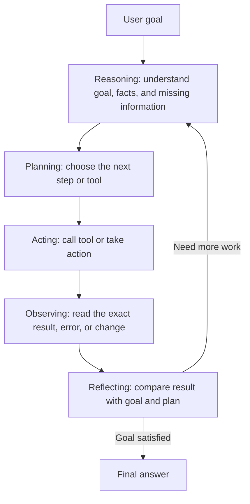

# Acting and Observation

## Goal

Learn how an agent uses tools, reads the results, and changes its next step based on what happened.

## The Big Idea

An AI agent is not just a chatbot that answers from memory. It is a program that can repeatedly:

1. Plan what to do next.
2. Act by using a tool or taking a step in the world.
3. Observe what happened.
4. Reflect on the result and choose the next step.

This loop is similar to how people solve real problems. Imagine a robot playing a video game. To win, it cannot only think about the game. It must choose a move, make the move, watch what changes on the screen, and adjust its next move.

Agents work the same way. A good agent does not blindly run tools or blindly trust its first answer. It acts, looks at the result, checks whether the result helps the goal, and then decides what to do next.

## A Clear Mental Model

Reasoning, planning, observing, and reflecting are related, but they do different jobs in the agent loop.

- Reasoning means thinking through the goal, facts, constraints, and missing information.
- Planning means choosing the next step or sequence of steps.
- Acting means taking the step, often by calling a tool.
- Observing means reading what actually happened after the action.
- Reflecting means judging whether the observation helps the goal and whether the plan should change.

Reflection is a kind of reasoning, but it has a special job: it happens after feedback. Planning looks forward before action. Reflection looks backward after action, then decides whether to continue, revise, ask, or stop.



**How to read this diagram:** reasoning and planning happen before the action. Observing and reflecting happen after the action. Reflection feeds the next round of reasoning and planning.

## Quick Comparison

| Concept | Main Question | Timing | Output | Weather Example |
| --- | --- | --- | --- | --- |
| Reasoning | What do I know, and what is missing? | Before or after new information | A better understanding of the task | The user wants to launch a rocket, so rain and wind matter. |
| Planning | What should I do next? | Before action | A step, tool choice, or sequence | Search for tomorrow's forecast in the user's location. |
| Acting | What step do I take? | During execution | A tool call or external action | Call the weather tool with the location and date. |
| Observing | What actually happened? | After action | Raw result, error, or state change | The forecast says heavy thunderstorms and high winds. |
| Reflecting | What does that result mean for the goal? | After observation | Continue, revise, ask, answer, or stop | Launching tomorrow is unsafe, so recommend waiting. |

The simplest difference is this:

```text
Observation: The forecast says heavy thunderstorms and high winds.
Reflection: That weather makes a model rocket launch unsafe, so the agent should warn the user.
```

## Part 1: Acting, Or Tool Invocation

Acting is the step where the agent stops only thinking and actually does something.

For humans, acting might mean opening a weather app, using a calculator, checking a calendar, sending an email, or grabbing a measuring cup while baking. Thinking alone is not enough when the answer depends on something outside your head.

For an AI agent, acting usually means invoking a digital tool. Tool invocation means the agent chooses a tool, fills in the required input, runs the tool, and waits for the result.

Examples:

- If the agent needs tomorrow's weather, it may call a weather or web search tool.
- If the agent needs to solve a large calculation, it may call a calculator or code tool.
- If the agent needs a customer's phone number, it may query a database.
- If the agent needs to create a file, it may call a file-writing tool.
- If the agent needs to book a meeting, it may call a calendar API.

A tool call has three important parts:

- Tool choice: Which tool is best for the job?
- Tool input: What exact information should the agent give the tool?
- Tool result: What did the tool return after it ran?

For example, if the agent wants to multiply `55 x 340`, the tool invocation might look like this:

```text
Tool: calculator
Input: 55 * 340
Result: 18700
```

After the result comes back, the action is finished. The agent should save the useful result in its current state or memory so it can use it in the next step.

## Part 2: Observation And Reflection

Observation is the step where the agent looks at what happened after an action.

Reflection is the step where the agent asks what the observation means.

Imagine you are playing soccer. You kick the ball toward the goal. That kick is the action. After the kick, you need to observe the result. Did the ball go into the net? Did the goalie block it? Did it fly out of bounds?

Then you reflect. If the ball went too high, you may think, "Next time I should use less power." That reflection helps you avoid repeating the same mistake.

An AI agent does the same thing:

- Observation: "What result did the tool return? Did the world change? Did I get an error?"
- Reflection: "Does this result help the user's goal? Did I make a mistake? What is the most useful next action?"

Observation is about seeing the facts. Reflection is about understanding the facts.

A useful rule is to write observation like evidence and reflection like a decision.

| Situation | Observation | Reflection |
| --- | --- | --- |
| Weather tool | `90% chance of thunderstorms and high winds.` | The user should not launch the rocket tomorrow. |
| Calculator check | `$1.00 - $0.10 = $0.90.` | The first answer breaks the rule, so solve again. |
| File search | `No file named report.pdf was found.` | The agent should try a broader search or ask for the filename. |
| API call | `The API returned 401 Unauthorized.` | The tool did not succeed, so do not trust missing data as a real answer. |

## Why This Matters

Without observation and reflection, an agent becomes lost.

It would be like a soccer player kicking the ball out of bounds, closing their eyes, and then kicking empty air because they never noticed the ball was gone. The same problem happens with AI agents when they call a tool but do not inspect the result.

Observation and reflection help an agent:

- Notice when a tool failed.
- Catch wrong assumptions.
- Avoid repeating a bad action.
- Decide whether it has enough information to answer.
- Improve the next step instead of continuing blindly.

This is one of the main differences between a simple one-shot prompt and an agent. A one-shot prompt gives one answer. An agent can act, learn from feedback, and repair its plan.

## A Simple Agent Loop

A beginner-friendly version of the loop looks like this:

```text
1. Observe the user's request.
2. Decide what information or action is needed.
3. Invoke the best tool.
4. Observe the tool result.
5. Reflect on whether the result solves the problem.
6. Answer the user or take another action.
```

The loop may run once for an easy task or many times for a complex task.

## Example 1: Checking Weather For A Rocket Launch

User goal:

```text
Can you tell me if it will rain tomorrow? I want to launch my model rocket.
```

The user is not only asking for weather. They are asking because they want to know whether it is safe and sensible to launch a model rocket.

Here is a simplified agent work log.

### Step 1: Observation

The agent reads the request and identifies the important details:

- The user wants tomorrow's weather.
- The weather matters because of a model rocket launch.
- A useful answer needs a location.

If the agent already has a trusted user profile that says the user lives in Miami, Florida, it can use that. If it does not know the location, it should ask the user for it before searching.

For this example, assume the agent has a trusted location:

```text
Known location: Miami, Florida
```

### Step 2: Reflection And Planning

The agent asks:

```text
What do I need to know?
```

It needs a current forecast for Miami tomorrow. The agent's built-in knowledge is not enough because weather changes constantly. It needs real-world, up-to-date data.

Decision:

```text
Use a weather or web search tool.
```

### Step 3: Acting

The agent invokes the tool with specific input:

```text
Tool: web_search
Input: Miami Florida weather forecast for tomorrow
```

The tool runs and returns weather information.

### Step 4: New Observation

The agent reads the result:

```text
Forecast: 90% chance of heavy thunderstorms and high winds in the afternoon.
```

This observation is not just text to copy. It is new information that affects the user's plan.

### Step 5: Reflection

The agent connects the weather result to the real goal:

- Heavy thunderstorms are unsafe for an outdoor launch.
- High winds could blow the rocket off course.
- The rocket could be damaged or lost.
- The answer should warn the user, not just say "yes, it will rain."

The agent also checks whether the task is complete:

- Did it answer the weather question? Yes.
- Did it consider the rocket launch context? Yes.
- Is there a safer recommendation? Yes, wait for a clear and calmer day.

### Step 6: Final Response

The agent can now answer:

```text
I checked the forecast for Miami tomorrow. It looks like there is a 90% chance of heavy thunderstorms and high winds in the afternoon. Launching your model rocket tomorrow is not a safe idea. It would be better to wait for a clear, calm day.
```

The important lesson: the agent did not stop after finding weather data. It reflected on what the data meant for the user's real goal.

## Example 2: Catching A Math Mistake

User goal:

```text
A baseball bat and a ball cost $1.10 together. The bat costs $1.00 more than the ball. How much does the ball cost?
```

This is a classic trick question. Many people quickly answer `10 cents`, but that answer is wrong.

### Step 1: Observation And Quick Plan

The agent observes:

- Total cost: `$1.10`
- Bat costs `$1.00` more than the ball.
- Need to find the ball's cost.

A quick but risky plan is to subtract `$1.00` from `$1.10` and say the ball costs `$0.10`.

### Step 2: Acting With A First Guess

The first guess:

```text
Ball: $0.10
Bat: $1.00
Total: $1.10
```

At first glance, the total looks correct.

### Step 3: Observation And Reflection

A careful agent does not send the first guess immediately. It checks the answer against every rule.

Rule 1:

```text
Bat + ball = $1.10
$1.00 + $0.10 = $1.10
```

This rule passes.

Rule 2:

```text
Bat is $1.00 more than the ball.
$1.00 - $0.10 = $0.90
```

This rule fails. The bat is only `$0.90` more than the ball, not `$1.00` more.

The observation exposes the mistake. Reflection tells the agent to stop using the quick guess and solve the problem more carefully.

### Step 4: Re-Planning And New Action

Use algebra:

```text
Let ball = x
Let bat = x + 1.00

x + (x + 1.00) = 1.10
2x + 1.00 = 1.10
2x = 0.10
x = 0.05
```

So:

```text
Ball: $0.05
Bat: $1.05
```

### Step 5: New Observation And Final Reflection

Check both rules again:

```text
$1.05 + $0.05 = $1.10
$1.05 - $0.05 = $1.00
```

Both rules pass. The answer is now reliable.

### Step 6: Final Response

The agent can answer:

```text
The ball costs 5 cents. The bat costs $1.05. Together they cost $1.10, and the bat is exactly $1.00 more than the ball.
```

The important lesson: reflection can catch mistakes before the user sees them.

## Common Failure Modes

Agents often make mistakes in this part of the loop. Common failures include:

- Wrong tool: The agent uses a calculator when it needs live weather data.
- Bad tool input: The agent searches for "weather tomorrow" without including the location.
- Ignored result: The tool returns an error, but the agent continues as if it worked.
- Shallow observation: The agent copies data without understanding what it means for the goal.
- No reflection: The agent gives the first answer without checking it.
- Infinite loop: The agent keeps calling tools even though it already has enough information.

Good agents reduce these mistakes by checking the result after every action.

## A Useful Reflection Checklist

After each action, an agent should ask:

- What did I expect to happen?
- What actually happened?
- Did the tool succeed, fail, or return incomplete information?
- Does this result answer the user's real goal?
- Did I violate any instruction, constraint, or rule?
- Should I answer now, ask a question, or take another action?

This checklist is simple, but it makes agents much more reliable.

## Practice

Pick one small task and write the agent loop for it.

Example task:

```text
The user asks: "Can I bike to school tomorrow, or will it rain?"
```

Write:

1. What the agent observes from the request.
2. What tool it should use.
3. The exact tool input.
4. What result might come back.
5. How the agent should reflect on the result.
6. What final answer it should give.

For extra practice, include one possible mistake and show how reflection catches it.

## Key Takeaways

- Acting means using a tool or taking a step in the world.
- Tool invocation means choosing a tool, giving it input, and receiving a result.
- Observation means reading what happened after the action.
- Reflection means deciding what the result means for the goal.
- Agents become useful because they can act, observe, reflect, and adjust.

## Resources

- [Agent Loop](../agent-loop/index.md)
- [Tools Overview](../tools-overview/index.md)
- [ReAct Pattern](../react-pattern/index.md)
