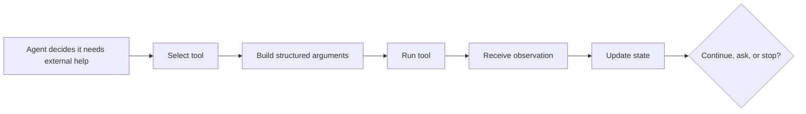

# Agent Loop

## What Is an Agent?

An agent is a goal-driven software system that can decide what to do next. In
modern AI applications, the reasoning part is often an LLM, but the full agent
also includes instructions, memory, tools, state, limits, and safety rules.

A simple chatbot answers the current message. An agent uses the current message
as a goal, then may gather information, choose actions, check results, and keep
working until the goal is complete or it must stop.

| Capability | Chatbot | AI agent |
| --- | --- | --- |
| Receives user input | Yes | Yes |
| Generates text | Yes | Yes |
| Breaks a goal into steps | Sometimes | Usually |
| Uses external tools | Not by default | Commonly |
| Observes results and retries | No or limited | Core behavior |
| Maintains task state | Limited | Often required |
| Acts under stop rules | Usually simple | Essential |

### Agent Example

User goal:

```text
Create a short report on this week's product signups and explain the biggest change from last week.
```

A useful agent might:

1. Read the analytics database.
2. Compare this week and last week.
3. Calculate the largest change.
4. Check whether the result looks unusual.
5. Produce a short report in the requested format.

The important difference is that the user did not list every step. The agent
figures out the next reasonable action from the goal and the current state.

## What Are Tools?

Tools are external capabilities the agent can call when language alone is not
enough. A tool can retrieve information, perform a calculation, execute code,
query a database, send a message, update a system, or ask for approval.

The LLM is the reasoning engine. Tools are how the agent touches the world.

```text
Goal: "Find the current price and email a summary."

LLM reasoning:
I need current data and then I need to send a message.

Tool calls:
1. finance_api.get_price(symbol="NVDA")
2. email.send(to="...", subject="...", body="...")
```

| Tool category | What it does | Example use |
| --- | --- | --- |
| Search tool | Finds current or external information | Look up recent documentation |
| Retrieval tool | Reads private knowledge or documents | Search a company's policy library |
| Database tool | Queries structured records | Get customer orders or metrics |
| Calculator/code tool | Computes or verifies results | Run Python, tests, or formulas |
| Browser tool | Interacts with websites | Open pages, inspect forms, collect data |
| API action tool | Changes another system | Create tickets, send email, update CRM |
| Human approval tool | Pauses for review | Ask before deleting, buying, or publishing |

### Anatomy of a Tool Call

A reliable tool call needs more structure than "use the database."

| Part | Meaning | Example |
| --- | --- | --- |
| Tool name | Which capability to use | `search_docs` |
| Arguments | Inputs passed to the tool | `{"query": "refund policy"}` |
| Permissions | Whether the action is allowed | Read-only, write, admin, approval required |
| Observation | What the tool returns | Search results, rows, error message |
| Failure rule | What to do if it fails | Retry once, ask user, or stop safely |



### Tool Example

Task:

```text
Summarize the open bugs assigned to me and identify the oldest unresolved one.
```

Possible tool sequence:

| Step | Tool | Why |
| --- | --- | --- |
| 1 | Issue tracker search | Retrieve open bugs assigned to the user |
| 2 | Date parser or code tool | Sort bugs by creation date |
| 3 | Summarizer | Create a readable summary |
| 4 | Final response | Report count, themes, and oldest bug |

Tools should be limited to what the agent actually needs. Giving an agent too
many powerful tools without permissions, schemas, and logging makes the loop
harder to control.

## What is Agent Loop

An AI agent is not just a chatbot that produces text. It is a system that can
receive a goal, inspect information, reason about what to do next, use tools,
observe the result, and repeat until it should stop.

The agent loop is the control cycle that makes this possible.

Most useful agents follow the same pattern:

```text
Perceive -> Plan -> Act -> Observe -> Reflect -> Stop or Continue
```

The loop lets the agent adapt when the first attempt is incomplete, wrong, or
blocked. Without a loop, the system is closer to a single LLM response or a
fixed workflow. With a loop, the agent can work through multi-step tasks such as
research, code repair, customer support, data analysis, or deployment planning.

## Agent Loop at a Glance

| Step | What happens | Common input | Common output |
| --- | --- | --- | --- |
| Perception | The agent receives the goal and current state | User request, files, events, tool results | Working state |
| Planning | The agent decides what information or action is needed next | Goal, memory, constraints | Task list or next step |
| Action | The agent calls a tool or produces a structured response | Tool name, arguments, plan | Search, code run, API call, message |
| Observation | The agent reads the result of the action | Tool output, error, new data | Updated facts |
| Reflection | The agent checks progress and quality | Goal, plan, observations | Continue, revise, ask, or stop |
| Stop condition | The agent finishes or fails safely | Done criteria, limits, risk rules | Final answer, handoff, refusal, error |

## Make the Loop Specific

A useful agent loop should not be described only as "think, act, repeat." Before
building the loop, write down the exact state, tools, limits, and completion
rules.

| Design item | Specific question | Concrete example |
| --- | --- | --- |
| Goal | What outcome should be true at the end? | `Produce a cited 500-word market summary.` |
| State | What facts must the agent track between steps? | `topic`, `sources_read`, `open_questions`, `draft_status` |
| Tools | What actions are allowed? | `web_search`, `open_page`, `summarize_source`, `final_answer` |
| Tool permissions | Which tools can change external systems? | Search is read-only; email requires approval |
| Observation format | What does each tool return? | Search returns `title`, `url`, `snippet`, `date` |
| Reflection check | How does the agent know whether to continue? | Continue until at least 3 credible sources agree |
| Stop rule | What ends the loop? | Stop after final answer, 8 steps, 5 minutes, or unsafe request |
| Failure rule | What happens when a tool fails? | Retry once with narrower input, then ask the user |

### Specific Loop State

The agent should maintain a small working state instead of relying on loose
conversation history.

```json
{
  "goal": "Summarize three credible sources about AI agents.",
  "step": 3,
  "max_steps": 8,
  "sources_read": [
    {
      "title": "What are AI Agents?",
      "url": "https://aws.amazon.com/what-is/ai-agents/",
      "credibility": "high",
      "used_in_answer": true
    }
  ],
  "open_questions": ["Need one beginner-friendly source."],
  "next_action": "search_web",
  "done": false
}
```

This state makes the loop inspectable. A developer can see what the agent knows,
what it still needs, and why it plans the next action.

### Specific Tool Contract

Every tool should have a clear contract. This prevents vague tool use and makes
tool output easier to validate.

```yaml
tool: search_web
purpose: Find current public web pages for a research question.
input:
  query: string
  max_results: integer
output:
  results:
    - title: string
      url: string
      snippet: string
      published_date: string | null
limits:
  max_results: 5
  read_only: true
failure_behavior:
  - If no results are found, rewrite the query once.
  - If results are low quality, ask the user for a preferred source type.
```

### Specific Stop Rules

Stop rules should be measurable:

| Vague stop rule | More specific stop rule |
| --- | --- |
| `Stop when done.` | `Stop when the answer includes 3 cited sources, a comparison table, and a final recommendation.` |
| `Do not take too long.` | `Stop after 8 loop iterations or 5 minutes, whichever comes first.` |
| `Ask if confused.` | `Ask the user when two required fields are missing or confidence is below 0.6.` |
| `Be safe.` | `Require approval before sending email, deleting files, making purchases, or changing production data.` |

## Why the Loop Matters

Traditional software usually follows a path designed ahead of time. A simple LLM
usually maps one input to one output. An agent adds repeated decision-making.

| System type | Flow | Strength | Limitation |
| --- | --- | --- | --- |
| LLM response | `Input -> Output` | Fast text generation | No real action or iteration |
| Workflow | `Input -> Predefined steps -> Output` | Reliable for routine tasks | Brittle when the situation changes |
| Agent | `Goal -> Reason -> Act -> Observe -> Iterate -> Output` | Adapts to changing information | Needs guardrails, budgets, and monitoring |

The loop is useful because many real tasks cannot be solved from the first
prompt alone. The agent may need to search, inspect files, run code, query a
database, call an API, or ask a human for missing information.

## Core Architecture

An agent loop usually sits inside a larger architecture.

```text
┌─────────────────────────────────────────────────────┐
│ User goal                                           │
└──────────────────────┬──────────────────────────────┘
                       ▼
┌─────────────────────────────────────────────────────┐
│ Agent brain                                         │
│ - LLM or foundation model                           │
│ - instructions                                      │
│ - planning policy                                   │
│ - safety rules                                      │
└──────────┬───────────────────────┬──────────────────┘
           │                       │
           ▼                       ▼
┌──────────────────────┐   ┌──────────────────────────┐
│ Memory               │   │ Tool layer               │
│ - task history       │   │ - search                 │
│ - user preferences   │   │ - database               │
│ - retrieved context  │   │ - code execution         │
└──────────┬───────────┘   │ - browser/API/email      │
           │               └────────────┬─────────────┘
           │                            ▼
           │               ┌──────────────────────────┐
           │               │ Environment              │
           │               │ files, web, apps, data   │
           │               └────────────┬─────────────┘
           │                            ▼
           └──────────────► Observation and state ◄───┘
                            │
                            ▼
                      Continue or stop
```

The "brain" decides what to do, but the agent becomes useful because it can
connect reasoning to memory, tools, and observations.

## Step-by-Step Explanation

### 1. Perception

Perception means the agent gathers the state it can see. In software agents,
this usually means user messages, documents, retrieved search results, API
responses, logs, database rows, files, or tool output.

Examples:

- A customer support agent reads the latest customer message and account status.
- A research agent reads the user question and search results.
- A code assistant reads the failing test output and relevant source files.

Good perception has boundaries. The agent should know which inputs are trusted
instructions and which inputs are untrusted evidence. For example, a webpage can
provide facts, but it should not override the agent's system rules.

### 2. Planning

Planning turns the goal into smaller steps. The plan can be explicit, such as a
task list, or implicit, such as selecting the next tool call.

For a research task, a plan might be:

1. Search for recent sources.
2. Compare the claims.
3. Extract the strongest evidence.
4. Write a cited summary.

For a code task, a plan might be:

1. Reproduce the bug.
2. Inspect the failing module.
3. Patch the smallest responsible code path.
4. Run targeted tests.

Planning is not the same as completing the task. It is a temporary map. The
agent should revise it when observations show that the original plan was wrong.

### 3. Action

An action is anything the agent does to change state or gather more information.
Actions can be visible or invisible to the user.

| Action type | Example | Risk to manage |
| --- | --- | --- |
| Retrieve information | Search the web, query a database, read files | Bad sources, stale data, private data |
| Transform information | Summarize, classify, extract fields | Hallucinated fields, lost nuance |
| Execute code | Run tests, calculate results, call scripts | Runtime errors, destructive commands |
| Use an API | Create a ticket, send email, update CRM | Wrong recipient, unauthorized changes |
| Ask a human | Request approval or missing input | Too many interruptions |
| Produce final output | Answer, report, decision memo | Unsupported claims, bad format |

Tool calls should be structured. The agent should know the tool name, required
arguments, permissions, expected output, and failure behavior.

### 4. Observation

Observation is the result that comes back after an action. It may confirm the
plan, contradict it, or expose a new problem.

Examples:

```text
Action:
Run unit tests.

Observation:
3 tests failed. The parser rejects empty metadata.
```

```text
Action:
Search documentation.

Observation:
The current API requires a different parameter name than the old example.
```

Observations should update the agent's working state. If the agent ignores
observations and keeps repeating the same action, the loop becomes wasteful or
dangerous.

### 5. Reflection

Reflection is the quality check between steps. The agent asks:

- Is the goal already satisfied?
- Did the last action work?
- Did the result contradict my assumptions?
- Do I need a different tool?
- Is it safe to continue?
- Should I ask the user or hand off to a human?

Reflection is especially important after errors. A useful agent does not just
retry forever. It changes strategy, narrows the task, or stops safely.

### 6. Stop Condition

Every agent loop needs a clear stop rule. Without one, the agent can waste
tokens, repeat actions, call tools too many times, or make changes after the
task is already complete.

Common stop conditions:

| Stop condition | Meaning |
| --- | --- |
| Goal satisfied | The output meets the user's request and success criteria |
| Max steps reached | The loop hit its iteration budget |
| Timeout reached | The task took too long |
| Cost budget reached | Tool or model usage is too expensive to continue |
| Missing information | The agent cannot proceed without user input |
| Safety boundary reached | The next action would be unsafe, private, illegal, or destructive |
| Low confidence | The agent should ask for review instead of pretending certainty |

Stop rules are a core safety feature, not an implementation detail.

## Research Assistant Example

Goal:

```text
Find three credible sources about AI agents and summarize how agents differ
from basic LLM chatbots.
```

Loop:

| Iteration | Perceive | Plan | Act | Observe | Reflect |
| --- | --- | --- | --- | --- | --- |
| 1 | User asks for credible sources | Need authoritative and beginner-friendly sources | Search web | Finds cloud provider docs and explainers | Need cross-source comparison |
| 2 | Search results available | Read selected sources | Open sources | Sources discuss autonomy, tools, reasoning, iteration | Enough for draft |
| 3 | Notes available | Create structured summary | Write table and bullets | Draft is complete | Check whether sources support claims |
| 4 | Draft and sources available | Add citations and caveats | Finalize answer | Cited summary ready | Stop: goal satisfied |

Illustration:

```text
Question
  |
  v
Search -> Read -> Compare -> Summarize -> Cite -> Stop
             ^                     |
             |                     v
          Need more? <--------- Quality check
```

## Code Assistant Example

Goal:

```text
Fix the failing markdown parser test without changing unrelated behavior.
```

Loop:

| Iteration | Perceive | Plan | Act | Observe | Reflect |
| --- | --- | --- | --- | --- | --- |
| 1 | User reports failure | Reproduce before editing | Run tests | One parser test fails | Need source context |
| 2 | Failure names function | Inspect parser and tests | Read files | Empty metadata is handled inconsistently | Patch narrow condition |
| 3 | Source context known | Make minimal edit | Update parser | Code changed | Verify behavior |
| 4 | Patch applied | Run targeted tests | Execute tests | Targeted test passes | Run broader check if risk is shared |
| 5 | Tests pass | Summarize change | Final response | User gets concise status | Stop: goal satisfied |

This is why code agents need tool access. The model alone can suggest a fix,
but the loop lets it inspect the real repository, run tests, observe failures,
and adjust.

## ReAct Pattern

One common agent pattern is ReAct: reasoning and acting are interleaved. The
agent reasons about the next useful move, takes an action, reads the
observation, and then reasons again.

```text
Reason: I need current information, not only model memory.
Action: Search official documentation.
Observation: The API changed in the latest version.
Reason: Update the answer and mention the version difference.
Action: Write final summary with citation.
```

This pattern is powerful because the agent does not need to solve the entire
task in one pass. It can use evidence from the environment to guide the next
step.

## Tools in the Loop

Tools give agents capabilities that the LLM does not have by itself.

| Tool | What it adds to the loop | Example |
| --- | --- | --- |
| Search | Current external information | Find recent documentation |
| Browser | Page inspection and interaction | Read a web page or fill a form |
| Database | Structured business data | Retrieve customer account state |
| Code execution | Computation and verification | Run a script or test suite |
| File system | Project context | Read and edit source files |
| API connector | Real-world action | Create a ticket or send a notification |
| Memory store | Continuity | Retrieve user preferences or past decisions |

More tools do not automatically make a better agent. Each tool increases the
need for permissions, validation, logging, and failure handling.

## Memory in the Loop

Memory lets the agent carry useful state across steps.

| Memory type | Lifetime | Example |
| --- | --- | --- |
| Working memory | One loop or one task | Current plan, last observation, open questions |
| Conversation memory | One chat session | User constraints mentioned earlier |
| Long-term memory | Across sessions | Preferred report format or recurring project facts |
| External knowledge | Retrieved on demand | Docs, policies, tickets, records |

Memory should be treated as evidence, not absolute truth. Old preferences,
stale retrieved facts, and corrupted records can mislead the loop.

## Guardrails and Failure Modes

Agent loops need control because each iteration can consume money, time, and
permissions.

| Failure mode | What it looks like | Guardrail |
| --- | --- | --- |
| Infinite loop | Repeats the same failed action | Max steps and repeated-failure detection |
| Tool misuse | Calls the wrong API or uses bad arguments | Tool schemas and permission checks |
| Stale information | Answers from outdated memory | Fresh retrieval for time-sensitive facts |
| Hallucinated observation | Invents a tool result | Only use actual tool output |
| Overconfident final answer | Hides uncertainty | Confidence checks and citations |
| Unsafe action | Sends, deletes, buys, or changes without approval | Human approval for high-impact actions |
| Cost runaway | Too many model or tool calls | Token budgets, timeouts, circuit breakers |

Production agents should log actions and observations so failures can be
debugged after the fact.

## Designing a Simple Agent Loop

Use this checklist when building or evaluating an agent:

| Design question | Why it matters |
| --- | --- |
| What is the goal? | The loop needs a success condition |
| What can the agent perceive? | It cannot reason about invisible state |
| What tools can it use? | Tools define the action space |
| What memory is available? | Memory affects continuity and personalization |
| What counts as done? | Prevents unnecessary extra work |
| What requires approval? | Protects users and systems |
| What are the budgets? | Controls cost, time, and retries |
| How are errors handled? | Prevents repeated failure |

## Specific Design Template

Use this template before implementing an agent:

```text
Agent name:
Primary user:
Goal:

Inputs the agent can perceive:
- User message:
- Files:
- Tool observations:
- Memory:

Allowed tools:
- Tool name:
- Read or write:
- Requires approval:
- Expected output:

Loop limits:
- Max iterations:
- Timeout:
- Cost or token budget:
- Retry limit per tool:

Reflection checks:
- What evidence is required?
- What output format is required?
- What errors require a new plan?
- What uncertainty requires a user question?

Stop conditions:
- Success:
- Missing information:
- Unsafe request:
- Tool failure:
```

## Source Notes

This page synthesizes the provided study note and these references:

- [AWS: What are AI Agents?](https://aws.amazon.com/what-is/ai-agents/)
- [Geeky Gadgets: AI Agents Explained in Simple Terms for Beginners](https://www.geeky-gadgets.com/ai-agents-explained-for-beginners/)
- [AIMultiple: Compare AI Agent Tools](https://aimultiple.com/ai-agent-tools)