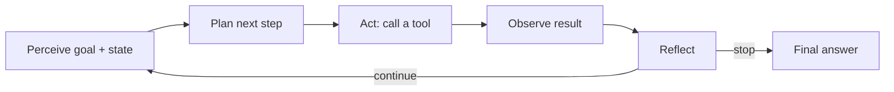
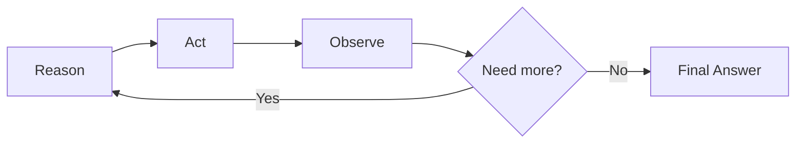
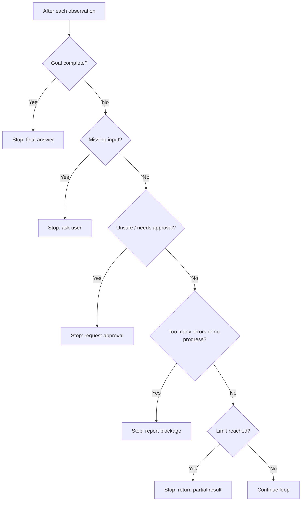
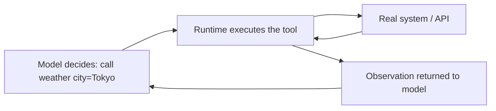

# Junior Interview: Agent Fundamentals

Friendly, entry-level questions for people who are still learning how AI agents work. They check whether the **foundations** are there — and they double as a **study guide**: each question has a short rubric (*good answer covers*), a fuller **explanation** with examples and diagrams, and a hint the interviewer can give if the candidate is stuck.

!!! note "How to use this page"
    As an interviewer, ask the question and listen for the ideas in *good answer covers*; the explanation is there to help you follow up and to let learners study. Reading every explanation here should cover most of the Stage 04 basics. See the [QAs](../test/index.md) for quick self-testing.

## 1. What makes something an "agent" instead of a single LLM call?

**Good answer covers:** A single LLM call maps one input to one output. An **agent** takes a goal, then **loops** — it can plan, use tools, read results, and keep going until the goal is met or it must stop.

**Explanation:** A plain chatbot answers the current message and stops. An agent treats the message as a **goal** and works toward it: it may gather information, call a tool, check the result, and try again. The key new ingredient is **repeated decision-making** — the agent decides its own next step instead of following one fixed path.

| Capability | Single LLM call | AI agent |
| --- | --- | --- |
| Receives input | Yes | Yes |
| Generates text | Yes | Yes |
| Breaks a goal into steps | Sometimes | Usually |
| Uses external tools | Not by default | Commonly |
| Observes results and retries | No | Core behavior |
| Decides when it is done | No | Essential |

**Hint if stuck:** What can a system do *after* its first answer that a one-shot prompt cannot?

## 2. Can you describe the agent loop as a simple mental model?

**Good answer covers:** A repeating cycle: **perceive** the goal and state, **plan/think** about the next step, **act** (often a tool call), **observe** the result, **reflect**, then either continue or stop.

**Explanation:** The agent loop is the control cycle that makes an agent more than a single response. Most useful agents follow the same shape. The loop lets the agent adapt when the first attempt is incomplete, wrong, or blocked — instead of guessing the whole answer up front, it works one step at a time.



**Hint if stuck:** Think of how a person solves a problem: think, try something, look at what happened, adjust, repeat.

## 3. What is the ReAct pattern?

**Good answer covers:** ReAct = **Reason + Act**. The agent **reasons** about the next useful step, takes an **action**, reads the **observation**, then reasons again — reasoning and acting are interleaved instead of done all at once.

**Explanation:** ReAct (from the paper *Synergizing Reasoning and Acting in Language Models*) is one of the most common agent patterns. The big idea is that the **observation from each action guides the next reasoning step**. Instead of answering from memory, the agent can notice it needs information, go get it, read the result, and only then answer — grounded in evidence.



A short trace looks like this:

```text
Reason: I need the latest build log.
Act:    read_build_log({"build_id": "latest"})
Observation: "ModuleNotFoundError: No module named 'yaml'"
Reason: PyYAML may be missing from requirements.
Act:    read_file({"path": "requirements.txt"})
Observation: "mkdocs==1.6.1"
Final Answer: PyYAML is missing from requirements.txt. Add it and rerun.
```

**Hint if stuck:** What are the two words "ReAct" is short for, and how do they take turns?

## 4. What do "reasoning" and "planning" mean for an agent?

**Good answer covers:** **Reasoning** is the agent thinking through the goal, known facts, and what is missing. **Planning** is breaking a big goal into smaller ordered steps and choosing what to do next.

**Explanation:** Planning turns a broad goal into a sequence of smaller subgoals. This matters when a task has multiple phases, needs different tools, or has steps that depend on earlier results. A good plan is not a rigid script — the agent should **revise** it when an observation shows the original plan was wrong.

Example decomposition:

```text
Goal: Plan a three-day conference trip.

1. Identify the conference dates and location.
2. Check travel options.
3. Compare hotels near the venue.
4. Build a daily itinerary.
5. Estimate the total cost.
6. Present the plan for approval.
```

A weak goal like `Help me with customer tickets` is hard to plan for. A strong goal — `Summarize the 20 newest unresolved tickets, group them by issue type, and flag the highest-priority one without messaging customers` — gives the agent scope, output, and a safety boundary.

**Hint if stuck:** If a task takes several steps, what does the agent need to write down before it starts acting?

## 5. What does "acting" mean, and what is an "observation"?

**Good answer covers:** **Acting** = the agent actually does something, usually by **calling a tool** (with a tool name and inputs). The **observation** is the **result the tool returns**, fed back into the loop.

**Explanation:** Acting is when the agent stops only thinking and touches the world. A tool call has three parts: the **tool choice**, the **input**, and the **result**. After the result comes back, the action is finished and the agent saves what it learned.

```text
Tool:   calculator
Input:  55 * 340
Result: 18700   <- this is the observation
```

The observation is the bridge between the action and the next decision: it might confirm the plan, contradict it, or reveal a new problem (like an error message).

**Hint if stuck:** One half is what the agent *does*; the other half is what *comes back*. Name both.

## 6. Why do observations matter so much?

**Good answer covers:** Observations **ground the next step** in reality. Without checking the result, the agent acts blindly — it can't tell if a tool failed, repeat bad actions, or know whether it's done.

**Explanation:** Imagine a soccer player who kicks the ball, then closes their eyes and keeps kicking empty air. That is an agent that ignores observations. Reading the result lets the agent notice a tool failed, catch a wrong assumption, avoid repeating a bad action, and decide whether it has enough to answer.

| Observation | What the agent should do with it |
| --- | --- |
| `90% chance of thunderstorms` | Warn the user; launching the rocket is unsafe |
| `No file named report.pdf found` | Broaden the search or ask for the filename |
| `API returned 401 Unauthorized` | Do not treat missing data as a real answer; the call failed |

A good rule: write the **observation like evidence** and the next decision like a **reflection** on that evidence.

**Hint if stuck:** What goes wrong if the agent calls a tool but never looks at what it returned?

## 7. What are stopping criteria, and why does an agent need them?

**Good answer covers:** Stopping criteria are the **rules for when to finish the loop** — goal met, limit reached (max steps/time/cost), too many errors, no progress, or an unsafe action. They prevent **infinite loops and runaway cost**.

**Explanation:** An agent loop without a stop rule can run forever: repeat the same search, retry a broken API endlessly, burn tokens, or keep acting after the task is already done. Stopping criteria are checked **after the agent observes and reflects** — the agent should continue only if another step is useful, allowed, and within budget.



**Hint if stuck:** What stops an agent from looping forever and spending money with nothing to show for it?

## 8. "Stopping" doesn't always mean "success" — what else can it mean?

**Good answer covers:** An agent can also stop because it's **blocked** (missing input), a **tool failed**, an action **needs approval**, it hit a **limit**, or the request is **unsafe**. A good agent stops with a clear reason, not silence.

**Explanation:** Beginners often assume "stop" equals "done." But a useful agent has several exits, each with an explanation:

```text
Success:       "Paris is the capital of France."
Clarification: "I need the order ID before I can check shipping."
Failure:       "The database returned authorization errors twice."
Safety:        "I cannot delete production data without approval."
Budget:        "I reached the limit after 8 sources. Here is the best summary so far."
```

Recording **why** it stopped (a stop reason) makes the agent easier to debug and trust.

**Hint if stuck:** List a few reasons an agent might stop that are *not* "the task succeeded."

## 9. At a high level, what is a tool, and why do agents need them?

**Good answer covers:** A **tool** is an external capability the LLM doesn't have on its own — search, a calculator, a database query, an email sender. Agents need tools to **touch the real world**: get fresh data, run code, or change a system.

**Explanation:** The model is the **reasoning engine**; tools are how the agent **acts on the world**. A model alone can't reliably get today's weather, run a program, or send a message. Tools fall into a few rough categories:

| Tool type | What it does | Example |
| --- | --- | --- |
| Perception / read | Gather information | Web search, database query, file reader |
| Reasoning / compute | Process or verify | Calculator, code execution |
| Action / write | Change the environment | Send email, create a ticket, deploy |

A useful caution: more tools is not automatically better. Each tool adds the need for permissions, validation, and failure handling.

**Hint if stuck:** What can't a language model do by itself that an agent often needs — like getting *current* data?

## 10. Is the model the same as the agent?

**Good answer covers:** No. The **model** is one part (the reasoning brain). The **agent** is the whole system: model **plus** tools, memory, instructions, state, and stop rules working together in a loop.

**Explanation:** A common beginner mix-up. Think of tools as instruments and the agent as the entity that uses them. A research assistant agent might contain a search tool, a calculator, memory, and a language model — the model is just one component.

```text
Research Assistant Agent
├── Language Model   (reasoning)
├── Tools            (search, calculator)
├── Memory           (notes, preferences)
└── Instructions     (goal + rules)
```

**Hint if stuck:** Is the LLM the *whole* system, or one piece of it alongside tools and memory?

## 11. When the agent decides to use a tool, who actually runs it?

**Good answer covers:** The **model decides** which tool to call and with what inputs. The **runtime (the framework/app)** actually **executes** the tool and feeds the result back as an observation. Deciding and executing are separate jobs.

**Explanation:** The model doesn't reach out and run code itself — it produces a structured request like "call `weather(city="Tokyo")`." The surrounding runtime executes that request, gets the result, and returns it to the model. This separation is what lets the app add safety: it can require approval before a risky action runs, even though the model asked for it.



**Hint if stuck:** The model *asks* for an action — but something else has to *carry it out*. What is that something?

## 12. Why might an agent need approval before sending an email or deleting a file?

**Good answer covers:** Those are **write or destructive** actions that affect the real world and can be hard to undo. Read actions can usually run freely, but high-impact actions should pause for a human to confirm.

**Explanation:** A simple way to classify any action: **read** (observe), **write** (change), **destructive** (remove/overwrite). Reads are usually safe to run automatically; writes need care; destructive actions should require explicit approval. Even if a tool is available, the app can insert an **approval stop** before it runs.

| Action | Risk | Default handling |
| --- | --- | --- |
| Search the web | Low (read) | Run automatically |
| Update a record | Medium (write) | Run with care / log it |
| Delete files, send money | High (destructive) | Require approval |

**Hint if stuck:** Which actions can't be undone — and who should sign off before they happen?

## A light warm-up task

> Trace one ReAct loop for the goal: **"What's the weather in Paris in Celsius?"**

Ask the candidate to write out the **Reason → Act → Observation → (repeat or) Final Answer** steps, naming a tool, its input, and a plausible observation.

**Good answer covers:** a reason (the model can't know live weather), an action (a weather/search tool call with a city), an observation (the returned forecast), and a final answer grounded in that observation — converted to Celsius.

**Explanation:** A complete answer looks like this:

```text
Goal: What's the weather in Paris in Celsius?

Reason: I don't have live weather; I need a tool.
Act:    weather({"city": "Paris", "units": "celsius"})
Observation: {"temp_c": 14, "condition": "cloudy"}
Reason: I have the current temperature in Celsius. The goal is met.
Final Answer: It's about 14°C and cloudy in Paris right now.
```

This shows the candidate understands that the agent **acts to get information it lacks**, **reads the result**, and **stops once the goal is satisfied** instead of guessing or looping further.

## Source material

These build on the Stage 04 topics: [Agent Loop](../agent-loop/index.md), [ReAct Pattern](../react-pattern/index.md), [Reasoning and Planning](../reasoning-and-planning/index.md), [Acting and Observation](../acting-and-observation/index.md), [Stopping Criteria](../stopping-criteria/index.md), and [Tools Overview](../tools-overview/index.md).
