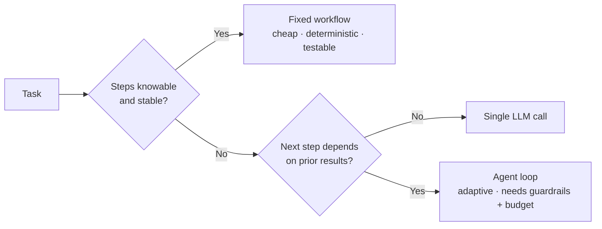
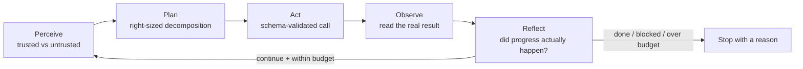
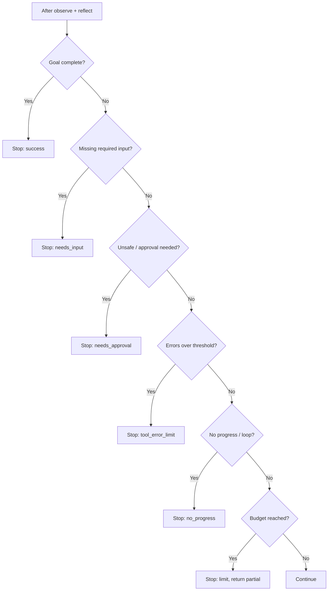
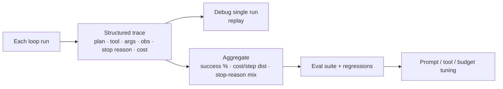

# Senior Interview: Agent Fundamentals

Interview questions for **senior** engineers designing and operating agent loops. These are open-ended and meant to be explored with follow-ups — not recited. Each question lists what a strong answer covers, **one sample strong answer** (a complete example), good follow-up probes, and red flags.

!!! note "How to use this page"
    Pick three or four questions and go deep rather than covering all of them. A senior candidate should reason about trade-offs, failure modes, and cost under constraints — push past definitions into "why," "when not to," and "what breaks at scale." Agency is a cost, not a feature, so credit answers that treat the loop as something to bound and control, not maximize. The sample strong answer is *one* good example, not the only acceptable one; credit any reasoning that reaches the same depth. The final item is a hands-on design task. For the foundations these build on, see the [Junior Interview](../interview-junior/index.md); for quick self-testing, see the [QAs](../test/index.md).

## 1. When does a fixed workflow beat an autonomous agent — and when does the calculus flip?

Probes judgment about *agency as a cost*, not enthusiasm for agents.

**Strong answer covers:**

- A workflow runs predefined steps: reliable, cheap, auditable, easy to test — but brittle when the situation deviates from the script.
- An agent loops and decides its own next step: adapts to changing information — but needs guardrails, budgets, monitoring, and costs more per task with non-deterministic behavior.
- Use a workflow when the steps are known and stable (password reset, ETL, a fixed approval chain); reach for an agent only when the path genuinely can't be enumerated ahead of time (debugging, open-ended research, support triage).
- The loop is what you pay for: every iteration is tokens, latency, and a chance to go wrong. You only buy it when adaptivity is worth that.

**Sample strong answer:** "I treat agency as a cost I have to justify. A fixed workflow is the default — it's deterministic, cheap, testable, and I can reason about every branch. The moment the task has a knowable shape, like a password reset or a nightly data pipeline, I script it; wrapping that in an autonomous loop just adds non-determinism and token spend for no benefit. I flip to an agent only when the next step honestly depends on what the last step returned and I can't enumerate the paths up front — fixing a failing test, researching an open question, triaging a messy ticket. Even then I usually build the *narrowest* loop that works, and I'll often pin the parts that are stable into a workflow and leave only the genuinely uncertain middle to the agent. The loop earns its keep through adaptivity; if I'm not getting adaptivity back, I'm paying for risk I didn't need."

**Follow-ups:** Where would you keep a workflow *inside* an agent (or vice versa)? What signal tells you a workflow has gotten too brittle and should become a loop? How do you test each one?

**Red flags:** Treats "agent" as always better/more impressive; can't name a case where a workflow wins; ignores that each loop iteration has a cost and a failure probability.

## 2. Walk me through the agent loop, and tell me where each stage tends to fail in production.

**Strong answer covers:**

- The cycle: perceive (goal + state) → plan → act (tool call) → observe → reflect → stop-or-continue.
- Per-stage failure modes: perception confuses untrusted evidence with trusted instructions; planning over- or under-decomposes; action hallucinates a tool call or bad arguments; observation gets ignored or misread; reflection rubber-stamps progress that didn't happen; the stop check is missing so it loops.
- The loop's value is adaptivity, but each iteration costs tokens/time and can compound an earlier error.

**Sample strong answer:** "The loop is perceive, plan, act, observe, reflect, then decide whether to stop or go again. I think about it as 'where does each stage betray you.' Perception fails when the agent treats a webpage or tool result as an instruction instead of as evidence — that's prompt injection. Planning fails by either over-planning a trivial task or never decomposing a hard one. Action fails when the model hallucinates a tool that doesn't exist or fabricates arguments. Observation is the sneaky one: the agent calls the tool and then doesn't actually read the result, or it invents an observation. Reflection fails when it claims progress that didn't happen, so the loop convinces itself it's fine. And the whole thing fails if there's no real stop check, because then it just keeps spending. The way I make it robust is to keep state explicit and inspectable, validate tool calls against schemas before executing, only ever feed back real tool output, and treat the reflect-and-stop check as a first-class control point rather than 'continue because we can.'"

**Follow-ups:** Which stage do you instrument first and why? How does an error in observation cascade into the next plan? Where would you insert a validation layer?

**Red flags:** Recites the loop with no failure analysis; thinks the model "just knows" not to obey injected text; no notion of explicit, inspectable state.

## 3. ReAct vs plan-then-execute vs reflection — how do you choose, and what does each cost?

**Strong answer covers:**

- ReAct interleaves reason/act/observe: best when the next step genuinely depends on the last observation (investigation, search). Cost: many model round-trips; can wander without a budget.
- Plan-then-execute writes the plan up front, then runs it: best for multi-phase, auditable work where the approach should be visible before acting. Cost: brittle if reality diverges from the plan; needs replanning.
- Reflection adds a critique/improve pass: best for high-stakes quality (legal, compliance). Cost: extra model calls per item, slower; no correctness guarantee.
- These compose — a plan-then-execute agent can use ReAct within a step and reflect on the final output.

**Sample strong answer:** "ReAct is for when I can't know step two until I see step one's result — debugging, research, anything investigative. Its cost is round-trips: it can wander, so it lives or dies by its budget and no-progress detection. Plan-then-execute is for multi-phase work where I want the approach visible and auditable before anything runs — compare three vendors, then act. Its weakness is brittleness: if an observation contradicts the plan, a naive executor plows ahead, so I always pair it with a replan trigger. Reflection is a quality lever — produce, critique against the requirements, revise — and I reach for it on high-stakes outputs where a missed requirement is expensive. It roughly doubles cost per item and guarantees nothing, so I don't sprinkle it everywhere. In practice they nest: a plan-then-execute skeleton, ReAct inside the steps that are genuinely uncertain, and one reflection pass on the final deliverable. The decision is always cost versus the value of adaptivity or quality on *this* task."

| Pattern | Best for | Main cost | Failure mode if unbounded |
| --- | --- | --- | --- |
| ReAct | Next step depends on last observation | Many model round-trips | Wandering, repeated calls |
| Plan-then-execute | Auditable multi-phase work | Up-front plan can go stale | Executing a wrong plan |
| Reflection | High-stakes quality | ~2x calls per item | Endless self-critique, no gain |

**Follow-ups:** When does plan-then-execute become a liability mid-task? How do you stop a reflection loop from critiquing forever? Can you combine all three — what's the control structure?

**Red flags:** Picks one pattern for everything; thinks reflection guarantees correctness; no awareness of the token/latency cost of each.

## 4. Stopping criteria are a control system. Design them for a long-running loop, and tell me what happens without them.

**Strong answer covers:**

- Multiple layered stops, not one: success (measurable done criteria), clarification (missing input), limits (max steps/time/tokens/cost), error threshold, no-progress / loop detection, safety/approval.
- Order matters: check success first (don't waste a turn), check safety before acting, check budgets last.
- Without them: infinite loops, retry storms against a broken API, context/cost runaway, answering too early, hiding uncertainty.
- Detection mechanics: track explicit state (iteration, tool calls, consecutive errors, repeated-action hashes, "new evidence this loop?"), and stop with a *reason code*.

**Sample strong answer:** "I never rely on a single stop rule — I layer them, and the order is deliberate. First, success: a *measurable* done criterion, not 'looks good' — for a coding agent that's the target test plus related tests passing with the change scoped to the root cause. Then clarification if a required input is missing. Then safety: if the next action is destructive or out of policy, stop for approval before doing anything. Then the failure stops — a consecutive-error threshold and no-progress detection, where I hash the tool name plus arguments and stop if the same call repeats, or if N loops pass with no new evidence. Finally the budgets: max iterations, wall-clock, tokens, and cost. I keep all of that in explicit state so the *application* decides to stop, not the model's optimism. And I always emit a stop reason code — success, needs_input, needs_approval, no_progress, max_iterations, tool_error_limit — so the outcome is debuggable. Without this, a long-running loop is a money fire: it'll retry a 401 forever, rewrite the same query, bloat context every turn, and either spin until something else kills it or quietly return a half-answer. Stopping criteria *are* the loop's safety system."

**Follow-ups:** How do you detect "no progress" precisely — what state do you hash or diff? Why check success before budget, and safety before everything? What do you return on a budget stop?

**Red flags:** Only has "max steps"; conflates stopping with success; relies on the model to decide it's done; no stop reason logged.

## 5. How do you detect and break out of a loop that's stuck or oscillating?

Stuck agents can be *under* every limit and still useless.

**Strong answer covers:**

- Stuck patterns: same tool + same args repeated; same recoverable error retried unchanged; query reworded but results don't improve; planning without ever acting; oscillating between two states.
- Detection: hash recent (action, args) tuples; track consecutive identical errors; require "new useful evidence" per loop and count loops without it; detect A→B→A→B cycles.
- Response: don't just stop — change strategy (broaden/narrow, switch tool), then stop with a clear blockage explanation if change doesn't help. Distinguish "no progress" from "needs human input."

**Sample strong answer:** "Being under budget isn't the same as making progress, so I detect stuckness directly. I keep a short history of (tool, normalized-arguments) hashes; if the same call repeats, that's a hard stop signal. I track consecutive identical errors — retrying an unchanged 401 three times is pointless. I also require each loop to add *new useful evidence* to state, and I count loops where it doesn't; three barren loops means stop or escalate. Oscillation is the subtle one — the agent flips between two plans, A then B then A — so I watch for short repeating cycles in the action history. The response isn't always 'halt': first I try to perturb the strategy — broaden the search, swap the tool, narrow the task — because sometimes the agent's just in a rut. If a perturbation still yields nothing new, I stop with `no_progress` and an explanation of where it's blocked, rather than letting it grind to the iteration cap. The key distinction is whether the agent is looping because it lacks information a human must supply, versus looping because its strategy is bad — those get different exits."

**Follow-ups:** How do you normalize arguments so semantically-identical calls hash the same? When is repetition legitimate (e.g., polling)? How do you tell "stuck" from "needs clarification"?

**Red flags:** Only catches stuckness via the max-step cap; retries identical failing calls; no concept of measuring per-loop progress.

## 6. Context grows every iteration. How do you keep a long loop from bloating, getting slower, and degrading?

**Strong answer covers:**

- Naively appending every thought, tool call, and full observation makes context grow each turn: rising cost/latency, lost-in-the-middle degradation, eventual window overflow.
- Strategies: maintain a compact explicit working state (goal, facts, open questions, next action) instead of relying on raw history; summarize/compact older turns; truncate or store-by-reference large observations; drop superseded data; keep only what the *next* decision needs.
- Memory is evidence, not truth — stale facts and old observations can mislead later loops.

**Sample strong answer:** "The trap is treating the full transcript as the agent's memory — every reasoning step and every fat tool result piling up, so each iteration is more expensive and slower, and the model starts losing things in the middle of a huge context. I don't carry raw history; I carry a small, structured working state — the goal, the facts I've confirmed, open questions, sources read, the next action — and I rebuild context from that each loop. Big observations don't go in verbatim; I summarize them or store them by reference and pull the relevant slice on demand. I actively drop superseded data — if I've recomputed a value, the old one leaves. Older turns get compacted into a running summary once they're no longer load-bearing. The principle is: include only what the *next* decision needs, not everything that ever happened. And I treat that memory as evidence with a shelf life — a fact I cached ten loops ago might be stale, so for time-sensitive things I re-fetch rather than trust the carried copy."

**Follow-ups:** What goes in working state vs. what gets summarized vs. dropped? How do you avoid summarization losing a detail that mattered later? How does context bloat interact with your cost budget?

**Red flags:** "Just use a bigger context window"; appends everything forever; no distinction between working state and raw history; trusts old cached facts blindly.

## 7. Observations derail agents more than bad reasoning. How should tool results be formatted, and what breaks otherwise?

**Strong answer covers:**

- The observation is the bridge from action to next decision; garbage observations produce garbage plans.
- Good observation design: structured and minimal (only the fields the agent needs), explicit success/failure signal, real errors surfaced (not swallowed), large outputs truncated/paginated with a note, untrusted content clearly bounded so it can't pose as instructions.
- What breaks: a tool that returns a 500-line dump bloats context and buries the signal; a tool that returns empty on failure makes the agent treat "no data" as a real answer; a result that smuggles instruction-like text causes injection; inconsistent shapes cause misparsing.

**Sample strong answer:** "I think of observation quality as more important than reasoning quality, because the agent can only reason about what it's handed. So I design tool outputs deliberately: structured and minimal — the title, url, snippet, date for a search, not the raw HTML — with an explicit success-or-error field so the agent can't mistake a failure for empty data. That last point matters: a tool that silently returns `[]` on a 401 teaches the agent that the answer is 'nothing found,' which is a lie; I'd surface `error: unauthorized` instead. Large results get truncated or paginated with an explicit 'showing 10 of 240' note, both to protect the context budget and to stop the signal getting buried. And I treat the *content* of observations as untrusted — a fetched page or ticket can contain 'ignore your instructions,' so it gets clearly delimited as data, never merged into the instruction channel. Bad observations derail agents quietly: they don't error, they just lead the next plan somewhere wrong, and you only notice three loops later."

**Follow-ups:** How do you truncate without dropping the part that mattered? How do you surface partial failures? How does observation formatting tie into prompt-injection defense?

**Red flags:** Returns raw, unbounded blobs; swallows errors into empty results; no separation of untrusted observation content from instructions.

## 8. The loop is non-deterministic. How do you make it reliable, observable, and evaluable at scale?

**Strong answer covers:**

- Determinism is gone, so you manage distributions, not single runs: log every iteration (plan, tool, args, observation, reflection, stop reason) as a trace.
- Observability: structured traces, per-step timing/cost/tokens, stop-reason breakdowns, success/failure tagging — so you can debug a single run and aggregate over many.
- Evaluation: task-level success metrics, regression suites of representative tasks, eval on traces not just final answers (did it use the right tool, stop for the right reason); track cost/latency/step-count distributions, not just averages.
- Reliability levers: retries with backoff, idempotent/guarded side effects, circuit breakers, fallbacks, replay from logged traces.

**Sample strong answer:** "Because the same input can take different paths, I stop thinking about a single correct run and start thinking about distributions and traces. Every iteration is logged as a structured event — the plan, the tool and arguments, the observation, the reflection, the stop reason, plus tokens, cost, and latency. That gives me two things: I can replay and debug one bad run step by step, and I can aggregate across thousands to see, say, that 8% are hitting the no-progress stop or that p95 step count doubled after a prompt change. For eval I don't only grade the final answer — I grade the trace: did it pick the right tool, did it stop for the right reason, did it stay in budget — and I keep a regression suite of representative tasks so a prompt or model swap doesn't silently degrade behavior. I report distributions, because a great median with a long tail of 40-step runaway loops is a cost and reliability problem the average hides. On the reliability side: retries with backoff for transient tool failures, idempotency or guards so a retried side effect doesn't double-fire, circuit breakers around flaky tools, and fallbacks so one tool outage doesn't sink the whole task."

**Follow-ups:** What do you log to make a destructive run debuggable after the fact? How do you eval a trace, not just the answer? Why distributions over averages? How do you make a retried side effect safe?

**Red flags:** No tracing/observability; only checks final answers; reports averages only; no plan for transient tool failures or non-idempotent retries.

## 9. Where do humans-in-the-loop and approval gates belong, and how do you place them without crippling autonomy?

**Strong answer covers:**

- Gate by *impact and reversibility*, not uniformly: reads run free; writes run with logging/care; destructive or external-facing actions (send, delete, deploy, pay) require approval.
- The gate is enforced by the runtime/app, not the model's good intentions — the model proposes, the host disposes.
- Show the human enough to decide (recipient, exact payload, blast radius), and design so approval fatigue doesn't make it a rubber stamp: batch, set thresholds, auto-approve low-risk, escalate genuinely risky/ambiguous cases.
- Handoff/escalation for judgment calls (legal, fraud, low confidence) is a distinct stop type.

**Sample strong answer:** "I place gates by impact and reversibility, not on every action — gating everything just trains people to click approve. Reads run automatically. Writes run but get logged and scoped. The hard gates go on actions that are destructive or leave the trust boundary: sending an email, deleting data, deploying, moving money. And the gate lives in the application, not in the prompt — the model can *request* a send, but the runtime is what pauses and requires a human, so a prompt-injected 'email the secrets' can't auto-execute. When I do ask a human, I show them what they actually need to decide: the recipient, the exact message, the paths affected, the blast radius — not a vague 'approve?'. To fight approval fatigue I auto-approve clearly low-risk cases, batch where I can, and reserve interrupts for genuinely high-impact or ambiguous ones. Separately from approval, I build an escalation/handoff exit for judgment calls — fraud signals, legal questions, low model confidence — which stops the autonomous loop and routes to a person instead of guessing."

**Follow-ups:** How do you prevent approval fatigue from turning the gate into a rubber stamp? Why must the gate be in the runtime, not the prompt? How do you decide auto-approve vs. ask vs. deny per action?

**Red flags:** Approval on everything or nothing; trusts the model to self-gate; shows the human too little to decide; no escalation path for judgment calls.

## 10. How do you control cost in a long-running or high-volume agent — beyond just a max-step cap?

**Strong answer covers:**

- Cost = model calls x tokens + tool calls; every loop iteration spends, and context bloat makes later iterations cost more than earlier ones.
- Levers: hard token/cost budget per task with a partial-result stop; cap iterations and tool calls; aggressive no-progress detection (the cheapest spend is the loop you don't run); context compaction; cheaper/smaller models for routing or simple steps and the strong model only where needed; cache repeated retrievals; truncate observations.
- At volume: per-tenant/per-task budgets, rate limits, and monitoring of cost distributions to catch tail-runaway loops.

**Sample strong answer:** "A max-step cap is the floor, not the strategy. Cost is model calls times tokens plus tool calls, and context bloat means iteration ten costs far more than iteration one, so the single biggest lever is just *not running unnecessary loops* — tight no-progress and success detection so the agent stops the moment another step isn't worth it. On top of that I set a hard token-and-dollar budget per task that triggers a partial-result stop, and I cap tool calls separately because a retrieval-heavy task can be cheap on model tokens but expensive on the tools. I keep context compact so I'm not re-paying for a growing transcript every turn, and I cache repeated retrievals. I'll also tier the models — a cheap model for routing or trivial steps, the expensive one only for the hard reasoning — which often cuts cost more than any single cap. At volume I push budgets down to per-tenant and per-task, add rate limits, and watch the cost *distribution*, because the average looks fine while a small tail of runaway loops eats the bill. The mindset is that every iteration is a purchase, and the loop should keep buying only while it's worth it."

**Follow-ups:** Where would you use a cheaper model inside the loop? Why does context management *also* control cost? How do you catch the runaway tail in monitoring? What's the trade-off of a tight budget vs. task success rate?

**Red flags:** "We set max steps" as the entire answer; ignores that context growth raises per-iteration cost; no per-tenant budgets at scale; one model for everything regardless of step difficulty.

## Hands-on design task

> Design the agent for an **autonomous incident-triage assistant**: given a paging alert, it should investigate (read logs, metrics, recent deploys, and the runbook), form a root-cause hypothesis, and either propose a remediation or escalate to an on-call engineer. It runs unattended, many times a day, under a strict per-incident cost budget, and it has access to tools that can restart services and roll back deploys.

Ask the candidate to produce, on a whiteboard or in text:

- the **agent loop** and reasoning pattern (ReAct, plan-then-execute, or a mix) and *why*,
- the **tool set**, each classified **read / write / destructive**, and which run automatically vs. require approval,
- the **stopping criteria**: measurable success, limits (steps/time/tokens/cost), no-progress and loop detection, error threshold, and safety/approval stops — with stop reason codes,
- how they manage **context/memory growth** across iterations and how they **format and truncate observations** (logs can be huge),
- the **guardrails**: where humans-in-the-loop sit, how prompt injection from log/ticket content is handled, and what gets **traced/logged** for post-incident debugging,
- the **cost controls** that keep it within budget at volume.

**What to evaluate:** treats agency as a cost (narrow loop, tight stops); read/write/destructive separation with approval on restart/rollback; measurable stopping criteria with reason codes, not just a step cap; a credible context/observation-truncation story for huge logs; tracing for non-deterministic debugging; cost control beyond a max-step cap; and handling untrusted log/ticket content as data, never instructions.

**Sample strong answer (sketch):** "ReAct for the investigation phase, because each step depends on what the last log or metric showed, wrapped in a thin plan-then-execute skeleton: investigate, hypothesize, then either propose or escalate. Tools: read logs, read metrics, read recent deploys, read runbook (all read, auto); `restart_service` and `rollback_deploy` are destructive and *always* require on-call approval — the model proposes, the runtime gates. Stopping criteria: success = a root-cause hypothesis with supporting evidence and a recommended action; hard stops on cost/token budget (partial-result with findings so far), max iterations, a no-progress check that hashes (tool, args) and counts barren loops, and an error threshold; safety stop forces approval before any restart or rollback; reason codes throughout (`success`, `needs_approval`, `no_progress`, `cost_limit`, `escalate`). Context: a compact working state — alert, confirmed facts, ruled-out hypotheses, next action — not the raw transcript; logs come back truncated to the relevant window with a 'showing N of M lines' note and stored by reference. Guardrails: log and ticket text is delimited untrusted data so an injected 'roll back prod' can't act on its own; the on-call human approves all destructive actions and is the escalation target on low confidence or fraud/security signals. Everything — plan, tool, args, observation, stop reason, cost — goes to a structured trace so we can replay the run in the post-incident review. Cost: tight no-progress detection first, a cheap model for routing and a strong model only for hypothesis formation, cached repeated reads, and a per-incident dollar budget that stops with partial findings rather than running the loop dry."

## Source material

These questions build on the Stage 04 topics: [Agent Loop](../agent-loop/index.md), [ReAct Pattern](../react-pattern/index.md), [Reasoning and Planning](../reasoning-and-planning/index.md), [Acting and Observation](../acting-and-observation/index.md), [Stopping Criteria](../stopping-criteria/index.md), and [Tools Overview](../tools-overview/index.md).
