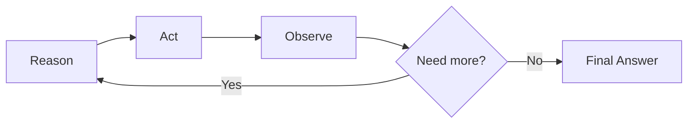

# ReAct Pattern

<div class="topic-page topic-page--react-pattern" markdown="1">

<section class="topic-hero topic-hero--prompt">
  <span class="topic-hero__eyebrow">Stage 04 · Agent Fundamentals</span>
  <p class="topic-hero__lead">ReAct is the pattern of alternating reasoning with action. The agent decides what to do next, takes an action, observes the result, and repeats until it can give a grounded answer.</p>
  <div class="topic-hero__facts">
    <span>Reason</span>
    <span>Act</span>
    <span>Observe</span>
    <span>Repeat</span>
    <span>Answer</span>
  </div>
</section>

## Goal

By the end of this topic, you should be able to:

- Define the ReAct pattern clearly.
- Explain each step in the ReAct loop.
- Read a ReAct trace without confusion.
- Decide whether a task needs ReAct.
- Understand how this topic differs from tools, planning, acting/observation, and stopping criteria.

## Learning Path

This page focuses only on the ReAct pattern itself.

<div class="learning-grid learning-grid--path">
  <a class="learning-card" href="#part-1-the-core-idea">
    <strong>Part 1 · Core Idea</strong>
    <span>Understand what ReAct means and why it exists.</span>
  </a>
  <a class="learning-card" href="#part-2-the-react-loop">
    <strong>Part 2 · The Loop</strong>
    <span>Learn Reason, Act, Observe, Repeat, and Final Answer.</span>
  </a>
  <a class="learning-card" href="#part-3-reading-a-react-trace">
    <strong>Part 3 · Trace Reading</strong>
    <span>Read a simple ReAct trace step by step.</span>
  </a>
  <a class="learning-card" href="#part-4-when-to-use-react">
    <strong>Part 4 · Fit</strong>
    <span>Decide when ReAct is useful and when it is unnecessary.</span>
  </a>
</div>

## Part 1: The Core Idea

**ReAct** means **Reason + Act**.

The pattern was introduced in [ReAct: Synergizing Reasoning and Acting in Language Models](https://arxiv.org/abs/2210.03629). The idea is simple:

```text
Reason about the next useful step.
Act to get information or take a step.
Observe the result.
Use the observation to decide what to do next.
```

ReAct is useful because a model often needs information it does not already have. Instead of guessing, the agent can act, observe, and update its answer.

### One-Sentence Definition

```text
ReAct is an agent loop where reasoning chooses the next action, and the observation from that action guides the next reasoning step.
```

### Why ReAct Exists

Without ReAct, an agent may answer from memory even when it should check evidence.

With ReAct, the agent can:

- notice that it needs more information
- choose an action
- read the result
- continue only if more information is needed
- answer with evidence from the process

## Part 2: The ReAct Loop

The ReAct loop has five logical steps.



| Step | What It Means | Simple Example |
| --- | --- | --- |
| Reason | Decide what is needed next | `I need the error log.` |
| Act | Take a step to get information or affect the environment | `read_build_log("latest")` |
| Observe | Read the result of the action | `No module named yaml` |
| Repeat | Use the observation to decide whether another step is needed | `I should check dependencies.` |
| Final Answer | Answer when there is enough information | `PyYAML is missing from requirements.txt.` |

The most important part is the connection between **Observation** and the next **Reason** step. The observation should change or confirm what the agent does next.

### What Each Step Should Do

| Step | Good Behavior | Weak Behavior |
| --- | --- | --- |
| Reason | Names the next needed fact or action | Vague thinking with no next step |
| Act | Uses one relevant action | Calls tools randomly |
| Observe | Reads the actual result | Ignores the result |
| Repeat | Changes direction based on evidence | Repeats the same action |
| Final Answer | Gives an answer supported by observations | Gives a guess without evidence |

## Part 3: Reading a ReAct Trace

A ReAct trace is a record of the loop. It helps you see whether the agent is acting logically.

### Simple Trace

```text
Goal:
Find why the latest build failed.

Reason:
I need the latest failed build log.

Act:
read_build_log({"build_id": "latest"})

Observation:
"ModuleNotFoundError: No module named 'yaml'"

Reason:
The build failed while importing yaml. I need to check whether the dependency is listed.

Act:
read_file({"path": "requirements.txt"})

Observation:
"mkdocs==1.6.1"

Final Answer:
The build failed because the code imports yaml, but PyYAML is not listed in requirements.txt.
Add PyYAML to requirements.txt and rerun the build.
```

### Why This Trace Is ReAct

| Trace Part | Why It Matters |
| --- | --- |
| First reason | The agent identifies what evidence it needs first. |
| First action | The agent gets the build log instead of guessing. |
| First observation | The error message gives a concrete clue. |
| Second reason | The next step changes because of the observed error. |
| Second action | The agent checks the dependency file. |
| Final answer | The answer is based on observed evidence. |

### What a Bad ReAct Trace Looks Like

```text
Goal:
Find why the latest build failed.

Reason:
Maybe it is a dependency issue.

Final Answer:
Install dependencies and try again.
```

This is weak because the agent skipped action and observation. It guessed instead of using evidence.

## Part 4: When to Use ReAct

Use ReAct when the task needs step-by-step interaction and the next step depends on the previous result.

| Task | Use ReAct? | Why |
| --- | --- | --- |
| Explain what JSON is | No | No external step is needed. |
| Rewrite a short paragraph | No | The model can transform the given text directly. |
| Find why a deployment failed | Yes | The agent must inspect logs or state. |
| Search docs and answer from the best page | Yes | The agent must search, observe results, then answer. |
| Inspect a repository before explaining an error | Yes | The answer depends on file contents. |

Good ReAct tasks usually have these signs:

- The model should not guess.
- External evidence matters.
- One result determines the next step.
- The task is investigative.
- The answer should be grounded in observations.

## Common Misunderstandings

| Misunderstanding | Correction | Simple Example |
| --- | --- | --- |
| ReAct means the agent should always use tools | No. Use ReAct only when action or external evidence is useful. | If the user asks `Explain what JSON is`, the agent can answer directly. It does not need to call a search tool. |
| ReAct is the same as planning | No. Planning organizes steps; ReAct alternates action and observation. | A plan may say `check logs, inspect config, suggest fix`. ReAct actually checks the log, reads the result, then decides the next action. |
| ReAct means showing every private reasoning token | No. For learning, traces are useful. In products, expose concise summaries and evidence instead. | A support agent should show `I checked the account status and found the subscription is active`, not every internal reasoning detail. |
| ReAct guarantees correct answers | No. It improves grounding, but tools, observations, and final answers can still be wrong. | If a log reader returns an old log file, the agent may still reach the wrong conclusion. |
| ReAct should be used for every agent | No. Some agents are better as fixed workflows or direct prompts. | A password reset flow may be safer as fixed steps: verify identity, send reset link, confirm result. |

## Practice

### Exercise 1: Label the Trace

Label each line as `Reason`, `Act`, `Observation`, or `Final Answer`.

```text
I need to know which deployment failed.
get_latest_deployment()
{"deployment_id": "dep_19", "status": "failed"}
I need the error log for dep_19.
read_deployment_log({"deployment_id": "dep_19"})
"Error: DATABASE_URL is missing"
The deployment failed because DATABASE_URL is missing.
```

### Exercise 2: Choose ReAct or Not

For each task, decide whether ReAct is needed.

| Task | ReAct Needed? | Reason |
| --- | --- | --- |
| Explain what a REST API is |  |  |
| Find why a deployment failed |  |  |
| Rewrite an email in a friendly tone |  |  |
| Search docs and answer from the most relevant page |  |  |
| Inspect a repository before explaining an error |  |  |

### Exercise 3: Complete the Missing Step

Fill in the missing ReAct step.

```text
Goal:
Answer a question using internal notes.

Reason:
I need to find relevant notes first.

Act:
search_notes({"query": "refund policy"})

Observation:
["note_12", "note_19"]

Reason:
{write the next reasoning step}
```

## Exit Criteria

You understand this topic when you can:

- Define ReAct as Reason + Act.
- Explain why observation changes the next reasoning step.
- Draw the Reason, Act, Observe, Repeat, Final Answer loop.
- Identify each step in a simple ReAct trace.
- Decide whether a task needs ReAct.
- Explain what belongs in related topics instead of this one.

## Further Reading

- [ReAct: Synergizing Reasoning and Acting in Language Models](https://arxiv.org/abs/2210.03629)
- [ReAct Project Site](https://react-lm.github.io/)
- [Google Research: ReAct](https://research.google/blog/react-synergizing-reasoning-and-acting-in-language-models/)
- [Prompt Engineering Guide: ReAct Prompting](https://www.promptingguide.ai/techniques/react)

</div>
