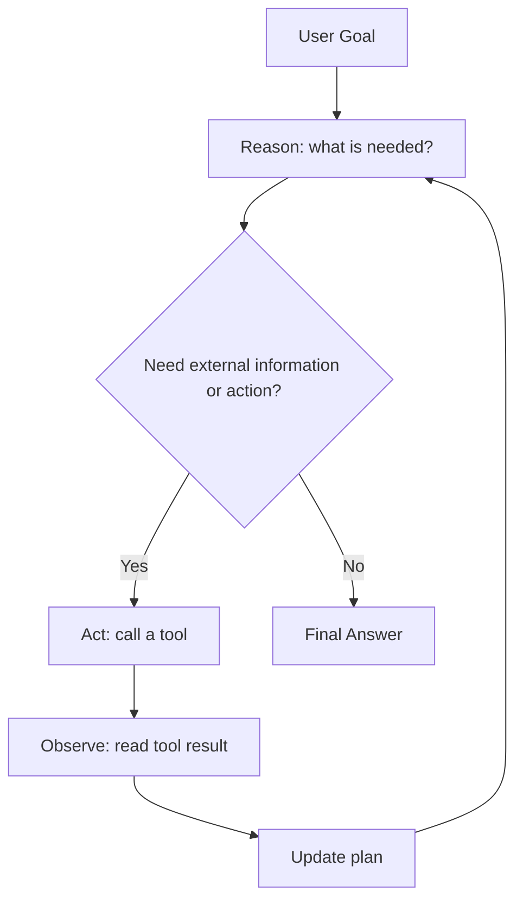
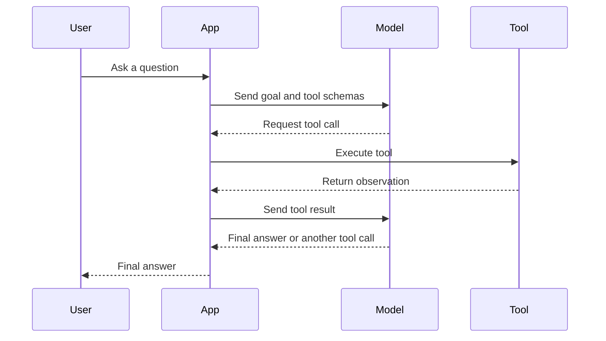

# ReAct Pattern

<div class="topic-page topic-page--react-pattern" markdown="1">

<section class="topic-hero topic-hero--prompt">
  <span class="topic-hero__eyebrow">Stage 04 · Agent Fundamentals</span>
  <p class="topic-hero__lead">ReAct is an agent pattern that combines reasoning and acting. The agent decides what it needs, calls a tool, reads the observation, updates its plan, and repeats until it can give a final answer.</p>
  <div class="topic-hero__facts">
    <span>Reason</span>
    <span>Act</span>
    <span>Observe</span>
    <span>Update</span>
    <span>Finish</span>
  </div>
</section>

## Learning Path

Read this topic in five parts. Each part answers one practical question about ReAct.

<div class="learning-grid learning-grid--path">
  <a class="learning-card" href="#part-1-understand-the-react-idea">
    <strong>Part 1 · Understand ReAct</strong>
    <span>Learn what ReAct means and when this pattern is useful.</span>
  </a>
  <a class="learning-card" href="#part-2-read-the-react-loop">
    <strong>Part 2 · Read the Loop</strong>
    <span>Understand reason, act, observe, update, and finish.</span>
  </a>
  <a class="learning-card" href="#part-3-use-tools-and-observations">
    <strong>Part 3 · Use Tools</strong>
    <span>See how modern tool calling maps to the ReAct pattern.</span>
  </a>
  <a class="learning-card" href="#part-4-control-the-agent">
    <strong>Part 4 · Control the Agent</strong>
    <span>Add prompts, stop conditions, safety rules, and failure handling.</span>
  </a>
  <a class="learning-card" href="#part-5-build-and-practice">
    <strong>Part 5 · Build and Practice</strong>
    <span>Implement a small ReAct loop and prove you understand it.</span>
  </a>
</div>

## Part 1: Understand the ReAct Idea

This part explains the core concept before showing the loop.

### What Is ReAct?

**ReAct** means **Reason + Act**.

The pattern was introduced in the paper [ReAct: Synergizing Reasoning and Acting in Language Models](https://arxiv.org/abs/2210.03629). The core idea is that an agent should not only reason internally and should not only call tools. It should do both in a connected loop.

A ReAct agent:

1. Thinks about what information or action is needed.
2. Uses a tool or takes an action.
3. Reads the tool result.
4. Updates the next step based on that result.
5. Stops when it has enough evidence to answer.

This matters because many useful agent tasks cannot be solved from the model's memory alone. The agent may need to search, read files, query a database, inspect logs, call an API, or check a live system.

### When ReAct Is Useful

Use ReAct when the next step depends on the result of the previous step.

| Task | Simple Prompt Is Enough? | ReAct Is Better? |
| --- | --- | --- |
| Explain what JSON is | Yes | No |
| Rewrite an email | Yes | No |
| Find the cause of a failed CI build | No | Yes |
| Search documentation, then summarize | Sometimes | Yes |
| Answer from a live database | No | Yes |
| Compare a user request with current account data | No | Yes |

ReAct adds complexity. Do not use it when a direct answer or fixed workflow is enough.

### ReAct vs Other Agent Patterns

| Pattern | Main Idea | Best For |
| --- | --- | --- |
| Fixed workflow | Steps are predefined by code | Predictable business processes |
| Planning | Agent creates a plan before acting | Multi-step tasks with clear subgoals |
| ReAct | Agent alternates decision, tool use, and observation | Tasks where each result changes the next step |
| ReAct + planning | Agent creates a rough plan, then updates it after observations | Research, debugging, investigation |

## Part 2: Read the ReAct Loop

This part explains the actual loop and shows how to read a ReAct trace.

### The Main Loop



The key point is feedback. The agent does not call tools blindly. It uses each observation to decide the next action.

### ReAct Vocabulary

| Term | Meaning | Example |
| --- | --- | --- |
| Goal | The user request or task objective | `Find why the build failed.` |
| Reason | The agent's decision about the next useful step | `I need the latest CI error log.` |
| Action | A tool call or environment step | `read_ci_log(build_id)` |
| Observation | The result returned by the tool or environment | `Test failed: missing env var API_KEY.` |
| State | What the agent knows so far | Goal, previous tool results, current assumptions |
| Stop condition | The rule for ending the loop | Cause found and fix is clear |
| Final answer | The response given to the user | Cause, evidence, fix, and test |

### Standard ReAct Trace

Many tutorials show ReAct with this structure:

```text
Thought: I need to know the current weather.
Action: get_weather({"city": "Seoul"})
Observation: {"temperature": "18C", "condition": "rain"}
Thought: I have the weather. Now I can answer.
Final Answer: It is 18C and raining in Seoul.
```

For learning, this trace is useful because it shows the loop clearly.

For production, do not expose private chain-of-thought to users. Log safer information instead:

- selected tool
- tool input
- tool output
- short decision summary
- final answer

### Real Example: Investigating a Failed Build

User goal:

```text
Find why the latest build failed and tell me the fix.
```

Available tools:

```text
get_latest_build()
read_build_log(build_id)
search_repo(query)
read_file(path)
```

ReAct-style trace:

```text
Reason: I need the latest build id before reading logs.
Action: get_latest_build()
Observation: {"build_id": "8421", "status": "failed"}

Reason: I need the failure message from the build log.
Action: read_build_log({"build_id": "8421"})
Observation: "ModuleNotFoundError: No module named 'yaml' in scripts/deploy.py"

Reason: I need to inspect dependency files.
Action: search_repo({"query": "pyyaml yaml deploy.py requirements"})
Observation: ["scripts/deploy.py", "requirements.txt"]

Reason: I need to check whether PyYAML is listed.
Action: read_file({"path": "requirements.txt"})
Observation: "mkdocs==1.6.1\nmkdocs-material==9.5.49"

Final Answer:
The build failed because scripts/deploy.py imports yaml, but PyYAML is not listed in requirements.txt.
Fix: add PyYAML to requirements.txt and rerun the build.
Test: run the CI build or execute the deploy script in a clean environment.
```

Why this works:

- The agent does not guess the cause.
- Each tool call has a reason.
- Each observation changes the next step.
- The final answer includes evidence and a test.

## Part 3: Use Tools and Observations

This part explains how ReAct connects to real tool-calling systems.

### Modern Tool-Calling View

In modern APIs, the model often does not output plain text like `Action: search(...)`. Instead, it returns a structured tool call. Your application executes the tool and sends the result back to the model.



The model chooses the tool. The application executes the tool. This separation matters for security and reliability.

### Designing Tools for ReAct

Tools should be small, clear, and safe.

| Tool Design Rule | Why It Matters | Example |
| --- | --- | --- |
| Use clear names | Helps the model choose correctly | `read_build_log`, not `get_data` |
| Give narrow responsibilities | Prevents vague tool use | One tool reads logs, another reads files |
| Use structured inputs | Makes validation easier | `{ "build_id": "8421" }` |
| Return concise observations | Reduces noise | Return key error lines, not full 10 MB logs |
| Validate arguments | Prevents unsafe execution | Reject unknown paths or invalid ids |
| Handle errors clearly | Helps the agent recover | `Build id not found` |

Bad tool:

```text
do_anything(input)
```

Better tools:

```text
read_build_log(build_id)
search_repository(query)
read_file(path)
```

## Part 4: Control the Agent

This part explains the guardrails that make a ReAct loop usable.

### ReAct Agent Skeleton

This is the basic control loop.

```text
state = {
  goal,
  messages,
  observations,
  step_count
}

while step_count < max_steps:
    decision = model.decide_next_step(state, tools)

    if decision.type == "final_answer":
        return decision.answer

    if decision.type == "tool_call":
        validate_tool_call(decision.tool_name, decision.arguments)
        observation = run_tool(decision.tool_name, decision.arguments)
        state.observations.append(observation)
        step_count += 1

return "Stopped because max_steps was reached."
```

Every ReAct implementation needs:

- a goal
- a list of tools
- a model decision step
- tool execution
- observation storage
- stop conditions
- error handling

### Prompt Template for a ReAct Agent

Use this as a starting point.

```text
You are a ReAct-style agent.

Goal:
{user_goal}

Available tools:
- {tool_name}: {what it does, when to use it, required input}

Rules:
- Use tools only when external information or action is needed.
- Do not guess tool results.
- After each observation, decide the next best step.
- If a tool fails, explain the failure and choose a safe next step.
- Stop when the goal is complete or when more progress is not possible.
- Do not expose hidden reasoning. Provide concise decision summaries when useful.

Final answer format:
1. Answer
2. Evidence
3. Next step or test
```

### Stop Conditions

ReAct agents need explicit stopping rules. Without them, they can loop, repeat tool calls, or keep searching after they already have enough information.

Good stop conditions:

- The requested answer is complete.
- The required evidence has been found.
- The agent has enough information to recommend a fix.
- A tool returned a clear error and no safe fallback exists.
- The agent reached `max_steps`.
- The user must make a decision before continuing.

Example:

```text
Stop when:
- the failure cause is identified,
- there is evidence from logs or files,
- a concrete fix is available,
- and one verification command is suggested.
```

### Common Failure Modes

| Failure Mode | What Happens | Prevention |
| --- | --- | --- |
| Tool overuse | Agent calls tools when it already knows enough | Require a reason before tool use |
| Tool underuse | Agent guesses instead of checking | Tell agent not to guess external facts |
| Looping | Agent repeats the same action | Add `max_steps` and repeated-action detection |
| Noisy observations | Tool returns too much data | Summarize or filter tool output |
| Bad tool choice | Agent uses the wrong tool | Improve tool names and descriptions |
| Unsafe action | Agent changes state without approval | Add permissions and confirmation gates |
| Weak final answer | Agent gives output without evidence | Require evidence in final format |

### When Not to Use ReAct

Do not use ReAct when:

- the task can be answered directly
- no external information is needed
- a fixed workflow is safer
- tool calls are expensive and unnecessary
- the action has high risk and needs human approval
- the agent cannot verify whether it succeeded

Example:

```text
Explain what JSON is.
```

This does not need ReAct. A normal prompt is enough.

## Part 5: Build and Practice

This part turns the concept into a small implementation exercise.

### Build: Small ReAct Agent

Build a tiny ReAct-style loop with two safe tools:

```text
search_notes(query)
read_note(note_id)
```

Task:

```text
Answer a question using only local notes.
```

Required behavior:

- If the agent needs information, it calls `search_notes`.
- If a note looks relevant, it calls `read_note`.
- If the notes do not contain the answer, it says so.
- It stops after 5 tool calls.
- The final answer includes the note id used as evidence.

### Exercise 1: Identify the Loop

For this trace, label each line as `Reason`, `Action`, `Observation`, or `Final Answer`.

```text
I need to know which deployment failed.
get_latest_deployment()
{"deployment_id": "dep_19", "status": "failed"}
I need the error log for dep_19.
read_deployment_log({"deployment_id": "dep_19"})
"Error: DATABASE_URL is missing"
The deployment failed because DATABASE_URL is missing.
```

### Exercise 2: Write Tool Descriptions

Write descriptions for these tools so a model can choose them correctly:

```text
search_docs(query)
read_doc(path)
create_ticket(title, body)
```

Each description should include:

- what the tool does
- when to use it
- required input
- what it returns

### Exercise 3: Add Stop Conditions

Write stop conditions for an agent that investigates production errors.

Include:

- success condition
- failure condition
- max step limit
- when to ask a human

## Exit Criteria

You understand this topic when you can:

- Define ReAct as reasoning plus acting.
- Draw the reason, act, observe, update, finish loop.
- Explain why observations matter.
- Read a ReAct trace and identify each part.
- Explain how modern tool calling maps to ReAct.
- Design small, clear tools for a ReAct agent.
- Add stop conditions and max-step protection.
- Identify when ReAct is unnecessary.

## Further Reading

- [ReAct: Synergizing Reasoning and Acting in Language Models](https://arxiv.org/abs/2210.03629)
- [ReAct Project Site](https://react-lm.github.io/)
- [Google Research: ReAct](https://research.google/blog/react-synergizing-reasoning-and-acting-in-language-models/)
- [Prompt Engineering Guide: ReAct Prompting](https://www.promptingguide.ai/techniques/react)
- [OpenAI Docs: Function Calling](https://platform.openai.com/docs/guides/function-calling?api-mode=chat)
- [OpenAI Cookbook: Handling Function Calls with Reasoning Models](https://cookbook.openai.com/examples/reasoning_function_calls/)
- [AWS Prescriptive Guidance: Tool-Based Agents for Calling Functions](https://docs.aws.amazon.com/prescriptive-guidance/latest/agentic-ai-patterns/tool-based-agents-for-calling-functions.html)

</div>
