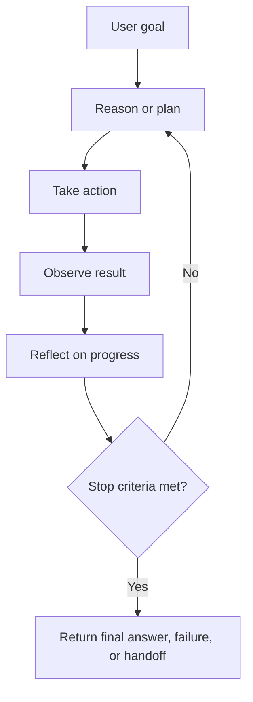
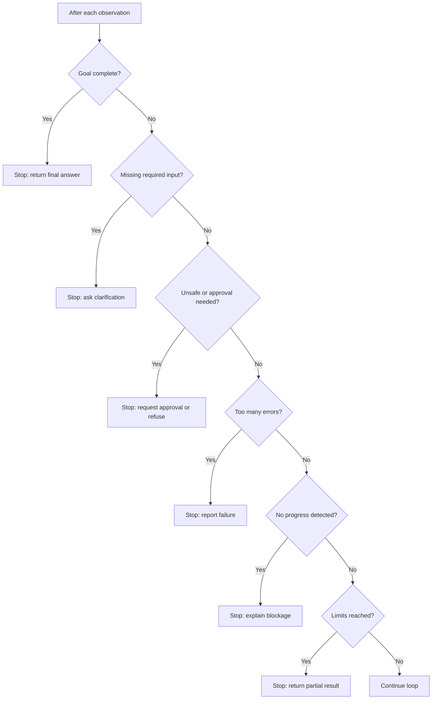

# Stopping Criteria

<div class="topic-page" markdown="1">

<section class="topic-hero">
  <span class="topic-hero__eyebrow">Stage 04 - Agent Fundamentals</span>
  <p class="topic-hero__lead">Stopping criteria are the rules that tell an AI agent when to finish, ask for help, fail safely, or stop spending more time and money. Without clear stop rules, an agent can loop forever, repeat tool calls, waste tokens, take unsafe actions, or return before the task is actually complete.</p>
  <div class="topic-hero__facts">
    <span>Goal complete</span>
    <span>Loop limits</span>
    <span>Budget control</span>
    <span>Error limits</span>
    <span>Safe handoff</span>
  </div>
</section>

## Goal

Understand how stopping criteria control an AI agent loop, prevent endless work, and make agent behavior safer, cheaper, faster, and easier to debug.

After this lesson, you should be able to explain:

- what stopping criteria are,
- why every agent loop needs stop rules,
- how success, failure, limit, and safety stops differ,
- how to define measurable completion criteria,
- how to combine multiple stop rules,
- how to detect loops and no-progress behavior,
- how to design stop behavior for research, coding, support, and tool-using agents.

## Learning Path

This topic is designed in four parts. Read them in order.

<div class="learning-grid learning-grid--path">
  <a class="learning-card" href="#part-1-understand-why-agents-must-stop">
    <strong>Part 1 - Understand Why Agents Must Stop</strong>
    <span>Learn where stopping criteria fit inside the agent loop.</span>
  </a>
  <a class="learning-card" href="#part-2-compare-the-main-stop-types">
    <strong>Part 2 - Compare The Main Stop Types</strong>
    <span>Separate success stops, limit stops, failure stops, safety stops, and human handoffs.</span>
  </a>
  <a class="learning-card" href="#part-3-design-measurable-completion-rules">
    <strong>Part 3 - Design Measurable Completion Rules</strong>
    <span>Turn vague goals into checkable done criteria, budgets, and thresholds.</span>
  </a>
  <a class="learning-card" href="#part-4-debug-stuck-or-overactive-agents">
    <strong>Part 4 - Debug Stuck Or Overactive Agents</strong>
    <span>Detect repeated actions, weak observations, tool failures, and unsafe continuation.</span>
  </a>
</div>

## Part 1: Understand Why Agents Must Stop

An AI agent usually works in a loop. It receives a goal, reasons about the next step, takes an action, observes the result, and decides whether to continue.

Stopping criteria are the rules used at that decision point.

Simple definition:

```text
Stopping criteria tell an agent:
"The work is complete, blocked, unsafe, too expensive, or no longer useful.
Stop the loop and return an appropriate result."
```

### The Basic Agent Loop



**How to read this diagram:** stopping criteria are checked after the agent observes and reflects. The agent should not continue only because it can. It should continue only if another step is useful, allowed, and within limits.

### Why This Matters

Without stopping criteria, an agent may:

- repeat the same search,
- call tools forever,
- keep rewriting a plan without improving it,
- spend too many tokens,
- exceed latency budgets,
- retry a broken API endlessly,
- take unsafe actions to make progress,
- answer too early before the goal is satisfied,
- hide uncertainty instead of asking the user.

With stopping criteria, an agent has controlled behavior.

| Without Clear Stop Rules | With Clear Stop Rules |
| --- | --- |
| Infinite or long loops | Bounded execution |
| Uncontrolled cost | Token, time, and tool budgets |
| Repeated actions | No-progress detection |
| Premature answers | Explicit success checks |
| Unsafe persistence | Safety and approval stops |
| Hard debugging | Inspectable stop reason |

### Stopping Is Not Always Success

Many beginners think "stop" means "task completed." That is only one stop reason.

An agent can stop because:

- the goal is complete,
- the task is impossible with available information,
- a required tool failed,
- the user must provide missing input,
- a human must approve a risky action,
- the agent reached a time, token, cost, or iteration limit,
- the request is unsafe or outside policy,
- the agent is no longer making progress.

Good agents stop with a useful explanation, not just silence.

Example:

```text
Success stop:
  "I found the answer: Paris is the capital of France."

Clarification stop:
  "I need the order ID before I can check shipping status."

Failure stop:
  "I tried the database twice, but it returned authorization errors."

Safety stop:
  "I cannot delete production data without explicit approval."

Budget stop:
  "I reached the research budget after reviewing 8 sources. Here is the best summary so far."
```

## Part 2: Compare The Main Stop Types

Production agents usually combine several stopping criteria. One rule is rarely enough.

### Stopping Criteria Categories

| Stop Type | Meaning | Example | Typical Result |
| --- | --- | --- | --- |
| Success stop | Goal is complete | Tests pass, answer found, report drafted | Return final answer |
| Clarification stop | Missing required input | Need location, order ID, date range | Ask user a question |
| Limit stop | Time, iterations, tokens, or cost exhausted | 10 steps reached, 5 minutes elapsed | Return partial result or failure |
| Error stop | Too many failures happened | 3 tool errors, repeated invalid arguments | Explain failure and next step |
| No-progress stop | Agent is looping or not improving | Same search repeated, same error repeated | Stop and summarize blockage |
| Safety stop | Next action is risky or forbidden | Delete files, send money, deploy prod | Ask approval or refuse |
| Confidence stop | Quality threshold reached | Classification confidence high enough | Return result with confidence |
| Human handoff stop | Human judgment is required | Legal, medical, security, policy decision | Escalate or request review |

### Success Stops

A success stop means the agent has met the user's goal.

Weak success rule:

```text
Stop when the answer seems good.
```

Better success rule:

```text
Stop when the answer includes:
  - the requested final value,
  - the evidence source,
  - any assumptions,
  - no unresolved required fields.
```

Example for a web-search agent:

```text
Task:
  Find the capital of France.

Stop when:
  The answer has one clear capital city and a reliable source confirms it.

Final answer:
  Paris.
```

Example for a coding agent:

```text
Task:
  Fix the failing unit test.

Stop when:
  The target test passes,
  related tests pass,
  and the code change is limited to the root cause.
```

### Limit Stops

Limit stops prevent runaway execution.

| Limit | What It Controls | Example |
| --- | --- | --- |
| Max iterations | Number of loop cycles | Stop after 8 agent steps |
| Max tool calls | Number of external calls | Stop after 5 search calls |
| Max runtime | Wall-clock time | Stop after 3 minutes |
| Max tokens | LLM context and output usage | Stop after 40,000 total tokens |
| Max cost | Money spent | Stop after `$0.50` |
| Max retrieved items | Context size | Stop after reading 10 documents |
| Max retries | Repeated failures | Retry a failed API call twice |

Limit stops should not be the only completion rule. They prevent damage, but they do not prove success.

### Error And No-Progress Stops

Agents can get stuck even when they are under their limits.

Common stuck patterns:

- same tool call repeated with same arguments,
- same failed API call retried without change,
- search query rewritten but results do not improve,
- model keeps planning but never acts,
- tool result says "not found" but agent keeps asking the same tool,
- validation error repeats after multiple repair attempts.

No-progress stop example:

```text
Stop if:
  The agent repeats the same tool call with the same arguments 2 times,
  or receives the same recoverable error 3 times,
  or completes 3 loops without adding new useful evidence.
```

### Safety And Approval Stops

Some actions should stop the autonomous loop and ask for explicit permission.

| Risky Action | Stop Behavior |
| --- | --- |
| Send email or Slack message | Show recipient and exact message; wait for approval |
| Delete files | Show exact paths and impact; require approval or deny |
| Deploy to production | Show version, environment, checks, rollback plan |
| Transfer money or purchase item | Require human confirmation |
| Change security or billing settings | Require stronger approval or deny |
| Access sensitive personal data | Check authorization and purpose |

Approval stop example:

```text
The agent wants to call:
  send_email

Recipient:
  team@example.com

Subject:
  Weekly incident summary

Message preview:
  ...

Approve sending?
```

### Chart: Stop Type By Agent Risk

| Agent Type | Primary Success Stop | Required Limit Stop | Safety Stop |
| --- | --- | --- | --- |
| FAQ agent | Answer found in approved docs | Max retrievals and tokens | Stop if answer requires unsupported claim |
| Research agent | Enough credible sources collected | Max sources, time, cost | Stop if sources conflict strongly |
| Coding agent | Tests pass or patch ready | Max iterations and test runs | Stop before destructive shell commands |
| Support agent | Customer issue resolved or escalated | Max tool calls and time | Stop before refunds or account changes |
| Data agent | Query answered with validated result | Max rows, query time, tokens | Stop before exporting sensitive data |
| Deployment agent | Deployment plan approved and checks pass | Max runtime and retries | Stop before production deploy approval |

## Part 3: Design Measurable Completion Rules

The hardest part of stopping criteria is turning vague goals into measurable rules.

### Vague vs Measurable Stop Rules

| Vague Rule | Measurable Rule |
| --- | --- |
| Stop when done | Stop when all required output fields are filled and validated |
| Research enough | Stop after 5 credible sources or after 3 sources agree on the answer |
| Fix the bug | Stop when the failing test and related tests pass |
| Make it good | Stop when the output passes the rubric score threshold |
| Try a few times | Stop after 2 retries per failed tool call |
| Do not take too long | Stop after 8 loops or 2 minutes, whichever comes first |
| Ask if needed | Stop and ask when a required field is missing |

### Done Criteria Template

Use a checklist that the agent or application can evaluate.

```text
Task:
  <What the user wants>

Success criteria:
  - <Required output item 1>
  - <Required output item 2>
  - <Quality or validation condition>

Limit criteria:
  - max_iterations: <number>
  - max_runtime_seconds: <number>
  - max_tool_calls: <number>
  - max_token_budget: <number>

Failure criteria:
  - max_consecutive_errors: <number>
  - repeated_action_limit: <number>
  - missing_required_input: ask user

Safety criteria:
  - approval_required_for: <actions>
  - denied_actions: <actions>

Stop output:
  - success: final answer
  - partial: best effort summary and missing items
  - blocked: reason and next needed input
  - unsafe: refusal or approval request
```

### Complete Stop Decision Flow



**How to read this diagram:** success is checked first, but the agent also needs stop paths for missing information, safety, errors, no progress, and resource limits.

### Stop State Example

An inspectable agent should track stop-related state explicitly.

```json
{
  "goal": "Fix failing unit test for invoice totals",
  "iteration": 4,
  "max_iterations": 8,
  "tool_calls": 6,
  "max_tool_calls": 12,
  "consecutive_errors": 0,
  "repeated_actions": {
    "run_tests:tests/test_invoice.py": 2
  },
  "tests_passing": false,
  "new_evidence_since_last_loop": true,
  "approval_required": false,
  "stop_reason": null
}
```

This state lets the application decide whether to continue without relying only on the model's judgment.

### Stop Reason Codes

A production agent should record why it stopped.

| Stop Reason Code | Meaning | User-Facing Behavior |
| --- | --- | --- |
| `success` | Goal completed | Return final result |
| `needs_input` | Required data missing | Ask a specific question |
| `needs_approval` | Risky action requires confirmation | Show preview and wait |
| `max_iterations` | Step limit reached | Return partial result and next step |
| `max_time` | Runtime limit reached | Return current progress |
| `max_tokens` | Token budget reached | Summarize and ask whether to continue |
| `tool_error_limit` | Too many tool failures | Explain failed tool and recovery option |
| `no_progress` | Repeated or unhelpful work | Explain blockage |
| `unsafe_request` | Request or next action is disallowed | Refuse or offer safe alternative |

### Combining Stop Rules

Use a layered rule:

```text
Stop if any of these are true:
  1. goal_complete
  2. required_user_input_missing
  3. approval_required
  4. unsafe_action_requested
  5. max_iterations_reached
  6. max_runtime_reached
  7. max_token_or_cost_budget_reached
  8. consecutive_error_limit_reached
  9. no_progress_detected
```

The order matters. For example, if the goal is complete on iteration 7, the agent should stop successfully before spending more work. If the next step is unsafe, it should stop for approval before trying more actions.

## Part 4: Debug Stuck Or Overactive Agents

Stopping criteria are also debugging tools. When an agent behaves badly, ask which stop rule was missing or too weak.

### Common Stopping Failures

| Failure | Symptom | Missing Or Weak Stop Rule |
| --- | --- | --- |
| Infinite loop | Same thought/action repeats | Max iterations and no-progress detection |
| Tool retry storm | API called many times after errors | Retry limit and error threshold |
| Premature answer | Agent answers before checking enough evidence | Success criteria too vague |
| Endless research | Agent keeps collecting sources | Source count, confidence, or time limit |
| Cost spike | Context and tool calls grow too much | Token, cost, and result-size limits |
| Unsafe continuation | Agent proceeds toward risky action | Approval or policy stop |
| Silent failure | Agent hides tool errors | Error stop with user-visible explanation |
| Over-questioning | Agent asks too many clarifying questions | Required-input rule too strict or poorly ordered |

### Weak vs Strong Stopping Design

<div class="prompt-compare">
  <section>
    <span class="prompt-compare__label prompt-compare__label--bad">Weak</span>
    <pre><code>Keep working until the task is done.
Try your best.
Do not stop too early.</code></pre>
    <p>This gives the agent no measurable success rule, no budget, no failure condition, and no safety boundary.</p>
  </section>
  <section>
    <span class="prompt-compare__label prompt-compare__label--good">Strong</span>
    <pre><code>Stop successfully when the answer includes:
  - 3 cited sources,
  - a comparison table,
  - a recommendation,
  - open questions if evidence conflicts.

Stop early if:
  - 8 loop iterations are reached,
  - 3 tool calls fail,
  - no new evidence is found in 2 searches,
  - user approval is needed.</code></pre>
    <p>This gives the agent clear success, limit, failure, no-progress, and approval stops.</p>
  </section>
</div>

### Example: Research Agent

User:

```text
Research the pros and cons of serverless databases for a startup.
```

Useful stopping criteria:

| Criterion | Rule |
| --- | --- |
| Success | At least 5 credible sources reviewed and pros/cons summarized |
| Quality | Include tradeoffs for cost, scaling, vendor lock-in, latency, operations |
| Limit | Stop after 10 searches or 15 minutes |
| No progress | Stop if 3 searches return duplicate or irrelevant sources |
| Conflict | If sources disagree strongly, mention uncertainty instead of searching forever |
| Output | Return summary table, recommendation, and caveats |

Possible stop summary:

```text
Stopped successfully.
Reviewed 6 credible sources.
No major unresolved conflicts found.
Returned pros/cons table and startup recommendation.
```

### Example: Coding Agent

User:

```text
Fix the failing checkout test.
```

Useful stopping criteria:

| Criterion | Rule |
| --- | --- |
| Success | Target failing test passes |
| Validation | Related checkout tests pass |
| Scope | Only files related to checkout logic changed |
| Limit | Stop after 8 debug loops |
| Error | Stop after 3 consecutive test command failures unrelated to code |
| Safety | Ask before deleting files, installing packages, or changing environment config |
| No progress | Stop if the same test failure repeats after 3 distinct fixes |

Possible stop reasons:

```text
success:
  Target and related tests pass.

blocked:
  Test environment cannot connect to local database.

needs_approval:
  Fix appears to require installing a new package.

no_progress:
  Same assertion fails after three different attempted fixes.
```

### Example: Customer Support Agent

User:

```text
Help this customer who says their subscription was charged twice.
```

Useful stopping criteria:

| Criterion | Rule |
| --- | --- |
| Success | Billing record checked and response drafted |
| Required input | Stop and ask if customer ID is missing |
| Approval | Stop before issuing refund or changing subscription |
| Safety | Do not expose full payment details |
| Limit | Stop after 5 tool calls |
| Error | Stop if billing API returns authorization failure |
| Handoff | Escalate if fraud, legal, or chargeback risk appears |

This agent should not "keep trying" by guessing billing actions. It should stop for approval or handoff at the right point.

### Visual Checklist

<div class="visual-checklist">
  <div>
    <strong>Success checks</strong>
    <ul>
      <li>Goal is measurable</li>
      <li>Required fields are complete</li>
      <li>Evidence is sufficient</li>
      <li>Output format is satisfied</li>
      <li>Validation passed</li>
      <li>Uncertainty is disclosed</li>
    </ul>
  </div>
  <div>
    <strong>Safety and limit checks</strong>
    <ul>
      <li>Max iterations set</li>
      <li>Max runtime set</li>
      <li>Token or cost budget set</li>
      <li>Error threshold set</li>
      <li>No-progress rule set</li>
      <li>Approval gates set</li>
    </ul>
  </div>
</div>

### Debugging Checklist

When an agent does not stop correctly, inspect:

- What was the exact success condition?
- Was the success condition measurable?
- Did the agent track loop count, tool count, time, tokens, and cost?
- Did the agent repeat the same action with the same input?
- Did each loop add new useful information?
- Did a tool error trigger retry forever?
- Did the agent ask for missing required input?
- Did a risky action trigger approval before execution?
- Did the final response include the stop reason?
- Was the stop reason logged for debugging?

## Summary

Stopping criteria are not optional. They are part of the agent's control system.

Good stopping criteria answer four questions:

```text
Success:
  What proves the task is complete?

Limits:
  How much time, money, tokens, and tool use is allowed?

Failure:
  When should the agent stop trying and explain the blockage?

Safety:
  Which actions require approval, refusal, or human handoff?
```

The practical rule:

```text
An agent should stop when the next loop is no longer useful, allowed, or worth the cost.
```

## Practice

Design stopping criteria for this agent:

```text
Agent:
  Travel planning assistant

Task:
  Find a 3-day Berlin itinerary for a family with children.

Tools:
  - web search
  - maps lookup
  - calendar planner
  - message draft tool
```

Write a table with:

- success criteria,
- max iterations,
- max tool calls,
- max runtime,
- required user inputs,
- no-progress rule,
- approval-required actions,
- final output format,
- stop reason codes.

Starter answer:

| Category | Rule |
| --- | --- |
| Success | 3-day itinerary includes morning, afternoon, evening activities and child-friendly notes |
| Required input | Ask for dates and budget if missing |
| Limit | Stop after 8 loops or 10 tool calls |
| No progress | Stop if 3 searches return duplicate attractions |
| Approval | Ask before creating calendar events or sending messages |
| Output | Return itinerary table, assumptions, and next questions |

## Mini Project

Build a simple agent-loop simulator that stops correctly.

It should track:

- `goal_complete`,
- `iteration_count`,
- `max_iterations`,
- `tool_call_count`,
- `max_tool_calls`,
- `consecutive_errors`,
- `max_consecutive_errors`,
- `new_information_found`,
- `approval_required`,
- `unsafe_action_requested`,
- `stop_reason`.

Suggested pseudocode:

```python
def should_stop(state):
    if state.goal_complete:
        return "success"
    if state.unsafe_action_requested:
        return "unsafe_request"
    if state.approval_required:
        return "needs_approval"
    if state.consecutive_errors >= state.max_consecutive_errors:
        return "tool_error_limit"
    if state.iteration_count >= state.max_iterations:
        return "max_iterations"
    if state.tool_call_count >= state.max_tool_calls:
        return "max_tool_calls"
    if not state.new_information_found and state.repeated_steps >= 2:
        return "no_progress"
    return None
```

Test it with:

1. a successful task,
2. a missing-input task,
3. a repeated-tool-loop task,
4. a task that needs approval,
5. a task that reaches the max-iteration limit.

## Exit Criteria

You are ready to move on when you can:

- explain stopping criteria in plain English,
- place stopping criteria inside the agent loop,
- distinguish success, limit, error, no-progress, safety, and handoff stops,
- turn a vague user goal into measurable done criteria,
- define iteration, time, token, cost, and retry limits,
- explain why stop reason codes matter,
- design approval stops for risky actions,
- debug an agent that loops, stops too early, or keeps retrying failures,
- write a basic `should_stop` function for an agent loop.

## Resources

- [Agent Loop](../agent-loop/index.md)
- [Acting and Observation](../acting-and-observation/index.md)
- [Reasoning and Planning](../reasoning-and-planning/index.md)
- [ReAct Pattern](../react-pattern/index.md)
- [Tool Error Handling](../../05-tools-and-actions/tool-error-handling/index.md)
- [Permission Boundaries for Read, Write, and Destructive Tools](../../05-tools-and-actions/boundaries-and-destructive-tools/index.md)

</div>
