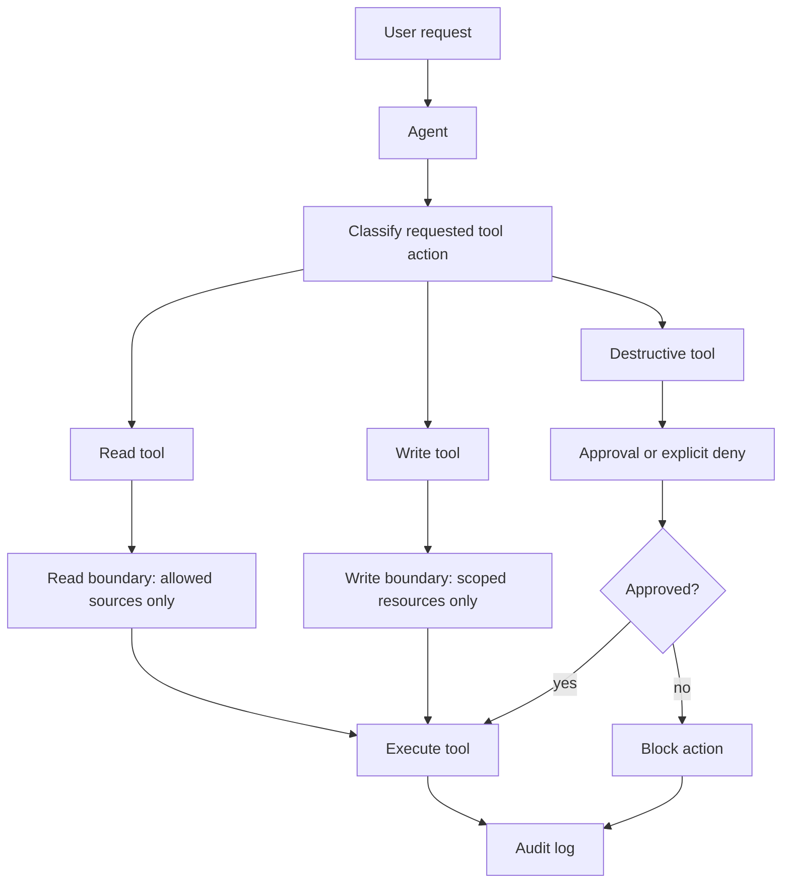
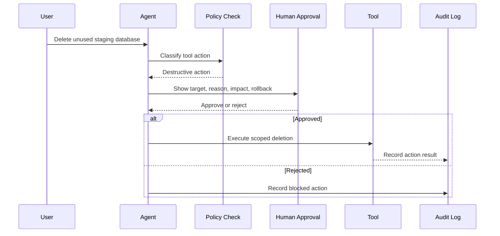

# Permission Boundaries for Read, Write, and Destructive Tools

## Goal

Learn how to classify agent tools by risk and design permission boundaries for read, write, and destructive actions.

After this lesson, you should be able to explain:

- what a permission boundary is,
- why tool permissions matter in AI agents,
- how read, write, and destructive tools differ,
- when a tool should run automatically,
- when a tool needs human approval,
- how to prevent accidental damage or privilege escalation.

## What Is A Permission Boundary?

A permission boundary is a guardrail that limits the maximum actions an agent, user, or role can perform.

Important idea:

```text
A permission boundary does not grant permission.
It limits what other permissions are allowed to do.
```

Example:

```text
Agent role policy:
  "This agent can manage cloud resources."

Permission boundary:
  "This agent can never delete production databases."

Result:
  The agent may manage allowed resources,
  but production database deletion is blocked.
```

For AI agents, permission boundaries are especially important because agents can call tools repeatedly, chain actions together, and make mistakes at machine speed.

## Why It Matters

An agent tool can affect real files, systems, users, money, infrastructure, and production data.

Without boundaries, a small misunderstanding can become a serious incident:

- reading private data,
- modifying the wrong file,
- sending a message to the wrong person,
- deleting resources,
- deploying broken code,
- changing billing or security settings,
- leaking secrets into logs or prompts.

The goal is not to block useful agents. The goal is to give agents enough access to work while limiting the blast radius when something goes wrong.

## Simple Mental Model

Classify tools by impact.

```text
Read          -> observe state
Write         -> change state
Destructive   -> remove, overwrite, execute, or make high-risk changes
```

Basic rule:

```text
Read tools can usually run automatically.
Write tools need scope limits.
Destructive tools need explicit approval or denial.
```

## Tool Risk Categories

| Tool Type | What It Can Do | Typical Examples | Risk Level |
| --- | --- | --- | --- |
| Read | View or retrieve information without changing anything | Search files, query databases, read emails, inspect logs, fetch web pages | Low |
| Write | Create or modify data, usually reversible | Edit documents, create tickets, update records, send draft messages, commit code | Medium |
| Destructive | Delete, overwrite, execute, deploy, transfer, or make irreversible changes | Delete files, drop databases, terminate resources, force-push code, deploy to production, transfer funds | High |

The category depends on impact, not just the tool name.

Example:

```text
git status        -> read
git add           -> write
git push --force  -> destructive
```

## Permission Boundary Architecture



This pattern keeps the agent useful while making high-impact actions visible and controlled.

## Read Tools

Read tools gather information without changing external state.

Examples:

- read project files,
- inspect logs,
- search documentation,
- query a read-only database,
- fetch a web page,
- list cloud resources,
- check repository status.

Recommended boundaries:

- allow by default only inside approved sources,
- block secrets and unrelated private data,
- use read-only credentials,
- log access for auditing,
- avoid exposing sensitive results to the model when not needed.

Example:

```text
Allowed:
  - Read files inside the current project
  - View monitoring dashboards
  - Query a read-only analytics table
  - Inspect application logs

Not allowed:
  - Read password vault contents
  - Read unrelated customer data
  - Read private SSH keys
  - Read production secrets from environment variables
```

Read tools are lower risk, but they are not risk-free. A read-only tool can still leak sensitive information.

## Write Tools

Write tools modify external state but do not usually destroy data permanently.

Examples:

- edit a document,
- create a support ticket,
- update a CRM record,
- create a draft email,
- stage a git change,
- open a pull request,
- append to a log,
- update a non-production config file.

Recommended boundaries:

- limit writes to specific folders, records, queues, or environments,
- prefer drafts over final actions,
- make changes traceable,
- use version control where possible,
- require approval for sensitive fields,
- block writes to production security, billing, or identity settings unless explicitly approved.

Example:

```text
Allowed:
  - Update a bug ticket assigned to the agent
  - Create a draft report
  - Edit files inside a feature branch
  - Open a pull request

Not allowed without approval:
  - Modify production security settings
  - Change billing records
  - Update another team's customer data
  - Rewrite shared configuration files
```

Write tools should be scoped. "Can write anything" is usually too broad for an agent.

## Destructive Tools

Destructive tools perform irreversible, high-risk, or production-impacting actions.

Examples:

- delete files,
- run `rm -rf`,
- drop or truncate database tables,
- terminate cloud instances,
- delete logs or audit trails,
- remove user accounts,
- force-push git history,
- merge to production,
- deploy production changes,
- transfer funds,
- rotate or revoke critical credentials.

Recommended boundaries:

- deny by default,
- require explicit human approval,
- show a preview of the planned action,
- require a narrow target,
- use least privilege credentials,
- log who approved the action,
- add cooldowns or two-person review for critical systems,
- make rollback plans visible before execution.

Example:

```text
Allowed only after approval:
  - Delete a cloud resource
  - Remove a user account
  - Execute a production deployment
  - Drop a test database

Usually denied:
  - Delete production audit logs
  - Transfer funds without human confirmation
  - Run broad shell deletion commands
  - Disable security controls
```

The safest design is to avoid giving the agent direct destructive capability when a workflow can be completed through a safer alternative.

## Approval Flow

Destructive and high-impact write tools should use a confirmation workflow.



Good approval prompts should include:

- exact target,
- reason for the action,
- expected impact,
- whether the action is reversible,
- rollback plan,
- logs or evidence used by the agent,
- command or API call that will be executed.

Bad approval prompt:

```text
Can I delete resources?
```

Good approval prompt:

```text
Approve deletion of staging database `app_staging_old`.
Reason: It has had no connections for 45 days.
Impact: Staging test data will be removed.
Rollback: Restore from snapshot `snap-2026-06-03`.
Command: delete_database --id app_staging_old
```

## Agent Design Pattern

A common security model:

1. Read actions run automatically inside approved scope.
2. Write actions run automatically only inside predefined scope.
3. Destructive actions require approval or are explicitly denied.

Example engineering agent:

```text
Read:
  - inspect source code
  - read test logs
  - check git diff

Write:
  - edit files in the current branch
  - add tests
  - create a pull request

Destructive:
  - force-push branch
  - merge to main
  - delete cloud resources
  - deploy to production
```

Recommended behavior:

```text
Read source code automatically.
Write a patch automatically in the workspace.
Ask approval before merging, deploying, deleting, or force-pushing.
```

## Boundary Examples By Tool

| Tool | Read Boundary | Write Boundary | Destructive Boundary |
| --- | --- | --- | --- |
| Filesystem | Read current repo | Edit current repo files | Block delete outside repo; approve bulk deletion |
| Git | `status`, `diff`, `log` | `add`, local commit | Approve push, force-push, reset, branch deletion |
| Database | Read selected tables | Update allowed records | Approve drop, truncate, migration, bulk delete |
| Email | Read selected inbox | Create draft | Approve send to external recipients |
| Cloud | List resources | Modify staging resources | Approve production changes or termination |
| Messaging | Read channel history | Draft or post in safe channel | Approve broad announcement or external message |
| Payments | Read invoice status | Create draft invoice | Approve charge, refund, transfer |

## Least Privilege

The principle of least privilege means:

```text
Give the agent only the minimum access required for the task.
```

Do not give an agent admin access just because it is convenient.

Better:

```text
Agent can read issue data.
Agent can update only assigned issues.
Agent cannot delete issues.
Agent cannot change billing settings.
```

Worse:

```text
Agent has full admin access to the project.
```

Least privilege reduces damage when:

- the model misunderstands the task,
- the user prompt is malicious,
- a tool schema is too broad,
- credentials leak,
- a command targets the wrong resource.

## Preventing Privilege Escalation

Privilege escalation happens when an agent uses allowed permissions to gain stronger permissions.

Examples:

- agent can create IAM roles, then creates an admin role,
- agent can edit CI config, then adds a step that leaks secrets,
- agent can modify a deployment script, then deploys unsafe code,
- agent can write files, then overwrites a security policy,
- agent can delete logs, then hides its own activity.

Boundary rules should block escalation paths.

Example:

```text
Allowed:
  - Create a staging IAM role from an approved template

Denied:
  - Attach AdministratorAccess
  - Modify permission boundary policies
  - Delete audit logs
  - Read production secrets
```

## Policy Decision Checklist

Before allowing a tool call, ask:

- Is this read, write, or destructive?
- What exact resource will it touch?
- Is the resource inside the approved scope?
- Could the action expose secrets or private data?
- Could the action affect production?
- Is the action reversible?
- Does the user expect this action?
- Should this require approval?
- Will the action be logged?
- Is there a safer alternative?

## Example Policy Rules

Simple pseudo-policy:

```yaml
tool_boundaries:
  read:
    default: allow
    allowed_paths:
      - "./docs"
      - "./src"
    denied_patterns:
      - ".env"
      - "secrets.*"
      - "*.pem"

  write:
    default: deny
    allowed_paths:
      - "./docs"
      - "./src"
      - "./tests"
    require_version_control: true

  destructive:
    default: deny
    require_human_approval: true
    denied_commands:
      - "rm -rf /"
      - "git reset --hard"
      - "DROP DATABASE"
      - "terraform destroy"
```

The exact syntax depends on your platform. The idea is the same: classify, scope, approve, and log.

## Common Mistakes

Treating all tools the same:

Read, write, and destructive tools need different boundaries.

Using broad credentials:

An agent should not use admin credentials for normal work.

No approval step:

High-impact actions should not run silently.

No audit log:

You need to know what the agent did, when, why, and with which input.

Weak tool schemas:

A broad command tool like `run_shell(command: string)` is much riskier than a narrow tool like `create_ticket(title, description, assignee)`.

No secret filtering:

Read tools can leak secrets even if they never modify anything.

Ignoring production scope:

Staging and production should not share the same permission boundary.

## Practice

Design permission boundaries for a small coding agent.

Give the agent these goals:

```text
Read source code.
Edit docs and tests.
Open a pull request.
Do not deploy, force-push, or delete resources without approval.
```

Create a table:

| Action | Category | Allowed Automatically? | Approval Needed? | Reason |
| --- | --- | --- | --- | --- |
| Read `src/app.py` | Read | Yes | No | Inside repo |
| Edit `docs/index.md` | Write | Yes | No | Inside approved path |
| Delete `src/` | Destructive | No | Yes | Bulk deletion |
| Push to main | Destructive | No | Yes | Shared branch |
| Read `.env` | Read | No | No | Secret file |

Then write one pseudo-policy that enforces those decisions.

## Key Takeaways

- Permission boundaries limit what an agent can do.
- Boundaries do not grant permission; they cap permission.
- Read tools observe state but can still leak data.
- Write tools change state and must be scoped.
- Destructive tools should be denied by default or require approval.
- Least privilege reduces blast radius.
- Good agents classify actions before calling tools.
- Strong systems log tool calls, approvals, targets, and results.

## Resources

- [AWS IAM permissions boundaries](https://docs.aws.amazon.com/IAM/latest/UserGuide/access_policies_boundaries.html)
- [AWS policy evaluation logic](https://docs.aws.amazon.com/IAM/latest/UserGuide/reference_policies_evaluation-logic.html)
- [OpenAI guide: safety best practices](https://platform.openai.com/docs/guides/safety-best-practices)
- [OpenAI function calling guide](https://platform.openai.com/docs/guides/function-calling)
