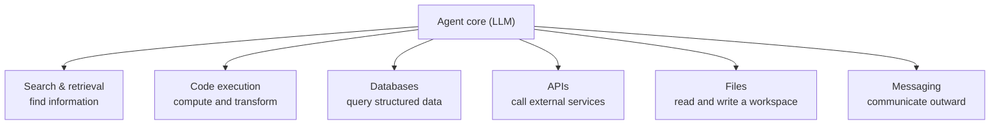

# Common Agent Tools

<div class="topic-page" markdown="1">

<section class="topic-hero">
  <span class="topic-hero__eyebrow">Stage 05 - Tools and Actions</span>
  <p class="topic-hero__lead">Most agents are built from a small set of recurring tool types: search, code execution, databases, APIs, files, and messaging. This topic is a field guide to those categories. For each one you learn what it does, when an agent should reach for it, what a typical tool looks like, and the failure modes that come with that category specifically.</p>
  <div class="topic-hero__facts">
    <span>Search</span>
    <span>Code execution</span>
    <span>Databases</span>
    <span>APIs</span>
    <span>Files</span>
    <span>Messaging</span>
  </div>
</section>

## Goal

Learn the common families of tools that real agents use, so you can:

- recognize which category a capability belongs to
- pick the right tool type for a given task
- know the failure modes that are specific to each category
- assemble a sensible starter toolset for a new agent

This topic is about **what tools exist and when to use them**. It does not re-teach how to write a definition ([Tool Definition](../tool-definition/index.md)), how to validate inputs ([Tool Schemas](../tool-schemas/index.md)), how the call is executed ([Function Calling](../function-calling/index.md)), how to handle failures ([Tool Error Handling](../tool-error-handling/index.md)), or how to gate risky actions ([Permission Boundaries](../boundaries-and-destructive-tools/index.md)). Each category below links back to those topics where they apply.

## Learning Path

This topic is designed in four parts. Read them in order.

<div class="learning-grid learning-grid--path">
  <a class="learning-card" href="#part-1-the-six-core-categories">
    <strong>Part 1 - The Six Core Categories</strong>
    <span>Get a one-glance map of the tool types most agents are built from.</span>
  </a>
  <a class="learning-card" href="#part-2-a-field-guide-to-each-category">
    <strong>Part 2 - A Field Guide to Each Category</strong>
    <span>Learn each category: purpose, example tool, and category-specific gotchas.</span>
  </a>
  <a class="learning-card" href="#part-3-narrow-tools-vs-do-anything-tools">
    <strong>Part 3 - Narrow vs Do-Anything Tools</strong>
    <span>See why a specific tool usually beats a single generic one.</span>
  </a>
  <a class="learning-card" href="#part-4-starter-toolsets-by-agent-type">
    <strong>Part 4 - Starter Toolsets by Agent Type</strong>
    <span>Assemble a minimal, sensible tool list for a new agent.</span>
  </a>
</div>

## Part 1: The Six Core Categories

Almost every useful agent is assembled from the same small menu of tool types. An agent is rarely original in *which kinds* of tools it has; it is original in *which specific* tools it combines.



**How to read this diagram:** these six categories cover the large majority of tools you will give an agent. A new requirement almost always maps onto one of them before you invent something exotic.

A fast way to remember the difference is to ask what each category mainly does to the outside world.

| Category | Mainly does | Default risk class | Most common failure mode |
| --- | --- | --- | --- |
| Search & retrieval | Brings outside information in | Read | Noisy, stale, or token-heavy results |
| Code execution | Computes and transforms data | High (arbitrary code) | Unsandboxed or runaway execution |
| Databases | Reads or changes structured records | Read for queries, write/destructive for changes | Huge result sets, unsafe generated SQL |
| APIs | Reads from or acts on external services | Varies by endpoint | Auth/secret leakage, duplicate writes |
| Files | Reads or changes a workspace | Read / write / destructive | Path escape, oversized files, overwrites |
| Messaging | Sends communication to people | Write or destructive (external) | Wrong recipient, duplicate sends |

The "default risk class" column uses the read / write / destructive model from [Permission Boundaries](../boundaries-and-destructive-tools/index.md). It is a starting point, not a rule; the real risk depends on the exact action.

## Part 2: A Field Guide to Each Category

Each entry below follows the same shape: what it is, when an agent should use it, a typical tool sketch, and the gotchas that are unique to that category.

### 1. Search and Retrieval

**What it is.** Tools that bring outside information into the agent's context: live web search, fetching and reading a specific page, or retrieving from your own knowledge base (RAG over a vector store).

**Use when** the answer is not in the model's training data or context: current events, prices, recent documentation, internal policy documents, or anything past the model's knowledge cutoff.

Typical tool:

```json
{
  "name": "web_search",
  "description": "Search the public web for current information. Use for recent events, prices, news, and facts that may have changed. Returns a ranked list of results with title, url, and snippet.",
  "input": {
    "query": "string",
    "max_results": "integer"
  },
  "output": {
    "results": "list of { title, url, snippet }"
  }
}
```

This category usually has three flavors:

| Flavor | What it returns | Example use |
| --- | --- | --- |
| Search API | Ranked links and snippets | "What changed in the latest release?" |
| Fetch / read page | The text of one URL | Read a doc the search step found |
| Knowledge retrieval (RAG) | Chunks from your own documents | "What does our refund policy say?" |

!!! warning "Gotchas specific to search"
    - **Token bloat.** A fetched page can be huge. Return a snippet or a truncated body and label it (see truncation in [Tool Error Handling](../tool-error-handling/index.md)).
    - **Stale or cached results.** Fresh-looking results can be old. Surface dates when you have them.
    - **Citation drift.** The model may cite a URL it never actually read. Prefer returning the source text the model must quote from.
    - **Noise.** Top results are not always relevant. A narrower query usually beats a broad one.

### 2. Code Execution

**What it is.** A sandbox where the agent can run code (most often Python) to compute, transform data, draw charts, or parse a file. The LLM writes code; the sandbox runs it and returns the output.

**Use when** the task is deterministic and the model is unreliable at it directly: arithmetic, data analysis, sorting and filtering large lists, format conversion, or generating a plot.

Typical tool:

```json
{
  "name": "run_python",
  "description": "Execute Python in an isolated sandbox and return stdout, stderr, and any produced files. Use for calculations, data analysis, and file processing. The sandbox has no access to the host filesystem or private network.",
  "input": {
    "code": "string"
  },
  "output": {
    "stdout": "string",
    "stderr": "string",
    "files": "list of produced file references"
  }
}
```

!!! danger "Gotchas specific to code execution"
    - **This is the highest-risk category.** Running model-written code is effectively arbitrary code execution. It must run in a sandbox with no host filesystem and no private network, plus CPU, memory, and time limits.
    - **Runaway loops.** Always enforce a timeout, or one bad loop spends your whole budget.
    - **Session state.** Decide whether variables persist between calls. A persistent session is convenient but can carry hidden state into later steps.
    - **Capture both streams.** Feed `stderr` back to the model, not just `stdout`, so it can fix its own code.

Because of the risk, code execution should sit behind the controls in [Permission Boundaries](../boundaries-and-destructive-tools/index.md).

### 3. Databases

**What it is.** Tools that read or change structured records: looking up a customer, aggregating sales, updating an order status.

**Use when** the agent needs precise, structured, current data that lives in your application's database rather than on the web.

There are two ways to expose a database, and the choice matters a lot:

<div class="prompt-compare">
  <section>
    <span class="prompt-compare__label prompt-compare__label--bad">Risky</span>
    <pre><code>{
  "name": "run_sql",
  "description": "Run any SQL query.",
  "input": { "query": "string" }
}</code></pre>
    <p>The model can write any query against any table. Easy to misuse, hard to scope, and a real injection and data-exposure risk.</p>
  </section>
  <section>
    <span class="prompt-compare__label prompt-compare__label--good">Safer</span>
    <pre><code>{
  "name": "get_customer_by_email",
  "description": "Look up one customer by email. Returns id, name, plan, and signup date.",
  "input": { "email": "string" }
}</code></pre>
    <p>A narrow, purpose-built query. The model cannot reach data it was not meant to, and the boundary is obvious.</p>
  </section>
</div>

!!! warning "Gotchas specific to databases"
    - **Result-set size.** A query can return thousands of rows. Always cap with a limit and paginate; label truncation.
    - **Generated SQL is dangerous.** If you must allow SQL, use a read-only role, an allowlist of tables, and statement timeouts.
    - **Schema blindness.** The model does not know your schema unless you describe it. Put the relevant columns in the tool description.
    - **Reads vs writes.** A `SELECT` is read; an `UPDATE`/`INSERT` is write; a `DROP`/`DELETE` is destructive. Keep them in separate tools so risk is visible.

### 4. APIs and Third-Party Services

**What it is.** Tools that call external or internal HTTP services to read information or take an action: weather, payments, a CRM, a calendar, an internal microservice.

**Use when** the capability already exists as a service. This is the most open-ended category because almost anything can be an API.

Prefer one tool per capability over a single generic HTTP tool:

| Generic (avoid) | Purpose-built (prefer) |
| --- | --- |
| `http_request(method, url, body)` | `create_calendar_event(title, start, end, attendees)` |
| `call_api(endpoint, params)` | `get_weather_forecast(city, date)` |

A purpose-built tool hides the URL, headers, and auth, and gives the model a clear decision rule.

!!! warning "Gotchas specific to APIs"
    - **Secrets never go to the model.** API keys and tokens live in your backend, not in the tool arguments or the model context.
    - **Idempotency for writes.** A retried "create payment" must not charge twice. Use an idempotency key so duplicates are safe.
    - **Rate limits.** External APIs throttle. Handle `429` as a recoverable error (see [Tool Error Handling](../tool-error-handling/index.md)).
    - **Shape mapping.** Translate the raw API response into a small, clean object. Do not dump a giant JSON blob into context.

### 5. File Operations

**What it is.** Tools that read, write, list, or search files in a workspace. The backbone of coding agents and document-processing agents.

**Use when** the agent works over a project, a folder of documents, or generated artifacts like reports.

Typical tools:

```text
read_file(path)            -> file contents
write_file(path, content)  -> confirmation
list_dir(path)             -> file and folder names
search_files(query)        -> matching paths and lines
```

!!! warning "Gotchas specific to files"
    - **Scope to a workspace.** Block path traversal (`../../etc/passwd`). The agent should only reach an approved root.
    - **Large files.** Read in chunks or with a line range; do not load a 50 MB file into context.
    - **Overwrite vs append.** `write_file` that replaces a whole file is easy to get wrong. Be explicit about which behavior a tool has.
    - **Deletion is destructive.** Deleting or overwriting files belongs behind the controls in [Permission Boundaries](../boundaries-and-destructive-tools/index.md).

### 6. Messaging and Communication

**What it is.** Tools that send communication outward: email, a Slack or chat message, a notification, or a ticket comment. This category also covers asking a human for input (human-in-the-loop).

**Use when** the agent needs to deliver a result, notify someone, or pause for human confirmation.

Typical tools:

```text
send_email(to, subject, body)
post_slack_message(channel, text)
ask_user(question)            -> human reply
```

!!! warning "Gotchas specific to messaging"
    - **Side effects are visible and often irreversible.** A sent email cannot be unsent. Prefer creating a draft, then confirming.
    - **Wrong recipient.** Double-check the destination. External recipients usually deserve an approval step.
    - **Duplicate sends.** A retry must not send the same message twice. Use an idempotency key or a sent-message check.
    - **Loops.** An agent that emails on every step can spam. Add limits.

Sending to people is almost always at least a write action, and external messages are often treated as destructive. See [Permission Boundaries](../boundaries-and-destructive-tools/index.md).

### Honorable Mentions

A few categories appear often enough to know by name, even if they are variations on the six above:

| Tool type | What it adds |
| --- | --- |
| Browser / computer use | Drives a real browser or desktop when no API exists |
| Vector / knowledge retrieval | A search flavor that retrieves from your own embedded documents (see [Embeddings and Vector Search](../../02-llm-fundamentals/embeddings-vector-search/index.md)) |
| Calculator / math | A tiny code-execution tool for exact arithmetic |
| Scheduling / timers | Lets an agent wait, schedule, or run later |
| Human-in-the-loop | A messaging tool whose reply is a person's decision |

## Part 3: Narrow Tools vs Do-Anything Tools

When you expose any category, you choose how wide to make each tool. A single "do anything" tool (`run_shell`, `http_request`, `run_sql`) is tempting because it covers every case. It is also the most common source of agent accidents.

<div class="visual-checklist">
  <div>
    <strong>Do-anything tools tend to:</strong>
    <ul>
      <li>Hide what action will actually happen</li>
      <li>Make risk impossible to classify in advance</li>
      <li>Invite injection and out-of-scope access</li>
      <li>Force the model to guess the exact syntax</li>
      <li>Produce errors that are hard to recover from</li>
    </ul>
  </div>
  <div>
    <strong>Narrow, purpose tools tend to:</strong>
    <ul>
      <li>Make the intended action obvious</li>
      <li>Carry a clear read / write / destructive class</li>
      <li>Limit the blast radius by construction</li>
      <li>Give the model simple, well-named arguments</li>
      <li>Return small, clean, mappable results</li>
    </ul>
  </div>
</div>

### Example: The Same Task, Two Ways

Suppose a support agent must refund an order. Watch how the tool shape changes everything that follows.

<div class="prompt-compare">
  <section>
    <span class="prompt-compare__label prompt-compare__label--bad">Do-anything</span>
    <pre><code>http_request(
  method = "POST",
  url    = "https://api.shop.internal/v2/refunds",
  headers = { "Authorization": "Bearer ..." },
  body   = { "order": "10452", "amt": 4999 }
)</code></pre>
    <p>The model must invent the URL, the auth header, the field names, and the cents/dollars convention. Nothing tells the system this is a money-moving action, so it cannot be gated, and a wrong field silently overcharges.</p>
  </section>
  <section>
    <span class="prompt-compare__label prompt-compare__label--good">Narrow</span>
    <pre><code>refund_order(
  order_id = "10452",
  reason   = "damaged_on_arrival"
)</code></pre>
    <p>The amount, endpoint, and auth live in your backend. The name makes the action obvious, the system can flag it as destructive and require approval, and the model only supplies what it actually knows.</p>
  </section>
</div>

The narrow tool is not just safer. It is also easier for the model to *select* correctly, because its name and arguments describe one clear intent (see [Tool Definition](../tool-definition/index.md)).

### Common Refactors by Category

Most do-anything tools have a clear narrow replacement. When you catch yourself reaching for the generic one, this table shows the move:

| Category | Do-anything tool | Narrow replacements |
| --- | --- | --- |
| Databases | `run_sql(query)` | `get_customer_by_email(email)`, `list_open_orders(customer_id)` |
| APIs | `http_request(method, url, body)` | `create_calendar_event(...)`, `refund_order(order_id, reason)` |
| Files | `run_shell(command)` | `read_file(path)`, `write_file(path, content)`, `list_dir(path)` |
| Code execution | `eval(code)` on the host | `run_python(code)` in a sandbox, `calculate(expression)` |
| Messaging | `send_request(service, payload)` | `send_email(to, subject, body)`, `post_slack_message(channel, text)` |
| Search | `fetch(url)` for anything | `web_search(query)`, `retrieve_documents(query)` |

The trade-off is coverage. Narrow tools mean more tools. Two practical rules keep this balanced:

- **Start narrow.** Add a specific tool for each real task before reaching for a generic one.
- **Keep the toolset small.** Too many tools makes selection harder and prompts longer. A handful of well-chosen tools usually beats twenty overlapping ones.

If you truly need a broad tool (for example, a SQL tool for analysts), pair it with the strongest boundaries: a read-only role, allowlists, timeouts, and approval for anything that writes.

## Part 4: Starter Toolsets by Agent Type

A useful exercise: for a given agent, write down the minimum toolset and the category of each tool. Below are three sensible starting points.

### Customer Support Agent

| Tool | Category | Risk class |
| --- | --- | --- |
| `search_help_center` | Search / retrieval | Read |
| `get_order_status` | Database | Read |
| `get_customer_by_email` | Database | Read |
| `create_support_ticket` | API | Write |
| `send_email` (draft first) | Messaging | Write / approval |

### Coding Agent

| Tool | Category | Risk class |
| --- | --- | --- |
| `read_file` / `list_dir` | Files | Read |
| `search_files` | Files / search | Read |
| `write_file` | Files | Write |
| `run_tests` | Code execution | Medium |
| `run_shell` | Code execution | High / approval |

### Research Agent

| Tool | Category | Risk class |
| --- | --- | --- |
| `web_search` | Search / retrieval | Read |
| `fetch_url` | Search / retrieval | Read |
| `retrieve_documents` (RAG) | Search / retrieval | Read |
| `run_python` (analysis) | Code execution | High (sandboxed) |
| `write_file` (report) | Files | Write |

Notice the pattern: most of an agent's tools are read tools from a few categories, with a small number of carefully gated write and destructive tools.

## Practice

Pick one agent idea (for example: a travel-planning assistant, an on-call ops helper, or a personal finance assistant).

1. List every task the agent must perform.
2. Map each task to one of the six categories.
3. For each task, write a one-line tool sketch (name + one-sentence description).
4. Mark each tool as read, write, or destructive.
5. Note one category-specific gotcha for each tool.

You should end with a small table that another developer could turn into real tool definitions.

## Mini Project

Design the toolset for a "release notes" agent that reads merged pull requests and posts a summary to a team channel.

Your design should include:

- one **search/retrieval** tool (find merged PRs)
- one **API** tool (read PR details)
- one **code execution** or text tool (build the summary)
- one **messaging** tool (post the summary, draft-first)

For each tool, write:

- name and one-sentence description
- inputs and output meaning
- its category and risk class
- the single biggest failure mode for that category and how you would handle it

Do not build the code. The goal is a clear, category-aware tool catalog that a teammate could implement safely.

## Exit Criteria

You understand common agent tools when you can:

- name the six core categories and what each mainly does
- place a new capability into the right category
- sketch a typical tool for each category
- state at least one failure mode that is specific to each category
- explain why a narrow tool usually beats a do-anything tool
- assemble a minimal, mostly-read toolset for a given agent
- point to the right sibling topic for definition, schema, calling, errors, and boundaries

## Resources

- [roadmap.sh: AI Agents Roadmap](https://roadmap.sh/ai-agents)
- [Anthropic Claude Docs: Tool use overview](https://platform.claude.com/docs/en/agents-and-tools/tool-use/overview)
- [Anthropic: Code execution tool](https://platform.claude.com/docs/en/agents-and-tools/tool-use/code-execution-tool)
- [OpenAI: Built-in tools (web search, code interpreter, file search)](https://platform.openai.com/docs/guides/tools)
- [LangChain Docs: Tools and toolkits](https://docs.langchain.com/oss/python/langchain/tools)
- [Model Context Protocol: Example servers](https://modelcontextprotocol.io/examples)

</div>
