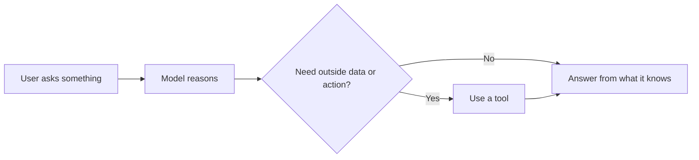
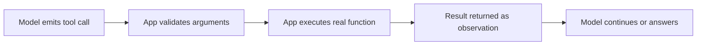
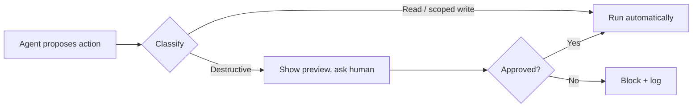

# Junior Interview: Tools and Actions

Friendly, entry-level questions for people who are still learning how agents use tools. They check whether the **foundations** are there — and they double as a **study guide**: each question has a short rubric (*good answer covers*), a fuller **explanation** with examples and diagrams, and a hint the interviewer can give if the candidate is stuck.

!!! note "How to use this page"
    As an interviewer, ask the question and listen for the ideas in *good answer covers*; the explanation is there to help you follow up and to let learners study. Reading every explanation here should cover most of the Stage 05 basics. See the [QAs](../test/index.md) for quick self-testing.

## 1. In plain words, what is a "tool" for an agent, and why do agents need them?

**Good answer covers:** A tool is an **external capability** the agent can use — search the web, read a file, query a database, send an email. The model can only generate text on its own; tools let it reach real data and take real actions.

**Explanation:** A language model is good at reasoning and writing, but by itself it cannot look up today's weather, open your files, or update a ticket. A tool is the bridge to those abilities. You give the agent a small menu of tools, and it picks one when text alone is not enough.



**Hint if stuck:** What can't a model do on its own — and what would let it look something up or change something?

## 2. What does a tool definition contain?

**Good answer covers:** At minimum a **name**, a **description** (what it does and when to use it), and its **parameters** (the inputs it accepts). Often also what the output means and when *not* to use it.

**Explanation:** A tool definition is the contract you show the model. The name should be a clear verb-object like `get_order_status`. The description tells the model the decision rule — when to reach for this tool and when to avoid it. The parameters list what arguments are needed.

```json
{
  "name": "get_order_status",
  "description": "Look up the delivery status for one order by order ID. Use when the user asks where an order is or when it will arrive. Do not use for refunds or cancellations.",
  "input": {
    "order_id": "string"
  }
}
```

**Hint if stuck:** If you were handing a coworker a new button, what three things would you label it with?

## 3. Why does the tool description matter so much?

**Good answer covers:** The **model reads the description** to decide whether and when to call the tool. A vague description leads to wrong tool choices; a clear one with use and non-use cases leads to correct ones.

**Explanation:** The model does not see your source code — it sees the name and description. "Gets order info" tells it almost nothing. A strong description gives a decision rule: what it does, when to use it, when not to, and what comes back. This is the cheapest way to make an agent more reliable.

| Weak description | Strong description |
| --- | --- |
| "Searches things." | "Search the help center for how-to and troubleshooting articles. Use for product questions. Do not use for private account data." |

**Hint if stuck:** The model can't read your code — what does it read to pick a tool?

## 4. What is a tool schema, and why do typed, validated parameters matter?

**Good answer covers:** A schema (usually **JSON Schema**) defines the tool's allowed arguments: names, types, which are required, and value limits like enums or min/max. It lets the app **validate** the model's call before running anything.

**Explanation:** Without a schema, arguments are vague text and the model can invent fields or pass the wrong type. A schema makes the call structured and checkable: the app can reject a bad call early instead of crashing the real system. It also helps the model produce valid arguments in the first place.

```json
{
  "type": "object",
  "properties": {
    "status": { "type": "string", "enum": ["open", "pending", "resolved"] },
    "limit": { "type": "integer", "minimum": 1, "maximum": 50 }
  },
  "required": ["status"],
  "additionalProperties": false
}
```

A call like `{"status": "urgent", "limit": 500}` is rejected: `urgent` is not an allowed value and `500` is over the max.

**Hint if stuck:** What stops the model from sending `limit: "a lot"` or making up a field that doesn't exist?

## 5. What is function calling, and what is the round-trip?

**Good answer covers:** Function calling is how the model **requests** a tool by emitting a structured call. The **app** then runs the real function and sends the result back as an observation, and the model continues. The model does **not** run the function itself.

**Explanation:** The model emits something like `{"tool": "get_weather", "arguments": {"city": "Berlin"}}`. Your application validates it, runs the actual code, and feeds the result back. The model reads that result and either answers or calls another tool. Splitting "the model asks" from "the app executes" is what keeps things safe and controllable.



**Hint if stuck:** When the model "calls" a tool, who actually runs the code — the model or your app?

## 6. Does the model execute the function itself?

**Good answer covers:** No. The model only **proposes** a structured call. The application validates, authorizes, and executes it, then returns the result. This separation is what lets you add permission checks and approvals.

**Explanation:** This is the most common beginner mix-up. Function calling is the model *asking* for an action — it does not give the model direct access to your database or shell. Your code stays in control of every real action, which is exactly where you enforce safety.

**Hint if stuck:** Where would you put a "are you allowed to do this?" check — and could you, if the model ran the code directly?

## 7. A tool call fails. What should the tool layer do?

**Good answer covers:** Catch the error and return it as a **clear, structured observation** (what failed, whether it's retryable, what to do next) so the model can recover. Do **not** let the app crash, and don't hide the error in vague text.

**Explanation:** Normal software might throw an exception. An agent needs the failure turned into feedback. A good error tells the model what went wrong and whether retrying helps, so it can fix the arguments, try a fallback, ask the user, or stop. A `recoverable` flag prevents pointless retry loops (a timeout may be worth retrying; a permission error is not).

```json
{
  "status": "error",
  "error_type": "schema_validation",
  "message": "Field 'date' must be YYYY-MM-DD. You passed 'tomorrow'. Convert it and retry.",
  "recoverable": true
}
```

Compare that with a useless `"Something went wrong."` — the model gets no recovery path.

**Hint if stuck:** Should a failed API call crash the whole agent, or become a message the model can read and react to?

## 8. What are some common categories of agent tools?

**Good answer covers:** Most agents are built from a few recurring types: **search/retrieval**, **code execution**, **databases**, **APIs**, **file operations**, and **messaging** (plus things like browser use and human-in-the-loop).

**Explanation:** Agents are rarely original in *which kinds* of tools they have — they're original in which specific tools they combine. Recognizing the category helps you pick the right tool and anticipate its typical failure mode.

| Category | Mainly does | Example tool |
| --- | --- | --- |
| Search & retrieval | Brings outside info in | `web_search`, `retrieve_documents` |
| Code execution | Computes/transforms (sandboxed) | `run_python` |
| Databases | Reads/changes structured records | `get_customer_by_email` |
| APIs | Calls external services | `create_calendar_event` |
| Files | Reads/writes a workspace | `read_file`, `write_file` |
| Messaging | Communicates outward | `send_email`, `post_slack_message` |

**Hint if stuck:** Think about how an agent finds information, runs a calculation, and talks to people.

## 9. What's the difference between read, write, and destructive actions?

**Good answer covers:** **Read** observes state (low risk), **write** changes state but is usually reversible (medium), **destructive** removes, overwrites, executes, or deploys and is often irreversible (high). Reads can usually run automatically; destructive actions need approval.

**Explanation:** Classify by *impact*, not just the name. The same tool family spans all three: `git status` is read, `git add` is write, `git push --force` is destructive. This three-way split tells you how careful to be.

| Class | Example | Default boundary |
| --- | --- | --- |
| Read | `search_files`, `get_order_status` | Usually allow inside approved scope |
| Write | `create_ticket`, `draft_email` | Scope it; prefer drafts |
| Destructive | `delete_file`, `refund_payment`, `deploy` | Deny by default or require approval |

**Hint if stuck:** Which actions can't be undone — and should those run silently?

## 10. Why do destructive actions need guardrails or approval?

**Good answer covers:** They affect the real world and can be hard or impossible to undo (a sent email, a deleted database, a charged card). Agents act fast and can chain steps, so a misunderstanding can become a real incident. Approval keeps a human in the loop for high-impact actions.

**Explanation:** A good approval step shows the exact target, the reason, the impact, whether it's reversible, and a rollback plan — not a vague "Can I delete things?" The model may *propose* the action, but the host decides what needs a confirmation.



**Hint if stuck:** Before deleting a production database, who should say yes first?

## 11. What is least privilege, and why does it help?

**Good answer covers:** Give the agent only the **minimum access** it needs for the task — not admin "just in case." This shrinks the blast radius if the model misunderstands, the prompt is malicious, or a schema is too broad.

**Explanation:** A permission boundary caps what the agent can do; it does not grant access. Prefer narrow, purpose-built tools (`refund_order(order_id, reason)`) over do-anything tools (`http_request(method, url, body)`), because a narrow tool makes the action obvious, easy to classify, and easy to gate. "Can write anything" is almost always too broad.

```text
Better:  Agent can read issues and update only assigned issues.
Worse:   Agent has full admin access to the project.
```

**Hint if stuck:** If a tool could touch anything, how would you ever decide what's safe to run automatically?

## 12. How do good descriptions and schemas reduce wrong tool calls?

**Good answer covers:** Clear names and descriptions help the model **pick the right tool** (especially between similar ones); strict schemas stop **bad arguments** (wrong types, invalid values, made-up fields). Together they cut both selection mistakes and execution errors.

**Explanation:** If two tools both say "search data," the model may grab the wrong one — maybe exposing private data. Distinct descriptions fix selection. A schema with enums and limits fixes the arguments. If the model keeps choosing wrong, improve the definition before touching the agent logic.

| Problem | Fix |
| --- | --- |
| Model picks the wrong tool | Clearer description + non-use cases |
| Model passes an invalid value | Enum / min-max in the schema |
| Model invents a field | `additionalProperties: false` |

**Hint if stuck:** One change makes the model *choose* better; another makes its *arguments* valid — what are they?

## A light warm-up task

> Define a `get_weather` tool for an assistant: give it a name, a description, its parameters, and say which actions in a weather assistant would need approval.

**Good answer covers:** A clear name (`get_weather`), a description with a use case ("get the forecast for a city and date"), typed parameters (`city: string`, `date: string in YYYY-MM-DD`), and the point that *reading* the weather is safe to run automatically, while any *write/send* action (like emailing the forecast to a list) should ask first.

**Explanation:** A complete answer looks like: name `get_weather`; description "Get the forecast for a city on a date. Use when the user asks about weather; returns conditions and temperature."; parameters `city` (required string) and `date` (string, YYYY-MM-DD). Then the safety point: `get_weather` is a **read**, so it can run automatically; if the assistant also had `send_email`, that external send is a **write/destructive** action and should require approval. This shows the candidate can map a real need onto name, description, schema, and a read-vs-write boundary.

## Source material

These build on the Stage 05 topics: [Tool Definition](../tool-definition/index.md), [Tool Schemas](../tool-schemas/index.md), [Function Calling](../function-calling/index.md), [Tool Error Handling](../tool-error-handling/index.md), [Common Agent Tools](../common-agent-tools/index.md), and [Permission Boundaries for Read, Write, and Destructive Tools](../boundaries-and-destructive-tools/index.md).
