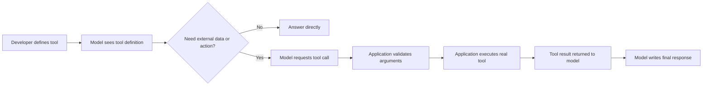

# Tool Definition

<div class="topic-page" markdown="1">

<section class="topic-hero">
  <span class="topic-hero__eyebrow">Stage 05 - Tools and Actions</span>
  <p class="topic-hero__lead">A tool definition is the contract that tells an AI agent what an external capability does, when to use it, what inputs it needs, and what result it returns. Clear tool definitions make agents more reliable because the model can choose the right action instead of guessing.</p>
  <div class="topic-hero__facts">
    <span>Name</span>
    <span>Description</span>
    <span>Inputs</span>
    <span>Output meaning</span>
    <span>Usage rules</span>
  </div>
</section>

## Goal

Learn how to define an agent tool clearly enough that a model can decide:

- whether the tool is needed
- which tool to use
- what arguments to provide
- how to interpret the returned result
- when not to use the tool

This topic focuses on the **meaning and design** of a tool definition. The next topics cover schemas, function calling mechanics, error handling, common tool types, and permission boundaries in more detail.

## Learning Path

This topic is designed in four parts. Read them in order.

<div class="learning-grid learning-grid--path">
  <a class="learning-card" href="#part-1-understand-what-a-tool-definition-is">
    <strong>Part 1 - Understand Tool Definitions</strong>
    <span>Learn what a tool definition is and how it fits into an agent loop.</span>
  </a>
  <a class="learning-card" href="#part-2-define-the-core-parts-of-a-tool">
    <strong>Part 2 - Define the Core Parts</strong>
    <span>Write clear names, descriptions, inputs, outputs, and usage rules.</span>
  </a>
  <a class="learning-card" href="#part-3-compare-weak-and-strong-tool-definitions">
    <strong>Part 3 - Compare Weak and Strong Definitions</strong>
    <span>See how small wording choices change tool selection quality.</span>
  </a>
  <a class="learning-card" href="#part-4-test-a-tool-definition-before-shipping">
    <strong>Part 4 - Test Before Shipping</strong>
    <span>Check whether the model uses the tool correctly across realistic requests.</span>
  </a>
</div>

## Part 1: Understand What a Tool Definition Is

An AI model can generate text, but it cannot directly query your database, send an email, calculate with your internal pricing engine, open a ticket, or update a CRM record unless your application gives it a tool.

A **tool** is an external capability made available to the agent.

A **tool definition** is the description of that capability given to the model.

The definition does not execute the action by itself. It tells the model what exists. Your application or agent framework still executes the real code after the model requests a tool call.

### Tool Definition vs Tool Execution



**How to read this diagram:** the model chooses and requests a tool, but the application owns validation and execution. A tool definition is the instruction layer between the model and your real system.

### Simple Example

User asks:

```text
What is the delivery status for order 10452?
```

The model cannot know that from training data. It needs a tool such as:

```json
{
  "name": "get_order_status",
  "description": "Look up the current delivery status for one customer order by order ID. Use this when the user asks where an order is, whether it shipped, or when it will arrive. Do not use it for refunds, cancellations, or product questions.",
  "input": {
    "order_id": "string"
  },
  "output": {
    "status": "string",
    "estimated_delivery_date": "string",
    "carrier": "string",
    "tracking_url": "string"
  }
}
```

The important part is not just the function name. The description tells the model **when to use it** and **when not to use it**.

## Part 2: Define the Core Parts of a Tool

A useful tool definition answers six questions.

| Part | Question It Answers | Example |
| --- | --- | --- |
| Name | What is this tool called? | `get_order_status` |
| Purpose | What does it do? | Looks up delivery status for one order. |
| Use cases | When should the model call it? | User asks about shipment, delivery, or tracking. |
| Non-use cases | When should the model avoid it? | User asks to cancel, refund, or edit an order. |
| Inputs | What arguments are required? | `order_id` |
| Output meaning | What result comes back? | Status, carrier, estimated delivery date, tracking URL. |

### 1. Tool Name

The name should be short, specific, and action-oriented.

Good names:

```text
get_order_status
search_customer_records
create_support_ticket
calculate_invoice_total
```

Weak names:

```text
data_tool
helper
run_action
customer
api_call
```

Use a verb plus object pattern:

```text
verb_object
```

Examples:

| Good Pattern | Why It Works |
| --- | --- |
| `get_weather_forecast` | Tells the model it retrieves weather forecast data. |
| `create_calendar_event` | Tells the model it creates something, not only reads. |
| `search_product_catalog` | Tells the model it searches a specific data source. |
| `calculate_shipping_cost` | Tells the model it performs a calculation. |

### 2. Tool Description

The description is the most important human-written part of the definition. It should explain:

- what the tool does
- when to use it
- when not to use it
- what each important input means
- what the tool returns
- important limits or caveats

Weak description:

```text
Gets order info.
```

Strong description:

```text
Look up the current delivery status for one customer order by order ID.
Use this when the user asks where an order is, whether it shipped, or when it will arrive.
Do not use this for refunds, cancellations, address changes, or product questions.
Returns shipment status, carrier, estimated delivery date, and tracking URL when available.
```

The strong version gives the model a decision rule.

### 3. Inputs

Inputs should be named from the user's or domain's perspective, not from internal implementation details.

Good:

```json
{
  "order_id": "10452",
  "include_tracking_history": false
}
```

Weak:

```json
{
  "id": "10452",
  "flag": false
}
```

The model performs better when each input name and description make the expected value obvious.

### 4. Output Meaning

A tool definition should explain what the result means. This helps the model use the result correctly in the final answer.

Example output:

```json
{
  "status": "in_transit",
  "estimated_delivery_date": "2026-06-07",
  "carrier": "UPS",
  "tracking_url": "https://example.com/track/123"
}
```

Useful explanation:

```text
status is the current shipment state.
estimated_delivery_date may be null if the carrier has not provided a date.
tracking_url may be null for local courier deliveries.
```

This prevents the model from treating missing fields as failures or inventing unavailable details.

### 5. Usage Rules

Usage rules tell the model how careful it should be.

Examples:

- Use this tool only when the user asks about an existing order.
- Ask for `order_id` if the user does not provide it.
- Do not call this tool for general product availability.
- Do not expose internal IDs in the final answer.
- If the tool returns `not_found`, ask the user to confirm the order ID.

These are not permission boundaries. They are selection and behavior instructions. Permission and destructive-action rules are covered later in this stage.

### 6. Examples

Examples help when a tool can be confused with similar tools.

| User Request | Correct Tool Decision |
| --- | --- |
| "Where is order 10452?" | Call `get_order_status`. |
| "Cancel order 10452." | Do not call `get_order_status`; use a cancellation tool if available. |
| "When will my package arrive?" | Ask for order ID, then call `get_order_status`. |
| "What colors does this product come in?" | Do not call `get_order_status`; use a product catalog tool if available. |

## Part 3: Compare Weak and Strong Tool Definitions

Small differences in wording can change agent behavior.

### Example: Search Tool

<div class="prompt-compare">
  <section>
    <span class="prompt-compare__label prompt-compare__label--bad">Weak</span>
    <pre><code>{
  "name": "search",
  "description": "Searches things.",
  "input": {
    "query": "string"
  }
}</code></pre>
    <p>The model does not know what it searches, when to use it, or what kind of result to expect.</p>
  </section>
  <section>
    <span class="prompt-compare__label prompt-compare__label--good">Strong</span>
    <pre><code>{
  "name": "search_help_center",
  "description": "Search the public help center articles for product support answers. Use this for how-to questions, troubleshooting steps, account setup, billing help, and feature explanations. Do not use it for private customer account data or real-time order status.",
  "input": {
    "query": "string"
  },
  "output": {
    "articles": "list of matching article titles, URLs, and snippets"
  }
}</code></pre>
    <p>The model can tell what source is searched, when to use it, when to avoid it, and how to read the result.</p>
  </section>
</div>

### Example: Tool Confusion

Imagine an agent has two tools:

```text
search_help_center
search_customer_records
```

If both descriptions say only "search data," the model may choose the wrong one.

Better:

| Tool | Clear Definition |
| --- | --- |
| `search_help_center` | Search public product documentation and troubleshooting articles. Never returns private customer data. |
| `search_customer_records` | Search private customer account records by email, customer ID, or order ID. Use only when the user needs account-specific information. |

The distinction matters because one tool is public knowledge and the other touches private user data.

### Tool Definition Checklist

<div class="visual-checklist">
  <div>
    <strong>Weak tool definitions often have:</strong>
    <ul>
      <li>Generic names like <code>tool</code> or <code>search</code></li>
      <li>One-line vague descriptions</li>
      <li>Unclear input names like <code>id</code> or <code>data</code></li>
      <li>No explanation of returned fields</li>
      <li>No rule for when not to use the tool</li>
      <li>No examples for similar tools</li>
    </ul>
  </div>
  <div>
    <strong>Strong tool definitions usually have:</strong>
    <ul>
      <li>Specific verb-object names</li>
      <li>Clear use and non-use cases</li>
      <li>Domain-specific input names</li>
      <li>Expected output meaning</li>
      <li>Missing-data behavior</li>
      <li>Examples that reduce confusion</li>
    </ul>
  </div>
</div>

## Part 4: Test a Tool Definition Before Shipping

You should test a tool definition before trusting it in an agent.

The goal is not only "does the code run?" The goal is also "does the model choose this tool correctly?"

### Tool Selection Test

Create a small test set of user requests.

| Test Request | Expected Behavior |
| --- | --- |
| "Where is order 10452?" | Call `get_order_status` with `order_id = "10452"`. |
| "My order has not arrived." | Ask for the order ID before calling the tool. |
| "Cancel my order." | Do not call this tool unless it is also designed for cancellations. |
| "What is your return policy?" | Use a policy or help-center tool, not the order status tool. |
| "Order 10452 says delivered but I do not have it." | Call order status first, then explain next support step. |

If the model chooses the wrong tool, improve the definition before changing the agent logic.

### Argument Quality Test

Check whether the model provides valid arguments.

Good:

```json
{
  "order_id": "10452",
  "include_tracking_history": true
}
```

Problem:

```json
{
  "order_id": "my package",
  "include_tracking_history": "yes please"
}
```

The second result shows that the definition or schema may need clearer input descriptions. Schema validation belongs to the next topic, but the definition should still make the expected values obvious.

### Output Interpretation Test

Give the model realistic tool outputs and check the final answer.

Tool result:

```json
{
  "status": "label_created",
  "estimated_delivery_date": null,
  "carrier": "USPS",
  "tracking_url": null
}
```

Good final answer:

```text
Your shipping label has been created with USPS, but the carrier has not provided an estimated delivery date yet.
```

Bad final answer:

```text
Your order will arrive soon.
```

The bad answer invents confidence that the tool result did not provide.

## A Professional Tool Definition Template

Use this plain-language template before writing the final JSON schema.

```text
Tool name:
{verb_object}

Purpose:
What this tool does in one sentence.

Use when:
- User request pattern 1
- User request pattern 2

Do not use when:
- Similar but wrong request pattern 1
- Similar but wrong request pattern 2

Inputs:
- input_name: meaning, accepted format, whether it is required

Output:
- field_name: meaning, possible missing/null behavior

Important behavior:
- What happens if no record is found?
- What happens if required information is missing?
- What should the model avoid saying after using this tool?

Examples:
- User says: ...
  Tool decision: ...
```

Then convert it into your framework's schema format.

## What This Topic Does Not Cover

To avoid overlap with the rest of Stage 05:

| Topic | Covered Elsewhere |
| --- | --- |
| JSON Schema, Pydantic, and Zod validation | [Tool Schemas](../tool-schemas/index.md) |
| API-specific function calling flow | [Function Calling](../function-calling/index.md) |
| Retries, timeouts, and failed tool calls | [Tool Error Handling](../tool-error-handling/index.md) |
| Search, file, database, browser, and code tools | [Common Agent Tools](../common-agent-tools/index.md) |
| Read, write, destructive, and approval boundaries | [Permission boundaries](../boundaries-and-destructive-tools/index.md) |

## Practice

Write definitions for three tools in the same product area.

Example product area: e-commerce support.

1. `get_order_status`
2. `search_help_center`
3. `create_support_ticket`

For each tool, write:

- name
- purpose
- use cases
- non-use cases
- inputs
- output meaning
- two correct example requests
- two requests where the tool should not be used

Then test the three definitions against ten realistic user messages and record whether the model selects the correct tool.

## Mini Project

Create a small "tool catalog" document for a customer support agent.

Your catalog should include:

- three read-only tools
- one write tool
- one tool that should require user confirmation before execution

For each tool, include:

- a strong name
- a 3-5 sentence description
- required inputs
- optional inputs
- output meaning
- when to use it
- when not to use it
- one good final-answer example after the tool returns data

The goal is not to build the tool code yet. The goal is to make the tool definitions clear enough that another developer could implement schemas and execution safely.

## Exit Criteria

You are ready to move on when you can:

- explain the difference between a tool and a tool definition
- write a specific verb-object tool name
- write a description that includes use cases and non-use cases
- define inputs using domain-specific names
- explain what the tool output means
- identify weak tool definitions that cause wrong tool selection
- design tests that check whether the model chooses the right tool
- avoid mixing tool definition, schema validation, execution, and permissions into one unclear concept

## Resources

- [roadmap.sh: AI Agents Roadmap](https://roadmap.sh/ai-agents)
- [OpenAI: Function calling](https://developers.openai.com/api/docs/guides/function-calling)
- [Anthropic Claude Docs: Define tools](https://platform.claude.com/docs/en/agents-and-tools/tool-use/define-tools)
- [Google Gemini API: Function calling](https://ai.google.dev/gemini-api/docs/function-calling)
- [LangChain Docs: Tools](https://docs.langchain.com/oss/python/langchain/tools)
- [Pingax: Understanding the Agent Function in AI](https://pingax.com/ai/agent/function/understanding-the-agent-function-in-ai-key-roles-and-responsibilities/)
- [Synthesia: AI tools overview](https://www.synthesia.io/glossary/ai-tool)

</div>
