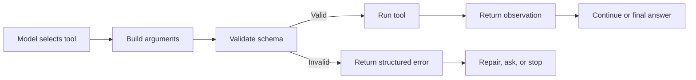

# Tool Schemas

<div class="topic-page topic-page--tool-schemas" markdown="1">

<section class="topic-hero topic-hero--prompt">
  <span class="topic-hero__eyebrow">Stage 05 · Tools and Actions</span>
  <p class="topic-hero__lead">Tool schemas define the contract between an AI agent and the tools it can call. They describe valid inputs, expected outputs, constraints, errors, and safety rules so tool use is structured instead of vague.</p>
  <div class="topic-hero__facts">
    <span>Name</span>
    <span>Input</span>
    <span>Validate</span>
    <span>Execute</span>
    <span>Observe</span>
  </div>
</section>

## Goal

By the end of this topic, you should be able to:

- Define a tool schema clearly.
- Explain why schemas matter for agent tool use.
- Read a JSON Schema-style tool definition.
- Identify required fields, types, enums, and limits.
- Understand input schemas, output schemas, and error shapes.
- Decide what belongs in a schema versus permissions or prompt instructions.

## Learning Path

This page focuses only on tool schemas.

<div class="learning-grid learning-grid--path">
  <a class="learning-card" href="#part-1-the-core-idea">
    <strong>Part 1 · Core Idea</strong>
    <span>Understand what a tool schema is and why agents need it.</span>
  </a>
  <a class="learning-card" href="#part-2-anatomy-of-a-schema">
    <strong>Part 2 · Anatomy</strong>
    <span>Learn tool names, descriptions, input fields, constraints, outputs, and errors.</span>
  </a>
  <a class="learning-card" href="#part-3-reading-a-tool-schema">
    <strong>Part 3 · Schema Reading</strong>
    <span>Read valid and invalid tool calls against a schema.</span>
  </a>
  <a class="learning-card" href="#part-4-using-schemas-in-agent-loops">
    <strong>Part 4 · Agent Loop</strong>
    <span>See where validation, execution, observation, and repair happen.</span>
  </a>
</div>

## Part 1: The Core Idea

A tool schema is a structured contract for a tool call.

It tells the agent and the application:

- what the tool is called
- what the tool is for
- which arguments the tool accepts
- which arguments are required
- what types and values are allowed
- what the tool returns
- how errors should be represented

Without a schema, a tool call is vague:

```text
Search the tickets for open bugs.
```

With a schema, the call becomes structured:

```json
{
  "tool": "search_tickets",
  "arguments": {
    "status": "open",
    "assignee": "me",
    "limit": 10
  }
}
```

The schema does not execute the tool. It describes what a valid call looks like
so the application can validate the request before running code.

### One-Sentence Definition

```text
A tool schema is the contract that defines valid tool inputs and expected tool outputs for an agent.
```

### Why Tool Schemas Exist

Tools let agents interact with databases, APIs, files, browsers, calendars,
issue trackers, calculators, and messaging systems. That makes agents useful,
but it also creates risk.

Schemas help because they make tool calls:

- structured
- checkable
- easier to debug
- safer to execute
- easier for the model to choose correctly
- easier for the application to reject when invalid

| Without schemas | With schemas |
| --- | --- |
| Arguments are vague text | Arguments have names and types |
| Required fields may be missing | Required fields are enforced |
| The model may invent parameters | Unknown fields can be rejected |
| Validation happens late or not at all | Validation happens before execution |
| Tool output may be hard to parse | Output shape can be documented |
| Debugging is guesswork | Calls and failures are inspectable |

## Part 2: Anatomy of a Schema

A useful tool schema has a few standard parts.

| Part | What It Means | Simple Example |
| --- | --- | --- |
| Tool name | Which tool the model can request | `search_tickets` |
| Description | What the tool does and when to use it | Search support tickets |
| Input schema | The allowed arguments | `status`, `assignee`, `limit` |
| Required fields | Arguments that must be present | `status` |
| Types | Expected value types | string, integer, boolean |
| Constraints | Limits on valid values | enum, min, max |
| Output shape | What the tool returns | ticket IDs, titles, priorities |
| Error shape | How failures are reported | invalid input, unauthorized, not found |

### Tool Name

Use a clear, specific name. The name should describe the action.

| Weak Name | Better Name |
| --- | --- |
| `run` | `run_unit_tests` |
| `get_data` | `get_customer_orders` |
| `tool_1` | `search_support_tickets` |
| `update` | `update_ticket_status` |

The model uses the tool name as a signal. A vague name makes the wrong tool more
likely.

### Description

The description tells the model when the tool is useful.

Weak description:

```text
Gets data.
```

Better description:

```text
Search support tickets by status, assignee, priority, or keyword. Use this
when the user asks about ticket counts, ticket summaries, or unresolved issues.
```

Good descriptions reduce unnecessary tool calls and help the model choose
between similar tools.

### Input Fields

Input fields define the data the tool accepts.

| Field | Type | Purpose |
| --- | --- | --- |
| `status` | string enum | Filter tickets by workflow state |
| `assignee` | string | Filter tickets assigned to a person |
| `limit` | integer | Limit the number of results |
| `include_closed` | boolean | Include closed tickets when true |

Fields should be narrow enough to validate. Avoid catch-all fields like
`payload`, `data`, or `instructions` unless the tool truly needs free-form
input.

### Required Fields and Constraints

Required fields prevent incomplete calls. Constraints prevent invalid values.

Common constraints include:

- allowed enum values
- minimum and maximum numbers
- string length limits
- array length limits
- required object fields
- date or email formats
- disallowing unknown fields

Example:

```json
{
  "status": "open",
  "limit": 25
}
```

The schema can allow `status` values such as `open`, `pending`, and `resolved`,
while rejecting unsupported values such as `maybe` or `all of them`.

### Input Schemas vs Output Schemas

Input schemas protect the tool from bad arguments. Output schemas protect the
agent from unclear observations.

| Schema Type | Purpose | Example |
| --- | --- | --- |
| Input schema | Validates what the model sends to the tool | `ticket_id`, `status`, `limit` |
| Output schema | Defines what the tool returns to the model | `id`, `title`, `priority`, `url` |

Many teams focus only on input schemas. Output schemas also matter because the
model uses tool results as evidence for the next step.

## Part 3: Reading a Tool Schema

This is a simple JSON Schema-style input definition for a ticket search tool.

```json
{
  "type": "object",
  "properties": {
    "status": {
      "type": "string",
      "enum": ["open", "pending", "resolved"],
      "description": "Ticket status to search for."
    },
    "assignee": {
      "type": "string",
      "description": "Person assigned to the ticket. Use 'me' for the current user."
    },
    "limit": {
      "type": "integer",
      "minimum": 1,
      "maximum": 50,
      "default": 10,
      "description": "Maximum number of tickets to return."
    }
  },
  "required": ["status"],
  "additionalProperties": false
}
```

### What This Schema Says

| Schema Part | Meaning |
| --- | --- |
| `type: object` | The input must be a JSON object |
| `status` | The tool can filter by ticket status |
| `enum` | `status` must be `open`, `pending`, or `resolved` |
| `assignee` | The tool can filter by assigned person |
| `limit` | The tool can limit the number of returned tickets |
| `minimum` and `maximum` | `limit` must stay between 1 and 50 |
| `required` | `status` must be present |
| `additionalProperties: false` | Unknown fields are rejected |

### Valid Tool Call

```json
{
  "status": "open",
  "assignee": "me",
  "limit": 10
}
```

This is valid because:

- `status` is present
- `status` uses an allowed value
- `limit` is inside the allowed range
- there are no unknown fields

### Invalid Tool Call

```json
{
  "status": "urgent",
  "limit": 500,
  "sort_by_magic": true
}
```

This should be rejected because:

- `urgent` is not an allowed status
- `500` is outside the allowed limit range
- `sort_by_magic` is not defined in the schema

### Output Example

```json
{
  "tickets": [
    {
      "id": "SUP-1042",
      "title": "Login fails after password reset",
      "priority": "high",
      "status": "open",
      "url": "https://example.com/tickets/SUP-1042"
    }
  ],
  "count": 1
}
```

This output is easier for the agent to use than a long paragraph because the
fields are named and predictable.

## Part 4: Using Schemas in Agent Loops

Tool schemas sit between the model and the tool implementation.



The model proposes a tool call. The application validates the call. The tool
runs only if the call is valid and allowed.

### Tool Schema in the Loop

| Loop Step | What Happens | Schema Role |
| --- | --- | --- |
| Plan | The model chooses a tool | Tool name and description guide selection |
| Act | The model generates arguments | Input schema defines valid fields |
| Validate | The app checks the call | Required fields, types, and constraints are enforced |
| Execute | The app runs the tool | Only valid calls reach the implementation |
| Observe | The tool returns a result | Output shape makes the result readable |
| Reflect | The agent decides next step | Error shape helps repair, retry, ask, or stop |

### Simple Loop Example

```text
Goal:
Close ticket SUP-1042.

Reason:
I need to update the ticket status.

Tool call:
update_ticket_status({"ticket_id": "SUP-1042", "status": "closed"})

Validation:
Reject. "closed" is not an allowed status.

Next step:
Use "resolved" if that matches the user's intent, or ask for confirmation.
```

The schema prevents an unsupported status from reaching the ticket system.

### Error Shape

Errors should be structured too.

```json
{
  "ok": false,
  "error": {
    "code": "invalid_status",
    "message": "status must be one of: open, pending, resolved",
    "retryable": true
  }
}
```

This gives the agent enough information to repair the call or ask the user.

### Permissions Are Not the Same as Schemas

A valid schema does not make a tool call safe. It only means the arguments have
the expected shape.

| Control | Question It Answers | Example |
| --- | --- | --- |
| Schema | Are the arguments valid? | `status` is an allowed value |
| Permission | Is the caller allowed? | User can update this ticket |
| Policy | Is the action acceptable? | Do not send email without approval |
| Runtime limit | Is the request bounded? | Return at most 50 results |

Use schemas with permissions, policy checks, logging, and human approval for
high-impact actions.

## Common Misunderstandings

| Misunderstanding | Correction | Simple Example |
| --- | --- | --- |
| A schema runs the tool | No. A schema only defines valid input and output shapes. | The app still executes `search_tickets`. |
| A valid schema means the action is safe | No. Permissions and policy checks are still needed. | `delete_file({"path": "report.md"})` may be valid but still require approval. |
| Tool descriptions are enough | No. Descriptions guide the model, but schemas let the app validate. | `limit` should still have a maximum. |
| More fields make a better schema | No. Too many fields can confuse tool selection and validation. | Prefer `search_tickets` fields over a giant free-form `payload`. |
| Output shape does not matter | No. Agents reason from observations, so output should be structured. | Return `id`, `title`, and `priority`, not a vague paragraph. |

## Practice

### Exercise 1: Label the Schema Parts

Label each line as `tool name`, `description`, `required field`, `enum`,
`numeric limit`, or `unknown-field rule`.

```json
{
  "name": "search_tickets",
  "description": "Search support tickets by status and assignee.",
  "required": ["status"],
  "properties": {
    "status": { "type": "string", "enum": ["open", "pending", "resolved"] },
    "limit": { "type": "integer", "minimum": 1, "maximum": 50 }
  },
  "additionalProperties": false
}
```

### Exercise 2: Valid or Invalid?

For each tool call, decide whether it is valid.

| Tool Call | Valid? | Reason |
| --- | --- | --- |
| `{"status": "open", "limit": 10}` |  |  |
| `{"status": "urgent", "limit": 10}` |  |  |
| `{"status": "open", "limit": 500}` |  |  |
| `{"assignee": "me", "limit": 10}` |  |  |
| `{"status": "pending", "sort_by_magic": true}` |  |  |

### Exercise 3: Complete the Schema

Fill in the missing constraints.

```json
{
  "type": "object",
  "properties": {
    "ticket_id": { "type": "string" },
    "status": {
      "type": "string",
      "enum": [{add allowed statuses}]
    }
  },
  "required": [{add required fields}],
  "additionalProperties": false
}
```

### Exercise 4: Design a Tool Schema

Design a schema for this tool:

```text
Find the oldest unresolved issue assigned to a user.
```

Include:

1. Tool name.
2. Description.
3. Required fields.
4. Allowed enum values.
5. Numeric limits.
6. Output shape.
7. Error shape.
8. Permission rule.

## Exit Criteria

You understand this topic when you can:

- Define a tool schema as a contract for tool calls.
- Explain why schemas are needed before tool execution.
- Read required fields, types, enums, limits, and unknown-field rules.
- Identify whether a tool call is valid or invalid.
- Explain the difference between input schema and output schema.
- Explain why schemas are different from permissions and prompt instructions.
- Design a small schema for a tool-using agent.

## Further Reading

- [JSON Schema](https://json-schema.org/)
- [Pydantic](https://docs.pydantic.dev/)
- [Zod](https://zod.dev/)
- [OpenAPI Specification](https://spec.openapis.org/oas/latest.html)

</div>
