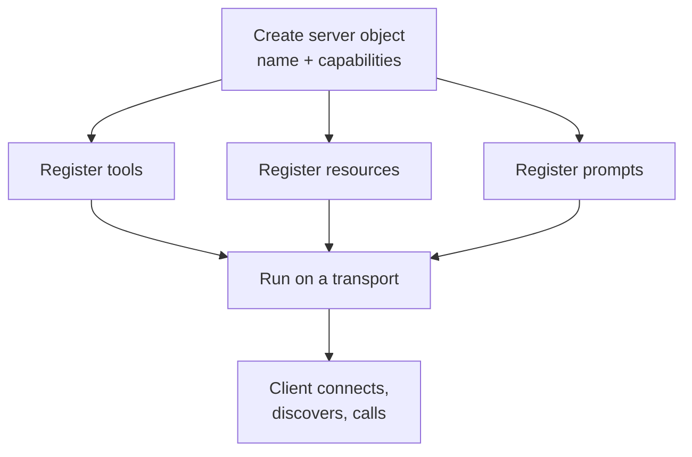

# Building MCP Servers

<div class="topic-page" markdown="1">

<section class="topic-hero">
  <span class="topic-hero__eyebrow">Stage 06 - Model Context Protocol</span>
  <p class="topic-hero__lead">An MCP server is just a small program that advertises what it can do and answers requests. With a modern SDK you can build a working one in a few lines. This topic walks from an empty file to a tested, safe server that exposes a tool, a resource, and a prompt.</p>
  <div class="topic-hero__facts">
    <span>FastMCP</span>
    <span>Tools</span>
    <span>Resources</span>
    <span>Prompts</span>
    <span>stdio transport</span>
    <span>MCP Inspector</span>
  </div>
</section>

## Goal

Build a real MCP server you can run and test, and understand the parts well enough to expose your own systems safely.

By the end you should be able to declare a server, add a tool, add a resource, add a prompt, run it over `stdio`, test it with the MCP Inspector, and apply basic safety controls.

This topic assumes you know the three roles from [MCP Hosts, Clients, and Servers](../mcp-hosts-clients-servers/index.md) and what tools/resources/prompts are from [Tool and Resource Exposure](../tool-and-resource-exposure/index.md).

!!! note "Code shown here uses the official Python SDK"
    Examples use the official `mcp` Python SDK and its `FastMCP` helper. APIs evolve, so always check the [Python SDK README](https://github.com/modelcontextprotocol/python-sdk) for the current syntax before shipping.

## A One-Minute Picture

A server does three things, in order:

```text
1. Declare itself        -> "I am the 'demo' server"
2. Register capabilities -> tools, resources, prompts
3. Run on a transport    -> stdio (local) or HTTP (remote)
```

Everything else — the handshake, listing capabilities, routing calls — the SDK handles for you. You mostly write normal Python functions and decorate them.

## Background: The Words You Need First

You will build a *server*, but a server never works alone. Here are the few terms used throughout this page. The [MCP Overview](../mcp-overview/index.md) and [MCP Hosts, Clients, and Servers](../mcp-hosts-clients-servers/index.md) topics explain them in full; this is the quick version.

| Term | Plain meaning | Who owns it |
| --- | --- | --- |
| **Host** | The AI application the user opens (Claude Desktop, an IDE assistant, your agent). It owns the model. | The app |
| **Client** | A connector *inside* the host that holds one connection to one server. Three servers means three clients. | The host |
| **Server** | The program you are building. It exposes a menu of capabilities for one outside system. | You |
| **Transport** | How messages travel: `stdio` (local program) or HTTP (over the network). | Both |
| **Handshake** | The first exchange when a client connects (`initialize`): agree on a version and announce what each side supports. | Client + server |
| **Discovery** | Right after the handshake, the client asks "what is on your menu?" (`tools/list`, `resources/list`, `prompts/list`). | Client asks, server answers |

The key thing to internalize before you write code:

> Your server does **not** contain an AI model. The host owns the model. Your server only exposes capabilities, and the client talks to your server — not to the model.

Every connection follows the same order, and the SDK does most of it for you:

```text
1. Connect    -> the client opens a connection to your server
2. Handshake  -> initialize: agree on protocol version + capabilities
3. Discover   -> client lists your tools, resources, and prompts
4. Use        -> client calls tools / reads resources, reusing the connection
```

You write step 4's functions. The SDK handles steps 1-3.

## Learning Path

This topic is designed in four parts. Read them in order.

<div class="learning-grid learning-grid--path">
  <a class="learning-card" href="#part-1-the-anatomy-of-a-server">
    <strong>Part 1 - Anatomy of a Server</strong>
    <span>The three jobs every MCP server does.</span>
  </a>
  <a class="learning-card" href="#part-2-build-a-minimal-server">
    <strong>Part 2 - A Minimal Server</strong>
    <span>A working server with one tool, run over stdio.</span>
  </a>
  <a class="learning-card" href="#part-3-add-a-resource-and-a-prompt">
    <strong>Part 3 - Add a Resource and a Prompt</strong>
    <span>Expose readable data and a reusable template.</span>
  </a>
  <a class="learning-card" href="#part-4-test-debug-and-harden">
    <strong>Part 4 - Test, Debug, and Harden</strong>
    <span>Use the Inspector, validate inputs, apply least privilege.</span>
  </a>
</div>

## Part 1: The Anatomy of a Server

Every MCP server, in any language, follows the same shape.



**How to read this diagram:** you declare a server, attach capabilities to it, and start it on a transport. The client then connects and discovers whatever you registered.

The three capability types map to three different intents:

| You want the agent to... | Use a | Side effects? |
| --- | --- | --- |
| *do* something | Tool | Yes, allowed |
| *read* something | Resource | No, read-only |
| *reuse* a proven instruction | Prompt | No |

Keeping these honest matters: a "resource" that secretly writes data, or a "tool" with a misleading name, makes the whole system harder to reason about and to secure.

## Part 2: Build a Minimal Server

First install the SDK. The `[cli]` extra adds the development and Inspector commands.

```bash
pip install "mcp[cli]"
```

Now the smallest useful server — one tool, run over `stdio`:

```python
# server.py
from mcp.server.fastmcp import FastMCP

# 1. Declare the server
mcp = FastMCP("demo")


# 2. Register a tool. The docstring becomes the tool description
#    that the model sees, so write it clearly.
@mcp.tool()
def add(a: int, b: int) -> int:
    """Add two numbers and return the result."""
    return a + b


# 3. Run it. With no transport argument, FastMCP uses stdio,
#    which is the right choice for a local server.
if __name__ == "__main__":
    mcp.run()
```

That is a complete MCP server. Three things to notice:

- **The name** (`"demo"`) is how the host refers to this server.
- **Type hints** (`a: int, b: int -> int`) are turned into the tool's input/output schema automatically.
- **The docstring** is not a comment — it is the description the model uses to decide when to call the tool. Vague docstrings cause wrong tool choices.

### How a Host Launches It

For a local `stdio` server, the host starts your script as a subprocess and talks to it over standard input/output. A typical host configuration looks like this:

```json
{
  "mcpServers": {
    "demo": {
      "command": "python",
      "args": ["/absolute/path/to/server.py"]
    }
  }
}
```

The host runs the command, the SDK speaks MCP over the pipe, and your `add` tool becomes available. You will see the full transport story in [Local vs Remote MCP](../local-vs-remote-mcp/index.md).

## Part 3: Add a Resource and a Prompt

A server with only tools is fine, but most real servers also expose readable data and reusable prompts. Add both to the same file.

```python
# server.py (continued)
from mcp.server.fastmcp import FastMCP

mcp = FastMCP("demo")


@mcp.tool()
def add(a: int, b: int) -> int:
    """Add two numbers and return the result."""
    return a + b


# A resource: read-only data. The URI can contain parameters
# in braces, which are passed to the function.
@mcp.resource("greeting://{name}")
def get_greeting(name: str) -> str:
    """Return a personalized greeting for the given name."""
    return f"Hello, {name}!"


# A prompt: a reusable template the host can offer to the user.
@mcp.prompt(title="Code Review")
def review_code(code: str) -> str:
    """Build a code-review prompt for the given snippet."""
    return f"Please review this code and list any bugs:\n\n{code}"


if __name__ == "__main__":
    mcp.run()
```

What changed:

| Capability | Decorator | Key idea |
| --- | --- | --- |
| Resource | `@mcp.resource("greeting://{name}")` | A URI identifies the data; `{name}` is a parameter. |
| Prompt | `@mcp.prompt(title="Code Review")` | Returns text (or messages) the host can reuse. |

Resources should stay **read-only**. If `get_greeting` started writing to a database, it should be a tool instead. This honesty is what lets a host safely auto-read resources while gating tools behind approval.

## Part 4: Test, Debug, and Harden

### Test With the MCP Inspector

You do not need a full host to test a server. The MCP Inspector is an interactive tool that connects to your server, lists its capabilities, and lets you call them by hand.

```bash
mcp dev server.py
```

This launches the [MCP Inspector](https://modelcontextprotocol.io/docs/tools/inspector) pointed at your server (it runs the Inspector via `npx`, so you need Node.js installed). Use it to confirm:

- the server initializes without errors
- `add`, `greeting://{name}`, and the `Code Review` prompt all appear
- calling `add` with `{ "a": 2, "b": 3 }` returns `5`
- the resource returns the greeting you expect

Testing here first saves you from debugging through a full host UI.

### Validate Inputs

The SDK validates types from your hints, but it does not know your business rules. Add the checks the schema cannot express.

```python
@mcp.tool()
def divide(a: float, b: float) -> float:
    """Divide a by b. b must not be zero."""
    if b == 0:
        raise ValueError("b must not be zero")
    return a / b
```

A clear error is better than a crash: the host can show it, and the model can recover or ask the user.

### Apply Least Privilege

A server is a doorway into a real system. Give it the smallest doorway that does the job.

| Control | What it looks like in practice |
| --- | --- |
| Expose few tools | Only register what this server genuinely needs to offer. |
| Separate read from write | Prefer resources for reading; make writes explicit tools. |
| Scope access | A filesystem server should be limited to one directory, not the whole disk. |
| Validate everything | Never pass raw tool input into a shell, SQL query, or path. |
| Fail safe | On bad input, raise a clear error instead of guessing. |
| Keep secrets out of results | Do not return tokens, keys, or private data as resource content. |

Two roles share the safety job: the **host** decides whether a write needs user confirmation, but the **server** decides whether a dangerous tool exists at all. The safest tool is the one you never expose. This page only covers the controls you bake into the server itself — for the full treatment of trust boundaries, sandboxing, and approval flows, see [Security Boundaries for MCP-Connected Tools](../security-boundaries-conn-tool/index.md).

### Common Failure Modes

| Symptom | Likely cause |
| --- | --- |
| Model never calls your tool | Vague or missing docstring/description. |
| Tool call fails with a schema error | Missing or wrong type hints on parameters. |
| Server "does nothing" when run directly | A `stdio` server is meant to be launched by a host or the Inspector, not chatted with in a terminal. |
| Resource returns nothing | URI template parameters do not match the function arguments. |

## Practice

Extend the server in this topic:

1. Add a `multiply(a, b)` tool with a clear docstring.
2. Add a resource `config://settings` that returns a small JSON string.
3. Run `mcp dev server.py` and call every capability from the Inspector.
4. Break one thing on purpose (remove a type hint, empty a docstring) and note how the failure shows up.

## Mini Project

Build a small but real read-only server for a single domain you know — for example a "notes" server.

- Expose one tool: `search_notes(query)`.
- Expose one resource: `note://{id}` that returns a note's text.
- Expose one prompt: a "summarize this note" template.
- Write down which operations are read-only, which (if any) could become writes later, and what directory or data the server is allowed to touch.
- Test all three capabilities in the Inspector and record the results.

The deliverable is a running server plus a short note explaining its permission boundary.

## Exit Criteria

You are ready to move on when you can:

- install the SDK and run a server over `stdio`
- explain why the docstring and type hints matter
- add a tool, a resource, and a prompt, and say why each is that kind
- test a server with the MCP Inspector
- list at least three safety controls you applied and why
- describe how a host launches a local `stdio` server

## Resources

- [Model Context Protocol Python SDK (README + quickstart)](https://github.com/modelcontextprotocol/python-sdk)
- [Model Context Protocol: Build an MCP server](https://modelcontextprotocol.io/quickstart/server)
- [Model Context Protocol: Inspector](https://modelcontextprotocol.io/docs/tools/inspector)
- [Anthropic: Model Context Protocol announcement](https://www.anthropic.com/news/model-context-protocol)
- [Collabnix: How to Build and Host Your Own MCP Servers](https://collabnix.com/how-to-build-and-host-your-own-mcp-servers-in-easy-steps/)
- [punkpeye/awesome-mcp-servers (examples to learn from)](https://github.com/punkpeye/awesome-mcp-servers)
- [Model Context Protocol: Security Best Practices](https://modelcontextprotocol.io/specification/2025-06-18/basic/security_best_practices)

</div>
