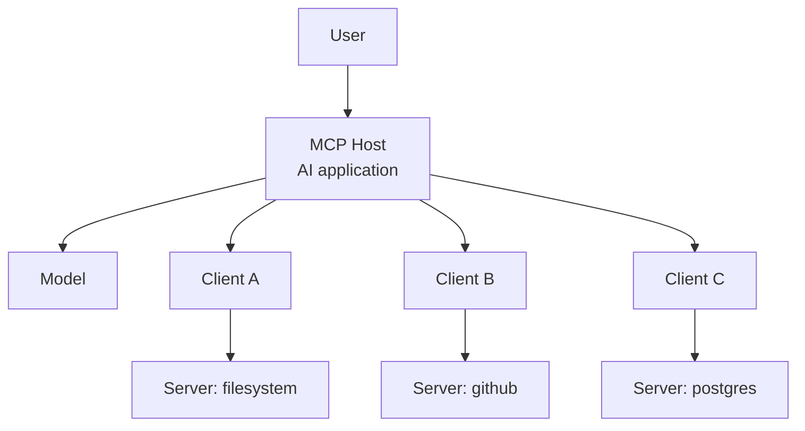
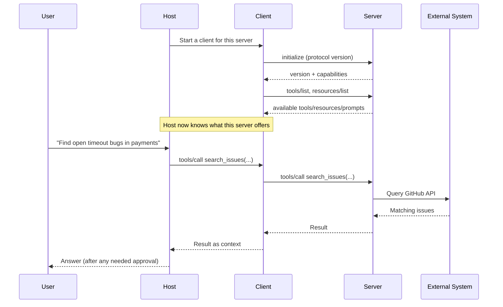

# MCP Hosts, Clients, and Servers

<div class="topic-page" markdown="1">

<section class="topic-hero">
  <span class="topic-hero__eyebrow">Stage 06 - Model Context Protocol</span>
  <p class="topic-hero__lead">Every MCP connection has three roles: a <strong>host</strong> (the AI application), one or more <strong>clients</strong> (the connection objects inside the host), and the <strong>servers</strong> they connect to (programs that expose tools, resources, and prompts). Getting these three roles straight is the difference between understanding MCP and guessing at it.</p>
  <div class="topic-hero__facts">
    <span>Host</span>
    <span>Client</span>
    <span>Server</span>
    <span>One client per server</span>
    <span>Capability negotiation</span>
  </div>
</section>

## Goal

Learn exactly what each MCP component does, who owns what, and how a host, its clients, and a server set up and use a connection.

After this topic you should be able to point at any part of an MCP system and say which role it plays, and explain why the client and server are kept separate.

This topic builds on the [MCP Overview](../mcp-overview/index.md). The overview introduced the three roles in one table; here we go one level deeper into each one.

## A One-Minute Picture

A host is the app the user actually opens — a chat app, an IDE assistant, or a custom agent. By itself it knows nothing about your files, your repos, or your database.

To reach those systems, the host opens a separate **client** connection for each **server** it wants to use. Each server sits in front of one external system and offers a menu of capabilities.

```text
Claude Desktop (1 host)
 ├─ client A ──► filesystem server   ──► your disk
 ├─ client B ──► github server       ──► GitHub API
 └─ client C ──► postgres server     ──► your database
```

The key rule, which surprises many beginners:

> One MCP client manages exactly one connection to one MCP server. A host with three servers runs three clients.

## Learning Path

This topic is designed in four parts. Read them in order.

<div class="learning-grid learning-grid--path">
  <a class="learning-card" href="#part-1-the-host">
    <strong>Part 1 - The Host</strong>
    <span>The AI application that owns the model, the user, and the security rules.</span>
  </a>
  <a class="learning-card" href="#part-2-the-client">
    <strong>Part 2 - The Client</strong>
    <span>The connection object inside the host. One client per server.</span>
  </a>
  <a class="learning-card" href="#part-3-the-server">
    <strong>Part 3 - The Server</strong>
    <span>The program that exposes tools, resources, and prompts for one system.</span>
  </a>
  <a class="learning-card" href="#part-4-how-they-work-together">
    <strong>Part 4 - How They Work Together</strong>
    <span>Follow the connection lifecycle from initialize to tool call.</span>
  </a>
</div>

## Part 1: The Host

The **host** is the AI application the user interacts with. It is the part you install, open, or build.

Common hosts:

- AI desktop apps (for example, Claude Desktop)
- IDE assistants (for example, an MCP-enabled VS Code or a coding agent)
- chatbots and customer-facing assistants
- your own custom agent application

### What the Host Owns

The host is the trusted center of the system. It owns the things a server is never allowed to control.

| The host owns | Why it lives here |
| --- | --- |
| The model connection | The host decides which model runs and what it sees. |
| The user relationship | The host shows results and asks the user for approval. |
| Security and permissions | The host enforces what each server is allowed to do. |
| The set of clients | The host starts, stops, and routes each client connection. |
| The conversation/context | The host decides what context to assemble for the model. |

A useful way to say it:

> The host is the only place that sees the whole picture — the user, the model, and every server at once.

### The Host Coordinates Many Clients

A real assistant usually needs several systems at the same time. The host handles this by running one client per server and routing requests to the right one.



**How to read this diagram:** the host sits in the middle. The model is one of the things the host coordinates — not the thing that talks to servers directly. Servers never talk to each other; everything passes through the host.

## Part 2: The Client

The **client** is a connection object that lives **inside** the host. Its only job is to maintain one connection to one server and speak the MCP protocol over it.

!!! warning "Correct a common misconception"
    A client is **not** "the part that talks to the language model API." The model connection belongs to the host. An MCP client talks to an MCP **server**. Keeping these separate is the whole point of the design.

### What the Client Does

| The client handles | What that means in practice |
| --- | --- |
| The handshake | Runs `initialize` and agrees on a protocol version with the server. |
| Capability negotiation | Learns what the server supports (tools, resources, prompts, notifications). |
| Discovery requests | Calls `tools/list`, `resources/list`, `prompts/list`. |
| Sending calls | Sends `tools/call` and `resources/read` when the host asks. |
| Receiving updates | Receives notifications when the server's capabilities change. |

### Why One Client Per Server

Each server is a separate trust boundary with its own capabilities and its own connection state. Giving each server its own client keeps them isolated.

| If clients were shared | Why one-per-server is better |
| --- | --- |
| One slow server could block others | Each connection is independent. |
| A buggy server could see another server's traffic | Servers stay isolated from each other. |
| Capability lists would get tangled | Each client tracks exactly one server's capabilities. |
| Permissions would be hard to scope | The host can grant different permissions per client. |

```text
Host
 ├─ Client(github)    <-- knows only the github server
 ├─ Client(postgres)  <-- knows only the postgres server
 └─ Client(files)     <-- knows only the filesystem server
```

The client is deliberately "dumb" about strategy. It does not decide *whether* to call a tool — that is the host's and model's job. It only knows *how* to carry the message.

## Part 3: The Server

An **MCP server** is a program that exposes capabilities for one external system through the protocol. It is the adapter that turns "GitHub" or "your filesystem" into a standard MCP menu.

!!! warning "Correct a common misconception"
    An MCP server is **not** a "shared memory hub" that all agents read and write. A server exposes **capabilities** — tools to call, resources to read, prompts to reuse. Some servers happen to wrap a database or a memory store, but that is one use case, not the definition.

### What a Server Exposes

Servers expose three standard primitives. You met these in the [Tool and Resource Exposure](../tool-and-resource-exposure/index.md) topic; here is the short version.

| Primitive | Meaning | Example |
| --- | --- | --- |
| Tools | Actions the host can invoke | `search_issues`, `create_ticket` |
| Resources | Readable context data | a file, a database schema, a doc page |
| Prompts | Reusable prompt templates | a code-review prompt, an incident-summary prompt |

### What a Server Is Responsible For

| The server handles | Why it matters |
| --- | --- |
| Declaring capabilities | The client cannot use what the server does not advertise. |
| Backing one external system | A server usually wraps one API, database, or file tree. |
| Validating inputs | The server must defend against malformed or unsafe calls. |
| Returning clean results | Results become context the host may show the model. |
| Honoring its own permissions | A read-only server should never offer destructive tools. |

### A Server Is a Boundary, Not a Brain

The server does not reason, plan, or decide what the user wants. It answers requests. The intelligence stays in the host and model.

```text
Client: tools/call search_issues { "repo": "payments", "q": "timeout" }
Server: -> queries the GitHub API
Server: <- returns matching issues as a result
```

That clean request/response shape is what lets the same GitHub server work in Claude Desktop, in an IDE assistant, or in your own agent without changes. Building one of these is covered in [Building MCP Servers](../building-mcp-servers/index.md).

## Part 4: How They Work Together

MCP connections are **stateful**. The host does not just fire a one-off request — the client and server first set up the connection, then reuse it.

### The Connection Lifecycle



**How to read this diagram:** there are two phases. First a **setup** phase (`initialize` then discovery). Then a **use** phase that can repeat many times over the same connection. The host stays in control the whole time and is where user approval happens.

### Who Decides What

It helps to be precise about which role makes which decision.

| Decision | Made by |
| --- | --- |
| "Which servers may we connect to?" | Host (and its configuration) |
| "What does this server offer?" | Server declares it; client discovers it |
| "Should we call a tool right now?" | Host + model |
| "How is the message framed and sent?" | Client |
| "Is this call allowed / does it need approval?" | Host |
| "How is the action actually performed?" | Server + external system |

Because the host is the only role that gates actions, it is also where most security controls live. The deep treatment is in [Security Boundaries for MCP-Connected Tools](../security-boundaries-conn-tool/index.md).

### End-to-End Walkthrough

Imagine a developer assistant connected to a `github` server.

```text
1. Host starts a client for the github server.
2. Client runs initialize; server reports it supports tools.
3. Client calls tools/list; server returns search_issues and create_issue.
4. Host registers those tools so the model can choose them.
5. User: "Is the payment timeout already reported?"
6. Model chooses search_issues; host routes it through the client.
7. Client sends tools/call to the server; server queries GitHub.
8. Result returns to the host as context; model summarizes it.
9. User: "File a new bug." -> create_issue is a write, so the host
   asks the user to confirm before the client sends the call.
```

Notice that the only place a destructive action is gated is the **host**. The server offers `create_issue`; the host decides it needs confirmation.

## Practice

Take one assistant idea (a developer assistant, a support assistant, or a data assistant) and write out its role map:

- which app is the **host**
- which **servers** it connects to (one line each)
- how many **clients** that implies
- for each server, list two tools and one resource it might expose
- mark which tool calls the host should require confirmation for

Keep it to one page. The goal is to assign every capability to the correct role.

## Mini Project

Write a short "role audit" of a real MCP host you can try, such as Claude Desktop or an MCP-enabled IDE.

1. Configure it to connect to one simple server (for example, a filesystem server).
2. Identify, in your setup, what is the host, what is the client, and what is the server.
3. Use the host to read a file through the server.
4. Write down: which role enforced the directory permission, and which role actually read the file.

This proves you can map the three roles onto a running system, not just a diagram.

## Exit Criteria

You are ready to move on when you can:

- define host, client, and server in one sentence each
- explain why there is one client per server
- explain why the client does **not** talk to the model
- explain why a server is a capability boundary, not a memory hub
- walk through the initialize -> discovery -> tool-call lifecycle
- say which role decides whether a tool call is allowed

## Resources

- [Model Context Protocol: Architecture overview](https://modelcontextprotocol.io/docs/concepts/architecture)
- [Model Context Protocol: Introduction](https://modelcontextprotocol.io/introduction)
- [Model Context Protocol GitHub repository](https://github.com/modelcontextprotocol/modelcontextprotocol)
- [Anthropic: Introducing the Model Context Protocol](https://www.anthropic.com/news/model-context-protocol)
- [punkpeye/awesome-mcp-servers (server catalog)](https://github.com/punkpeye/awesome-mcp-servers)
- [Microsoft: Introducing the Azure MCP Server](https://devblogs.microsoft.com/azure-sdk/introducing-the-azure-mcp-server/)
- [AWS: MCP Servers for Code Assistants](https://aws.amazon.com/blogs/machine-learning/introducing-aws-mcp-servers-for-code-assistants-part-1/)
- [Guangzheng Li: The Ultimate Guide to MCP](https://guangzhengli.com/blog/en/model-context-protocol)

</div>
