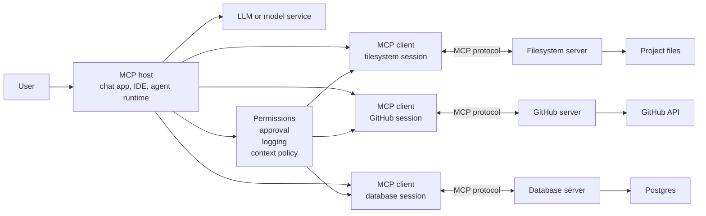
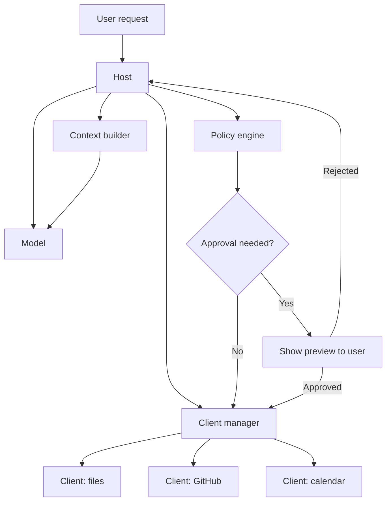
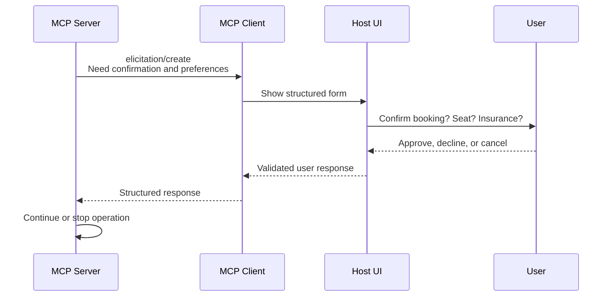
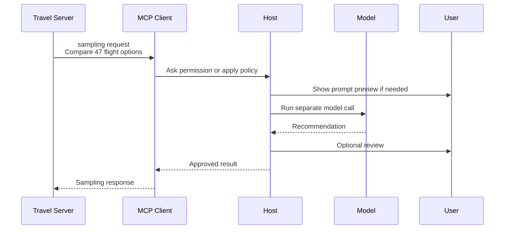
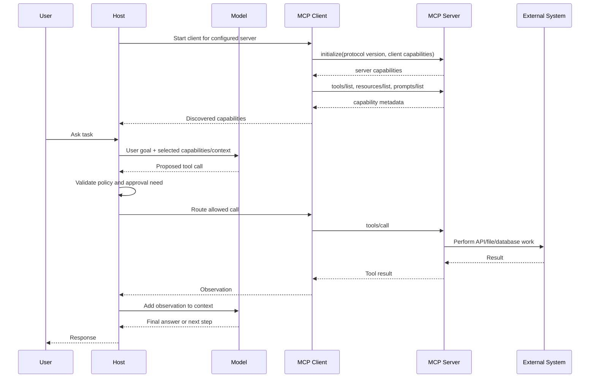
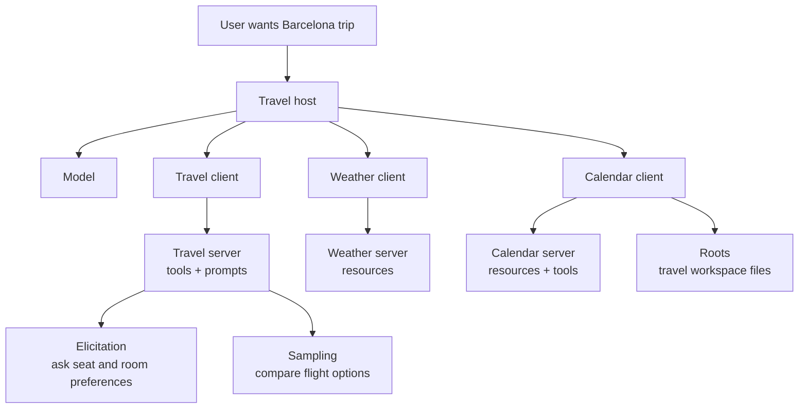

# MCP Hosts, Clients, and Servers

<div class="topic-page" markdown="1">

<section class="topic-hero">
  <span class="topic-hero__eyebrow">Stage 06 - Model Context Protocol</span>
  <p class="topic-hero__lead">MCP systems have three main roles: the host, the client, and the server. The host is the AI application the user opens. Each client is one protocol connection inside the host. Each server exposes tools, resources, and prompts for one external system. Once these roles are clear, MCP becomes much easier to design, debug, and secure.</p>
  <div class="topic-hero__facts">
    <span>Host app</span>
    <span>One client per server</span>
    <span>Server capabilities</span>
    <span>Tools, resources, prompts</span>
    <span>User control</span>
  </div>
</section>

## Goal

Learn what MCP hosts, clients, and servers do, how they connect, and how responsibility is split between them.

After this topic, you should be able to:

- define host, client, and server in plain English,
- explain why a host usually runs one client per server,
- explain why the model does not talk directly to MCP servers,
- distinguish server-provided tools, resources, and prompts,
- explain client-side features such as elicitation, roots, and sampling,
- trace the initialize, discovery, tool-call, and result flow,
- decide which role should enforce user approval, permissions, and security boundaries.

This topic builds on the [MCP Overview](../mcp-overview/index.md). The overview introduced the roles; this page explains how they behave in a real agent application.

## A One-Minute Picture

A **host** is the AI application the user interacts with. A **client** is a protocol connection inside that host. A **server** is a separate program that exposes capabilities for an external system.

```text
Claude Desktop, IDE assistant, or custom agent = Host

Host
 ├─ MCP client A -> filesystem server -> project files
 ├─ MCP client B -> GitHub server     -> GitHub API
 └─ MCP client C -> database server   -> Postgres
```

The beginner rule:

```text
One MCP client manages one direct connection to one MCP server.
```

If a host connects to three servers, it usually has three client sessions.

## Learning Path

This topic is designed in six parts. Read them in order.

<div class="learning-grid learning-grid--path">
  <a class="learning-card" href="#part-1-the-three-roles">
    <strong>Part 1 - Three Roles</strong>
    <span>Separate host, client, and server clearly.</span>
  </a>
  <a class="learning-card" href="#part-2-the-host">
    <strong>Part 2 - Host</strong>
    <span>The AI app that owns the user, model, permissions, and experience.</span>
  </a>
  <a class="learning-card" href="#part-3-the-client">
    <strong>Part 3 - Client</strong>
    <span>The protocol connection inside the host. One client per server.</span>
  </a>
  <a class="learning-card" href="#part-4-the-server">
    <strong>Part 4 - Server</strong>
    <span>The capability provider that exposes tools, resources, and prompts.</span>
  </a>
  <a class="learning-card" href="#part-5-how-they-work-together">
    <strong>Part 5 - Full Flow</strong>
    <span>Follow setup, discovery, calls, observations, and approvals.</span>
  </a>
  <a class="learning-card" href="#part-6-design-examples">
    <strong>Part 6 - Examples</strong>
    <span>Map real assistant ideas onto MCP roles.</span>
  </a>
</div>

## Part 1: The Three Roles

The easiest mistake is to treat MCP as "a server talks to a model." That is not the right mental model.

In MCP:

- the **host** talks to the user and model,
- the **client** talks to one MCP server,
- the **server** talks to an external system,
- the model only sees capabilities and results that the host chooses to put into context.

### Role Summary

| Role | Plain Meaning | Owns | Does Not Own |
| --- | --- | --- | --- |
| Host | The AI application the user opens | User experience, model access, permission policy, context assembly, approvals | Server implementation details |
| Client | One protocol connection inside the host | Connection state, initialize handshake, discovery requests, message framing | Model reasoning or product policy |
| Server | Program exposing one external system | Tools, resources, prompts, local validation, external API/file/database access | The full user experience or model connection |

### Architecture Picture



**How to read this diagram:** the model does not directly open files, call GitHub, or query Postgres. The host decides what capabilities are available, routes requests through the right client, applies policy, and decides what results become model context.

### Quick Example

User:

```text
Check whether the payment timeout is already reported, and if not, draft an issue.
```

Possible role map:

| Need | Role That Handles It |
| --- | --- |
| Read user request | Host |
| Decide whether GitHub search is needed | Host + model |
| Carry the GitHub request | GitHub client inside the host |
| Search issues through GitHub API | GitHub MCP server |
| Return matching issues | Server -> client -> host |
| Ask approval before creating an issue | Host |
| Create the issue after approval | GitHub server |

## Part 2: The Host

The **host** is the AI application. It may be a desktop assistant, IDE assistant, chatbot, customer support app, coding agent, or custom internal agent.

Examples:

- a desktop AI app connected to local file and browser servers,
- an IDE assistant connected to filesystem, GitHub, and test-runner servers,
- a support assistant connected to ticket, CRM, policy, and email servers,
- a data assistant connected to warehouse, dashboard, and notebook servers.

### What The Host Owns

The host is the trusted center of the system because it sees the whole picture.

| Host Responsibility | Why It Belongs To The Host |
| --- | --- |
| User interface | The user approves, cancels, edits, and receives results through the host. |
| Model connection | The host decides which model is used and what context the model receives. |
| Client management | The host starts, stops, and tracks MCP clients. |
| Context assembly | The host decides which resources, tool results, prompts, and messages enter the model context. |
| Permission policy | The host gates risky actions and applies user or workspace permissions. |
| Logging and audit | The host records which server was used, what was requested, and what happened. |

The host should never blindly forward everything between the model and a server. It should inspect risk, check permission, and keep the user in control.

### Host Control Plane



The host owns the control plane: model selection, context design, permission gates, approval UI, and client routing.

### What The Host Should Decide

| Decision | Example |
| --- | --- |
| Which servers are configured? | Enable `filesystem`, `github`, and `postgres`; disable unknown servers. |
| Which server capabilities are visible to the model? | Show `search_issues`, hide `delete_repo`. |
| What resources enter context? | Include only top relevant policy chunks, not an entire database export. |
| Which actions need approval? | Draft issue automatically; require approval before posting. |
| What gets logged? | Tool name, arguments summary, server, user approval, result status. |

## Part 3: The Client

The **client** is a protocol-level component instantiated by the host to communicate with one specific MCP server.

Official MCP docs emphasize this distinction: the host is the application users interact with, while clients are the protocol components that enable server connections.

!!! warning "Common misconception"
    An MCP client is not the language model API client. The host talks to the model. The MCP client talks to an MCP server.

### What The Client Does

| Client Job | What It Means |
| --- | --- |
| Start connection | Connect to a local or remote MCP server over the configured transport. |
| Initialize | Negotiate protocol version and initial capabilities. |
| Discover capabilities | Request server tools, resources, resource templates, and prompts. |
| Send requests | Carry `tools/call`, `resources/read`, and prompt requests when the host asks. |
| Receive notifications | Track capability or root changes when supported. |
| Return responses | Send server results back to the host as observations or context. |

### Why One Client Per Server

Each server has its own connection state, capability list, trust level, and permissions.

```text
Host
 ├─ Client(files)
 │    └─ capabilities: read_file, search_files, file:// resources
 ├─ Client(github)
 │    └─ capabilities: search_issues, create_issue, repo:// resources
 └─ Client(calendar)
      └─ capabilities: list_events, create_event, calendar:// resources
```

One-client-per-server helps because:

- a slow server does not block unrelated connections,
- server capabilities do not get mixed together,
- each connection can have its own permission scope,
- a server cannot see another server's traffic,
- debugging is easier because each request has one server target.

### Client Features Servers Can Use

MCP clients can provide features back to servers. These features let servers build richer workflows while the host and client keep user control.

| Client Feature | What It Means | Example |
| --- | --- | --- |
| Elicitation | Server asks the user for structured missing information through the client. | A travel server asks for seat preference before booking. |
| Roots | Client tells a server which filesystem directories are in scope. | An IDE exposes only the opened project folder. |
| Sampling | Server asks the client to run an LLM completion on its behalf. | A flight tool asks the model to compare many flight options. |

### Elicitation Example

Elicitation is useful when a server needs missing information but should not guess.



Example request shape:

```json
{
  "method": "elicitation/create",
  "params": {
    "message": "Please confirm the Barcelona booking details.",
    "schema": {
      "type": "object",
      "properties": {
        "confirm_booking": {
          "type": "boolean",
          "description": "Confirm flights and hotel"
        },
        "seat_preference": {
          "type": "string",
          "enum": ["window", "aisle", "no preference"]
        }
      },
      "required": ["confirm_booking"]
    }
  }
}
```

Good elicitation design:

- show which server is asking,
- explain why the information is needed,
- validate user input against the schema,
- let the user decline or cancel,
- never ask for passwords, API keys, or secrets through elicitation.

### Roots Example

Roots tell filesystem-aware servers which directories are in scope.

```json
{
  "uri": "file:///home/apollo/projects/payment-service",
  "name": "Payment Service Workspace"
}
```

Roots are useful for context scoping:

```text
Host opens project folder
  -> client exposes file:// root to filesystem server
  -> server focuses search/read operations inside that root
  -> if user changes workspace, client notifies root list changed
```

!!! warning "Roots are not a complete security boundary"
    Roots communicate intended filesystem scope to well-behaved servers. Real enforcement still needs operating system permissions, sandboxing, and host policy.

### Sampling Example

Sampling lets a server request a model completion through the client instead of having its own model integration.



Sampling keeps the host in control of model choice, token limits, approvals, rate limits, and sensitive data handling.

## Part 4: The Server

An **MCP server** is a program that exposes specific capabilities to AI applications through standard protocol interfaces.

Common server examples:

- filesystem server for document and code access,
- database server for queryable records,
- GitHub server for issues, pull requests, and repositories,
- Slack server for channel history and messages,
- calendar server for schedules and event creation,
- internal API server for business workflows.

!!! warning "Common misconception"
    An MCP server is not a shared memory hub or an agent brain. It exposes capabilities. Some servers wrap memory stores, but memory is only one possible external system.

### What Servers Expose

Servers expose three core building blocks.

| Server Feature | What It Is | Who Usually Controls It | Examples |
| --- | --- | --- | --- |
| Tools | Actions the model may request through the host | Model-controlled, host-approved | `searchFlights`, `sendEmail`, `createCalendarEvent` |
| Resources | Passive context the application can read | Application-driven | `file:///README.md`, `calendar://events/2026`, database schema |
| Prompts | Reusable templates or workflows | User-controlled | `/plan-vacation`, `/summarize-meetings`, `/review-pr` |

This control split is important:

- tools can do work, so the model may request them but the host should approve risky calls,
- resources provide context, so the application decides what to retrieve and include,
- prompts are workflow templates, so users or the host typically invoke them explicitly.

### Tools

Tools are schema-defined operations that can perform work.

Protocol methods:

| Method | Purpose |
| --- | --- |
| `tools/list` | Discover available tools and their schemas. |
| `tools/call` | Execute a specific tool with arguments. |

Example tool definition:

```json
{
  "name": "search_flights",
  "description": "Search for available flights between two cities on a specific date.",
  "inputSchema": {
    "type": "object",
    "properties": {
      "origin": {
        "type": "string",
        "description": "Departure city or airport"
      },
      "destination": {
        "type": "string",
        "description": "Arrival city or airport"
      },
      "date": {
        "type": "string",
        "format": "date",
        "description": "Travel date"
      }
    },
    "required": ["origin", "destination", "date"]
  }
}
```

Tool examples:

| Tool | Risk | Host Behavior |
| --- | --- | --- |
| `search_issues(repo, query)` | Read | Usually allow inside approved repo scope. |
| `create_issue(repo, title, body)` | Write | Show draft or require confirmation. |
| `send_email(to, subject, body)` | External write | Require preview and approval. |
| `delete_database(name)` | Destructive | Deny by default or require strong approval. |

### Resources

Resources are readable context. They do not represent "actions"; they represent information the host can retrieve and decide how to use.

Protocol methods:

| Method | Purpose |
| --- | --- |
| `resources/list` | List fixed resources. |
| `resources/templates/list` | Discover URI templates with parameters. |
| `resources/read` | Retrieve resource contents. |
| `resources/subscribe` | Monitor resource changes when supported. |

Direct resource examples:

```text
file:///workspace/README.md
calendar://events/2026-06
schema://billing-db/invoices
logs://payment-service/latest-errors
```

Resource template examples:

```json
{
  "uriTemplate": "weather://forecast/{city}/{date}",
  "name": "weather-forecast",
  "title": "Weather Forecast",
  "description": "Get weather forecast for a city and date.",
  "mimeType": "application/json"
}
```

```json
{
  "uriTemplate": "repo://pull-request/{owner}/{repo}/{number}",
  "name": "pull-request-details",
  "title": "Pull Request Details",
  "description": "Read metadata, files, and comments for one pull request.",
  "mimeType": "application/json"
}
```

Resource templates can support parameter completion. For example, typing `Bar` for a city field might suggest `Barcelona`, and typing `JFK` for an airport field might suggest `JFK - John F. Kennedy International`.

### Prompts

Prompts are reusable templates that help users start structured workflows.

Protocol methods:

| Method | Purpose |
| --- | --- |
| `prompts/list` | Discover available prompts. |
| `prompts/get` | Retrieve a prompt definition and its arguments. |

Example prompt:

```json
{
  "name": "review-pr",
  "title": "Review a pull request",
  "description": "Guide the assistant through a code-review workflow.",
  "arguments": [
    {
      "name": "repo",
      "type": "string",
      "required": true
    },
    {
      "name": "pr_number",
      "type": "number",
      "required": true
    },
    {
      "name": "focus",
      "type": "string",
      "required": false
    }
  ]
}
```

Common prompt UI patterns:

- slash commands such as `/review-pr`,
- command palette entries,
- buttons for frequent workflows,
- context menu suggestions.

### What Servers Must Do Well

| Server Responsibility | Good Practice |
| --- | --- |
| Declare capabilities clearly | Use specific tool names, descriptions, schemas, MIME types, and prompt arguments. |
| Validate inputs | Reject malformed paths, IDs, dates, amounts, and unknown parameters. |
| Return clean outputs | Return structured, bounded, relevant data instead of raw giant blobs. |
| Respect scope | Follow roots, tenant filters, and configured access limits. |
| Handle errors | Return model-friendly errors rather than crashing. |
| Avoid hidden authority | Do not expose broad admin actions unless the host can gate them safely. |

## Part 5: How They Work Together

MCP connections are stateful. The client and server first set up the connection, then the host can reuse it many times.

### Connection Lifecycle



### Setup Phase vs Use Phase

| Phase | What Happens | Why It Matters |
| --- | --- | --- |
| Setup | Host starts client, client initializes, server reports capabilities. | The host learns what the server can do. |
| Discovery | Client asks for tools, resources, prompts, and templates. | The host can present or hide capabilities. |
| Use | Host routes reads or tool calls through the client. | The agent gets context or performs approved actions. |
| Update | Server or client can notify changes when supported. | Capability lists and roots stay current. |

### Who Decides What?

| Decision | Role |
| --- | --- |
| Which servers may connect? | Host configuration and user policy |
| Which client talks to which server? | Host client manager |
| What does the server offer? | Server declares; client discovers |
| Which resources are included in model context? | Host |
| Which tool should be requested? | Model, guided by host context |
| Is the call allowed? | Host policy |
| Does the user need to approve? | Host |
| How is the external work performed? | Server and external system |
| What result is shown to the model? | Host context builder |

## Part 6: Design Examples

### Example 1: Coding Assistant

User request:

```text
Find why the parser test fails and draft a fix.
```

Architecture:

```text
Host: IDE assistant

Clients and servers:
  client(files)  -> filesystem server
  client(git)    -> Git server
  client(tests)  -> test-runner server

Resources:
  file:///workspace/src/parser.py
  file:///workspace/tests/test_parser.py
  git://diff/current

Tools:
  search_files(query)
  read_file(path)
  write_file(path, patch)
  run_tests(path)
```

Approval policy:

| Action | Approval? | Reason |
| --- | --- | --- |
| Read files in workspace | No | Read-only and scoped by roots. |
| Run targeted tests | Usually no | Bounded execution if sandboxed. |
| Edit workspace file | Maybe | Depends on product policy. |
| Delete files or reset git state | Yes or deny | Destructive. |

### Example 2: Support Assistant

User request:

```text
Help this customer who says their order never arrived.
```

Architecture:

```text
Host: support agent UI

Clients and servers:
  client(help-center) -> docs server
  client(orders)      -> order database server
  client(tickets)     -> ticketing server
  client(email)       -> email server
```

Capabilities:

| Server | Resources | Tools |
| --- | --- | --- |
| Help center | `policy://shipping/missing-package` | `search_articles(query)` |
| Orders | `order://{order_id}` | `get_order_status(order_id)` |
| Tickets | `ticket://{ticket_id}` | `create_support_ticket(...)` |
| Email | draft resources | `draft_email(...)`, `send_email(...)` |

Safe flow:

```text
1. Host asks for missing order ID if needed.
2. Model requests get_order_status.
3. Host routes call through order client.
4. Server returns shipping state.
5. Host retrieves missing-package policy.
6. Model drafts customer response.
7. Host requires approval before send_email.
```

### Example 3: Travel Planner With Client Features

This example combines server features and client features.



Possible workflow:

1. User invokes a `plan-vacation` prompt.
2. Host reads calendar resources to find available dates.
3. Travel server searches flights and hotels.
4. Weather server provides forecast resources.
5. Travel server uses elicitation to ask for seat and room preferences.
6. Travel server requests sampling to compare many flight options.
7. Host asks approval before booking or sending messages.

## Common Misunderstandings

| Misunderstanding | Correction |
| --- | --- |
| "The MCP client is the app." | The host is the app. The client is a connection object inside the host. |
| "The MCP client talks to the LLM." | The host talks to the LLM. The MCP client talks to one MCP server. |
| "One client can safely multiplex all servers." | MCP is easier to scope and debug when each client manages one server connection. |
| "The server decides what the user wants." | The host and model decide strategy. The server exposes and executes capabilities. |
| "Resources and tools are the same." | Resources are readable context. Tools are invocable actions. |
| "Roots enforce security." | Roots communicate intended filesystem scope. Real enforcement needs OS permissions, sandboxing, and host policy. |
| "If the server exposes a tool, it is safe to call." | The host still needs permission checks, approval, logging, and context policy. |

## Design Checklist

When designing or reviewing an MCP setup, ask:

- What is the host application?
- Which servers are configured?
- How many clients does that imply?
- What external system does each server wrap?
- Which tools, resources, and prompts does each server expose?
- Which resources may enter model context?
- Which tools are read, write, or destructive?
- Which calls require approval?
- Are filesystem roots advisory only, or also enforced with sandboxing?
- Are tool results filtered before being shown to the model?
- Are actions and approvals logged?
- Can a server request elicitation or sampling, and how will the host control it?

## Practice

Pick one assistant idea and write a one-page role map.

Include:

1. The host application.
2. Every MCP server it connects to.
3. One MCP client per server.
4. Two tools per server.
5. One resource per server.
6. One prompt if the server provides reusable workflows.
7. Which tools require approval.
8. Whether roots, elicitation, or sampling are useful.

Example starter:

| Role Item | Example |
| --- | --- |
| Host | MCP-enabled coding assistant |
| Server 1 | Filesystem server |
| Client 1 | Filesystem client session |
| Resource | `file:///workspace/README.md` |
| Read tool | `search_files(query)` |
| Write tool | `write_file(path, content)` |
| Approval rule | Ask before overwrite, delete, or shell execution |

## Mini Project

Audit a real MCP host you can run, such as a desktop AI app or an MCP-enabled IDE.

1. Configure one safe server, such as a filesystem server limited to a test folder.
2. Identify the host, client, server, and external system.
3. List the tools, resources, and prompts the server exposes.
4. Check whether roots are configured and what they point to.
5. Use the host to read one harmless file through the server.
6. Write down which role discovered the resource, which role read it, and which role decided whether the result entered model context.
7. Try a write or risky action only if the host gives a clear approval prompt.

The goal is to prove that you can map MCP roles onto a running system, not only memorize a diagram.

## Exit Criteria

You are ready to move on when you can:

- define host, client, and server in one sentence each,
- explain why there is one client per server,
- explain why the client does not talk to the model,
- explain why a server is a capability boundary, not a memory hub,
- distinguish tools, resources, and prompts by control model,
- explain elicitation, roots, and sampling,
- walk through the initialize -> discovery -> call -> observation lifecycle,
- say which role decides whether a tool call is allowed,
- design approval rules for write and destructive MCP tools.

## Resources

- [Model Context Protocol: Understanding MCP clients](https://modelcontextprotocol.io/docs/learn/client-concepts)
- [Model Context Protocol: Understanding MCP servers](https://modelcontextprotocol.io/docs/learn/server-concepts)
- [Model Context Protocol: Architecture overview](https://modelcontextprotocol.io/docs/concepts/architecture)
- [Model Context Protocol: Introduction](https://modelcontextprotocol.io/introduction)
- [Model Context Protocol GitHub repository](https://github.com/modelcontextprotocol/modelcontextprotocol)
- [Anthropic: Introducing the Model Context Protocol](https://www.anthropic.com/news/model-context-protocol)
- [punkpeye/awesome-mcp-servers (server catalog)](https://github.com/punkpeye/awesome-mcp-servers)

</div>
