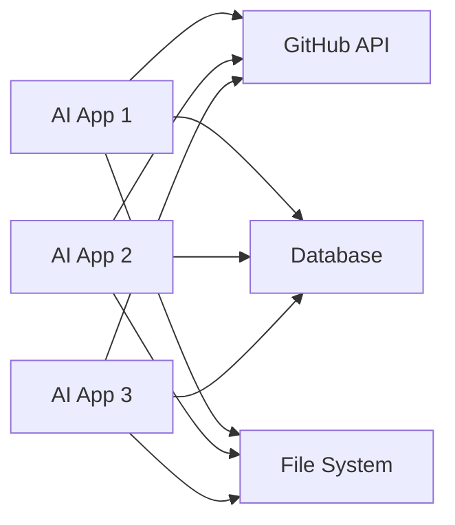
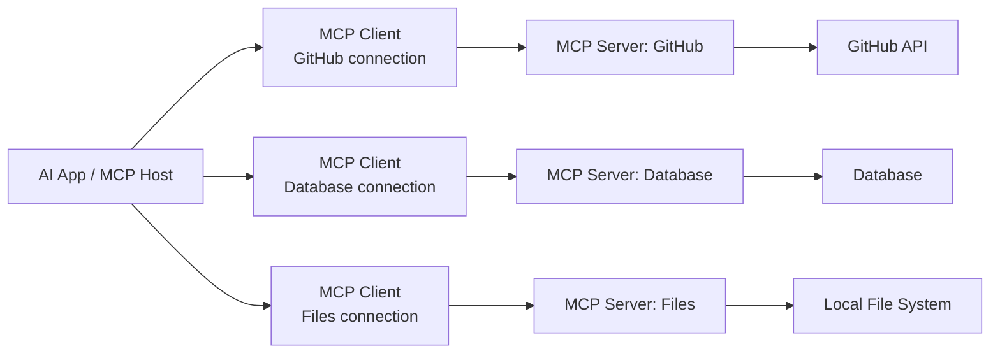
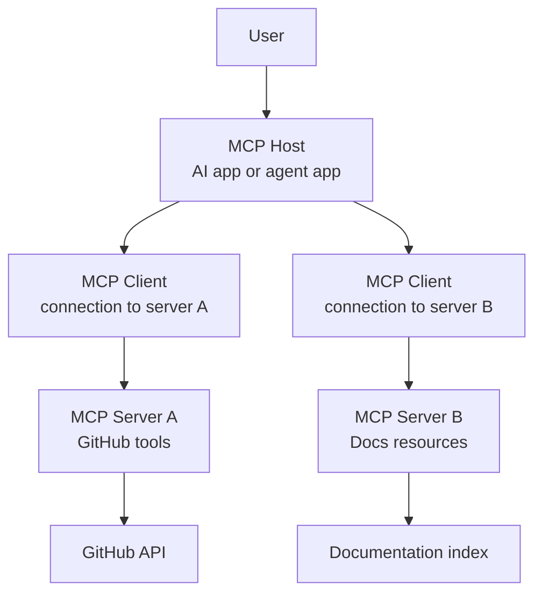
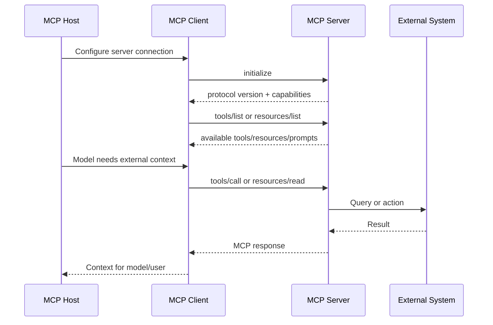
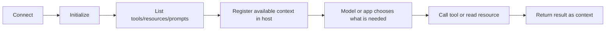

# MCP Overview

<div class="topic-page" markdown="1">

<section class="topic-hero">
  <span class="topic-hero__eyebrow">Stage 06 - Model Context Protocol</span>
  <p class="topic-hero__lead">Model Context Protocol, or MCP, is a standard way for AI applications to connect with external tools, data, and reusable prompts. It helps agent systems move from custom one-off integrations to a shared protocol that many clients and servers can use.</p>
  <div class="topic-hero__facts">
    <span>Open protocol</span>
    <span>Client-server</span>
    <span>Tools</span>
    <span>Resources</span>
    <span>Prompts</span>
  </div>
</section>

## Goal

Understand what MCP is, why it exists, how the basic architecture works, and when it is the right connection layer for an AI agent or AI application.

After this topic, you should be able to explain MCP without mixing it up with normal function calling, RAG, plugins, or an agent framework.

## MCP in One Minute

Imagine you are building a coding assistant.

The assistant can answer general questions from the model's training, but it cannot automatically know:

- what files exist in your project
- what issues are open in your GitHub repo
- what errors appeared in the latest logs
- what internal documentation says about your service

You could write a custom integration for each of those systems. That works for one app, but it becomes hard to reuse and maintain.

MCP gives those systems a standard way to expose capabilities to AI applications.

```text
AI application
  -> connects to MCP server
  -> discovers available tools/resources/prompts
  -> uses the right capability when needed
  -> receives results back as context
```

The simplest mental model:

> MCP is a standard adapter layer between AI applications and external systems.

It does not replace the model, the agent loop, RAG, or your product security rules. It only standardizes how an AI application connects to outside capabilities.

## Learning Path

This overview is designed in four parts.

<div class="learning-grid learning-grid--path">
  <a class="learning-card" href="#part-1-understand-the-problem-mcp-solves">
    <strong>Part 1 - The Problem MCP Solves</strong>
    <span>See why agent apps need a standard way to connect with external systems.</span>
  </a>
  <a class="learning-card" href="#part-2-understand-the-mcp-architecture">
    <strong>Part 2 - The MCP Architecture</strong>
    <span>Learn the high-level roles: host, client, server, transport, and protocol layer.</span>
  </a>
  <a class="learning-card" href="#part-3-understand-what-mcp-servers-expose">
    <strong>Part 3 - What Servers Expose</strong>
    <span>Understand tools, resources, prompts, discovery, and tool calls.</span>
  </a>
  <a class="learning-card" href="#part-4-use-mcp-with-good-judgment">
    <strong>Part 4 - Use MCP With Good Judgment</strong>
    <span>Know when MCP helps, when it is unnecessary, and what risks to watch.</span>
  </a>
</div>

## Part 1: Understand the Problem MCP Solves

AI agents become useful when they can work with real systems:

- read project files
- search documentation
- query databases
- inspect cloud resources
- create tickets
- call internal APIs
- use business tools like GitHub, Slack, Notion, or Azure

### A Concrete Example First

User request:

```text
Check whether the latest payment-service error is already reported in GitHub.
```

To answer well, the assistant may need to:

1. read recent production logs
2. search GitHub issues
3. read the service runbook
4. summarize the likely status for the user

Without MCP, your app needs custom code for every connection.

With MCP, each external system can expose its capabilities through an MCP server:

| Need | MCP Server Could Provide |
| --- | --- |
| Recent logs | `logs` server with log query tools |
| GitHub issues | `github` server with issue search tools |
| Runbook text | `docs` server with readable resources |
| Incident summary format | `docs` server with a reusable prompt |

This is the core value of MCP: the AI app can connect to external capabilities through a shared protocol instead of hardcoding every integration itself.

### The Integration Problem

Without a standard protocol, every AI application must build a custom connector for every external system.

That creates a many-to-many integration problem.



**How to read this diagram:** every AI app has to know how to connect to every external system. As apps and systems grow, integration work grows quickly.

MCP changes the shape of the problem.

Instead of each AI app building every integration itself, external capabilities can be exposed through MCP servers. AI applications that support MCP can connect to those servers through the same protocol.



**How to read this diagram:** the host can connect to several MCP servers. Each server normally has its own MCP client connection inside the host.

### Plain-English Definition

MCP is an open protocol that defines how an AI application can discover and use external context.

In MCP, "context" can mean:

- tools the agent can call
- resources the agent can read
- prompt templates the host can reuse
- metadata about what the server supports
- updates when available capabilities change

MCP is often described as a standard connection layer for AI applications. That is useful, but the practical meaning is more specific:

> MCP gives AI applications a common way to discover external capabilities, call them, and receive results.

### What MCP Is and Is Not

| MCP Is | MCP Is Not |
| --- | --- |
| A protocol for connecting AI apps to external capabilities. | A language model. |
| A way to expose tools, resources, and prompts. | A full agent framework. |
| A client-server communication standard. | A replacement for application security. |
| A reusable integration boundary. | A guarantee that tool use is safe or correct. |
| A way to make external context discoverable. | The same thing as RAG or function calling. |

This distinction is important. MCP can help an agent access better context, but the host application still decides how to use that context, what the model sees, what actions require approval, and what security rules apply.

### Why This Matters for Agents

An agent needs more than a model. It needs a controlled way to connect the model to the outside world.

MCP helps by separating responsibilities:

| Responsibility | Without MCP | With MCP |
| --- | --- | --- |
| External system integration | Each app builds custom connectors. | A server exposes capabilities through MCP. |
| Tool discovery | Hardcoded tool list inside the app. | Client asks server what it exposes. |
| Tool metadata | App-specific format. | Standard method and schema shape. |
| Reuse | Connector often works in one app only. | MCP server can work with many MCP-compatible hosts. |
| Evolution | Updating tools requires app-specific changes. | Server can notify clients when capabilities change. |

MCP does not make an agent intelligent by itself. It gives the agent application a cleaner connection layer.

## Part 2: Understand the MCP Architecture

MCP uses a client-server architecture.

Before reading the diagram, learn these four words:

The important participants are:

| Participant | Simple Meaning | Main Job |
| --- | --- | --- |
| MCP Host | The AI application the user interacts with. | Coordinates one or more MCP clients. |
| MCP Client | The connection object inside the host. | Maintains one connection to one MCP server. |
| MCP Server | A program that exposes context. | Provides tools, resources, and prompts. |
| External System | The real system behind the server. | Database, API, file system, SaaS app, cloud service, etc. |

Example hosts include AI desktop apps, IDE assistants, coding agents, chatbots, and custom agent applications.

Simple example:

```text
VS Code or Claude Desktop = MCP host
Connection to GitHub server = MCP client
GitHub MCP server = MCP server
GitHub itself = external system
```

### The Core Shape



**How to read this diagram:** the host can connect to multiple MCP servers. Each connection is handled by an MCP client. The servers expose capabilities backed by real systems.

### Data Layer and Transport Layer

MCP has two practical layers.

| Layer | What It Defines | What You Need to Remember |
| --- | --- | --- |
| Data layer | JSON-RPC messages, lifecycle, discovery, tools, resources, prompts, notifications. | This is the protocol meaning: what messages are sent and what they mean. |
| Transport layer | How messages move between client and server. | Local servers often use `stdio`; remote servers use HTTP-based transport. |

You do not need to memorize the full specification at this stage. You do need to understand that MCP separates **what is communicated** from **how it is transported**.

Beginner translation:

```text
Data layer = the message meaning
Transport layer = the message delivery method
```

### Local and Remote Connections

MCP servers can run locally or remotely.

| Server Type | Common Transport | Good For | Main Risk |
| --- | --- | --- | --- |
| Local MCP server | `stdio` | File access, local developer tools, local databases, command-line utilities. | Local process permissions can be powerful. |
| Remote MCP server | Streamable HTTP | Shared services, cloud APIs, SaaS tools, organization-wide capabilities. | Authentication, authorization, network exposure, tenant isolation. |

The separate [Local vs Remote MCP](../local-vs-remote-mcp/index.md) topic goes deeper. For this overview, remember that MCP is not limited to cloud APIs. It can also connect AI apps to local processes.

### MCP Lifecycle in One View

MCP connections are stateful. A client and server first initialize the connection and negotiate what each side supports.



**How to read this diagram:** MCP is not only "call a function." The host connects, discovers capabilities, then uses them when the model or application needs external context.

## Part 3: Understand What MCP Servers Expose

MCP servers expose primitives. A primitive is a standard type of capability the client can discover and use.

The main server-side primitives are:

| Primitive | What It Means | Example |
| --- | --- | --- |
| Tools | Executable functions the AI app can invoke. | `search_issues`, `query_database`, `create_ticket` |
| Resources | Readable context data. | file contents, database schema, API response, documentation page |
| Prompts | Reusable prompt templates. | support triage prompt, code review prompt, SQL helper prompt |

Think of the difference like this:

| User Need | Best MCP Primitive |
| --- | --- |
| "Search issues in this repo." | Tool |
| "Read this project README." | Resource |
| "Use the company's incident report format." | Prompt |
| "Run a database query." | Tool |
| "Show the database schema." | Resource |

### Tools

Tools are actions or computations exposed by the server.

Example tool metadata:

```json
{
  "name": "search_issues",
  "title": "Search Issues",
  "description": "Search issue titles and comments in a repository.",
  "inputSchema": {
    "type": "object",
    "properties": {
      "repository": { "type": "string" },
      "query": { "type": "string" }
    },
    "required": ["repository", "query"]
  }
}
```

The model does not execute the tool directly. The host decides how to expose tool metadata to the model, and the MCP client sends the actual MCP request to the server when needed.

### Resources

Resources are data the host can read and include as context.

Examples:

- `file:///project/README.md`
- `schema://warehouse/orders`
- `docs://internal/payments/refunds`
- `azure://subscriptions/current/resource-groups`

Resources are useful when the agent needs context but should not perform an action. Reading a database schema is a resource-style operation. Running a query is usually a tool-style operation.

### Prompts

Prompts are reusable templates exposed by a server.

Examples:

- "Generate a safe SQL query from this question."
- "Summarize this incident using the company format."
- "Review this pull request using backend service guidelines."

Prompts are useful when the external system owns the best interaction pattern. For example, a database MCP server might provide a prompt that teaches the host how to ask questions about that database safely.

### Discovery Before Use

MCP clients can ask a server what it exposes.

Common discovery and use pattern:



**How to read this diagram:** MCP makes capabilities discoverable. The host does not need to hardcode every available tool if the server can list them.

### MCP vs Function Calling

MCP and function calling are related, but they are not the same.

| Concept | Scope | Main Question |
| --- | --- | --- |
| Function calling | Model/API feature. | How does the model ask the application to call a function? |
| MCP | Integration protocol. | How does an AI app discover and connect to external tools, data, and prompts? |

Function calling can be used inside one application without MCP.

MCP can expose tools that the host later presents to a model through the model provider's tool/function-calling mechanism.

Simple way to remember:

```text
Function calling = model-to-app action request
MCP = app-to-external-system capability protocol
```

Concrete flow:

```text
Model chooses: search_issues(...)
Host receives the model's tool request
Host routes that request through an MCP client
MCP server calls GitHub
GitHub result returns to the host
Host gives the result back to the model as context
```

## Part 4: Use MCP With Good Judgment

MCP is powerful, but it should not be added to every project automatically.

### When MCP Is a Good Fit

Use MCP when:

- you want one external capability to work across multiple AI apps
- your agent needs dynamic discovery of tools or resources
- you are integrating with existing MCP-compatible clients
- you need to expose a domain system, such as GitHub, cloud resources, internal docs, or a database
- you want a cleaner boundary between the agent app and external systems
- you expect tools/resources to evolve independently from the host app

Good example:

```text
An internal developer assistant needs access to GitHub issues, CI logs, internal docs, and cloud resource metadata.
Each source can be exposed through an MCP server.
The assistant host connects to the servers it is allowed to use.
```

### When MCP May Be Too Much

MCP may be unnecessary when:

- the app has only one simple hardcoded tool
- the integration will never be reused outside one codebase
- the model only needs static text context
- a normal API call inside your backend is enough
- you do not need server discovery, reusable prompts, or resources

Simple example:

```text
If your app only needs to call calculate_tax(amount, state), a direct function call may be simpler than building an MCP server.
```

MCP is an integration boundary. Use it when that boundary gives you reuse, isolation, or ecosystem compatibility.

### Security Mindset

MCP connects models to real systems. That means the risk is not theoretical.

Important risks include:

- exposing too many tools
- allowing write or destructive actions without confirmation
- running local servers with excessive file or shell permissions
- trusting remote servers too broadly
- leaking secrets through resources or tool results
- passing tokens through without proper audience validation
- treating model-chosen actions as user-approved actions

Practical controls:

| Control | Why It Matters |
| --- | --- |
| Least privilege | Give each MCP server only the permissions it needs. |
| Clear tool descriptions | Helps the model choose tools correctly. |
| Input validation | Prevents malformed or dangerous tool calls. |
| User confirmation | Required for sensitive writes or destructive actions. |
| Audit logging | Records what tool was called, with what arguments, and why. |
| Server allowlist | Prevents unknown servers from entering trusted workflows. |
| Secret hygiene | Avoid exposing tokens, keys, and private data in resources or logs. |

MCP standardizes the connection. It does not remove the need for product-level authorization, validation, monitoring, and human confirmation.

### Common Misunderstandings

| Misunderstanding | Correct Understanding |
| --- | --- |
| "MCP is an agent framework." | MCP is a protocol. You still need an AI app or agent framework to decide how to use it. |
| "MCP replaces RAG." | MCP can expose resources that support RAG, but retrieval design is still separate. |
| "MCP means the model can do anything." | The host and server still control exposed capabilities and permissions. |
| "MCP is only for Claude." | MCP began with Anthropic, but the ecosystem now includes many clients, SDKs, and servers. |
| "MCP tools are automatically safe." | Tool safety depends on permissions, validation, approval flows, and server implementation. |

#### MCP vs RAG

MCP and RAG both help AI systems use external information, but they solve different problems.

| Question | RAG | MCP |
| --- | --- | --- |
| What is it? | A retrieval workflow or architecture pattern. | A communication protocol. |
| Main goal | Find relevant text and add it to the model's context. | Connect AI apps to external tools, resources, and prompts through a standard interface. |
| Typical flow | Search documents, retrieve useful chunks, put them into the prompt, then answer. | Connect to an MCP server, discover capabilities, call tools or read resources, then return results. |
| Main capability | Mostly read-only knowledge retrieval. | Can read data and, when allowed, take actions through tools. |
| Simple analogy | An open-book exam with highlighted pages. | A standard adapter port for AI integrations. |

They are not rivals. MCP can support a RAG system.

Example:

```text
AI app -> MCP client -> RAG MCP server -> vector database -> relevant documents -> model context
```

In that setup, RAG decides **which documents are relevant**. MCP defines **how the AI app connects to the server that performs retrieval**.

## A Small End-to-End Example

Imagine a coding assistant that helps debug production errors.

The assistant host connects to three MCP servers:

| MCP Server | Exposes | Example |
| --- | --- | --- |
| GitHub server | Tools | Search issues, read pull requests, inspect commits. |
| Logs server | Resources and tools | Read recent service logs, query traces. |
| Docs server | Resources and prompts | Read runbooks, use incident-summary prompt. |

User asks:

```text
Why did the payment service start failing after the latest deploy?
```

Possible MCP-backed flow:

1. Host discovers available tools and resources.
2. Model decides it needs recent deploy data and logs.
3. Host routes the tool call through the correct MCP client.
4. MCP server queries the external system.
5. Result returns to the host.
6. Model uses the result as context.
7. Host may ask for confirmation before any write action, such as creating an incident ticket.

This is where MCP is useful: the assistant can use several external systems through a standard connection pattern instead of custom integration logic for each one.

## Practice

Choose one AI assistant idea and design its MCP connection map.

Example ideas:

- developer assistant
- support assistant
- data analyst assistant
- cloud operations assistant
- documentation assistant

Write:

- which system is the host
- which MCP servers it should connect to
- which tools each server should expose
- which resources each server should expose
- which actions require user confirmation
- which server should run locally and which should run remotely

Keep the design small. The goal is to prove you understand MCP's role, not to build the server yet.

## Mini Project

Design a simple MCP server catalog for a developer assistant.

Include three servers:

1. `github`
2. `docs`
3. `logs`

For each server, define:

- purpose
- exposed tools
- exposed resources
- required permissions
- safe read-only operations
- risky write operations
- whether it should be local or remote

Then write a short note explaining why MCP is useful for this design compared with hardcoding all integrations into one agent app.

## Exit Criteria

You are ready to move on when you can:

- define MCP in simple language
- explain why MCP reduces custom integration work
- describe host, client, server, and external system roles at a high level
- explain tools, resources, and prompts
- describe discovery before use
- explain the difference between MCP and function calling
- identify when MCP is useful and when it is unnecessary
- name the main security concerns when connecting AI agents to MCP servers

## Resources

- [Model Context Protocol: What is MCP?](https://modelcontextprotocol.io/introduction)
- [Model Context Protocol: Architecture overview](https://modelcontextprotocol.io/docs/concepts/architecture)
- [Model Context Protocol GitHub repository](https://github.com/modelcontextprotocol/modelcontextprotocol)
- [Anthropic: Introducing the Model Context Protocol](https://www.anthropic.com/news/model-context-protocol)
- [DeepLearning.AI: MCP - Build Rich-Context AI Apps with Anthropic](https://www.deeplearning.ai/short-courses/mcp-build-rich-context-ai-apps-with-anthropic/)
- [Microsoft: Introducing the Azure MCP Server](https://devblogs.microsoft.com/azure-sdk/introducing-the-azure-mcp-server/)
- [OpenAI Agents SDK: Model Context Protocol](https://openai.github.io/openai-agents-python/mcp/)
- [Model Context Protocol: Security Best Practices](https://modelcontextprotocol.io/specification/2025-06-18/basic/security_best_practices)
- [Guangzheng Li: The Ultimate Guide to MCP](https://guangzhengli.com/blog/en/model-context-protocol)

</div>
