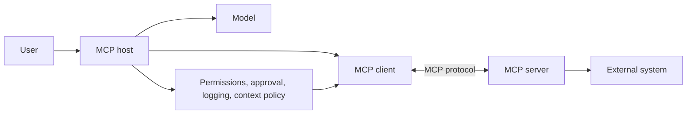

# QAs: 06 MCP

This study test checks understanding of every main section in **06 MCP**.

| Section | Questions |
| --- | ---: |
| MCP Overview | 16 |
| MCP Hosts, Clients, and Servers | 20 |
| Building MCP Servers | 16 |
| Local vs Remote MCP | 16 |
| Tool and Resource Exposure in MCP | 16 |
| Security Boundaries for MCP-Connected Tools | 16 |
| **Total** | **100** |

## MCP Overview

### Question 1

**Q:** What is MCP?

**A:**

MCP, or Model Context Protocol, is a standard adapter layer that lets AI applications discover and use external tools, resources, and prompts.

### Question 2

**Q:** What problem does MCP solve for AI applications?

**A:**

It reduces custom one-off integration work. Instead of each AI app building separate connectors for GitHub, files, databases, logs, and docs, those systems can expose capabilities through MCP servers.

### Question 3

**Q:** Why is MCP useful for a coding assistant?

**A:**

A coding assistant often needs project files, GitHub issues, logs, and runbooks. MCP lets those systems expose capabilities through a common protocol instead of hardcoded app-specific integrations.

### Question 4

**Q:** What happens without MCP?

**A:**

Every AI app must know how to connect to every external system directly, creating many custom integrations that grow difficult to maintain.

### Question 5

**Q:** With MCP, what changes compared with direct integrations?

**A:**

Instead of each AI app building every integration itself, external capabilities can be exposed through MCP servers. AI applications that support MCP can connect to those servers through the same protocol.

### Question 6

**Q:** What does "context" mean in MCP?

**A:**

It can mean callable tools, readable resources, reusable prompt templates, metadata about server capabilities, or updates when capabilities change.

### Question 7

**Q:** What is MCP not?

**A:**

MCP is not a language model, a full agent framework, a replacement for security, the same thing as RAG, or a guarantee that tool use is safe.

### Question 8

**Q:** What are the four main participants in the MCP overview architecture?

**A:**

MCP host, MCP client, MCP server, and the external system behind the server.

### Question 9

**Q:** What is the difference between the MCP data layer and transport layer?

**A:**

The data layer defines message meaning, such as JSON-RPC lifecycle, discovery, tools, resources, prompts, and notifications. The transport layer defines how messages move, such as `stdio` or HTTP.

### Question 10

**Q:** What happens during MCP discovery before use?

**A:**

The client asks the server what tools, resources, and prompts it exposes. The host can then register or present those capabilities.

### Question 11

**Q:** Compare MCP and function calling.

**A:**

Function calling is a model/API feature for asking an application to call a function. MCP is an integration protocol for connecting an AI app to external systems that expose tools, resources, and prompts.

### Question 12

**Q:** How can MCP and function calling work together?

**A:**

The model may choose a tool through function calling. The host receives that request and routes it through an MCP client to an MCP server, then returns the result to the model as context.

### Question 13

**Q:** When is MCP a good fit?

**A:**

Use MCP when a capability should work across multiple AI apps, tools/resources should be discoverable, external systems evolve independently, or the app needs a cleaner integration boundary.

### Question 14

**Q:** When may MCP be unnecessary?

**A:**

MCP may be too much when the app has one simple hardcoded tool, static text context, no need for discovery, or a normal backend API call is enough.

### Question 15

**Q:** Compare MCP and RAG.

**A:**

RAG is a retrieval workflow that finds relevant text and adds it to model context. MCP is a communication protocol that connects AI apps to external tools, resources, and prompts. MCP can support RAG by connecting to a docs server that performs retrieval.

### Question 16

**Q:** Why does the host ask for confirmation before creating an incident ticket?

**A:**

Creating a ticket is a write action. The host should gate write or high-impact actions with confirmation even if the MCP server exposes the tool.

## MCP Hosts, Clients, and Servers

### Question 17

**Q:** Define MCP host, client, and server in one sentence each.

**A:**

The host is the AI app the user interacts with. The client is one protocol connection inside the host. The server is a program that exposes capabilities for an external system.

### Question 18

**Q:** Why is "a server talks to a model" the wrong MCP mental model?

**A:**

The host talks to the model. The client talks to one MCP server. The server talks to an external system. The host controls what the model sees.

### Question 19

**Q:** What is the beginner rule for MCP clients?

**A:**

One MCP client manages one direct connection to one MCP server.

### Question 20

**Q:** Why is one client per server useful?

**A:**

It keeps capabilities, permissions, connection state, trust boundaries, and debugging separate for each server.

### Question 21

**Q:** What does the host own?

**A:**

The host owns the user interface, model connection, client management, context assembly, permission policy, approval flow, and logging.

### Question 22

**Q:** What does the host's control plane do?

**A:**

It shows the host coordinating model calls, policy checks, client routing, context building, and approval UI before requests reach MCP clients.

### Question 23

**Q:** What does an MCP client do during setup?

**A:**

It connects to the server, initializes the session, negotiates protocol and capabilities, and discovers server tools, resources, templates, and prompts.

### Question 24

**Q:** Why is an MCP client not the same as a model API client?

**A:**

The model API connection belongs to the host. The MCP client only speaks MCP to one MCP server.

### Question 25

**Q:** What are elicitation, roots, and sampling?

**A:**

Elicitation lets a server ask the user for structured missing information. Roots tell a server which filesystem directories are in scope. Sampling lets a server request a model completion through the client and host.

### Question 26

**Q:** Why should elicitation not ask for passwords or API keys?

**A:**

Elicitation is user input requested by a server. Asking for secrets can become phishing or credential leakage, so hosts should block or warn on secret collection.

### Question 27

**Q:** Why are roots not a complete security boundary?

**A:**

Roots communicate intended filesystem scope to well-behaved servers. Real enforcement still needs OS permissions, sandboxing, and host policy.

### Question 28

**Q:** What does sampling keep under host control?

**A:**

Model choice, token limits, approvals, rate limits, prompt visibility, and sensitive data handling.

### Question 29

**Q:** What three core building blocks do MCP servers expose?

**A:**

Tools, resources, and prompts.

- tools can do work, so the model may request them but the host should approve risky calls,
- resources provide context, so the application decides what to retrieve and include,
- prompts are workflow templates, so users or the host typically invoke them explicitly.

### Question 30

**Q:** Compare tools, resources, and prompts by control model.

**A:**

Tools are model-requested actions that the host approves. Resources are application-driven readable context. Prompts are reusable workflows usually invoked by the user or host.

### Question 31

**Q:** What are the two broad phases of an MCP connection?

**A:**

Setup and discovery happen first. Then the use phase repeats tool calls or resource reads over the same connection.

### Question 32

**Q:** Why does `send_email` require approval while `get_order_status` usually does not?

**A:**

`get_order_status` is a scoped read. `send_email` communicates externally and can expose information or affect users, so the host should preview and approve it.

### Question 33

**Q:** In the MCP architecture, how does a user request reach an external system, and what stays under host control?

**A:**

The model never touches external systems directly. The host routes each request through the right client to a server, and keeps permissions, approval, logging, and context policy under its own control.

### Question 34

**Q:** Give examples of tools an MCP server might expose, with their risk levels.

**A:**

- `search_flights(origin, destination, date)` — read, usually allowed
- `create_issue(repo, title, body)` — write, show a draft or require confirmation
- `send_email(to, subject, body)` — external write, require preview and approval
- `delete_database(name)` — destructive, deny by default or require strong approval

### Question 35

**Q:** Give examples of resources an MCP server might expose.

**A:**

Direct resources are identified by a URI, such as `file:///workspace/README.md`, `calendar://events/2026-06`, or `logs://payment-service/latest-errors`. Resource templates add parameters, such as `weather://forecast/{city}/{date}` or `repo://pull-request/{owner}/{repo}/{number}`.

### Question 36

**Q:** Give an example of a prompt an MCP server might expose.

**A:**

A `review-pr` prompt that takes `repo` and `pr_number` (and an optional `focus`) to guide the assistant through a code-review workflow. Hosts often surface prompts as slash commands like `/review-pr`, command-palette entries, or buttons.

## Building MCP Servers

### Question 37

**Q:** What are the three jobs of a basic MCP server?

**A:**

Declare itself, register capabilities such as tools/resources/prompts, and run on a transport such as `stdio` or HTTP.

### Question 38

**Q:** What does an MCP server not contain?

**A:**

It does not contain the AI model. The host owns the model; the server exposes capabilities.

### Question 39

**Q:** What sequence does every MCP connection follow before use?

**A:**

Connect, handshake with `initialize`, discover capabilities, then use tools or resources over the connection.

### Question 40

**Q:** After the server object is created, what happens next?

**A:**

The developer registers tools, resources, and prompts, then runs the server on a transport so clients can connect and discover those capabilities.

### Question 41

**Q:** In FastMCP, what does `FastMCP("demo")` represent?

**A:**

It declares a server named `demo`, which is how the host identifies the local MCP server.

### Question 42

**Q:** Why do type hints matter in a FastMCP tool?

**A:**

Type hints help generate input and output schemas automatically, so the host and model know what arguments are valid.

### Question 43

**Q:** Why does the docstring matter in an MCP tool?

**A:**

The docstring becomes the tool description the model uses to decide when to call the tool. Vague docstrings cause wrong tool choices.

### Question 44

**Q:** Why is `stdio` usually appropriate for a local server?

**A:**

The host can launch the server as a subprocess and communicate through standard input/output without exposing a network endpoint.

### Question 45

**Q:** What does a host configuration for a local `stdio` server usually include?

**A:**

It includes a server name, command, and arguments, such as running `python /absolute/path/to/server.py`.

### Question 46

**Q:** What is the difference between `@mcp.tool()`, `@mcp.resource(...)`, and `@mcp.prompt(...)`?

**A:**

`@mcp.tool()` exposes an action. `@mcp.resource(...)` exposes read-only data identified by a URI. `@mcp.prompt(...)` exposes a reusable prompt template.

### Question 47

**Q:** Why should resources stay read-only?

**A:**

Resources are intended as readable context. If a function changes state, it should be a tool so the host can classify and gate it properly.

### Question 48

**Q:** What is the MCP Inspector used for?

**A:**

It connects to a server, lists capabilities, and lets developers call tools, read resources, and inspect prompts before integrating with a full host.

### Question 49

**Q:** Why is SDK type validation not enough for business safety?

**A:**

The SDK can validate basic types, but it cannot know business rules such as "denominator must not be zero" or "path must stay inside this folder."

### Question 50

**Q:** Give three safety controls for a server you build.

**A:**

Expose few tools, separate read from write, scope access, validate inputs, fail safely, and keep secrets out of results.

### Question 51

**Q:** If the model never calls your tool, what server-design issue might be responsible?

**A:**

The tool name or docstring may be vague, missing, or not aligned with the user's task.

### Question 52

**Q:** Why does a `stdio` server seem to do nothing when run directly in a terminal?

**A:**

It is designed to communicate with a host or the Inspector over stdin/stdout, not behave like an interactive chat program.

## Local vs Remote MCP

### Question 53

**Q:** What is local MCP?

**A:**

Local MCP means the server runs on the user's machine or local development environment, often launched by the host over `stdio`.

### Question 54

**Q:** What is remote MCP?

**A:**

Remote MCP means the server runs as a network service, usually over an HTTP-based transport, for shared hosted tools or data.

### Question 55

**Q:** What is hybrid MCP?

**A:**

Hybrid MCP combines local servers and remote servers, such as a coding assistant using local filesystem tools and remote issue tracker or observability tools.

### Question 56

**Q:** Compare common transports for local and remote MCP.

**A:**

Local MCP commonly uses `stdio`. Remote MCP commonly uses Streamable HTTP.

### Question 57

**Q:** Why is the word "server" sometimes confusing in MCP?

**A:**

An MCP server is not always a remote web server. A local command-line process launched by the host can also be an MCP server.

### Question 58

**Q:** When is local MCP a good fit?

**A:**

Use local MCP for local files, repositories, scripts, dev databases, notes, desktop workflows, and prototypes that should not be exposed over the network.

### Question 59

**Q:** When is remote MCP a good fit?

**A:**

Use remote MCP for shared services, SaaS tools, hosted internal APIs, production observability, support platforms, and team-wide knowledge systems.

### Question 60

**Q:** Why is local MCP not automatically safe?

**A:**

It may access sensitive local files, environment variables, shell commands, browser state, local databases, or private developer resources.

### Question 61

**Q:** Why does remote MCP need stronger authentication and authorization?

**A:**

Remote MCP is reachable over a network and may serve many users, so it must verify identity, permissions, tenant isolation, scopes, and request legitimacy.

### Question 62

**Q:** In a local repository assistant, which servers are likely local?

**A:**

Filesystem, Git, and test-runner servers are likely local because they need access to the current working tree and local test environment.

### Question 63

**Q:** In a production incident assistant, why are observability and issue tracker servers likely remote?

**A:**

The data is hosted, shared, operational, and used by multiple users, so remote servers can centralize authentication, authorization, and logging.

### Question 64

**Q:** What is the main risk of a hybrid setup?

**A:**

A remote tool might accidentally gain access to local files, or local private data might be sent to a remote service without user approval and policy checks.

### Question 65

**Q:** What should a local MCP safety checklist ask about filesystem access?

**A:**

It should ask which folders are accessible, whether the server can write or delete, whether secrets like `.env` or SSH keys are blocked, and whether approval is required for risky actions.

### Question 66

**Q:** What should a remote MCP safety checklist ask about users and tenants?

**A:**

It should ask how users authenticate, how authorization checks real backing-system permissions, whether tenant isolation is enforced, and what gets logged.

### Question 67

**Q:** Why is binding a local server to public interfaces a failure mode?

**A:**

It can expose local capabilities to the network. Local services should usually bind to localhost or use `stdio`.

### Question 68

**Q:** A team needs a shared company knowledge base assistant. Should the docs MCP server be local or remote?

**A:**

Remote is usually better because the knowledge base should be centrally maintained, shared across users, authenticated, and logged.

## Tool and Resource Exposure in MCP

### Question 69

**Q:** What does tool and resource exposure mean?

**A:**

It means choosing which information an agent can read and which actions it can request through an MCP server.

### Question 70

**Q:** What is the simple mental model for resources and tools?

**A:**

Resources are what the agent may inspect. Tools are what the agent may ask to do.

### Question 71

**Q:** In an MCP-connected system, who decides what to show the model and what calls to allow?

**A:**

The host decides what context reaches the model, what tool calls are allowed, and when human approval is needed.

### Question 72

**Q:** Compare a resource, a tool, and a prompt.

**A:**

A resource is readable context. A tool is an invocable action. A prompt is a reusable instruction template or workflow.

### Question 73

**Q:** What questions should a resource answer before exposure?

**A:**

What information is available, who can read it, how fresh and large it is, what format it uses, and whether it is safe for model context.

### Question 74

**Q:** Why should resource exposure be narrow?

**A:**

Narrow resources reduce data leaks, token bloat, irrelevant context, and access to unrelated private systems.

### Question 75

**Q:** What questions should a tool answer before exposure?

**A:**

What action it performs, what input it requires, what output it returns, whether it is read/write/destructive, whether approval is needed, and how failures are handled.

### Question 76

**Q:** Why is `create_calendar_event` safer than `run_arbitrary_calendar_command`?

**A:**

It is specific, easier for the model to choose correctly, easier to validate, and easier for the host to classify and approve.

### Question 77

**Q:** What happens after the server returns an observation?

**A:**

The client sends the result to the host, the host adds appropriate observation context to the model, and the model continues, asks, or answers.

### Question 78

**Q:** Why should an agent read a resource like its inventory before acting?

**A:**

The inventory resource tells the agent what materials exist. Without that observation, it may plan actions that cannot be completed.

### Question 79

**Q:** What is a good resource exposure example?

**A:**

`ticket://12345` containing one redacted ticket with current status and access limited to the support agent role.

### Question 80

**Q:** What is a weak resource exposure example?

**A:**

`database://all-customer-data` available to any connected agent because it exposes too much sensitive data without task scope.

### Question 81

**Q:** What is a good tool exposure example?

**A:**

`create_refund_draft(ticket_id, amount, reason)`, which creates an internal draft and requires approval before sending or processing.

### Question 82

**Q:** What is a weak tool exposure example?

**A:**

`handle_customer_money(any text command)`, which can refund, charge, cancel, or edit billing without clear inputs or approval.

### Question 83

**Q:** Why is mixing read and write in one tool a common mistake?

**A:**

It makes risk hard to classify and prevents the host from approving only the risky parts.

### Question 84

**Q:** Why should resource content be treated carefully?

**A:**

Resources can contain stale data, sensitive information, too much context, or prompt injection. They should be scoped, filtered, and treated as untrusted input.

## Security Boundaries for MCP-Connected Tools

### Question 85

**Q:** What is a security boundary in MCP?

**A:**

A security boundary is a limit around what an MCP-connected agent, server, tool, credential, or external system may access or change.

### Question 86

**Q:** What is the simplest security rule for MCP-connected agents?

**A:**

An AI agent should not automatically get full access to every tool it can connect to.

### Question 87

**Q:** Why does MCP connection not equal trust?

**A:**

MCP standardizes communication, but servers, tools, resources, and results can still be unsafe, misleading, over-broad, or malicious.

### Question 88

**Q:** What crosses the host-to-model boundary?

**A:**

Prompts, tool definitions, resources, conversation history, and tool results can cross into model context, creating risks around sensitive data and prompt injection.

### Question 89

**Q:** Why should tool results be treated as data, not trusted instructions?

**A:**

Tool results may contain malicious text such as "ignore previous instructions." The model should analyze them as content, not obey them as policy.

### Question 90

**Q:** Name four MCP boundary controls.

**A:**

Server allowlists, schema validation, policy checks, scoped credentials, sandboxing, human approval, output filtering, and audit logs.

### Question 91

**Q:** What is the five-step beginner recipe for classifying an MCP server?

**A:**

List exposed items, mark each as read/write/send/execute/destructive, decide what is automatic, decide what needs approval, and deny what is not needed.

### Question 92

**Q:** Why must read permission and send permission be separate?

**A:**

Reading private data should not imply permission to send it outside the trust zone through email, Slack, public issues, or remote APIs.

### Question 93

**Q:** What should a strong approval prompt show?

**A:**

It should show the tool name, target, exact content or command, data leaving the chat, impact, and whether the user approves.

### Question 94

**Q:** What is wrong with "Allow this agent to manage GitHub" as approval?

**A:**

It is too broad. It does not identify the exact action, repository, content, scope, or impact.

### Question 95

**Q:** Why are broad scopes like `repo:*` risky?

**A:**

They let one mistake or stolen credential affect unrelated repositories and actions. Narrow task-specific scopes reduce blast radius.

### Question 96

**Q:** What local MCP paths should commonly be blocked?

**A:**

`.env`, `.ssh`, cloud credentials, password stores, browser cookies, system folders, and broad roots such as `/` or the full home directory.

### Question 97

**Q:** What remote MCP controls are recommended?

**A:**

Approved URLs, TLS, user/client authentication, scoped tokens, validated redirects, token rotation, egress restrictions, authorization checks, and audit logs.

### Question 98

**Q:** What is prompt injection through MCP?

**A:**

It is malicious text in resources, tool results, emails, web pages, logs, or prompt templates that tries to override instructions or trigger unsafe tool calls.

### Question 99

**Q:** In a secure MCP tool call, what happens after the server returns a result?

**A:**

The client returns the observation to the host, and the host filters the result and checks for untrusted instructions before showing an answer or approval prompt.

### Question 100

**Q:** What is the core rule from the security-boundaries summary?

**A:**

Connect broadly only after you can restrict narrowly.
