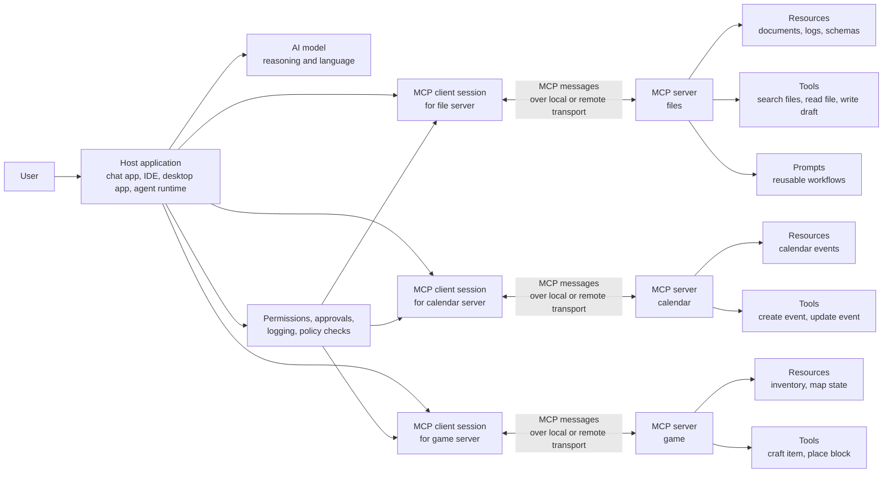
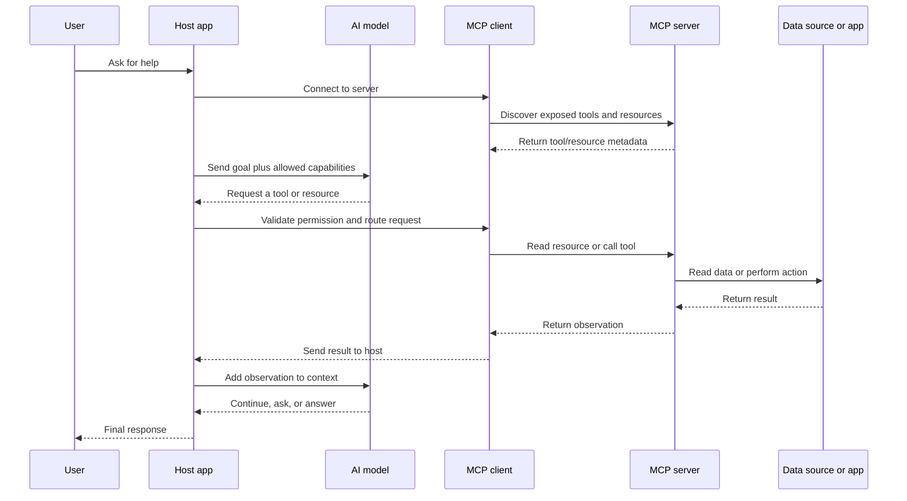

# Tool and Resource Exposure in MCP

## Goal

Understand how an MCP server exposes tools and resources to an AI agent, and
how to decide what the agent should be allowed to see or do.

## The Big Idea

MCP, or Model Context Protocol, is a standard way for AI applications to connect
models to outside capabilities. It is useful because an AI model does not
automatically know what is inside your files, databases, calendars, games, or
internal systems. The host application must connect the model to those systems
through controlled interfaces.

Tool and resource exposure means:

```text
You choose which information the agent can read
and which actions the agent can request.
```

A simple mental model:

```text
Resources are what the agent may inspect.
Tools are what the agent may ask to do.
```

Imagine the AI agent is a smart student sitting at an empty desk. The student
may know many general facts, but it cannot use your notebook, calculator, files,
or apps unless you put them on the desk. MCP is the controlled bridge that lets
you put selected items on that desk.

## Entire MCP Structure

This diagram shows the main pieces in a typical MCP-connected agent system.



**How to read this diagram:** the model does not connect directly to your files
or apps. The host application manages MCP client sessions. Each MCP server
exposes selected capabilities, such as resources, tools, and reusable prompts.
The host decides what to show the model, what calls to allow, and when to ask a
human for approval.

## Tools vs Resources

Tools and resources are easy to confuse because both come from an MCP server.
The difference is impact.

| Concept | What It Means | Agent Question | Examples | Main Risk |
| --- | --- | --- | --- | --- |
| Resource | Information the agent can read | "What can I see?" | File content, database schema, log entry, calendar event, game inventory | Data leak, stale data, too much context |
| Tool | Action the agent can request | "What can I do?" | Search files, run query, send message, create ticket, place block | Wrong action, unsafe write, duplicate action |
| Prompt | Reusable instruction template exposed by a server | "What workflow can I reuse?" | `summarize-ticket`, `review-schema`, `plan-release` | Wrong workflow or hidden assumptions |

Resources are like books, notes, maps, and status screens. Tools are like
calculators, buttons, APIs, commands, or apps that can change something.

## What Resource Exposure Means

Resource exposure is the controlled act of making information available through
an MCP server.

A resource should answer:

- What information is available?
- Who is allowed to read it?
- How fresh is it?
- How large is it?
- What format is it in?
- Is it safe to put into the model context?

Examples:

| Resource | What The Agent Learns | Possible URI Shape |
| --- | --- | --- |
| Project README | Project purpose, setup, commands | `file:///workspace/README.md` |
| Support ticket | Customer issue and account context | `ticket://12345` |
| Database schema | Table and column names | `schema://billing-db/invoices` |
| Log excerpt | Recent errors or traces | `logs://api/last-100-errors` |
| Minecraft chest inventory | Available materials | `game://world/chest/main` |

Good resource exposure is narrow. Do not expose an entire laptop, database, or
cloud account when the agent only needs one folder, table, or record.

## What Tool Exposure Means

Tool exposure is the controlled act of making actions available through an MCP
server.

A tool should answer:

- What exact action can this tool perform?
- What input does it require?
- What output does it return?
- Is the action read-only, write, or destructive?
- Does it need human approval?
- What should happen if it fails?

Examples:

| Tool | Action | Risk Class |
| --- | --- | --- |
| `search_files` | Search a safe workspace path | Read |
| `read_ticket` | Fetch one support ticket by ID | Read |
| `create_draft_reply` | Create a draft but do not send it | Write |
| `send_customer_email` | Send a message to a real customer | Write / high risk |
| `delete_database_record` | Delete production data | Destructive |
| `craft_item` | Create an item in a game world | Write |
| `place_block` | Modify the game world | Write |

Good tool exposure is specific. A narrow tool such as `create_calendar_event`
is safer than a broad tool such as `run_any_calendar_command`.

## How Exposure Happens in The Agent Loop

MCP exposure is not only a list of capabilities. The host uses those
capabilities inside the agent loop.



A careful host does not blindly pass every tool call through. It can validate
arguments, ask for approval, block risky actions, log results, and limit which
resources are included in the model context.

## The Minecraft Example

Imagine you are building an AI helper for Minecraft.

User request:

```text
Build me a small house.
```

The MCP server could expose:

| Exposure Type | Example | What It Gives The Agent |
| --- | --- | --- |
| Resource | `game://chest/main` | The chest contains `5 wood blocks` and `2 iron ingots`. |
| Resource | `game://player/location` | The player is standing near a flat grass area. |
| Tool | `craft_item` | The agent can craft allowed items from inventory. |
| Tool | `place_block` | The agent can place one allowed block at a safe coordinate. |

Possible loop:

1. The user asks the agent to build a house.
2. The agent reads the exposed inventory resource.
3. The agent observes that there are only `5 wood blocks` and `2 iron ingots`.
4. The agent reflects that this is not enough for a full house.
5. The agent may ask the user for more materials, suggest a smaller structure,
   or use an allowed tool to craft/place a limited number of blocks.

Without MCP exposure, the agent may know what Minecraft is, but it cannot see
your chest inventory or place a block in your world. With MCP exposure, it can
use only the resources and tools you intentionally provide.

## Design Rules For Safe Exposure

Use these rules when designing an MCP server for an AI agent.

| Rule | Why It Matters | Better Design |
| --- | --- | --- |
| Expose the minimum needed | Reduces accidental data access | Expose one project folder, not the whole home directory. |
| Separate read and write actions | Makes risk easier to control | Use `read_ticket` and `draft_reply`, not one `manage_ticket` tool. |
| Prefer narrow tools | Reduces misuse | Use `create_calendar_event`, not `run_arbitrary_calendar_api_call`. |
| Validate tool inputs | Blocks bad or unsafe arguments | Check paths, IDs, dates, amounts, and allowed enum values. |
| Return structured observations | Helps the agent reason reliably | Return `status`, `id`, `summary`, and `error`, not vague text. |
| Add approval for risky actions | Keeps humans in control | Ask before sending emails, deleting records, or spending money. |
| Log exposure and calls | Makes failures debuggable | Record server, tool name, arguments, caller, and result status. |

## Resource Exposure Checklist

Before exposing a resource, ask:

- Does the agent truly need this data?
- Is the data private, secret, regulated, or customer-sensitive?
- Can the resource be filtered, summarized, or scoped?
- Is the resource current enough for the task?
- Could the content contain prompt injection?
- How will the host avoid sending too much context to the model?

Good resource:

```text
Resource: ticket://12345
Contains: one customer ticket, redacted account metadata, current status
Access: support agent role only
```

Weak resource:

```text
Resource: database://all-customer-data
Contains: every customer record
Access: any connected agent
```

## Tool Exposure Checklist

Before exposing a tool, ask:

- Is the tool name clear enough for the model to choose correctly?
- Are the input fields specific and validated?
- Is the output structured and easy to inspect?
- Can the tool change real-world state?
- Does it need confirmation before running?
- Is the tool idempotent, or could retries create duplicate work?
- What error should the agent observe if the tool fails?

Good tool:

```text
Tool: create_refund_draft
Input: ticket_id, amount, reason
Behavior: creates an internal draft only
Approval: required before sending or processing
```

Weak tool:

```text
Tool: handle_customer_money
Input: any text command
Behavior: may refund, charge, cancel, or edit billing records
Approval: none
```

## Common Mistakes

| Mistake | What Goes Wrong | Safer Alternative |
| --- | --- | --- |
| Exposing everything | The agent sees data unrelated to the task. | Expose task-specific resources. |
| Mixing read and write in one tool | The host cannot easily approve only risky actions. | Split tools by effect. |
| Hiding tool side effects | The model may call a tool thinking it is harmless. | State side effects in the tool description. |
| Returning vague errors | The agent cannot recover well. | Return clear error observations. |
| Trusting resource content blindly | Prompt injection inside files can steer the agent. | Treat resources as untrusted input. |
| No audit logs | Failures become hard to investigate. | Log tool calls, resource reads, and approval decisions. |

## Practice

Design a tiny MCP server for one of these agents:

- personal study assistant
- coding helper
- support ticket assistant
- Minecraft helper
- meeting scheduler

Write:

1. Three resources the agent may read.
2. Three tools the agent may call.
3. Which tools are read, write, or destructive.
4. Which tool calls need approval.
5. One resource that should not be exposed.

## Key Takeaways

- MCP exposure is how a host gives an agent controlled access to outside
  information and actions.
- Resources are readable context. Tools are callable actions.
- The model should not receive direct, unlimited access to your systems.
- Good exposure is narrow, explicit, validated, observable, and logged.
- The safest MCP server exposes enough capability to solve the task and no more.

## Resources

- [MCP Documentation](https://modelcontextprotocol.io/docs)
- [MCP Specification: Tools](https://modelcontextprotocol.io/specification/2025-06-18/server/tools)
- [MCP Specification: Resources](https://modelcontextprotocol.io/specification/2025-06-18/server/resources)
- [MCP Specification: Prompts](https://modelcontextprotocol.io/specification/2025-06-18/server/prompts)
