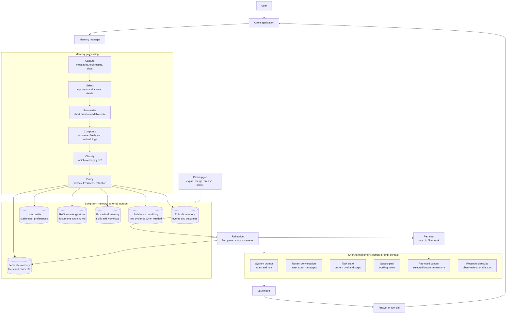
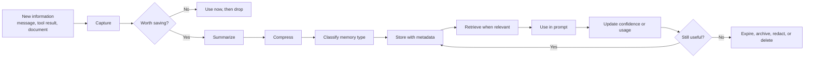
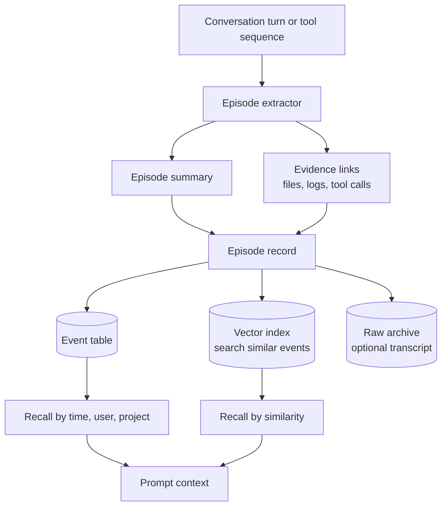
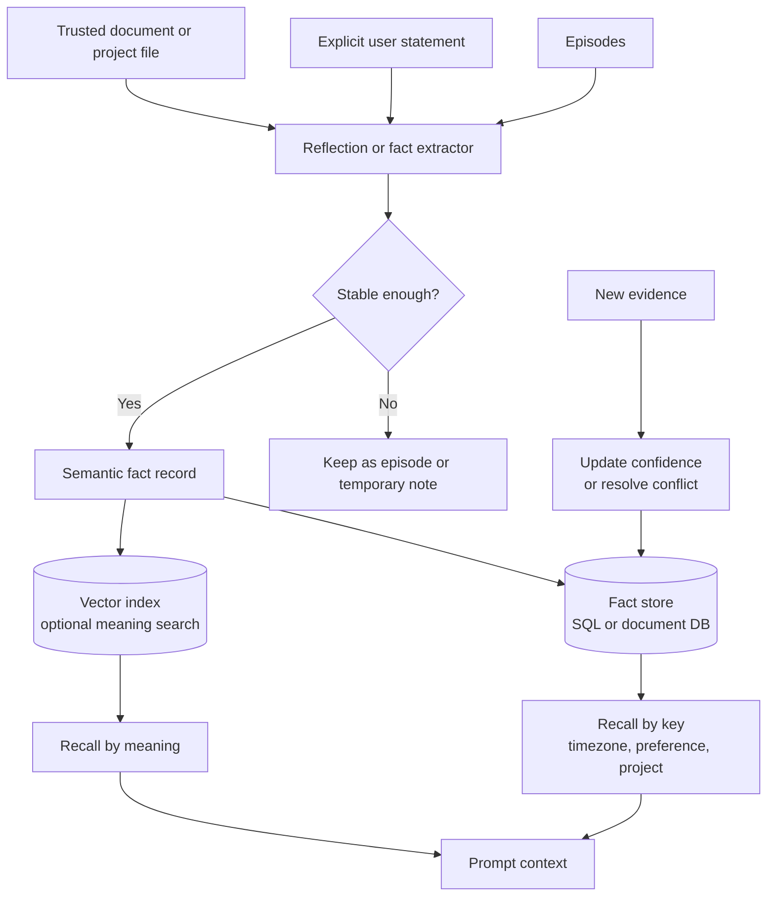
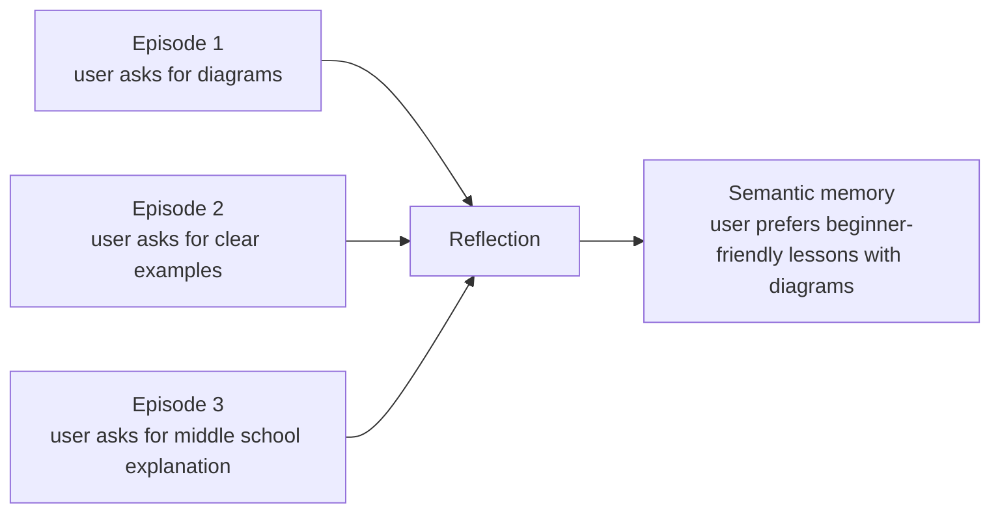

# Additional Explanation: Memory Architecture

<div class="topic-page" markdown="1">

<section class="topic-hero">
  <span class="topic-hero__eyebrow">Stage 07 - RAG and Memory</span>
  <p class="topic-hero__lead">AI agent memory is not one magic box. It is a set of short-term buffers, long-term stores, summaries, facts, events, profiles, retrieved documents, and cleanup rules. This lesson explains where each memory lives, why short-term and long-term memory are different, and how episodic and semantic memory work inside a real agent.</p>
  <div class="topic-hero__facts">
    <span>Short-term</span>
    <span>Long-term</span>
    <span>Episodic</span>
    <span>Semantic</span>
    <span>Memory lifecycle</span>
  </div>
</section>

## Goal

Understand the big picture of AI agent memory architecture.

After this lesson, you should be able to explain:

- where short-term memory is saved,
- where long-term memory is saved,
- whether short-term and long-term memory use the same storage,
- how agents save, summarize, compress, retrieve, update, and forget memory,
- what other memory-like systems exist in an agent,
- why episodic memory and semantic memory are divided,
- how episodic and semantic memory are stored internally,
- how each memory role helps the agent answer better.

## Before You Start

Use this simple idea first:

```text
The model does not magically remember every conversation.
The application around the model decides what to keep, where to keep it,
and what to put back into the prompt later.
```

Beginner example:

```text
Short-term memory:
  The sticky note on your desk right now.

Long-term memory:
  Your notebook, calendar, folder, and filing cabinet.

Episodic memory:
  "What happened in class yesterday?"

Semantic memory:
  "What did I learn that is still true?"
```

An AI agent works in a similar way. The model reads a prompt right now, but the
agent application manages saved information outside the model.

## The Big Picture

The most important distinction:

```text
Short-term memory = what the model can see now.
Long-term memory = what the agent saved outside the model for later.
```

### Big Picture Diagram



**How to read this diagram:** the model only sees short-term memory in the
current prompt. Long-term memory lives outside the model in databases, vector
stores, files, or logs. A memory manager decides what information should be
saved, summarized, compressed, classified, retrieved, refreshed, or forgotten.

## Part 1: Where Is Short-Term Memory Saved?

Short-term memory is the information used for the current turn.

It is not usually saved inside the model. It is assembled by the agent
application and sent to the model as prompt text.

### Short-Term Memory Storage

| Short-Term Item | Where It Usually Lives | Simple Meaning |
| --- | --- | --- |
| System prompt | application code or config | the agent's rules |
| Recent conversation | app memory, browser session, Redis, SQL, or chat service | recent exact messages |
| Task state | app state, workflow engine, Redis, SQL, or JSON object | what step the agent is on |
| Scratchpad | runtime state or hidden prompt field | temporary working notes |
| Retrieved context | prompt only for this turn | long-term memory copied into short-term memory |
| Recent tool results | runtime state, logs, or prompt | what tools just returned |

Important rule:

```text
Short-term memory is "visible now."
It can be stored temporarily by the app, but it only helps the model after it is
placed into the current prompt.
```

### Is Short-Term Memory The Same As The Context Window?

Mostly yes, from the model's point of view.

The context window is the text the model can read in one request:

```text
context window =
  system prompt
  + tool definitions
  + recent messages
  + task state
  + retrieved memories
  + retrieved documents
  + room for the model's answer
```

The application may store recent messages in a database, but the model cannot
use them unless the application puts them into the prompt.

### How Short-Term Memory Is Saved, Summarized, Compressed, And Forgotten

| Action | What Happens In Short-Term Memory | Example |
| --- | --- | --- |
| Save | keep recent turns or task state in the session | last 10 messages stay exact |
| Summarize | replace older turns with a running summary | "User is building a volcano project..." |
| Compress | turn state into small structured fields | `{ "step": 3, "blocked_by": "missing file" }` |
| Forget | drop old or irrelevant items from the prompt | remove small talk from 50 turns ago |

Short-term forgetting does not always delete data from every database. It may
only mean "do not include this in the next prompt."

## Part 2: Where Is Long-Term Memory Saved?

Long-term memory is information saved outside the model so it can be used later.

It usually lives in external storage:

| Long-Term Store | Common Technology | What It Is Good For |
| --- | --- | --- |
| SQL database | Postgres, MySQL, SQLite | user facts, task records, metadata |
| Document store | MongoDB, JSON files | flexible profile or memory records |
| Vector database | pgvector, Qdrant, Pinecone, Weaviate, Elasticsearch | search by meaning |
| Key-value store | Redis, DynamoDB | fast session state or settings |
| Object storage | files, S3-like storage | raw transcripts, documents, archives |
| Log system | event logs, audit tables | history, compliance, debugging |

Important rule:

```text
Long-term memory is "saved for later."
The model cannot see it until the agent retrieves it and inserts it into the
short-term prompt.
```

### Are Short-Term And Long-Term Memory Saved In The Same Place?

Sometimes they can use the same physical database, but they are not the same
logical memory.

Example:

```text
Same physical database:
  Postgres

Short-term table:
  session_messages
  task_state

Long-term tables:
  user_profile_facts
  episodic_events
  semantic_facts
```

They are divided because they have different jobs.

| Question | Short-Term Memory | Long-Term Memory |
| --- | --- | --- |
| Purpose | keep the current turn coherent | preserve useful information across time |
| Lifetime | one request, one session, or one task | days, months, years, or until deleted |
| Access | placed directly in the prompt | retrieved first, then placed in the prompt |
| Size | small, because context is limited | larger, because it is outside the prompt |
| Forgetting | evict from prompt or summarize | expire, archive, merge, redact, or delete |

So the answer is:

```text
They may be stored in the same technology,
but they are managed with different rules.
```

## Part 3: What Kinds Of Memory Exist In An AI Agent?

There are several kinds of memory and memory-like systems. They are not all the
same.

| Memory Type | Role | Usually Saved In | Retrieval Style | Example |
| --- | --- | --- | --- | --- |
| Working memory | holds what the model needs right now | prompt/context window | direct read | current question and recent messages |
| Conversation history | remembers recent chat flow | session store or prompt | latest turns | last 10 messages |
| Task state | tracks progress | app state, Redis, SQL | by task ID | "step 3 of 5 complete" |
| Scratchpad | temporary reasoning or notes | runtime or prompt | direct read | draft plan or intermediate result |
| User profile | stable user facts | SQL or document store | by user ID/key | "prefers Python examples" |
| Episodic memory | past events | event log, SQL, vector store | by time or similarity | "debugged issue yesterday" |
| Semantic memory | stable facts and learned meaning | SQL, document store, vector store | by key or meaning | "project uses MkDocs" |
| RAG knowledge | external documents | vector store plus document store | semantic search | policy docs or manuals |
| Procedural memory | reusable methods or workflows | code, prompts, templates, policy store | by task type | "how to run release checklist" |
| Tool memory | tool observations and results | logs, task state, cache | by tool call ID | API result or file search output |
| Cache | repeated expensive results | cache store | exact key or hash | reused embedding or API response |
| Archive | low-frequency evidence | object storage or logs | manual or filtered search | old raw transcript |

Beginner version:

```text
Some memory keeps the current task alive.
Some memory remembers the user.
Some memory remembers events.
Some memory remembers facts.
Some memory stores documents.
Some memory stores evidence for later checking.
```

## Part 4: The Memory Lifecycle

Most agent memory follows the same lifecycle.



**How to read this diagram:** information is not saved automatically forever.
The agent first decides whether it is worth saving. Then it summarizes,
compresses, classifies, stores, retrieves, updates, and eventually forgets it.

### What Metadata Should Be Saved?

Memory without metadata becomes dangerous because the agent may not know whether
it is old, private, guessed, or confirmed.

Useful metadata:

| Metadata | Why It Matters |
| --- | --- |
| `memory_id` | unique identifier |
| `user_id` or `tenant_id` | prevents cross-user leaks |
| `kind` | tells the agent what type of memory it is |
| `source` | says where the memory came from |
| `confidence` | separates confirmed facts from guesses |
| `created_at` | supports aging and audit |
| `updated_at` | supports freshness |
| `last_used_at` | supports "use it or lose it" rules |
| `expires_at` | supports automatic forgetting |
| `privacy_level` | controls retrieval and deletion |
| `evidence` | links back to proof |

## Part 5: How To Save, Summarize, Compress, And Forget Each Memory

| Memory | Save | Summarize | Compress | Forget |
| --- | --- | --- | --- | --- |
| Recent conversation | store latest messages in session | older messages become running summary | keep speaker, goal, decisions, open tasks | drop from prompt when too old |
| Task state | save current step and open blockers | summarize completed steps | JSON fields such as `step`, `status`, `next_action` | delete when task closes |
| User profile | save stable user facts | summarize repeated preferences | key-value facts with source and confidence | update, expire, or delete on request |
| Episodic memory | save event records | one short event summary | event schema plus embedding | archive old episodes or delete sensitive ones |
| Semantic memory | save stable facts or lessons | short fact statement | fact schema with confidence and evidence | lower confidence, update, or expire stale facts |
| RAG knowledge | save documents and chunks | document or section summaries | chunks, embeddings, metadata | reindex or delete when source changes |
| Procedural memory | save reusable workflow | checklist or recipe | steps, preconditions, tools | update when workflow changes |
| Cache | save repeated result | usually no summary | exact key and value | TTL expiration |
| Archive | save raw evidence when needed | optional archive summary | compressed files or object references | retention policy deletion |

Simple rule:

```text
Do not save everything in the same way.
Choose the memory type first, then choose the storage and forgetting rule.
```

## Part 6: Episodic Memory

Episodic memory stores events.

Simple definition:

```text
Episodic memory remembers what happened.
```

Examples:

```text
"On June 9, the user asked to add a memory architecture explanation."
"The agent ran the MkDocs build and it passed."
"The user changed the design preference from blue to green."
"A support ticket was solved by replacing a missing API key."
```

### Why Agents Need Episodic Memory

Episodic memory helps an agent answer questions like:

- What happened last time?
- What did we already try?
- What tools were run?
- What was the outcome?
- What evidence supports this conclusion?
- Did the user approve or reject something?

Without episodic memory, the agent may repeat work or forget important history.

### Internal System For Episodic Memory



**How to read this diagram:** after a meaningful event, an extractor creates an
episode summary and links evidence. The system may save a structured record in
SQL, an embedding in a vector index, and raw evidence in an archive.

### Episodic Memory Schema

```json
{
  "memory_id": "evt_20260609_001",
  "kind": "episodic",
  "user_id": "user_123",
  "project_id": "ai-agent-roadmap",
  "timestamp": "2026-06-09T12:00:00Z",
  "goal": "Explain AI agent memory architecture.",
  "summary": "User asked for a big-picture explanation of short-term, long-term, episodic, and semantic memory.",
  "actions": ["created additional explanation page", "added diagrams", "ran docs build"],
  "outcome": "Lesson page was added and build passed.",
  "evidence": ["docs/stages/07-rag-and-memory/additional-explaination/index.md"],
  "importance": 0.8,
  "privacy_level": "normal",
  "expires_at": null
}
```

### How Episodic Memory Is Saved And Forgotten

| Step | What Happens |
| --- | --- |
| Save | store event summary, timestamp, outcome, source, evidence |
| Summarize | raw transcript becomes a short event note |
| Compress | record keeps structured fields instead of every word |
| Retrieve | search by user, project, time, or similar goal |
| Forget | archive old events, delete sensitive raw data, keep only safe summaries |

Episodic memory is especially useful for audit and continuity.

## Part 7: Semantic Memory

Semantic memory stores stable facts, concepts, preferences, and learned meaning.

Simple definition:

```text
Semantic memory remembers what remains true.
```

Examples:

```text
"The ai-agent-roadmap project uses MkDocs Material."
"The user prefers beginner-friendly explanations."
"Vector search finds text by meaning, not exact words."
"The user's timezone is Europe/Berlin."
```

### Why Agents Need Semantic Memory

Semantic memory helps an agent answer questions like:

- What facts should I remember about this user?
- What stable project facts matter?
- What concepts has the user already learned?
- What preferences should guide my answer?
- What lessons were learned from repeated events?

Without semantic memory, the agent would need to rediscover the same stable
facts again and again.

### Internal System For Semantic Memory



**How to read this diagram:** semantic memory should be created from explicit
statements, trusted sources, or repeated evidence. One random event should not
automatically become a permanent fact.

### Semantic Memory Schema

```json
{
  "memory_id": "fact_001",
  "kind": "semantic",
  "user_id": "user_123",
  "scope": "project",
  "key": "docs_framework",
  "value": "MkDocs Material",
  "text": "The ai-agent-roadmap project uses MkDocs Material.",
  "source": "observed_repository_files",
  "evidence": ["mkdocs.yml"],
  "confidence": 0.95,
  "created_at": "2026-06-09T12:00:00Z",
  "updated_at": "2026-06-09T12:00:00Z",
  "last_confirmed_at": "2026-06-09T12:00:00Z",
  "expires_at": null,
  "privacy_level": "normal"
}
```

### How Semantic Memory Is Saved And Forgotten

| Step | What Happens |
| --- | --- |
| Save | store stable fact, preference, concept, or lesson |
| Summarize | many events become one reusable meaning |
| Compress | record uses key, value, confidence, source, and evidence |
| Retrieve | search by key or meaning when relevant |
| Forget | update stale facts, lower confidence, expire temporary facts, delete on request |

Semantic memory is especially useful for personalization and durable project
context.

## Part 8: Why Divide Episodic And Semantic Memory?

Agents divide them because events and facts behave differently.

```text
Episodic memory asks: "What happened?"
Semantic memory asks: "What is true or useful now?"
```

### Simple School Example

```text
Episodic memory:
  "On Tuesday, Mina missed three fraction problems because she forgot to find a
  common denominator."

Semantic memory:
  "Mina needs practice adding fractions with unlike denominators."
```

The episodic memory is one event. The semantic memory is a useful lesson that
may guide future tutoring.

### Technical Reasons To Separate Them

| Reason | Episodic Memory | Semantic Memory |
| --- | --- | --- |
| Data shape | event, time, actions, outcome, evidence | fact, value, confidence, source |
| Retrieval | by time, project, similar past event | by key, meaning, user, concept |
| Forgetting | archive old events or raw logs | update stale facts or expire preferences |
| Risk | too many events can clutter recall | weak facts can become false beliefs |
| Best use | history and audit | stable context and personalization |

The split prevents a common mistake:

```text
One event:
  "Today the user asked for a very long answer."

Wrong semantic memory:
  "The user always wants long answers."

Better memory:
  Episodic: "Today the user asked for extra detail."
  Semantic: no permanent style preference until repeated or confirmed.
```

### How Episodic Becomes Semantic



**How to read this diagram:** repeated episodes can become one semantic memory.
The agent should look for patterns before treating behavior as a stable fact.

## Part 9: RAG Memory Is Different From Agent Memory

RAG knowledge stores are often called memory, but they have a different job.

| System | Stores | Example | Main Purpose |
| --- | --- | --- | --- |
| RAG knowledge | external documents | docs, policies, articles | answer with grounded information |
| Agent memory | user and interaction continuity | preferences, past decisions, task history | continue work across time |
| Profile memory | selected user facts | language, timezone, answer style | personalize safely |
| Task memory | current workflow state | step, blocker, open question | finish a task |

RAG is like a library. Agent memory is like a notebook about the agent's
experience with the user and task.

Both can use vector search, but they are not the same thing.

## Part 10: A Complete Example

Imagine the user says:

```text
"Please remember that I like Python examples. Also, update the roadmap lesson
about memory architecture and explain it for middle school students."
```

The agent should split this into several memory decisions.

| Information | Memory Type | Save? | Why |
| --- | --- | --- | --- |
| "I like Python examples" | user profile or semantic memory | yes | stable preference |
| "Update roadmap lesson" | task state | yes, short-term | current work |
| "Explain for middle school students" | task state now, maybe profile if repeated | maybe | could be task-specific |
| Files edited and build result | episodic memory | yes | useful event history |
| Exact small talk | none | no | not useful later |

Possible saved records:

```json
{
  "kind": "profile_fact",
  "key": "example_language",
  "value": "Python",
  "source": "user_explicit",
  "confidence": 1.0
}
```

```json
{
  "kind": "episodic",
  "summary": "User asked to add a memory architecture explanation to Stage 07.",
  "outcome": "Lesson page added and docs build passed.",
  "evidence": ["additional-explaination/index.md"]
}
```

The next time the user asks for a code example, the agent may retrieve the
profile fact. The next time the user asks what changed in the roadmap, the
agent may retrieve the episode.

## Part 11: Common Questions

### Does The LLM Itself Save My Memory?

Usually, no.

In most agent systems, the model reads the prompt and produces output. The app
around the model saves memory in databases, vector stores, files, caches, or
logs. The saved memory is useful only when the app retrieves it and places it
back into the prompt.

### Can Short-Term Memory Become Long-Term Memory?

Yes. This is called consolidation.

```text
short-term message
  -> selected important detail
  -> summary
  -> compressed record
  -> long-term store
```

Example:

```text
Message:
  "Remember that I prefer Python examples."

Long-term memory:
  { "key": "example_language", "value": "Python", "source": "user_explicit" }
```

### Can Long-Term Memory Become Short-Term Memory?

Yes. This is retrieval.

```text
long-term memory
  -> search/filter/rank
  -> selected memory
  -> inserted into current prompt
  -> model can use it this turn
```

### What Happens When Memory Is Wrong?

The agent should update or expire it.

Example:

```text
Old semantic memory:
  "User prefers JavaScript examples."

New explicit statement:
  "Actually, use Python examples from now on."

Correct action:
  update the fact to Python, keep source and timestamp, and avoid using the old
  JavaScript preference.
```

### What Should Be Deleted Instead Of Summarized?

Some information should not become memory at all.

Delete or strongly protect:

- passwords,
- API keys,
- payment details,
- private personal data without consent,
- cross-user information,
- sensitive guesses,
- raw transcripts that no longer have a safe purpose.

## Practice

### Exercise 1: Identify The Memory Type

Label each item as `short-term`, `episodic`, `semantic`, `profile`, `RAG`,
`task state`, or `archive`.

| Item | Memory Type | Why |
| --- | --- | --- |
| "The last 8 chat messages" |  |  |
| "User prefers Python examples" |  |  |
| "On June 9, the agent added a lesson page" |  |  |
| "The current task is to run MkDocs build" |  |  |
| "The product manual says refunds last 30 days" |  |  |
| "Raw terminal log from a finished task" |  |  |

### Exercise 2: Decide Where To Save It

For each item, choose where it should be saved.

| Information | Best Storage |
| --- | --- |
| current workflow step |  |
| stable user timezone |  |
| raw PDF document |  |
| searchable document chunks |  |
| past debugging event |  |
| stable project fact |  |
| temporary API response cache |  |

### Exercise 3: Convert Episode To Semantic Memory

Episodes:

```text
Episode 1:
  User asked for a diagram explaining memory roles.

Episode 2:
  User asked for a middle school explanation with clear examples.

Episode 3:
  User asked for additional details about the big picture.
```

Write one safe semantic memory that could be created from these episodes.

### Exercise 4: Design Forgetting Rules

For each memory, write a forgetting rule.

| Memory | Forgetting Rule |
| --- | --- |
| raw chat transcript |  |
| stable user preference |  |
| temporary instruction for today's answer |  |
| old closed support ticket event |  |
| API key pasted by mistake |  |
| stale project fact |  |

## Exit Criteria

You are ready to move on when you can:

- explain where short-term memory lives,
- explain where long-term memory lives,
- explain why they are not the same logical memory,
- name at least five kinds of agent memory,
- describe how memory is saved, summarized, compressed, retrieved, and forgotten,
- explain episodic memory with an example,
- explain semantic memory with an example,
- explain why episodic and semantic memory are separated,
- draw the full memory flow from user message to long-term storage and back.

## Resources

- [Short-Term and Long-Term Memory](../short-term-and-long-term-memory/index.md)
- [Episodic and Semantic Memory](../episodic-and-semantic-memory/index.md)
- [User Profile Storage](../user-profile-storage/index.md)
- [Summarization, Compression, and Forgetting](../summarization-compression-forgetting/index.md)
- [Vector Databases, SQL, and Custom Stores](../vector-databases-sql-custom-stores/index.md)
- [Context Windows](../../02-llm-fundamentals/context-windows/index.md)
- [RAG Basics](../../02-llm-fundamentals/rag-basics/index.md)

</div>
