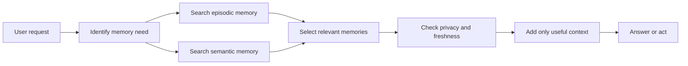

# Episodic and Semantic Memory

<div class="topic-page" markdown="1">

<section class="topic-hero">
  <span class="topic-hero__eyebrow">Stage 07 - RAG and Memory</span>
  <p class="topic-hero__lead">Episodic and semantic memory help an AI agent remember useful information across time. Episodic memory stores past events and interactions. Semantic memory stores stable facts, concepts, preferences, and learned knowledge. Good agents keep these memory types separate so they can retrieve the right context without remembering everything.</p>
  <div class="topic-hero__facts">
    <span>Episodic</span>
    <span>Semantic</span>
    <span>Retrieval</span>
    <span>Reflection</span>
    <span>Forgetting</span>
  </div>
</section>

## Goal

Understand the difference between episodic memory and semantic memory in AI
agents, how each one is stored and retrieved, and how they work with RAG,
conversation history, task state, and user profile storage.

After this lesson, you should be able to explain:

- what episodic memory stores,
- what semantic memory stores,
- how episodic memory can become semantic memory,
- how agent memory differs from normal RAG,
- what should and should not be saved,
- how to retrieve memory safely and usefully,
- how to design basic memory schemas,
- how to handle stale, wrong, private, or sensitive memories.

## Before You Start

Start with one simple distinction:

```text
Episodic memory remembers events.
Semantic memory remembers stable meaning.
```

Beginner example:

```text
Episodic memory:
  "On June 8, the user asked for help fixing a failing MkDocs build."

Semantic memory:
  "The user is working on an MkDocs-based AI agent roadmap."
```

The episodic memory is tied to a specific event. The semantic memory is a more
stable fact extracted from one or more events.

### Key Words In Plain English

| Word | Simple Meaning | Beginner Example |
| --- | --- | --- |
| Memory | Information saved for later use | saved user preference or past task |
| Episodic memory | Record of a past event or interaction | "User debugged parser tests yesterday" |
| Semantic memory | Stable fact or meaning learned from events | "User prefers Python examples" |
| Conversation history | Recent chat messages | last few turns in the current session |
| Task state | Current workflow progress | step 3 of a support ticket workflow |
| User profile | Stable facts about a specific user | timezone, role, style preference |
| RAG | Retrieval from documents or knowledge stores | search product docs before answering |
| Reflection | Turning events into higher-level lessons | "User often asks for concise Markdown docs" |
| Forgetting | Removing, expiring, or weakening memory | delete old temporary preferences |

## Learning Path

This topic is designed in four parts. Read them in order.

<div class="learning-grid learning-grid--path">
  <a class="learning-card" href="#part-1-understand-the-memory-types">
    <strong>Part 1 - Understand The Memory Types</strong>
    <span>Learn the difference between episodic memory, semantic memory, chat history, task state, and RAG.</span>
  </a>
  <a class="learning-card" href="#part-2-design-episodic-memory">
    <strong>Part 2 - Design Episodic Memory</strong>
    <span>Store useful event records with time, source, evidence, outcome, and privacy level.</span>
  </a>
  <a class="learning-card" href="#part-3-design-semantic-memory">
    <strong>Part 3 - Design Semantic Memory</strong>
    <span>Extract stable facts, preferences, concepts, and lessons from repeated evidence.</span>
  </a>
  <a class="learning-card" href="#part-4-retrieve-update-and-forget-memory">
    <strong>Part 4 - Retrieve, Update, And Forget Memory</strong>
    <span>Use memory only when relevant, handle conflicts, and avoid stale or unsafe context.</span>
  </a>
</div>

## Part 1: Understand The Memory Types

Agents need memory because useful work often spans more than one prompt. A user
may return to a project, continue a task, repeat a preference, or ask the agent
to recall a previous result.

Memory helps the agent maintain continuity. It should not mean storing every
message forever.

### Episodic Memory

Episodic memory stores records of past experiences.

In an agent system, an episode might be:

- a user request
- a tool call sequence
- a solved support case
- a previous debugging session
- a completed research task
- a human approval decision
- an important error and fix

Simple definition:

```text
Episodic memory is a timestamped record of something that happened.
```

Example:

```json
{
  "type": "episodic",
  "event": "User asked the agent to rewrite a Tool Schemas page.",
  "time": "2026-06-08T14:10:00Z",
  "project": "ai-agent-roadmap",
  "outcome": "Page was restructured and pushed to GitHub.",
  "source": "conversation"
}
```

This memory is useful when the agent needs to remember past work, decisions, or
evidence.

### Semantic Memory

Semantic memory stores stable facts, preferences, concepts, or learned meaning.

In an agent system, semantic memory might include:

- user preferences
- durable project facts
- domain concepts
- recurring constraints
- lessons learned from past episodes
- stable relationships between entities

Simple definition:

```text
Semantic memory is a stable fact or meaning that can be reused later.
```

Example:

```json
{
  "type": "semantic",
  "fact": "The ai-agent-roadmap project uses MkDocs Material.",
  "confidence": 0.95,
  "source": "repeated_project_context",
  "updated_at": "2026-06-08T14:10:00Z"
}
```

This memory is useful when the agent needs durable context without rereading the
same source every time.

### Episodic vs Semantic Memory

| Question | Episodic Memory | Semantic Memory |
| --- | --- | --- |
| What does it store? | Events and experiences | Stable facts and meanings |
| Is it tied to time? | Usually yes | Not always |
| Example | "User fixed issue #42 yesterday" | "User works on Python services" |
| Best for | Recall, audit, reflection, continuity | Personalization, project knowledge, durable context |
| Main risk | Storing too much history | Treating weak guesses as facts |
| Retrieval style | Find similar past events | Find relevant facts |

Beginner rule:

```text
Use episodic memory to remember what happened.
Use semantic memory to remember what remains true.
```

### Memory vs RAG

RAG and memory are related, but they are not the same thing.

| System | What it usually stores | Example |
| --- | --- | --- |
| RAG knowledge base | Documents or external knowledge | docs, policies, articles |
| Conversation history | Recent messages | last few turns |
| Task state | Current workflow progress | current step and open questions |
| Episodic memory | Past events | "we debugged this issue last week" |
| Semantic memory | Stable learned facts | "this project uses MkDocs" |
| User profile | Stable user-specific facts | timezone, style preference |

RAG usually retrieves external knowledge. Memory usually retrieves information
about the agent's past interactions, learned facts, or user/project continuity.

## Part 2: Design Episodic Memory

Episodic memory is useful when the agent needs to remember past events. It is
especially helpful for long-running work, debugging, support, research, and
workflow automation.

### What To Store In An Episode

An episode should be more than a raw transcript. It should capture the useful
parts of what happened.

| Field | Purpose | Example |
| --- | --- | --- |
| `event_id` | Unique identifier | `evt_123` |
| `user_id` | Who the episode belongs to | `user_456` |
| `project_id` | Optional project or workspace | `ai-agent-roadmap` |
| `timestamp` | When it happened | `2026-06-08T14:10:00Z` |
| `summary` | Short event summary | "Updated local vs remote MCP page" |
| `goal` | What the user wanted | "Add remote MCP examples" |
| `actions` | What the agent did | edited file, ran build, pushed commit |
| `outcome` | Result of the event | build passed, commit pushed |
| `evidence` | Links, files, commits, tool outputs | commit hash, file path |
| `privacy_level` | How sensitive it is | public, private, sensitive |

### Episodic Memory Schema

```json
{
  "event_id": "evt_20260608_001",
  "type": "episodic",
  "user_id": "user_123",
  "project_id": "ai-agent-roadmap",
  "timestamp": "2026-06-08T14:10:00Z",
  "goal": "Add remote MCP examples to the local vs remote MCP page.",
  "summary": "The agent added remote MCP workflows, config, and safety checks.",
  "actions": [
    "edited docs/stages/06-mcp/local-vs-remote-mcp/index.md",
    "ran mkdocs build --strict --clean",
    "pushed commit to main"
  ],
  "outcome": "success",
  "evidence": {
    "commit": "52e80467be8d9024c6bbf2b7613dd5533233b719",
    "file": "docs/stages/06-mcp/local-vs-remote-mcp/index.md"
  },
  "privacy_level": "project"
}
```

This is more useful than saving a whole chat transcript because it gives the
agent a compact record of the event.

### What Episodic Memory Is Good For

| Use case | How episodic memory helps |
| --- | --- |
| Debugging | Remember what failed, what was tried, and what fixed it |
| Research | Remember which sources were checked and what was concluded |
| Support | Remember previous customer interactions and resolutions |
| Coding | Remember prior changes, tests, and commit decisions |
| Approval workflows | Remember who approved an action and when |
| Long-running tasks | Resume work without redoing every step |

### What Not To Store As Episodes

Avoid storing every interaction by default. Raw history can become noisy,
expensive, invasive, and misleading.

Do not casually store:

- passwords, tokens, or secret keys
- private messages from other people
- sensitive personal information without clear consent
- temporary emotions or guesses
- huge raw transcripts when a summary is enough
- tool outputs that contain secrets
- events unrelated to future usefulness

Beginner rule:

```text
Store episodes that help future work.
Do not store everything just because storage is available.
```

## Part 3: Design Semantic Memory

Semantic memory stores stable meaning extracted from experience or explicit
user input.

It is useful when the agent should remember facts that remain true across
sessions.

### What Semantic Memory Stores

Semantic memory can store:

- user preferences
- durable project facts
- stable technical context
- recurring constraints
- domain terms
- summaries of repeated events
- higher-level lessons from episodes

Examples:

| Semantic Fact | Why It Helps |
| --- | --- |
| "User prefers concise final answers." | Improves response style |
| "The roadmap repo uses MkDocs Material." | Helps future documentation tasks |
| "Production incidents require approval before posting in Slack." | Helps safety and workflow control |
| "The parser test suite is run with `pytest tests/parser`." | Speeds up future coding tasks |

### Semantic Memory Schema

```json
{
  "memory_id": "mem_789",
  "type": "semantic",
  "subject": "ai-agent-roadmap",
  "predicate": "uses_site_generator",
  "value": "MkDocs Material",
  "confidence": 0.95,
  "source": "observed_repository_files",
  "evidence": [
    "requirements.txt",
    "mkdocs.yml"
  ],
  "created_at": "2026-06-08T14:20:00Z",
  "updated_at": "2026-06-08T14:20:00Z",
  "privacy_level": "project"
}
```

The `confidence`, `source`, and `evidence` fields matter. They prevent the
agent from treating every generated guess as a reliable fact.

### Turning Episodic Memory Into Semantic Memory

Semantic memory often comes from repeated or important episodes.

Example:

```text
Episode 1:
User asks for a concise Markdown lesson.

Episode 2:
User asks to keep final answers short and actionable.

Episode 3:
User prefers structure similar to existing roadmap pages.

Semantic memory:
User prefers concise, structured documentation updates that match existing page style.
```

This process is sometimes called reflection or consolidation.

The agent should not automatically convert every event into a permanent fact.
It should ask:

- Is this fact stable?
- Is it useful for future work?
- Is there enough evidence?
- Could this be a temporary preference?
- Is it safe and appropriate to store?
- Should the user confirm it?

### Semantic Memory Is Not Always True Forever

Semantic facts can become stale.

Example:

```text
Old memory:
"User works mainly with React."

New evidence:
User is now building mostly Python backend agents.
```

The system should update, weaken, or expire old memories. A memory store should
not act like a permanent truth database.

## Part 4: Retrieve, Update, And Forget Memory

Memory is only useful if the agent retrieves the right memory at the right time.

Bad memory retrieval can be worse than no memory because it can add irrelevant,
stale, or private context to the prompt.

### Retrieval Flow



The agent should not load all memories into every prompt. It should retrieve
only what helps the current task.

### Retrieval Examples

| User request | Useful episodic memory | Useful semantic memory |
| --- | --- | --- |
| "Continue the roadmap task from last time" | Last roadmap editing episode | Project uses MkDocs Material |
| "Run the same tests as before" | Prior test-running episode | Parser tests use `pytest tests/parser` |
| "Write this in my usual style" | Previous writing tasks | User prefers concise structured docs |
| "What did we decide about remote MCP?" | Prior MCP documentation episode | Remote MCP is for shared hosted services |

### Updating Memory

Memory should change when new evidence appears.

Update patterns:

| Pattern | Example |
| --- | --- |
| Add | Store a new support resolution episode |
| Merge | Combine repeated style preferences into one semantic fact |
| Strengthen | Increase confidence after repeated evidence |
| Weaken | Lower confidence when new evidence conflicts |
| Replace | Update project framework from old to new |
| Delete | Remove a user preference when requested |
| Expire | Remove stale temporary task facts |

### Forgetting

Forgetting is a core part of memory design. It protects users and keeps memory
useful.

Forgetting can mean:

- deleting a memory
- expiring old memories
- hiding sensitive memories from normal retrieval
- lowering confidence
- archiving raw episodes but keeping safe summaries
- removing data when a user asks

Beginner rule:

```text
Memory quality depends as much on forgetting as remembering.
```

### Privacy and Consent

Memory can make agents feel personal, but it can also become invasive.

Before storing memory, ask:

- Did the user explicitly ask the agent to remember this?
- Is the fact sensitive?
- Is the fact useful beyond this conversation?
- Could this memory harm the user if retrieved later?
- Can the user inspect, update, or delete it?
- Does the system log where the memory came from?

For production agents, memory should have clear user controls.

## Common Misunderstandings

| Misunderstanding | Correction | Simple Example |
| --- | --- | --- |
| Memory means saving every chat message | No. Useful memory is selected, structured, and retrievable. | Store "prefers concise answers," not every sentence. |
| Episodic and semantic memory are the same | No. Episodes are events; semantic memories are stable facts. | "We debugged X yesterday" vs "project uses pytest." |
| RAG is memory | Not exactly. RAG retrieves knowledge; memory stores continuity from experience or user context. | Product docs are RAG; prior user decisions are memory. |
| Semantic memory is always correct | No. It can be inferred incorrectly or become stale. | A user's preferred language can change. |
| More memory always improves agents | No. Irrelevant memory can distract the model and increase privacy risk. | Loading old unrelated tasks can confuse the answer. |
| Agents should remember sensitive facts automatically | No. Sensitive memory needs purpose, protection, and consent. | Do not store API keys or medical details casually. |

## Practice

### Exercise 1: Classify The Memory

Label each item as `episodic`, `semantic`, `profile`, `task state`, or `RAG`.

| Item | Memory Type | Why |
| --- | --- | --- |
| "User prefers short final answers." |  |  |
| "On June 8, the agent pushed commit abc123." |  |  |
| "The current task is step 3 of 5." |  |  |
| "The refund policy document says refunds expire after 30 days." |  |  |
| "The user is in Europe/Berlin timezone." |  |  |

### Exercise 2: Convert Episodes Into Semantic Memory

Given these episodes:

```text
Episode 1:
User asks for Markdown pages to match existing roadmap style.

Episode 2:
User asks to keep headings and page structure consistent with nearby docs.

Episode 3:
User rejects a page that does not match the repository's style.
```

Write one semantic memory that could be safely stored.

### Exercise 3: Design A Memory Schema

Design an episodic memory schema for this event:

```text
The user asked an agent to inspect a failing CI build. The agent read the log,
found that PyYAML was missing, updated requirements.txt, ran tests, and reported
the fix.
```

Include:

1. event ID
2. timestamp
3. goal
4. actions
5. outcome
6. evidence
7. privacy level
8. expiration or retention rule

### Exercise 4: Decide What To Forget

For each item, decide whether to keep, summarize, expire, or delete it.

| Item | Decision | Why |
| --- | --- | --- |
| User's preferred answer style |  |  |
| Raw transcript of a long debugging session |  |  |
| API key pasted by mistake |  |  |
| Old temporary instruction: "be extra detailed today" |  |  |
| Project fact confirmed by repo files |  |  |

## Exit Criteria

You understand this topic when you can:

- Define episodic memory in plain language.
- Define semantic memory in plain language.
- Explain how episodes can become semantic facts.
- Explain how memory differs from RAG, chat history, task state, and profile
  storage.
- Design a basic episodic memory record.
- Design a basic semantic memory record.
- Retrieve only relevant memories for a task.
- Identify stale, sensitive, or unsafe memories.
- Explain why forgetting is part of memory design.

## Further Reading

- [Retrieval-Augmented Generation for Knowledge-Intensive NLP Tasks](https://arxiv.org/abs/2005.11401)
- [Generative Agents: Interactive Simulacra of Human Behavior](https://arxiv.org/abs/2304.03442)
- [MemGPT: Towards LLMs as Operating Systems](https://arxiv.org/abs/2310.08560)

</div>
