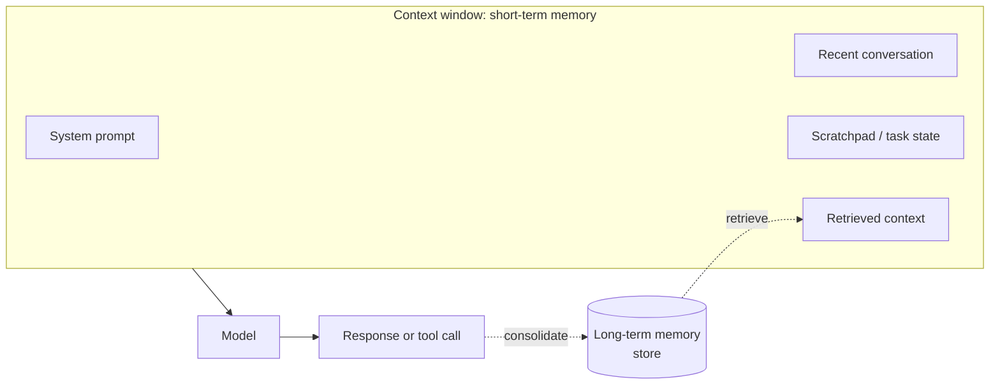
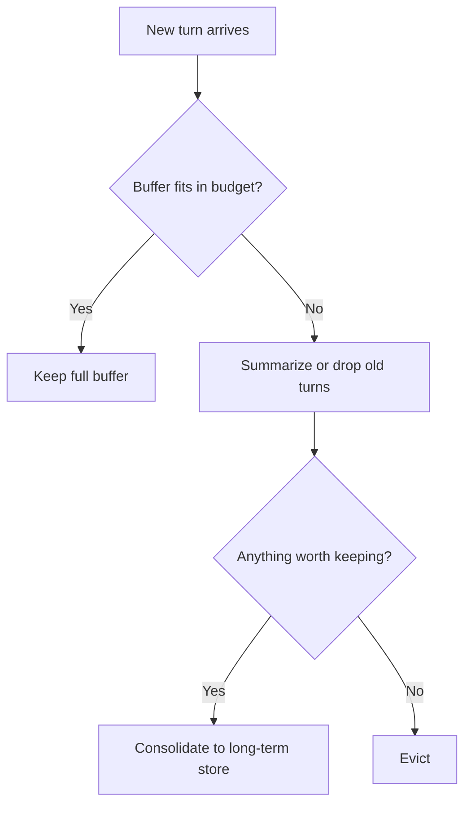
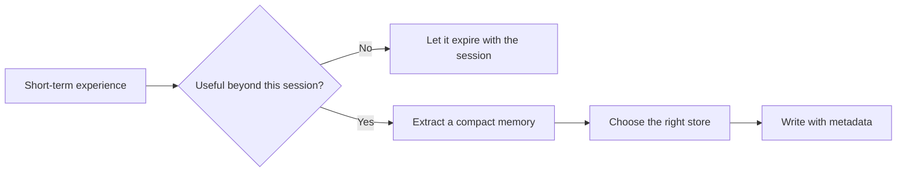
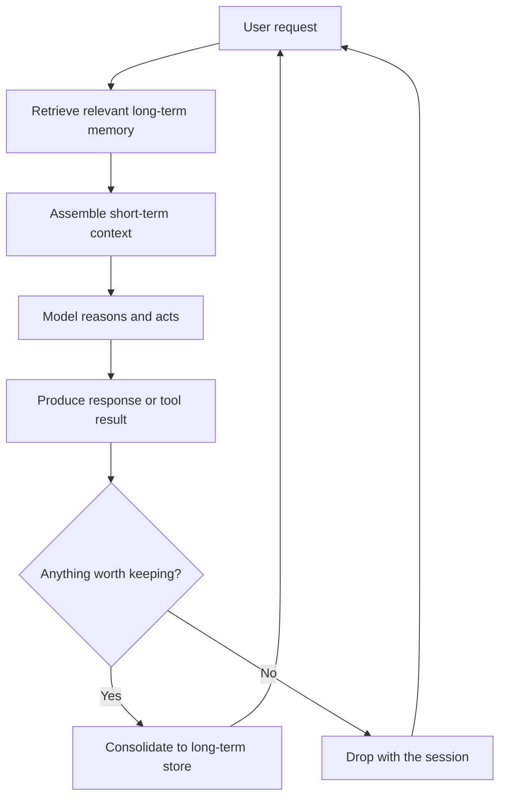

# Short-Term and Long-Term Memory

<div class="topic-page" markdown="1">

<section class="topic-hero">
  <span class="topic-hero__eyebrow">Stage 07 - RAG and Memory</span>
  <p class="topic-hero__lead">An agent has two kinds of memory. Short-term memory is what fits inside the context window right now: the current conversation, scratchpad, and task state. Long-term memory is what the agent saves outside the model and retrieves later. Good agents move information between the two on purpose.</p>
  <div class="topic-hero__facts">
    <span>Context window</span>
    <span>Working state</span>
    <span>Persistence</span>
    <span>Retrieval</span>
    <span>Consolidation</span>
  </div>
</section>

## Goal

Understand the difference between short-term and long-term memory in AI agents, what lives in each, and how information moves between them.

After this topic, you should be able to explain:

- what short-term memory is and where it lives,
- what long-term memory is and where it lives,
- why the context window is the boundary between them,
- how an agent decides what to keep and what to persist,
- how long-term memory is retrieved back into short-term memory,
- how the two memory horizons work together in a real agent loop.

## Before You Start

Start with one simple distinction:

> "Short-term memory is what the model can see right now. Long-term memory is what the agent saved for later."

**Beginner example:**

> "Short-term memory: the last 8 messages in this chat. Long-term memory: 'this user prefers Python examples,' stored in a database and loaded back when needed."

Short-term memory disappears when the session ends or the context window fills up. Long-term memory survives because it is stored outside the model and retrieved on demand.

### Key Words In Plain English

| Word | Simple Meaning | Beginner Example |
| --- | --- | --- |
| Context window | The text the model can read in one request | system prompt + chat history + retrieved context |
| Short-term memory | Working information held inside the context window | current conversation and scratchpad |
| Long-term memory | Information stored outside the model for later | saved preferences, past events, indexed documents |
| Working state | What the agent is doing right now | "step 3 of 5 of a refund workflow" |
| Persistence | Saving information so it survives the session | writing a fact to a database |
| Retrieval | Loading saved information back into context | searching memory and adding it to the prompt |
| Consolidation | Turning a short-term experience into long-term memory | saving "user prefers concise answers" after the chat |
| Eviction | Removing old items from short-term memory | dropping the oldest turns when the window is full |

## Learning Path

This topic is designed in four parts. Read them in order.

<div class="learning-grid learning-grid--path">
  <a class="learning-card" href="#part-1-understand-the-two-memory-horizons">
    <strong>Part 1 - Understand The Two Horizons</strong>
    <span>Learn what short-term and long-term memory are and why the context window is the boundary.</span>
  </a>
  <a class="learning-card" href="#part-2-work-with-short-term-memory">
    <strong>Part 2 - Work With Short-Term Memory</strong>
    <span>Manage the conversation buffer, scratchpad, and task state inside a finite context window.</span>
  </a>
  <a class="learning-card" href="#part-3-design-long-term-memory">
    <strong>Part 3 - Design Long-Term Memory</strong>
    <span>Decide what to persist, where to store it, and how to retrieve it back into context.</span>
  </a>
  <a class="learning-card" href="#part-4-make-short-term-and-long-term-memory-work-together">
    <strong>Part 4 - Make Them Work Together</strong>
    <span>Run the memory loop: retrieve, use, and consolidate, while controlling freshness, privacy, and cost.</span>
  </a>
</div>

## Part 1: Understand The Two Memory Horizons

An agent does useful work across many steps and sometimes across many sessions. To stay coherent, it needs to remember things. But "remember" means two very different things.

| Memory Horizon | Where It Lives | How Long It Lasts | How It Is Used |
| --- | --- | --- | --- |
| Short-term memory | Inside the context window | One request or one session | The model reads it directly |
| Long-term memory | Outside the model, in a store | Across sessions, until deleted | The agent must retrieve it first |

The key idea:

```text
Short-term memory is read for free, but it is small and temporary.
Long-term memory is large and durable, but it must be searched and loaded.
```

### The Context Window Is The Boundary

The model can only read what fits in its context window. Everything the model "knows" during one request is short-term memory: the system prompt, the recent conversation, the scratchpad, and any retrieved context the app added.



**How to read this diagram:** the context window holds short-term memory. Long-term memory lives in a store. The agent retrieves long-term memory *into* the window when it is relevant, and consolidates useful results back *out* to the store after acting.

When the conversation grows past the window, the oldest short-term memory must be evicted, summarized, or moved to long-term memory. It does not stay just because it once mattered.

### Why You Need Both

If an agent only had short-term memory:

- it would forget everything when the session ended,
- it could not personalize across visits,
- long conversations would overflow the context window,
- it would re-read the same documents every time.

If an agent only had long-term memory:

- it would have no sense of the current conversation,
- it could not track the step it is on,
- every turn would require a database lookup for basic continuity.

Real agents use both. Short-term memory keeps the current task coherent. Long-term memory carries knowledge forward.

### How This Relates To RAG And Other Memory Types

This topic is the high-level frame. The other Stage 07 topics are specific kinds of memory that fit inside it:

| Topic | Where It Fits |
| --- | --- |
| RAG and vector search | A read path into long-term *knowledge* memory |
| [Vector databases, SQL, and custom stores](../vector-databases-sql-custom-stores/index.md) | The backends that hold long-term memory |
| [Episodic and semantic memory](../episodic-and-semantic-memory/index.md) | Two *types* of long-term memory |
| [User profile storage](../user-profile-storage/index.md) | A specific long-term memory store for stable user facts |
| Summarization, compression, and forgetting | How short-term memory is reduced and how long-term memory is pruned |

## Part 2: Work With Short-Term Memory

Short-term memory is everything the model can see in the current request. It is fast and direct, but it is bounded by the context window, so it must be managed.

### What Lives In Short-Term Memory

| Item | Purpose | Example |
| --- | --- | --- |
| System prompt | Role, rules, and tools | "You are a support agent. Use only the provided context." |
| Conversation buffer | Recent turns | the last several user and assistant messages |
| Scratchpad | The agent's intermediate reasoning and notes | a plan, a draft, partial results |
| Task state | Progress through a workflow | "collected name and order ID, still need reason" |
| Retrieved context | Long-term memory loaded for this turn | top-k chunks from the knowledge base |

Short-term memory is not just chat history. For an agent, the scratchpad and task state are often the most important parts, because they hold the work in progress. See the [agent loop](../../04-agent-fundamentals/agent-loop/index.md) for how this state is threaded through each step.

### The Context Budget

Every token in the window costs money and latency, and the window has a hard limit. Treat short-term memory as a budget, not an unlimited log.

```text
Total window
  = system prompt
  + tool definitions
  + conversation buffer
  + scratchpad / task state
  + retrieved context
  + room for the model's answer
```

If the inputs grow too large, you have less room for retrieval and for the answer itself. Review [context windows](../../02-llm-fundamentals/context-windows/index.md) for how token limits behave.

### Strategies When The Window Fills Up

As a conversation grows, the buffer eventually does not fit. Common strategies:

| Strategy | What It Does | Trade-off |
| --- | --- | --- |
| Full buffer | Keep every message | Simple, but overflows and gets expensive |
| Sliding window | Keep only the last N turns | Cheap, but forgets earlier context |
| Summary buffer | Replace old turns with a running summary | Keeps the gist, loses exact wording |
| Selective recall | Keep only turns relevant to the current question | Powerful, but needs retrieval logic |
| Offload to long-term | Save important details, then drop them from the buffer | Durable, but requires a write and later retrieval |



**How to read this diagram:** when the buffer no longer fits, the agent reduces short-term memory. Before evicting, it checks whether anything should be saved to long-term memory first.

The detail of *how* to shrink memory safely — summary quality, compression, and what to forget — is covered in the **Summarization, compression, and forgetting** topic. Here, the key point is *that* short-term memory is finite and must be reduced on purpose.

!!! warning "Do not rely on short-term memory for durable facts"
    A preference mentioned 50 messages ago may have already scrolled out of the window. If a fact must survive the session, write it to long-term memory. Do not assume the model still sees it.

## Part 3: Design Long-Term Memory

Long-term memory is information the agent saves outside the model so it survives beyond the current window or session. It is large and durable, but the model cannot see it until the agent retrieves it.

### The Write Path: Deciding What To Persist

Not everything from short-term memory should become long-term memory. Persist only what is useful later.



**How to read this diagram:** consolidation is a decision, not an automatic dump. The agent extracts a compact memory, picks a store, and writes it with metadata such as source, time, and privacy level.

Good candidates to persist:

- stable user preferences and profile facts,
- decisions and their outcomes,
- solved problems and how they were fixed,
- durable project or domain facts,
- documents that should be searchable later.

Poor candidates to persist:

- one-off temporary instructions ("be extra detailed today"),
- secrets, tokens, or sensitive data without consent,
- raw transcripts when a short summary is enough,
- guesses with no supporting evidence.

### Where Long-Term Memory Lives

Long-term memory is not one database. The store depends on how the memory will be retrieved.

| Memory | Retrieval Style | Typical Store |
| --- | --- | --- |
| Searchable knowledge (RAG) | By meaning | Vector database |
| Stable user facts | By exact key | SQL or document store |
| Task and session state | By ID, fast | Key-value store |
| Past events for recall | By similarity or time | Vector database or event log |
| Audit history | Append-only | Log or SQL table |

Choosing and combining these backends is the subject of [Vector databases, SQL, and custom stores](../vector-databases-sql-custom-stores/index.md). The two *types* of experiential long-term memory — events versus stable facts — are covered in [Episodic and semantic memory](../episodic-and-semantic-memory/index.md).

### The Read Path: Retrieving Into Short-Term Memory

Long-term memory only helps when the right piece is retrieved into the context window at the right time.

```text
User request
  -> decide what memory is needed
  -> search the relevant store
  -> filter by permission and freshness
  -> add only the useful memories to the prompt
  -> model uses them as short-term memory for this turn
```

The retrieved memory becomes short-term memory for that single turn. After the turn, it is gone again unless it stays in the buffer. This is why retrieval is per-turn work, not a one-time load.

!!! danger "Retrieve only what is relevant"
    Loading the entire long-term store into the prompt defeats the purpose. It overflows the budget, raises cost, adds privacy risk, and distracts the model. Retrieve a small, relevant, permitted set.

## Part 4: Make Short-Term And Long-Term Memory Work Together

The two horizons are not separate systems. They form a loop: long-term memory feeds short-term memory, and short-term experiences feed back into long-term memory.

### The Memory Loop



**How to read this diagram:** each turn pulls long-term memory in, uses it as short-term context, then decides what new information is worth writing back out. Over time, the agent gets more useful without bloating the prompt.

### A Worked Example

```text
Session 1:
  User: "I always want code examples in Python."
  -> Short-term: the model sees this in the current turn.
  -> Consolidate: write a profile fact { answer_examples: "python" } to long-term memory.

Session 2 (days later, fresh context window):
  User: "How do I read a CSV file?"
  -> Short-term buffer does NOT contain the old preference; the session is new.
  -> Retrieve: the agent loads { answer_examples: "python" } from long-term memory.
  -> Result: the answer uses a Python example without the user repeating themselves.
```

The preference survived because it was consolidated to long-term memory in Session 1 and retrieved back into short-term memory in Session 2.

### Things To Get Right

| Concern | Why It Matters | Practical Rule |
| --- | --- | --- |
| Freshness | Stale long-term memory can override current facts | Prefer the latest value; expire temporary memories |
| Relevance | Irrelevant memory wastes budget and distracts the model | Retrieve a small, on-topic set per turn |
| Permission | Memory can leak across users or tenants | Filter by user and tenant before adding to context |
| Cost | Every retrieved token costs money and latency | Keep retrieved context tight |
| Consent | Personal long-term memory is sensitive | Persist personal facts with consent and a delete path |

### Common Mistakes

<div class="visual-checklist">
  <div>
    <strong>Weak memory design</strong>
    <ul>
      <li>Treat the whole chat history as permanent memory</li>
      <li>Assume a fact from 50 turns ago is still in the window</li>
      <li>Dump the entire long-term store into every prompt</li>
      <li>Never consolidate, so the agent forgets every session</li>
      <li>Keep stale memories that contradict current facts</li>
      <li>Store personal long-term memory without consent or deletion</li>
    </ul>
  </div>
  <div>
    <strong>Stronger memory design</strong>
    <ul>
      <li>Treat short-term memory as a finite context budget</li>
      <li>Write durable facts to long-term memory on purpose</li>
      <li>Retrieve a small, relevant, permitted set per turn</li>
      <li>Consolidate useful results back to the store</li>
      <li>Expire or update stale memories</li>
      <li>Give users visibility, correction, and deletion controls</li>
    </ul>
  </div>
</div>

## Practice

### Exercise 1: Classify The Memory

Label each item as `short-term` or `long-term`, and name where it lives.

| Item | Horizon | Where It Lives |
| --- | --- | --- |
| The last 6 messages in the current chat | | |
| "User prefers concise answers," saved in a database | | |
| The agent's plan for the current task | | |
| Indexed product documentation searched at query time | | |
| "Step 2 of 4 complete" in the current workflow | | |

### Exercise 2: Fit The Budget

A context window holds 8,000 tokens. The system prompt and tool definitions use 1,500. The model needs 1,000 reserved for its answer. The conversation buffer is now 4,000 and growing, and you want to retrieve 3,000 tokens of long-term context.

1. Does everything fit? Show the math.
2. Name two strategies to make room without losing the user's current goal.
3. Which detail in the buffer, if any, should be consolidated to long-term memory before it is dropped?

### Exercise 3: Design The Loop

For a personal coding assistant, describe:

1. one fact that should be consolidated to long-term memory,
2. when it should be retrieved back into short-term memory,
3. how you would expire it if it stops being true.

## Mini Project

Build a tiny two-tier memory prototype for a chat agent.

It should support:

- a short-term buffer with a fixed token or message budget,
- eviction when the budget is exceeded,
- a `remember(fact)` function that writes to a long-term store,
- a `recall(query)` function that retrieves relevant facts,
- a per-turn flow that retrieves before answering and consolidates after,
- a simple rule for what is worth consolidating.

Suggested data model:

```json
{
  "short_term": {
    "budget_tokens": 4000,
    "messages": []
  },
  "long_term": [
    {
      "memory_id": "mem_001",
      "kind": "preference",
      "text": "User prefers Python code examples.",
      "source": "user_explicit",
      "created_at": "2026-06-08T10:00:00Z",
      "expires_at": null
    }
  ]
}
```

Test cases:

1. The buffer overflows and the oldest turns are evicted.
2. A stated preference is consolidated to long-term memory.
3. A new session retrieves that preference back into short-term context.
4. A temporary instruction is used for one turn and not persisted.
5. A user asks to delete a remembered fact.

## Exit Criteria

You are ready to move on when you can:

- explain short-term and long-term memory in plain language,
- describe where each one lives and how long it lasts,
- explain why the context window is the boundary between them,
- list what belongs in short-term memory and what should be persisted,
- describe how long-term memory is retrieved back into short-term memory,
- explain the memory loop of retrieve, use, and consolidate,
- identify freshness, relevance, permission, cost, and consent concerns.

## Resources

- [Context Windows](../../02-llm-fundamentals/context-windows/index.md)
- [Agent Loop](../../04-agent-fundamentals/agent-loop/index.md)
- [RAG Basics](../../02-llm-fundamentals/rag-basics/index.md)
- [Embeddings and Vector Search](../../02-llm-fundamentals/embeddings-vector-search/index.md)
- [Vector Databases, SQL, and Custom Stores](../vector-databases-sql-custom-stores/index.md)
- [Episodic and Semantic Memory](../episodic-and-semantic-memory/index.md)
- [User Profile Storage](../user-profile-storage/index.md)
- [MemGPT: Towards LLMs as Operating Systems](https://arxiv.org/abs/2310.08560)
- [LangGraph: Memory concepts](https://langchain-ai.github.io/langgraph/concepts/memory/)
- [Generative Agents: Interactive Simulacra of Human Behavior](https://arxiv.org/abs/2304.03442)

</div>
