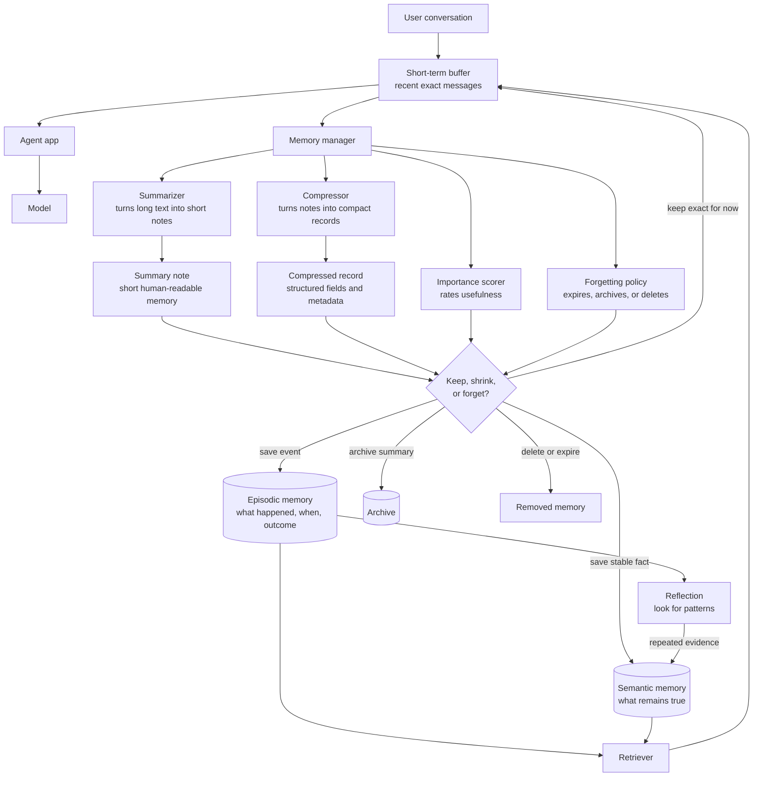
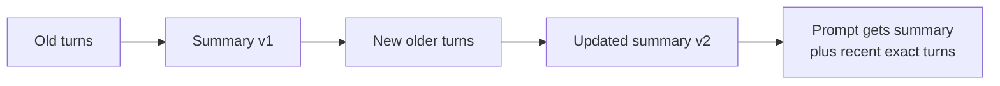
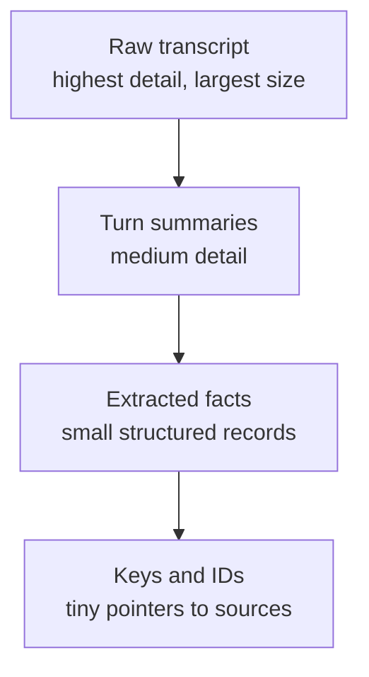
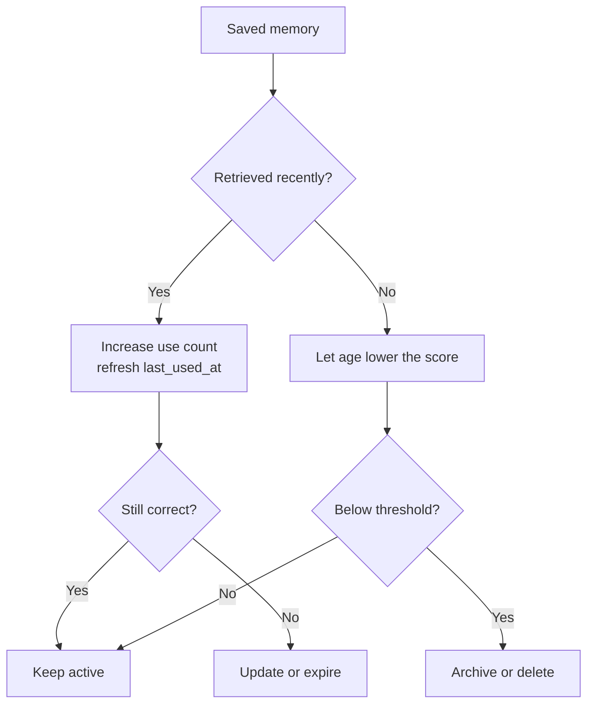
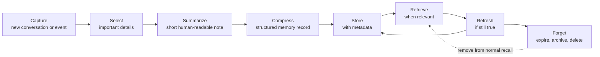

# Summarization, Compression, and Forgetting

<div class="topic-page" markdown="1">

<section class="topic-hero">
  <span class="topic-hero__eyebrow">Stage 07 - RAG and Memory</span>
  <p class="topic-hero__lead">AI agents can read and store a lot, but they cannot keep every word forever. Summarization turns long experiences into short notes, compression keeps useful meaning in fewer tokens, and forgetting removes stale, unsafe, or low-value memories so the agent stays fast, focused, and trustworthy.</p>
  <div class="topic-hero__facts">
    <span>Summaries</span>
    <span>Compression</span>
    <span>Sliding windows</span>
    <span>Aging</span>
    <span>Deletion</span>
  </div>
</section>

## Goal

Understand how agents shrink, save, refresh, and delete memory instead of trying
to remember everything.

After this lesson, you should be able to explain:

- why agents need memory reduction,
- the difference between summarization, compression, and forgetting,
- how a sliding window keeps recent messages in detail,
- how an agent decides what to keep, summarize, compress, archive, or delete,
- why old memories need timestamps, confidence, source, and expiration rules,
- how memory policies protect speed, cost, privacy, and answer quality.

## Before You Start

Start with one simple picture:

```text
Raw chat history is a whole movie.
Summarization is a short movie review.
Compression is a tiny but organized study note.
Forgetting is throwing away notes that are old, wrong, private, or useless.
```

Beginner example:

```text
Whole day at an amusement park:
  "We parked, walked in, waited, bought tickets, rode the blue rollercoaster..."

Summary:
  "We rode three rollercoasters, ate a giant pretzel, and lost sunglasses."

Compressed memory card:
  {
    "event": "amusement_park_visit",
    "highlights": ["three rollercoasters", "giant pretzel", "lost sunglasses"],
    "important_follow_up": "replace sunglasses"
  }

Forgotten:
  every step walked, every filler sentence, and exact wait times that no longer matter.
```

An agent does the same thing. It keeps the parts that help future work and
removes the parts that only make the prompt larger.

### Key Words In Plain English

| Word | Simple Meaning | Beginner Example |
| --- | --- | --- |
| Summarization | Turning long text into a shorter explanation | "The user wants Python examples" |
| Compression | Keeping useful information in fewer tokens or fields | a structured memory card instead of a whole transcript |
| Forgetting | Removing, expiring, hiding, or weakening memory | delete an old temporary preference |
| Sliding window | Keeping only the newest exact messages | last 10 chat turns stay detailed |
| Aging | Lowering a memory's value as it gets older | a six-month-old preference may matter less |
| Importance score | A number that estimates whether memory is worth keeping | "current project goal" scores higher than small talk |
| Recency | How new a memory is | today's task beats last year's task |
| Usage count | How often a memory is reused | frequently used preference stays alive |
| TTL | "Time to live"; when a memory should expire | temporary setting expires tomorrow |
| Retention policy | Rules for how long to keep data | delete raw chats after 30 days |

## Learning Path

This topic is designed in four parts. Read them in order.

<div class="learning-grid learning-grid--path">
  <a class="learning-card" href="#part-1-understand-the-three-jobs">
    <strong>Part 1 - Understand The Three Jobs</strong>
    <span>Separate summarization, compression, and forgetting so each one has a clear role.</span>
  </a>
  <a class="learning-card" href="#part-2-shrink-short-term-memory">
    <strong>Part 2 - Shrink Short-Term Memory</strong>
    <span>Use sliding windows, running summaries, and memory cards when the context window fills up.</span>
  </a>
  <a class="learning-card" href="#part-3-manage-long-term-memory">
    <strong>Part 3 - Manage Long-Term Memory</strong>
    <span>Score, refresh, merge, expire, archive, and delete saved memories.</span>
  </a>
  <a class="learning-card" href="#part-4-balance-remembering-and-forgetting">
    <strong>Part 4 - Balance Remembering And Forgetting</strong>
    <span>Prevent amnesia, stale answers, privacy leaks, slow prompts, and memory clutter.</span>
  </a>
</div>

## Part 1: Understand The Three Jobs

An AI agent has two memory limits:

1. The model can only read a limited amount of text in one request.
2. Stored memory becomes expensive and messy if everything is kept forever.

So a memory system needs three jobs.

| Job | What It Does | What It Saves | Main Risk |
| --- | --- | --- | --- |
| Summarization | Writes the important story in fewer words | goals, decisions, facts, open tasks | missing an important detail |
| Compression | Stores meaning in a smaller form | structured fields, compact state, embeddings, IDs | losing nuance or source evidence |
| Forgetting | Removes or weakens memory | space, speed, privacy, focus | deleting something still useful |

Simple rule:

```text
Summarization asks: "What happened?"
Compression asks: "What is the smallest useful form?"
Forgetting asks: "Should this still exist or be retrieved?"
```

### Role Relationship Diagram



**How to read this diagram:** the agent keeps recent messages in short-term
memory. A memory manager decides what old information should become a summary,
a compact record, an archived note, or deleted data. Important event records go
to episodic memory. Stable facts go to semantic memory. Later, the retriever
pulls only relevant long-term memory back into the short-term buffer.

### Why Divide Episodic And Semantic Memory?

Agents divide these memories because they answer different questions.

```text
Episodic memory asks: "What happened?"
Semantic memory asks: "What is true or useful now?"
```

Think about school notes:

```text
Episodic note:
  "On Monday, Maya missed three fraction questions because she forgot to find a
  common denominator."

Semantic note:
  "Maya needs practice adding fractions with different denominators."
```

The episodic note is a record of one event. It has time, evidence, and outcome.
The semantic note is a general lesson learned from that event. It is easier to
reuse in the future.

| Memory Type | Stores | Best For | Example |
| --- | --- | --- | --- |
| Episodic memory | past events, actions, outcomes, evidence | recall, audit, reflection | "Yesterday the agent fixed a broken MkDocs link." |
| Semantic memory | stable facts, preferences, concepts, lessons | personalization, planning, durable context | "The project uses MkDocs Material." |

They are divided for four practical reasons:

- **Different shape:** episodic memory needs timestamps, steps, outcomes, and
  evidence. Semantic memory needs facts, confidence, source, and update rules.
- **Different retrieval:** episodic memory is useful when asking "what happened
  before?" Semantic memory is useful when asking "what should I know right now?"
- **Different forgetting:** old episodes can often be archived, while stable
  facts may stay active until they are corrected or become stale.
- **Different risk:** turning one event into a permanent fact too quickly can
  make the agent believe something that is not really true.

Technical rule:

```text
Do not immediately turn every episode into semantic memory.
Use reflection, repeated evidence, or explicit user confirmation first.
```

Example:

```text
One episode:
  "Today the user asked for a very detailed answer."

Bad semantic memory:
  "The user always prefers very detailed answers."

Better semantic memory:
  no permanent preference yet, or:
  "For today's task, the user asked for extra detail."
```

### Why "Remember Everything" Fails

Imagine carrying every school notebook, every worksheet, every snack wrapper,
and every old permission slip in one backpack. More stuff does not mean better
studying. It means a heavier backpack and slower searching.

Agents have the same problem.

| If The Agent Keeps Everything | What Goes Wrong |
| --- | --- |
| Huge prompt | slower and more expensive responses |
| Old facts | stale answers that may no longer be true |
| Raw private text | higher privacy and security risk |
| Repeated details | memory store fills with duplicates |
| Irrelevant memories | model gets distracted from the current task |

Good memory design is selective. The agent should remember what helps, prove
where important facts came from, and remove what should not remain.

## Part 2: Shrink Short-Term Memory

Short-term memory is what the model can see right now. It includes the system
prompt, recent messages, tool results, scratchpad, task state, and retrieved
context.

When that text grows too large, the agent has to shrink it.

### The Sliding Window

A sliding window keeps the newest messages in exact detail and drops older
messages from the live buffer.

```text
Turn 1  Turn 2  Turn 3  Turn 4  Turn 5  Turn 6
drop    drop    keep    keep    keep    keep
```

Beginner example:

```text
The agent keeps the last 10 messages exactly.
Older messages are summarized or removed.
```

This is fast and simple. The problem is that an important detail from an older
turn might disappear unless the agent summarizes or stores it first.

### Running Summary

A running summary is a short note that gets updated as the conversation grows.



**How to read this diagram:** the prompt does not need every old message. It can
carry a short updated summary plus the newest messages in exact detail.

Example:

```text
Raw conversation:
  40 messages about a science fair project.

Running summary:
  "The user is building a volcano experiment. They need a safe materials list,
  a 3-minute presentation, and a poster outline. They already chose baking soda
  and vinegar. Open task: write conclusion."
```

That summary is much smaller than 40 messages, but it keeps the working goal.

### Types Of Summaries

| Summary Type | What It Keeps | When To Use It |
| --- | --- | --- |
| Conversation summary | main goals, decisions, open questions | long chats |
| Task-state summary | current step, completed steps, blockers | workflows |
| Decision summary | choices made and why | planning and design |
| User-preference summary | stable preferences | personalization |
| Error summary | bug, cause, fix, evidence | debugging agents |
| Research summary | sources checked and conclusions | research agents |

The summary should match the job. A support agent needs ticket status. A coding
agent needs files changed, tests run, and remaining work. A tutor needs the
student's current misunderstanding and next exercise.

### Compression Levels

Compression is not always one step. Agents often use layers.



**How to read this diagram:** each layer is smaller but loses some detail. The
agent can keep a tiny record for normal use and store a pointer to stronger
evidence when exact wording matters.

Example:

```text
Raw text:
  "Could you remember that I usually like examples in Python, not JavaScript?"

Summary:
  "User prefers Python examples."

Compressed memory record:
  {
    "kind": "preference",
    "key": "example_language",
    "value": "python",
    "source": "user_explicit",
    "confidence": 1.0
  }
```

### Lossless And Lossy Compression

There are two important kinds of compression.

| Compression Type | Meaning | Agent Example |
| --- | --- | --- |
| Lossless | Can recover the original exactly | store raw transcript in a compressed file |
| Lossy | Keeps useful meaning but loses exact wording | replace transcript with a summary |

Most agent memory compression is lossy. That is useful, but it means the agent
must be careful. A summary can accidentally leave out a warning, deadline, or
condition.

Practical rule:

```text
Use summaries for normal continuity.
Keep source links or raw evidence for facts that need proof.
```

### What A Good Summary Should Preserve

A summary should not just sound nice. It should preserve useful state.

| Preserve This | Why |
| --- | --- |
| User goal | the agent needs to know what it is trying to do |
| Constraints | budget, deadline, language, safety limits |
| Decisions | avoids reopening choices already made |
| Open tasks | shows what is unfinished |
| Important facts | names, project settings, preferences |
| Uncertainty | prevents guesses from becoming fake facts |
| Source pointers | helps verify important claims later |

Weak summary:

```text
"The user talked about a project."
```

Better summary:

```text
"The user is adding a Stage 07 lesson to an MkDocs AI agent roadmap.
Goal: explain summarization, compression, and forgetting for middle school
students, with diagrams and technical details. Open task: verify the MkDocs
build after adding the page."
```

## Part 3: Manage Long-Term Memory

Long-term memory lives outside the model: a database, vector store, document
store, key-value store, archive, or file system.

The agent should not dump every chat into long-term memory. It should write
compact memories with metadata.

### A Useful Memory Record

```json
{
  "memory_id": "mem_123",
  "user_id": "user_456",
  "kind": "preference",
  "text": "User prefers Python examples.",
  "source": "user_explicit",
  "confidence": 1.0,
  "importance": 0.8,
  "created_at": "2026-06-08T10:00:00Z",
  "updated_at": "2026-06-08T10:00:00Z",
  "last_used_at": "2026-06-08T10:30:00Z",
  "use_count": 4,
  "expires_at": null,
  "privacy_level": "normal"
}
```

The text alone is not enough. Metadata tells the agent whether the memory is
fresh, trusted, private, useful, and safe to retrieve.

### The Keep Score

Many memory systems use a score to decide what survives.

Simple version:

```text
keep_score =
  importance
  + recency
  + usage
  + confidence
  - sensitivity
  - redundancy
```

Middle school version:

```text
Keep memories that are important, recent, used often, and trustworthy.
Remove memories that are private, repeated, old, or not useful.
```

More technical version:

```text
recency_score = e ^ (-age_days / half_life_days)

keep_score =
  (0.40 * importance)
  + (0.20 * recency_score)
  + (0.20 * confidence)
  + (0.20 * usage_score)
  - sensitivity_penalty
  - duplicate_penalty
```

The exact weights depend on the product. A homework tutor may value recent
misunderstandings. A legal research tool may value source reliability. A
personal assistant may value explicit user preferences.

### Aging And Half-Life

Aging means older memories slowly lose priority.

Half-life is a simple way to explain it:

```text
If a memory has a half-life of 30 days,
its recency score is about half as strong after 30 days.
```

This does not mean the memory is automatically deleted. It means the agent needs
another reason to keep using it, such as high importance or frequent reuse.

Examples:

| Memory | Good Aging Rule |
| --- | --- |
| "User wants detailed answers today" | expires after the session |
| "User prefers Python examples" | lasts until changed, but can be refreshed |
| "Current shipping address" | expires or requires confirmation |
| "Project uses MkDocs" | refresh when repository files confirm it |
| "Old support ticket summary" | archive after the ticket closes |

### Use It Or Lose It

If a memory is used often, it may stay active. If it is never used, it may be
archived or deleted.



**How to read this diagram:** useful memories are refreshed when they are used.
Unused memories age down. If they fall below a threshold, the system archives or
deletes them.

### Forgetting Does Not Always Mean Delete

Forgetting can happen in several ways.

| Action | What It Means | Example |
| --- | --- | --- |
| Drop from prompt | do not show it to the model this turn | irrelevant old project note |
| Lower score | make it less likely to retrieve | old preference not mentioned lately |
| Expire | mark it inactive after a date | "be extra detailed today" |
| Merge | combine duplicates into one better memory | repeated "prefers Python" facts |
| Archive | keep outside normal retrieval | old raw episode for audit |
| Redact | remove sensitive parts | delete API key from a transcript |
| Delete | remove from storage | user asks "forget this" |

This matters because different data has different rules. A stale preference can
expire. A duplicate can merge. A secret pasted by mistake should be deleted or
redacted, not summarized.

### Pseudocode For A Memory Cleanup Job

```python
def cleanup_memories(memories, now):
    for memory in memories:
        if memory.user_deleted:
            delete(memory)
            continue

        if memory.privacy_level == "secret":
            redact_or_delete(memory)
            continue

        if memory.expires_at and memory.expires_at <= now:
            expire(memory)
            continue

        recency = decay(memory.updated_at, now, half_life_days=30)
        usage = usage_score(memory.use_count, memory.last_used_at, now)
        score = (
            0.40 * memory.importance
            + 0.20 * recency
            + 0.20 * memory.confidence
            + 0.20 * usage
            - sensitivity_penalty(memory)
            - duplicate_penalty(memory)
        )

        if score < 0.25:
            archive_or_delete(memory)
        elif is_duplicate(memory):
            merge_with_best_memory(memory)
        else:
            keep_active(memory)
```

You do not have to use this exact formula. The important idea is that cleanup is
a repeatable policy, not a random choice.

## Part 4: Balance Remembering And Forgetting

Memory design is a balancing act.

```text
Forget too fast  -> the agent feels like it has amnesia.
Forget too slowly -> the agent becomes slow, expensive, stale, and risky.
```

The best memory system keeps the smallest set of information that is useful,
current, permitted, and retrievable.

### The Full Memory Lifecycle



**How to read this diagram:** memory is not a one-time save. It has a lifecycle.
The agent captures information, selects what matters, stores it compactly, uses
it later, refreshes it when still true, and forgets it when it should no longer
guide behavior.

### Worked Example: Homework Tutor

```text
Turn 1:
  Student: "I always mix up fractions when the denominators are different."

Short-term memory:
  The model sees the exact sentence right now.

Summarization:
  "Student struggles with adding fractions with unlike denominators."

Compression:
  {
    "kind": "learning_gap",
    "subject": "math",
    "skill": "adding fractions with unlike denominators",
    "confidence": 0.9,
    "source": "student_explicit",
    "expires_at": null
  }

Future retrieval:
  When the student asks a fraction question, the tutor retrieves this memory and
  gives a slower explanation with denominator practice.

Forgetting:
  If the student answers several denominator problems correctly over time, the
  memory is updated:
  "Student previously struggled, but recent performance is strong."
```

The tutor did not store every sentence. It saved the useful learning state and
updated it when the student improved.

### Worked Example: Coding Agent

```text
Raw session:
  The user asks an agent to update an MkDocs roadmap page.
  The agent reads existing Stage 07 pages, adds a new lesson, updates nav,
  runs a build, and fixes a broken link.

Summary:
  "Added Stage 07 lesson on summarization, compression, and forgetting.
  Updated nav and checkpoint. MkDocs build passed."

Compressed memories:
  Project fact:
    "The ai-agent-roadmap project uses MkDocs Material."

  User preference:
    "User wants beginner-friendly explanations with clear examples and diagrams."

  Episode:
    "On 2026-06-08, Stage 07 memory page was added and build passed."

Forgotten:
  exact terminal noise, repeated file listings, and temporary draft wording.
```

This gives the future agent useful continuity without stuffing the next prompt
with the entire work session.

### Common Failure Modes

| Failure Mode | What It Looks Like | Better Design |
| --- | --- | --- |
| Summary drift | each summary update slowly changes the meaning | keep source pointers and re-check important facts |
| Over-compression | the memory is too short to be useful | preserve goals, constraints, decisions, and open tasks |
| Stale memory | old facts override new instructions | prefer recent explicit user statements |
| Memory clutter | many duplicate memories say almost the same thing | merge duplicates and keep the best source |
| Privacy leak | private memory appears in the wrong context | filter by user, tenant, permission, and sensitivity |
| Unsafe persistence | secrets are stored as normal memories | redact or delete secrets immediately |
| Amnesia | useful facts disappear too quickly | protect high-confidence preferences and current goals |

### Freshness And Conflict Rules

When memories disagree, the agent needs clear rules.

| Situation | Rule |
| --- | --- |
| Current user message conflicts with old memory | trust the current explicit message |
| Two saved memories conflict | prefer higher confidence and newer timestamp |
| Inferred memory conflicts with explicit memory | prefer explicit memory |
| Sensitive memory is relevant | require permission and purpose before retrieval |
| Memory has no source | treat it as weak until verified |

Example:

```text
Old memory:
  "User prefers blue designs."

New user message:
  "I used to like blue, but now use green for this project."

Correct update:
  expire or update the old blue preference.
  save "for this project, user prefers green."
```

### Memory Policy Checklist

Before storing a memory, ask:

- Is it useful beyond this turn?
- Did the user explicitly say it, or did the agent infer it?
- Is it sensitive, private, or secret?
- How long should it live?
- What should happen if it becomes old?
- How will the user inspect, correct, or delete it?
- What source proves where it came from?
- When should it be retrieved, and when should it stay hidden?

Beginner rule:

```text
Good memory is small, useful, current, allowed, and easy to correct.
```

## Practice

### Exercise 1: Choose The Memory Action

For each item, choose `keep exact`, `summarize`, `compress`, `archive`, or
`delete`.

| Item | Action | Why |
| --- | --- | --- |
| Last 6 messages in the current task |  |  |
| A 60-message debugging transcript after the bug is fixed |  |  |
| "User prefers Python examples" |  |  |
| An API key pasted by mistake |  |  |
| "Use a silly tone today only" |  |  |
| An old project note not used for one year |  |  |

### Exercise 2: Write A Better Summary

Raw conversation:

```text
User: I need help with my volcano science project.
Assistant: Sure. What do you have so far?
User: I picked baking soda and vinegar. I have to present for 3 minutes.
User: I still need a materials list, poster outline, and conclusion.
User: Also, my teacher said no flames or dangerous chemicals.
```

Write a summary that preserves:

1. goal
2. chosen materials
3. open tasks
4. safety constraint

### Exercise 3: Design A Forgetting Rule

Design a forgetting rule for each memory:

| Memory | Forgetting Rule |
| --- | --- |
| "User's timezone is Europe/Berlin" |  |
| "User wants extra detail today" |  |
| "Student struggles with unlike denominators" |  |
| "Old raw transcript from a closed support ticket" |  |
| "User accidentally pasted a password" |  |

### Exercise 4: Score A Memory

Use this simple scoring rule:

```text
keep_score = importance + recency + usage + confidence - sensitivity
```

Each number is from 0 to 1.

| Memory | Importance | Recency | Usage | Confidence | Sensitivity | Keep Score |
| --- | --- | --- | --- | --- | --- | --- |
| User prefers Python examples | 0.8 | 0.7 | 0.9 | 1.0 | 0.1 |  |
| Old joke from six months ago | 0.1 | 0.1 | 0.0 | 0.6 | 0.0 |  |
| Accidentally pasted API key | 0.0 | 1.0 | 0.0 | 1.0 | 1.0 |  |

Then decide whether to keep, archive, or delete each one.

## Mini Project

Build a tiny memory manager for a chat agent.

It should support:

- a short-term sliding window with a fixed message budget,
- a running summary for messages that leave the window,
- a `remember(memory)` function that writes compact records,
- metadata fields for `source`, `confidence`, `importance`, `created_at`,
  `last_used_at`, `use_count`, `expires_at`, and `privacy_level`,
- a `recall(query)` function that returns only relevant active memories,
- a cleanup job that expires, merges, archives, or deletes memories,
- a user command such as "forget that" to remove a memory.

Suggested data model:

```json
{
  "short_term": {
    "max_messages": 10,
    "recent_messages": [],
    "running_summary": ""
  },
  "long_term": [
    {
      "memory_id": "mem_001",
      "kind": "preference",
      "text": "User prefers Python examples.",
      "source": "user_explicit",
      "confidence": 1.0,
      "importance": 0.8,
      "created_at": "2026-06-08T10:00:00Z",
      "last_used_at": null,
      "use_count": 0,
      "expires_at": null,
      "privacy_level": "normal"
    }
  ]
}
```

Test cases:

1. The short-term buffer keeps the newest messages and summarizes older ones.
2. A stable user preference is compressed into a structured memory.
3. A temporary instruction expires after the session.
4. A duplicate memory is merged instead of stored twice.
5. A private or secret value is deleted or redacted.
6. A stale memory loses priority as it ages.
7. A relevant memory is retrieved into the prompt for one turn.
8. A user deletion request removes the chosen memory.

## Exit Criteria

You are ready to move on when you can:

- explain summarization, compression, and forgetting in plain language,
- describe how a sliding window works,
- explain why summaries are useful but can lose details,
- design a compact memory record with metadata,
- create a simple score for deciding what to keep,
- explain aging, expiration, archiving, deletion, and merging,
- identify stale, duplicate, sensitive, and unsafe memories,
- explain how to balance continuity with privacy, cost, latency, and freshness.

## Resources

- [Short-Term and Long-Term Memory](../short-term-and-long-term-memory/index.md)
- [Episodic and Semantic Memory](../episodic-and-semantic-memory/index.md)
- [User Profile Storage](../user-profile-storage/index.md)
- [Context Windows](../../02-llm-fundamentals/context-windows/index.md)
- [Tokenization](../../02-llm-fundamentals/tokenization/index.md)
- [MemGPT: Towards LLMs as Operating Systems](https://arxiv.org/abs/2310.08560)
- [Generative Agents: Interactive Simulacra of Human Behavior](https://arxiv.org/abs/2304.03442)
- [LangGraph: Memory concepts](https://langchain-ai.github.io/langgraph/concepts/memory/)

</div>
