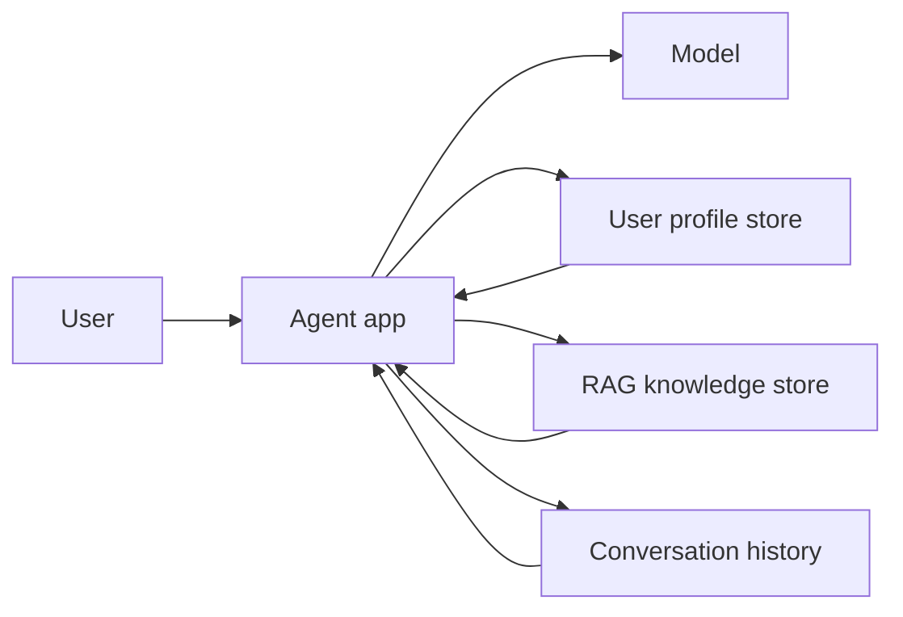
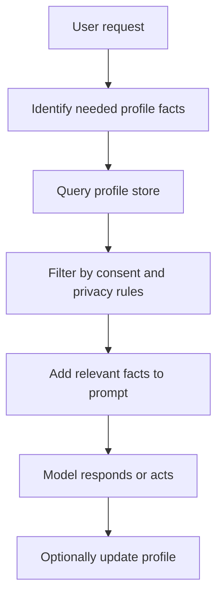
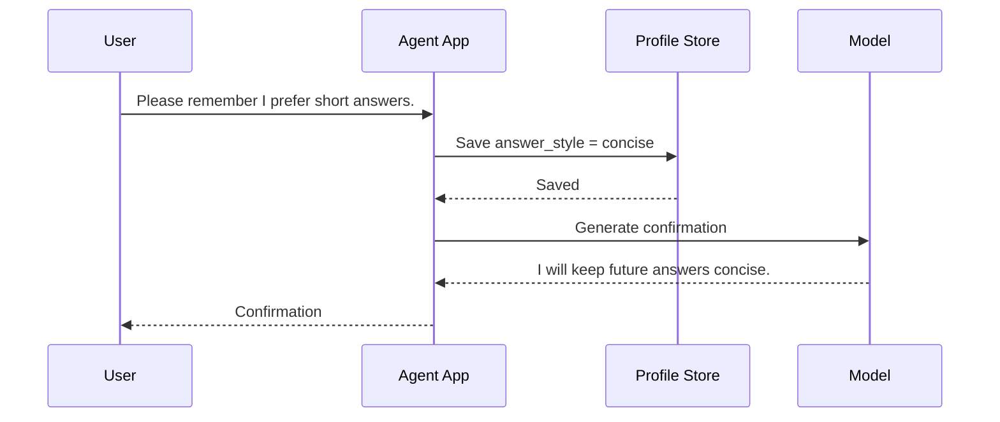
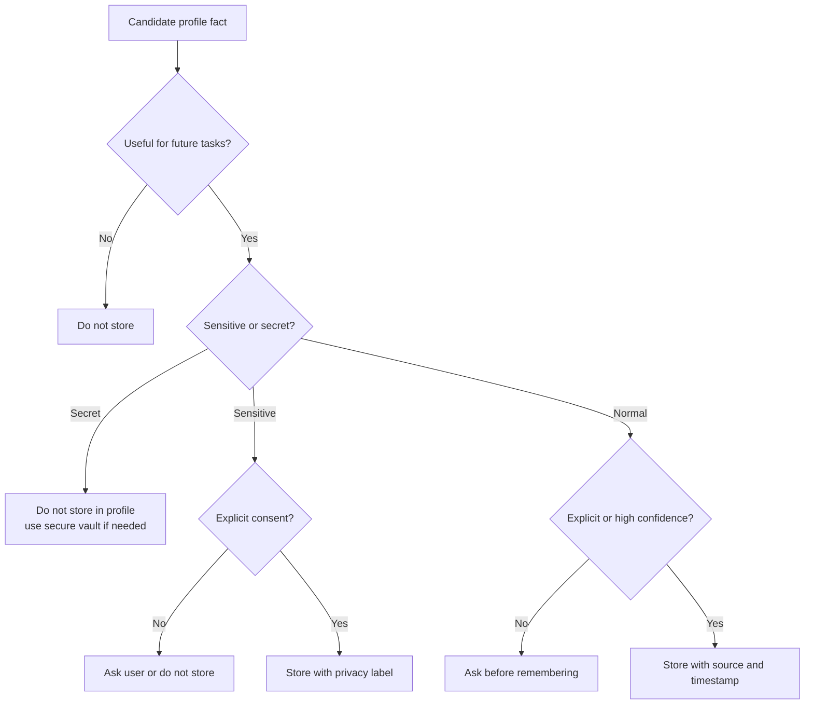

# User Profile Storage

<div class="topic-page" markdown="1">

<section class="topic-hero">
  <span class="topic-hero__eyebrow">Stage 07 - RAG and Memory</span>
  <p class="topic-hero__lead">User profile storage is the memory layer that lets an AI agent remember stable, useful facts about a user, such as preferences, settings, goals, and constraints. Good profile storage makes agents more helpful without stuffing every conversation into the prompt or remembering private data carelessly.</p>
  <div class="topic-hero__facts">
    <span>User facts</span>
    <span>Preferences</span>
    <span>Consent</span>
    <span>Retrieval</span>
    <span>Forgetting</span>
  </div>
</section>

## Goal

Understand how to store, retrieve, update, and protect user profile data for AI agents.

After this lesson, you should be able to explain:

- what user profile storage is,
- why agents need profile memory,
- what information should and should not be stored,
- how profile storage differs from chat history and RAG documents,
- how to design a simple profile schema,
- how to retrieve only relevant profile facts,
- how to handle consent, privacy, updates, deletion, and audit logs.

## Before You Start

Start with one simple idea:

```text
User profile storage is not "remember everything."
It is "remember selected useful facts safely."
```

Beginner example:

```text
Useful profile memory:
  "User prefers concise answers."
  "User works mainly with Python."
  "User's timezone is Europe/Berlin."

Bad profile memory:
  Store every message forever.
  Store passwords or secret keys.
  Store sensitive personal data without consent.
```

The goal is to make the agent helpful, not invasive.

### Key Words In Plain English

| Word | Simple Meaning | Beginner Example |
| --- | --- | --- |
| User profile | Stored facts about one user | timezone, language, preferences |
| Memory | Information saved across interactions | "User prefers tables" |
| Preference | How the user likes things done | short answers, Python examples |
| Constraint | A rule the agent should respect | no cloud tools, budget under $50 |
| Consent | User permission to store or use data | "Remember this preference" |
| Profile schema | The structure of saved profile data | fields like `timezone`, `language`, `topics` |
| Retrieval | Loading relevant facts when needed | get timezone for scheduling |
| Forgetting | Removing or expiring stored facts | delete old temporary preference |

## Learning Path

This topic is designed in four parts. Read them in order.

<div class="learning-grid learning-grid--path">
  <a class="learning-card" href="#part-1-understand-user-profile-storage">
    <strong>Part 1 - Understand User Profile Storage</strong>
    <span>Learn what profile memory is and why agents should not remember everything.</span>
  </a>
  <a class="learning-card" href="#part-2-design-a-profile-schema">
    <strong>Part 2 - Design A Profile Schema</strong>
    <span>Choose fields, confidence, source, update rules, and privacy level.</span>
  </a>
  <a class="learning-card" href="#part-3-retrieve-and-use-profile-data">
    <strong>Part 3 - Retrieve And Use Profile Data</strong>
    <span>Load only relevant facts into the prompt and keep user control visible.</span>
  </a>
  <a class="learning-card" href="#part-4-protect-update-and-forget-profile-data">
    <strong>Part 4 - Protect, Update, And Forget Profile Data</strong>
    <span>Handle consent, sensitive data, conflicts, deletion, and audits.</span>
  </a>
</div>

## Part 1: Understand User Profile Storage

An AI agent often needs context about the user to be useful. If the user repeatedly says "use Python examples" or "keep answers short," the agent should not need to relearn that every time.

User profile storage solves this by saving selected stable facts.

Simple definition:

```text
User profile storage is a structured memory store
for useful facts about a user that may help future agent interactions.
```

### Where Profile Storage Fits



**How to read this diagram:** user profile storage is different from RAG documents and chat history. The agent can use all three, but each one has a different purpose.

### Profile Memory vs Other Memory

| Storage Type | What It Stores | Example | Main Use |
| --- | --- | --- | --- |
| User profile | Stable facts about the user | timezone, role, preferences | Personalization |
| Conversation history | Recent messages | last 10 chat turns | Short-term context |
| RAG knowledge base | External documents | docs, policies, manuals | Factual grounding |
| Task state | Current workflow progress | step 3 of 5 completed | Agent execution |
| Episodic memory | Past events or interactions | user solved issue X last week | Remembering experiences |
| Semantic memory | General learned facts | user knows JavaScript | Long-term user understanding |

### What Should Be Stored?

Store facts that are useful, stable, and appropriate.

| Good To Store | Why |
| --- | --- |
| Preferred language | Improves communication |
| Timezone | Helps scheduling and date interpretation |
| Preferred answer style | Makes responses easier to use |
| Technical skill level | Helps choose explanation depth |
| Favorite programming language | Improves examples |
| Product settings | Avoids repeated setup |
| Accessibility preferences | Improves usability |
| Long-term project context | Helps continuity |

### What Should Not Be Stored Casually?

| Avoid Or Treat Carefully | Why |
| --- | --- |
| Passwords and API keys | Secrets should use secure vaults, not profile memory |
| Payment details | High-risk sensitive data |
| Medical, legal, or financial details | Sensitive and regulated in many contexts |
| Exact location history | Privacy risk |
| Private messages from other people | Consent and privacy risk |
| Inferred sensitive traits | Can be inaccurate and harmful |
| Temporary moods or guesses | May become stale or wrong |

Beginner rule:

```text
Store preferences and stable facts.
Do not store secrets or sensitive data unless there is a clear need, consent, and protection.
```

### Why Not Just Use Chat History?

Chat history is noisy. It may contain old, temporary, or irrelevant information.

Example:

```text
Message from last week:
  "Today I need a very detailed answer."

Stable profile preference:
  "Usually prefers concise answers."
```

If the agent blindly stores every message, it may confuse temporary requests with long-term preferences.

## Part 2: Design A Profile Schema

A profile schema defines the shape of stored user facts.

Simple definition:

```text
A profile schema says what fields exist,
what type each field has,
where the data came from,
and how it should be updated or deleted.
```

### Basic Profile Schema

```json
{
  "user_id": "user_123",
  "timezone": "Europe/Berlin",
  "preferred_language": "English",
  "answer_style": "concise",
  "skill_level": "beginner",
  "favorite_programming_languages": ["Python", "JavaScript"],
  "updated_at": "2026-06-08T10:30:00Z"
}
```

This simple version is useful, but production systems usually need more metadata.

### Better Profile Fact Structure

```json
{
  "fact_id": "fact_456",
  "user_id": "user_123",
  "key": "answer_style",
  "value": "concise",
  "source": "user_explicit",
  "confidence": 1.0,
  "privacy_level": "normal",
  "created_at": "2026-06-08T10:30:00Z",
  "updated_at": "2026-06-08T10:30:00Z",
  "expires_at": null
}
```

Metadata matters because profile facts can become wrong, sensitive, or stale.

### Profile Field Design

| Field | Meaning | Example |
| --- | --- | --- |
| `user_id` | Which user owns the fact | `user_123` |
| `key` | Type of profile fact | `timezone` |
| `value` | Stored value | `Europe/Berlin` |
| `source` | Where the fact came from | `user_explicit`, `inferred`, `imported` |
| `confidence` | How sure the system is | `1.0` for explicit user statement |
| `privacy_level` | Sensitivity category | `normal`, `sensitive`, `secret` |
| `expires_at` | When the fact should expire | temporary project preference |
| `updated_at` | Last update time | timestamp |

### Source Types

| Source | Meaning | Trust Level |
| --- | --- | --- |
| `user_explicit` | User clearly asked to remember it | Highest |
| `user_profile_import` | Imported from account settings | High if source is trusted |
| `agent_observed` | Agent observed behavior | Medium |
| `inferred` | Agent guessed from behavior | Low; should be used carefully |
| `admin_set` | Organization or app configured it | Depends on policy |

Avoid treating guesses as facts.

```text
Good:
  "User explicitly said: remember that I prefer Python examples."

Risky:
  "User asked one Python question, so they must be a Python developer forever."
```

### Profile Storage Options

| Storage Backend | Good For | Not Good For |
| --- | --- | --- |
| Relational database | Structured profile fields, user settings, audit queries | Fuzzy semantic search by meaning |
| Document database | Flexible JSON profiles | Strict relational constraints |
| Key-value store | Simple preferences and fast reads | Complex queries |
| Vector database | Similarity search over memories | Exact settings like timezone |
| Hybrid store | Combining exact profile fields and semantic memories | More system complexity |

Beginner recommendation:

```text
Use a normal database for profile fields.
Use vector search only for semantic memories that need meaning-based retrieval.
```

## Part 3: Retrieve And Use Profile Data

The agent should not load the entire profile into every prompt.

It should retrieve the facts that are relevant to the current task.

### Profile Retrieval Flow



**How to read this diagram:** the profile store is not dumped into the model. The app selects only relevant facts, checks privacy rules, and then uses them for the current answer.

### Relevant vs Irrelevant Profile Facts

User asks:

```text
Can you schedule a meeting with Mina tomorrow afternoon?
```

Relevant facts:

| Profile Fact | Why It Helps |
| --- | --- |
| User timezone | Interprets "tomorrow afternoon" |
| Working hours | Avoids bad meeting times |
| Calendar preferences | Chooses default duration |
| Preferred meeting platform | Adds Zoom, Meet, or Teams |

Irrelevant facts:

| Profile Fact | Why It Should Stay Out |
| --- | --- |
| Favorite programming language | Not needed |
| Preferred answer style | Maybe useful for response, not scheduling |
| Past vacation plans | Not relevant |
| Old project notes | Not relevant |

### Prompt Example

Weak prompt:

```text
Here is the user's full profile:
<all profile data>

Schedule the meeting.
```

Better prompt:

```text
User request:
Schedule a meeting with Mina tomorrow afternoon.

Relevant user profile:
- Timezone: Europe/Berlin
- Working hours: 09:00-17:00
- Default meeting length: 30 minutes
- Preferred meeting platform: Google Meet

Task:
Suggest a meeting time and ask for confirmation before creating the event.
```

This is cheaper, safer, and easier for the model to use.

### Read, Write, And Update Decisions

| Situation | Agent Behavior |
| --- | --- |
| User says "remember this" | Store after confirming if needed |
| User states temporary context | Use for current conversation, maybe do not store |
| User changes preference | Update old fact and record new timestamp |
| User contradicts profile | Ask or prefer explicit latest statement |
| User asks "what do you remember?" | Show stored profile facts |
| User asks to delete memory | Delete or mark inactive |

### Profile Update Flow



For sensitive or inferred information, use a stronger confirmation flow.

## Part 4: Protect, Update, And Forget Profile Data

Profile memory can improve personalization, but it also creates responsibility.

### Consent Levels

| Consent Level | Meaning | Example |
| --- | --- | --- |
| No storage | Do not save beyond current session | guest mode |
| Explicit memory | Store only when user says to remember | "Remember I prefer Python" |
| App settings | Store account preferences from settings | language, timezone |
| Inferred memory | Agent suggests a possible memory | "Should I remember you prefer short answers?" |
| Organization-managed | Company policy sets defaults | enterprise workspace settings |

Beginner rule:

```text
Explicit user memory is safer than hidden inferred memory.
```

### Privacy And Security Controls

| Control | Why It Matters |
| --- | --- |
| User access | Users should know what is stored |
| Edit and delete | Users should correct or remove memories |
| Consent checks | Sensitive facts need permission |
| Data minimization | Store only what is useful |
| Encryption | Protect stored profile data |
| Access control | Prevent one user seeing another user's profile |
| Audit logs | Track profile reads, writes, updates, and deletes |
| Expiration | Remove stale temporary facts |

### Safe Memory Decision Chart



### Common Mistakes

| Mistake | Why It Is Bad | Better Design |
| --- | --- | --- |
| Store every conversation | Expensive, noisy, privacy risk | Store selected structured facts |
| Store secrets in profile | High security risk | Use secret manager or vault |
| Never expire facts | Profile becomes stale | Use timestamps and expiration |
| Hide memory from user | Reduces trust | Provide "what do you remember?" view |
| Treat inferred facts as certain | Can personalize incorrectly | Track source and confidence |
| Load full profile every time | More cost and privacy exposure | Retrieve only relevant fields |
| No delete path | Bad privacy and user control | Support delete and correction |

### Weak vs Strong Profile Memory

<div class="prompt-compare">
  <section>
    <span class="prompt-compare__label prompt-compare__label--bad">Weak</span>
    <pre><code>Save everything the user says.
Put the whole profile into every prompt.
Let the model decide what is sensitive.
Never delete memories unless the database is reset.</code></pre>
    <p>This creates privacy risk, stale memories, higher cost, and poor user control.</p>
  </section>
  <section>
    <span class="prompt-compare__label prompt-compare__label--good">Strong</span>
    <pre><code>Save only useful, stable profile facts.
Track source, confidence, privacy level, and timestamp.
Retrieve only facts relevant to the current task.
Let users view, edit, and delete stored memories.</code></pre>
    <p>This keeps personalization useful while limiting risk and prompt bloat.</p>
  </section>
</div>

### Audit Log Example

For production systems, log profile memory changes.

```json
{
  "timestamp": "2026-06-08T11:00:00Z",
  "user_id": "user_123",
  "action": "profile_fact_updated",
  "key": "answer_style",
  "source": "user_explicit",
  "old_value": "detailed",
  "new_value": "concise",
  "actor": "user",
  "request_id": "req_789"
}
```

Do not log secrets or unnecessary sensitive values.

## Summary

User profile storage helps agents remember useful facts across conversations.

Core rules:

```text
1. Store selected facts, not everything.
2. Prefer explicit user-provided memories.
3. Use a profile schema with source, confidence, timestamp, and privacy level.
4. Retrieve only relevant facts for the current task.
5. Give users visibility, correction, and deletion controls.
6. Do not store secrets in profile memory.
```

Beginner shortcut:

```text
Profile memory = stable user facts.
Chat history = recent conversation.
RAG = external knowledge documents.
Task state = what the agent is doing now.
```

## Practice

Design a user profile for this agent:

```text
Agent:
  Learning assistant for software developers

Goal:
  Personalize explanations and practice tasks.
```

Fill this table:

| Profile Field | Example Value | Source | Privacy Level | When To Use |
| --- | --- | --- | --- | --- |
| `skill_level` | beginner | user_explicit | normal | explanation depth |
| `preferred_language` | English | account_setting | normal | response language |
| `favorite_stack` | Python, FastAPI | user_explicit | normal | examples |
| `answer_style` | step-by-step | user_explicit | normal | formatting |
| `timezone` | Europe/Berlin | account_setting | normal | scheduling |

Then answer:

1. Which fields need explicit consent?
2. Which fields should expire?
3. Which fields should never be stored?
4. Which fields are needed for a coding question?
5. Which fields are needed for scheduling?

## Mini Project

Build a simple profile-memory prototype.

It should support:

- create profile fact,
- read relevant profile facts,
- update profile fact,
- delete profile fact,
- show all remembered facts to the user,
- mark facts with source and confidence,
- mark facts with privacy level,
- retrieve only relevant facts for a task.

Suggested data model:

```python
profile_fact = {
    "fact_id": "fact_001",
    "user_id": "user_123",
    "key": "answer_style",
    "value": "concise",
    "source": "user_explicit",
    "confidence": 1.0,
    "privacy_level": "normal",
    "created_at": "2026-06-08T11:00:00Z",
    "updated_at": "2026-06-08T11:00:00Z",
    "expires_at": None,
}
```

Test cases:

1. User says, "Remember that I prefer short answers."
2. User asks, "What do you remember about me?"
3. User says, "Actually, give detailed answers for coding questions."
4. User asks a scheduling question.
5. User asks to delete a remembered preference.

## Exit Criteria

You are ready to move on when you can:

- explain user profile storage in plain English,
- distinguish profile memory from chat history, task state, and RAG,
- list safe and unsafe profile facts,
- design a simple profile schema,
- explain why source, confidence, privacy level, and timestamps matter,
- retrieve only relevant profile facts for a task,
- handle explicit memory updates,
- explain consent, deletion, expiration, and audit logs,
- avoid storing secrets or sensitive data casually.

## Resources

- [RAG Basics](../../02-llm-fundamentals/rag-basics/index.md)
- [Embeddings and Vector Search](../../02-llm-fundamentals/embeddings-vector-search/index.md)
- [Context Windows](../../02-llm-fundamentals/context-windows/index.md)
- [Tokenization](../../02-llm-fundamentals/tokenization/index.md)
- [Stopping Criteria](../../04-agent-fundamentals/stopping-criteria/index.md)
- [MCP Security Boundaries](../../06-mcp/security-boundaries-conn-tool/index.md)

</div>
