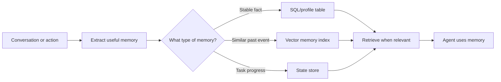
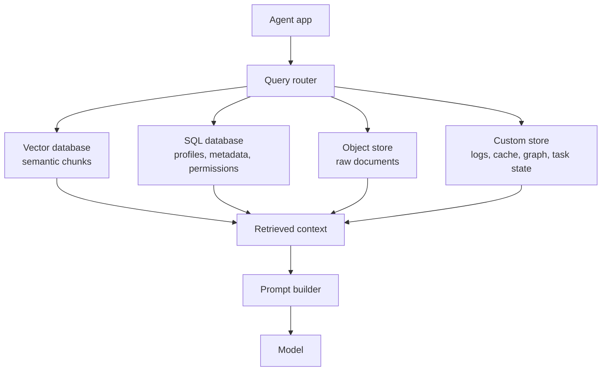

# Vector Databases, SQL, and Custom Stores

<div class="topic-page" markdown="1">

<section class="topic-hero">
  <span class="topic-hero__eyebrow">Stage 07 - RAG and Memory</span>
  <p class="topic-hero__lead">Agent memory is not one database. Good RAG and memory systems choose the right store for the job: vector databases for semantic similarity, SQL for exact structured facts, and custom stores for special retrieval, caching, logs, or domain-specific access.</p>
  <div class="topic-hero__facts">
    <span>Vector search</span>
    <span>SQL facts</span>
    <span>Metadata</span>
    <span>Hybrid retrieval</span>
    <span>Memory design</span>
  </div>
</section>

## Goal

Learn how to choose and combine storage backends for RAG and agent memory.

After this topic, you should be able to explain:

- when to use a vector database,
- when SQL is the better memory store,
- when a custom store is useful,
- why metadata matters as much as embeddings,
- how storage choices affect retrieval quality, privacy, cost, and maintenance.

## Before You Start

Start with one rule:

```text
Do not choose a database first.
Choose the memory or retrieval job first.
```

Different agent memory jobs need different storage behavior.

| Need | Better Store |
| --- | --- |
| Find text with similar meaning | Vector database or vector index |
| Store user preferences exactly | SQL or document store |
| Track task progress | SQL, key-value store, or application state |
| Search by exact ID, date, status, tenant, or permission | SQL or metadata filters |
| Keep raw files, PDFs, images, or transcripts | Object/file store |
| Keep audit history | Append-only log or SQL table |
| Mix semantic search with exact filters | Hybrid design |

## Learning Path

This topic is designed in four parts. Read them in order.

<div class="learning-grid learning-grid--path">
  <a class="learning-card" href="#part-1-understand-the-storage-problem">
    <strong>Part 1 - Understand The Storage Problem</strong>
    <span>Learn why RAG and memory need more than one kind of database.</span>
  </a>
  <a class="learning-card" href="#part-2-choose-between-vector-sql-and-custom-stores">
    <strong>Part 2 - Choose The Right Store</strong>
    <span>Compare vector databases, SQL databases, and custom stores with clear examples.</span>
  </a>
  <a class="learning-card" href="#part-3-design-a-hybrid-rag-and-memory-store">
    <strong>Part 3 - Design A Hybrid Store</strong>
    <span>Combine semantic search, metadata filters, raw documents, and memory tables.</span>
  </a>
  <a class="learning-card" href="#part-4-operate-the-store-safely">
    <strong>Part 4 - Operate Safely</strong>
    <span>Handle updates, permissions, deletion, evaluation, and cost in real systems.</span>
  </a>
</div>

## Part 1: Understand The Storage Problem

RAG and memory both give an agent useful context, but they are not the same thing.

| Concept | What It Stores | Example | Main Question |
| --- | --- | --- | --- |
| RAG knowledge | External documents or knowledge | policy docs, manuals, tickets, PDFs | "What information answers this question?" |
| Agent memory | Saved state or learned facts | user preference, past decision, task progress | "What should the agent remember for later?" |

A single database can sometimes support both, but the design should still separate the jobs.

### Simple RAG Storage Flow


**How to read this diagram:** a RAG store usually saves chunks, embeddings, and metadata. At question time, the app retrieves the most relevant chunks and gives them to the model.

### Simple Agent Memory Storage Flow



**How to read this diagram:** memory is not "save every message." The app decides what kind of memory it is, stores it in the right place, and retrieves it only when useful.

## Part 2: Choose Between Vector, SQL, And Custom Stores

The storage choice depends on how the agent needs to find and use information.

### Vector Databases

A vector database stores embeddings and retrieves items by similarity.

Use a vector database when the user may ask the same idea in many different ways.

Example:

```text
Stored document:
"Employees can reset MFA from the account recovery portal."

User asks:
"I lost access to my authenticator app. What do I do?"
```

A keyword search may miss this because the words are different. Vector search can still find the related meaning.

Good uses:

- semantic search over documents
- RAG over manuals, policies, support articles, or code docs
- finding similar past conversations or tickets
- long-term semantic memory
- recommendation or similarity matching

Store these with each vector:

| Field | Why It Matters |
| --- | --- |
| `chunk_text` | The text the model may use as context |
| `source_id` | Links the chunk back to the original document |
| `chunk_id` | Unique ID for citation and debugging |
| `embedding_model` | Needed when reindexing or changing models |
| `created_at` / `updated_at` | Helps manage freshness |
| `tenant_id` / `user_id` | Prevents cross-user or cross-tenant leakage |
| `permissions` | Controls who can retrieve the chunk |
| `document_version` | Avoids mixing old and new facts |

Common vector database features:

- approximate nearest neighbor search for speed
- metadata filtering
- namespaces or collections
- hybrid search with keyword matching
- reranking integration
- replication and scaling options

Main weakness:

```text
Vector search finds similar meaning.
It does not guarantee exact truth, freshness, permission correctness, or complete coverage.
```

### SQL Databases

SQL is best when the agent needs exact, structured, auditable data.

Use SQL when the question depends on precise fields.

Example:

```text
User asks:
"What is my current plan and renewal date?"

Better store:
SQL table with user_id, plan_name, renewal_date, status.
```

Good uses:

- user profiles and preferences
- account settings
- task state
- permissions
- audit logs
- document metadata
- exact filters such as date, status, owner, product, or tenant
- relational data like customers, orders, projects, and teams

Example profile table:

```sql
CREATE TABLE user_memory (
  user_id TEXT NOT NULL,
  key TEXT NOT NULL,
  value TEXT NOT NULL,
  confidence REAL NOT NULL,
  source TEXT NOT NULL,
  updated_at TIMESTAMP NOT NULL,
  PRIMARY KEY (user_id, key)
);
```

SQL can also support vector search through extensions such as `pgvector`, or through a database product that supports vector fields. This can be useful when you want structured metadata, transactions, and vector search in one system.

Main weakness:

```text
SQL is excellent for exact structure.
It is not automatically good at "find text with similar meaning" unless you add vector or full-text search.
```

### Custom Stores

A custom store means a storage layer designed for a specific access pattern.

It might be:

- a key-value store like Redis
- a document store
- an object store for files
- a search engine
- a graph database
- an append-only event log
- a small local embedded database
- a custom memory service that combines several stores

Use a custom store when your agent has special needs that do not fit a simple vector database or SQL table.

Examples:

| Need | Possible Store |
| --- | --- |
| Very fast short-term state | Redis or in-memory state store |
| Raw PDFs and images | Object storage or file storage |
| Exact keyword search across logs | Search engine |
| Relationships between people, systems, or citations | Graph database |
| Auditable history of actions | Append-only event log |
| Offline local agent memory | SQLite or local file store |

Main weakness:

```text
Custom stores add responsibility.
You must define schemas, permissions, retrieval logic, updates, backups, and evaluation.
```

## Part 3: Design A Hybrid RAG And Memory Store

Production systems often combine stores.

That is normal. A good design uses each store for what it does well.

### Recommended Mental Model



**How to read this diagram:** the agent app does not need to force all memory into one database. It can route each retrieval need to the store that fits the data.

### Common Hybrid Pattern

For document RAG:

| Store | Holds | Why |
| --- | --- | --- |
| Object store | Raw files | Keeps original documents safe and recoverable |
| Vector database | Chunk embeddings and chunk text | Finds semantically relevant passages |
| SQL database | Document metadata, permissions, versions | Supports exact filters and governance |
| Search engine | Keywords, logs, exact phrases | Helps with names, IDs, error codes, and rare terms |

For agent memory:

| Store | Holds | Why |
| --- | --- | --- |
| SQL database | Stable user facts and preferences | Exact, auditable, updateable |
| Vector database | Similar past interactions or semantic memories | Find related memories by meaning |
| Key-value store | Current task state | Fast reads and writes |
| Event log | Tool calls and important decisions | Debugging, compliance, replay |

### Choosing Store By Question Type

| User Question | Better Retrieval Strategy |
| --- | --- |
| "How do I reset MFA?" | Vector search over support docs |
| "What is my renewal date?" | SQL lookup |
| "Find errors like this stack trace." | Hybrid: keyword/search engine + vector search |
| "What did we decide last time about deployment?" | SQL/event log, possibly vector search over meeting notes |
| "Show docs from this product only." | Vector search with metadata filter |
| "What changed since last week?" | SQL metadata, document versions, or event log |

### Why Metadata Is Critical

Metadata is the bridge between semantic search and production rules.

Example chunk:

```json
{
  "chunk_id": "policy-042:003",
  "text": "Refunds for duplicate charges must be reviewed by billing support.",
  "embedding": [0.013, -0.204, 0.771],
  "metadata": {
    "source": "refund-policy.md",
    "product": "billing",
    "version": "2026-05",
    "visibility": "internal",
    "tenant_id": "acme",
    "updated_at": "2026-05-20"
  }
}
```

Without metadata, the retriever may find a semantically similar chunk that is:

- from the wrong tenant,
- from an old document version,
- not allowed for the current user,
- about the wrong product,
- too stale to trust.

### Hybrid Search

Hybrid search combines semantic matching with exact or keyword-based matching.

Use hybrid search when:

- users search product names, error codes, ticket IDs, laws, or commands,
- exact words matter,
- semantic search alone returns related but not exact chunks,
- keyword search alone misses paraphrases.

Example:

```text
Query:
"What does error E_CONN_RESET mean in the billing worker?"

Semantic search helps with:
"billing worker connection failure"

Keyword search helps with:
"E_CONN_RESET"
```

For many agent systems, the best retrieval is not "vector only." It is:

```text
metadata filter -> hybrid retrieval -> rerank -> permission check -> prompt context
```

## Part 4: Operate The Store Safely

Storage design is not finished when search returns results. You also need updates, permissions, evaluation, and cleanup.

### Update Strategy

Documents and memories change.

Plan how updates work:

| Update Need | Practical Approach |
| --- | --- |
| Small document change | Reindex only affected chunks |
| Large document rewrite | Rechunk and reembed the document |
| Deleted document | Remove vectors, metadata, and raw file references |
| Changed permissions | Update metadata filters before retrieval |
| Changed embedding model | Reembed affected collections or maintain model version fields |
| User memory correction | Update exact SQL record and keep audit history |

If users depend on current information, stale retrieval can be worse than no retrieval.

### Permissions And Privacy

Every retrieval request should respect access control.

Do not rely only on the model to ignore private data.

Use storage-level or application-level filters:

```text
tenant_id = current tenant
user_id = current user or allowed shared scope
visibility in allowed visibility levels
document_version = latest approved version
```

For user memory:

- store only useful facts,
- avoid secrets,
- require consent for sensitive data,
- allow correction and deletion,
- log memory updates.

### Evaluation

A storage backend is only good if retrieval works.

Test with realistic questions.

Track:

| Metric | Meaning |
| --- | --- |
| Recall | Did the retriever find the needed source? |
| Precision | Were the retrieved chunks mostly useful? |
| Freshness | Did it return the latest approved content? |
| Permission safety | Did it avoid forbidden content? |
| Latency | Was retrieval fast enough for the user experience? |
| Cost | Are embeddings, storage, and queries affordable? |

Beginner-friendly test:

1. Write 20 questions your agent should answer.
2. Identify the correct source chunk or record for each question.
3. Run retrieval without the model.
4. Check whether the right source appears in the top results.
5. Fix chunking, metadata, filters, or store choice before tuning prompts.

### Common Mistakes

<div class="visual-checklist">
  <div>
    <strong>Weak storage design</strong>
    <ul>
      <li>Put every kind of memory into one vector database</li>
      <li>Store no metadata with chunks</li>
      <li>Use semantic search for exact IDs and dates</li>
      <li>Ignore document versions and deletion</li>
      <li>Filter permissions after retrieval only</li>
      <li>Store raw secrets in memory</li>
      <li>Never evaluate retrieval quality</li>
    </ul>
  </div>
  <div>
    <strong>Stronger storage design</strong>
    <ul>
      <li>Match the store to the retrieval job</li>
      <li>Keep source, tenant, version, and permission metadata</li>
      <li>Use SQL for exact structured facts</li>
      <li>Plan reindexing and deletion workflows</li>
      <li>Apply access filters before context reaches the model</li>
      <li>Protect sensitive memory data</li>
      <li>Test retrieval before testing generation</li>
    </ul>
  </div>
</div>

## Decision Guide

Use this quick guide when choosing a store.

| If You Need... | Start With... | Why |
| --- | --- | --- |
| Semantic document retrieval | Vector database | Finds meaning, not just exact words |
| Exact user facts | SQL | Reliable updates, constraints, auditability |
| Product, tenant, or permission filters | SQL metadata or vector metadata filters | Prevents wrong-scope retrieval |
| Exact keyword and semantic search | Hybrid search | Handles both paraphrases and exact terms |
| Raw file storage | Object/file store | Keeps original source independent of chunks |
| Fast temporary state | Key-value store | Low-latency task/session state |
| Relationship-heavy memory | Graph/custom store | Captures links and dependencies |
| Small prototype | SQLite/Postgres with vector extension or simple local vector store | Lower operational complexity |
| Large multi-tenant production RAG | Dedicated vector DB plus SQL metadata and object storage | Better scale, filtering, governance, and operations |

## Practice

Design storage for a support agent.

The agent must:

- answer from product documentation,
- remember user language preference,
- check account plan and renewal date,
- avoid showing one customer's documents to another customer,
- cite source documents,
- forget profile memories when the user asks.

Choose a store for:

| Data | Store Choice | Reason |
| --- | --- | --- |
| Product docs |  |  |
| Raw uploaded files |  |  |
| Document metadata and permissions |  |  |
| User language preference |  |  |
| Account plan and renewal date |  |  |
| Past support cases with similar meaning |  |  |
| Audit log of memory updates |  |  |

Then write a short explanation of why one database alone is or is not enough.

## Mini Project

Build a small storage design document for a RAG memory system.

Include:

- data types,
- chosen stores,
- metadata fields,
- retrieval flow,
- update flow,
- deletion flow,
- permission rules,
- top five retrieval test questions.

Keep it implementation-ready. Another developer should be able to build the first version from your design.

## Exit Criteria

You are ready to move on when you can:

- explain why vector databases are useful for semantic retrieval,
- explain when SQL is better than a vector database,
- explain what a custom store is and when it is useful,
- design metadata for chunks and memories,
- choose a store based on retrieval behavior,
- explain hybrid retrieval in simple language,
- describe update, deletion, and permission requirements,
- test retrieval quality before judging the final model answer.

## Resources

- [Pure AI: Understanding RAG and Vector Databases](https://pureai.com/Articles/2025/03/03/Understanding-RAG.aspx)
- [Microsoft Learn: Build advanced retrieval-augmented generation systems](https://learn.microsoft.com/en-us/azure/developer/ai/advanced-retrieval-augmented-generation)
- [NVIDIA: What Is Retrieval-Augmented Generation?](https://blogs.nvidia.com/blog/what-is-retrieval-augmented-generation/)
- [Pinecone Docs: Indexing and metadata filtering](https://docs.pinecone.io/docs/metadata-filtering)
- [Pinecone Docs: Search overview](https://docs.pinecone.io/guides/search)
- [Qdrant Docs: Filtering](https://qdrant.tech/documentation/search/filtering/)
- [Elasticsearch Docs: Vector search](https://www.elastic.co/docs/solutions/search/vector)
- [pgvector: Open-source vector similarity search for Postgres](https://github.com/pgvector/pgvector)
- [RAG Basics](../../02-llm-fundamentals/rag-basics/index.md)
- [Embeddings and Vector Search](../embeddings-and-vector-search/index.md)
- [User Profile Storage](../user-profile-storage/index.md)

</div>
