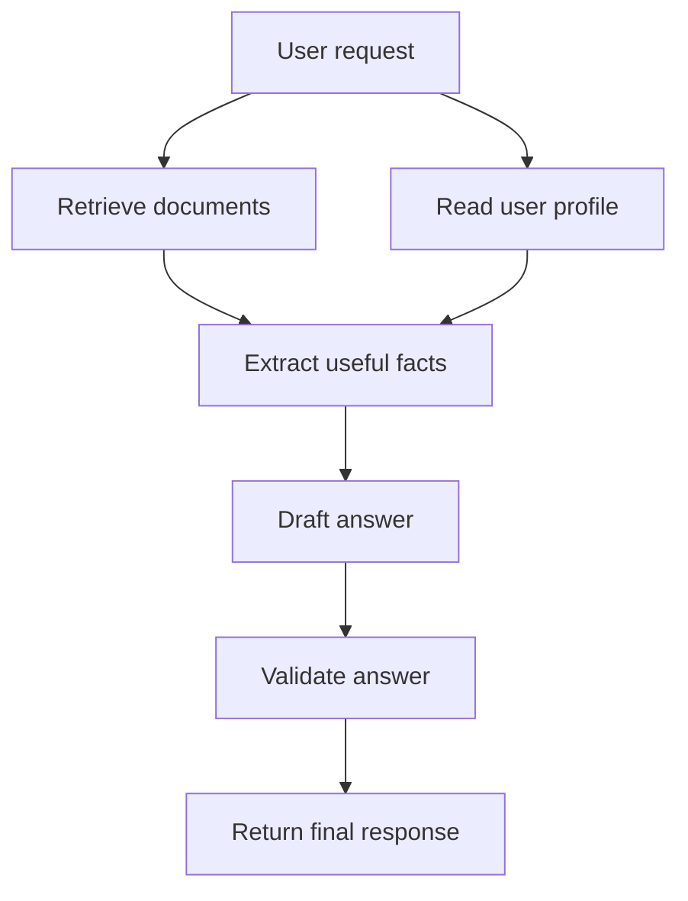
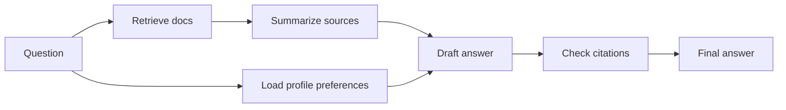
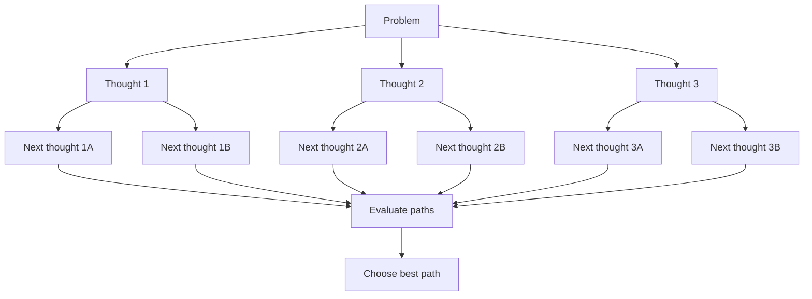
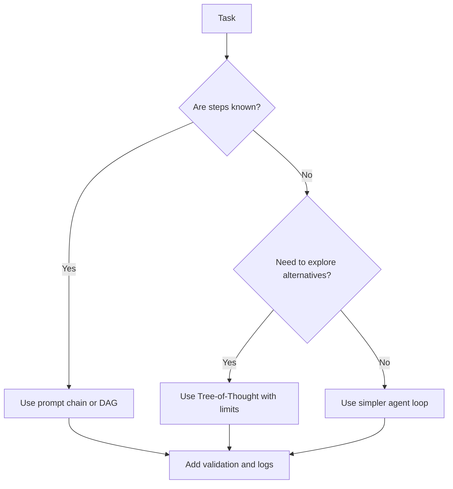

# DAG Agents and Tree-of-Thought Patterns

<div class="topic-page" markdown="1">

<section class="topic-hero">
  <span class="topic-hero__eyebrow">Stage 08 - Agent Architectures</span>
  <p class="topic-hero__lead">DAG agents and Tree-of-Thought patterns are ways to organize multi-step AI reasoning. A DAG agent runs a controlled graph of steps. Tree-of-Thought explores multiple possible reasoning paths before choosing one.</p>
  <div class="topic-hero__facts">
    <span>Graph steps</span>
    <span>Branching paths</span>
    <span>Search</span>
    <span>Evaluation</span>
    <span>Control</span>
  </div>
</section>

## Goal

Understand DAG agents and Tree-of-Thought patterns as beginner-friendly architecture tools for multi-step AI agents.

After this lesson, you should be able to explain:

- what a DAG is,
- what a DAG agent does,
- what Tree-of-Thought means,
- how DAGs and Tree-of-Thought are different,
- when these patterns are useful,
- when they are too complex,
- how to design a simple graph or tree workflow safely.

## Quick Summary

Use this table first. It gives the short version.
Both are ways to organize how an AI agent thinks and executes tasks, but they solve different problems.

| Pattern | Simple Meaning | Best For | Main Risk |
| --- | --- | --- | --- |
| DAG agent | A fixed graph of steps with clear dependencies | predictable workflows with multiple steps | can become too rigid |
| Tree-of-Thought | Explore several possible reasoning paths and pick the best | puzzles, planning, hard reasoning | can become expensive and slow |
| Graph-of-Thought | More general graph reasoning where ideas can combine or loop | complex reasoning research patterns | harder to implement and debug |
| Normal agent loop | Decide one next action at a time | open-ended tool use | less predictable |

Beginner rule:

```text
Use a DAG when the steps are known.
Use Tree-of-Thought when the answer may require exploring several possible paths.
```

## Before You Start

Start with one simple idea:

```text
A DAG controls work.
A tree explores possibilities.
```

Example:

```text
DAG:
  Read document -> extract facts -> validate facts -> write summary

Tree-of-Thought:
  Try plan A
  Try plan B
  Try plan C
  Score each plan
  Continue with the best plan
```

## Learning Path

This topic is designed in four parts. Read them in order.

<div class="learning-grid learning-grid--path">
  <a class="learning-card" href="#part-1-understand-dag-agents">
    <strong>Part 1 - Understand DAG Agents</strong>
    <span>Learn how a graph of fixed steps can make agent workflows easier to control.</span>
  </a>
  <a class="learning-card" href="#part-2-understand-tree-of-thought">
    <strong>Part 2 - Understand Tree-of-Thought</strong>
    <span>Learn how an agent can explore multiple reasoning paths before deciding.</span>
  </a>
  <a class="learning-card" href="#part-3-compare-dags-trees-and-agent-loops">
    <strong>Part 3 - Compare DAGs, Trees, And Agent Loops</strong>
    <span>Choose the right architecture based on uncertainty, control, cost, and debugging.</span>
  </a>
  <a class="learning-card" href="#part-4-design-simple-safe-patterns">
    <strong>Part 4 - Design Simple Safe Patterns</strong>
    <span>Build small graph and tree workflows without overengineering.</span>
  </a>
</div>

## Part 1: Understand DAG Agents

A DAG is a directed acyclic graph.

That sounds technical, but the idea is simple:

```text
Directed:
  Steps move in a direction.

Acyclic:
  The workflow does not loop back forever.

Graph:
  Steps are connected by dependencies.
```

### Simple DAG Picture



**How to read this diagram:** `Retrieve documents` and `Read user profile` can happen separately. Both feed into `Extract useful facts`. The workflow moves forward and does not loop.

### DAG Agent Definition

```text
A DAG agent is an agent workflow where each step is a node,
and the edges define which step depends on which previous result.
```

In practice, a DAG agent is often more controlled than an autonomous agent. The system designer decides the workflow shape.

### Why DAGs Help

| Problem | How A DAG Helps |
| --- | --- |
| The task has many steps | Each step becomes a node |
| Some steps can run in parallel | Independent nodes can run at the same time |
| Results need validation | Add a validation node |
| Debugging is hard | Inspect node inputs and outputs |
| Costs are unclear | Count model calls per node |
| The workflow must be predictable | Edges define allowed order |

### Simple DAG Example: RAG Answer

Task:

```text
Answer a user's question using company documentation.
```

DAG:



Summary table:

| Node | Job | Output |
| --- | --- | --- |
| `Retrieve docs` | Find relevant pages | document chunks |
| `Load profile preferences` | Get useful user settings | style and language |
| `Summarize sources` | Compress evidence | short source notes |
| `Draft answer` | Write response | draft text |
| `Check citations` | Verify support | final or error |

### DAGs Are Not Always Agents

Some DAG workflows are just workflows.

They become more agent-like when nodes include model decisions, tool use, routing, memory, or evaluation.

| Workflow Type | Description |
| --- | --- |
| Fixed DAG | Same steps every time |
| Conditional DAG | Some branches depend on state |
| Agentic DAG | Nodes may use LLMs, tools, memory, and evaluators |
| Cyclic graph | Allows loops; not a DAG anymore |

## Part 2: Understand Tree-of-Thought

Tree-of-Thought is a reasoning pattern where the model explores multiple possible paths.

Simple definition:

```text
Tree-of-Thought lets an AI system generate several possible next thoughts,
score them, and continue with the most promising ones.
```

### Chain-of-Thought vs Tree-of-Thought

| Pattern | Shape | Simple Meaning |
| --- | --- | --- |
| Direct answer | one step | answer immediately |
| Chain-of-Thought | one path | reason step by step |
| Tree-of-Thought | many paths | explore alternatives and choose |

### Tree-of-Thought Picture



**How to read this diagram:** the system does not commit to the first idea. It generates multiple options, evaluates them, and continues with better options.

### Beginner Example: Planning A Study Schedule

Problem:

```text
Create a 7-day study plan for a beginner learning AI agents.
```

Possible thoughts:

| Thought | Idea | Score |
| --- | --- | --- |
| A | Start with LLM basics, then prompting, then agents | high |
| B | Start with advanced multi-agent systems | low |
| C | Start with coding tools before concepts | medium |

Tree-of-Thought chooses path A because it fits the beginner goal better.

### Tree Search Steps

```text
1. Generate possible thoughts.
2. Score or evaluate each thought.
3. Keep the best thoughts.
4. Expand those thoughts into next thoughts.
5. Stop when the answer is good enough or budget is reached.
```

### Search Terms In Plain English

| Term | Meaning |
| --- | --- |
| Breadth | How many options to try at each step |
| Depth | How many steps ahead to explore |
| Score | Quality estimate for a thought |
| Prune | Drop weak branches |
| Backtrack | Return to an earlier branch |
| Beam search | Keep only the best few branches |

### Tree-of-Thought Risks

| Risk | Why It Matters |
| --- | --- |
| More model calls | Higher cost |
| More latency | User waits longer |
| Weak evaluator | Bad branches may be chosen |
| Overthinking simple tasks | Simple questions become slow |
| Hidden reasoning quality | The system may explore but still choose poorly |

Beginner rule:

```text
Use Tree-of-Thought only when exploring alternatives is worth the cost.
```

## Part 3: Compare DAGs, Trees, And Agent Loops

DAG agents and Tree-of-Thought both organize multi-step reasoning, but they solve different problems.

### Core Difference

| Pattern | Best Question |
| --- | --- |
| DAG agent | "What steps must run, and in what dependency order?" |
| Tree-of-Thought | "Which possible reasoning path should we choose?" |
| Agent loop | "What should the agent do next based on the latest observation?" |

### Architecture Comparison

| Pattern | Control | Flexibility | Cost | Debugging | Best For |
| --- | --- | --- | --- | --- | --- |
| Single prompt | low | low | low | simple | easy tasks |
| Prompt chain | medium | low | medium | easy | fixed steps |
| DAG agent | high | medium | medium | good | dependency-based workflows |
| Tree-of-Thought | medium | high | high | harder | hard planning or search |
| Autonomous agent loop | lower unless guarded | high | high | harder | open-ended tool work |

### When To Use A DAG

Use a DAG when:

- the steps are known,
- some steps depend on other steps,
- some steps can run in parallel,
- validation is important,
- you need traceable execution,
- you want predictable cost and behavior.

Example:

```text
Generate report:
  retrieve metrics
  retrieve incidents
  summarize both
  draft report
  validate citations
```

### When To Use Tree-of-Thought

Use Tree-of-Thought when:

- there are many possible plans,
- the first answer may be wrong,
- alternatives need comparison,
- the task benefits from lookahead,
- the cost of a bad answer is higher than the cost of extra reasoning.

Example:

```text
Solve puzzle:
  try several strategies
  score each strategy
  continue with the best path
```

### When To Avoid These Patterns

| Situation | Better Choice |
| --- | --- |
| Simple factual answer | Single prompt or retrieval |
| Fixed three-step task | Prompt chain |
| Need one tool call | Direct tool call |
| Need fast answer | Smaller workflow |
| Low-value task | Avoid expensive search |
| Untrusted high-risk action | Approval workflow |

## Part 4: Design Simple Safe Patterns

The best architecture is the simplest one that reliably solves the task.

### Beginner Design Recipe

```text
1. Start with the user's task.
2. Decide if steps are known.
3. If steps are known, draw a DAG.
4. If several reasoning paths are possible, consider Tree-of-Thought.
5. Add limits for cost, depth, retries, and tool calls.
6. Log every node or branch result.
```

### DAG Design Checklist

| Question | Why It Matters |
| --- | --- |
| What are the nodes? | Defines work units |
| What are the edges? | Defines dependencies |
| What can run in parallel? | Reduces latency |
| What must be validated? | Improves reliability |
| What happens on failure? | Prevents silent errors |
| What should be logged? | Helps debugging |

### Tree-of-Thought Design Checklist

| Question | Why It Matters |
| --- | --- |
| How many thoughts per step? | Controls cost |
| How deep can the tree go? | Controls latency |
| How are thoughts scored? | Controls quality |
| When do we stop? | Prevents endless search |
| What branches are pruned? | Saves budget |
| What answer is returned? | Keeps final output clear |

### Safe Limits

| Limit | Example |
| --- | --- |
| Max DAG nodes | 8 nodes |
| Max parallel calls | 3 at once |
| Max tree breadth | 3 thoughts per step |
| Max tree depth | 4 levels |
| Max total model calls | 12 calls |
| Max runtime | 30 seconds |
| Max failures | stop after 2 node failures |

### Weak vs Strong Design

<div class="prompt-compare">
  <section>
    <span class="prompt-compare__label prompt-compare__label--bad">Weak</span>
    <pre><code>Use a complex reasoning graph.
Let the model explore many ideas.
Keep going until the answer looks good.</code></pre>
    <p>This has no clear structure, no budget, and no stopping rule.</p>
  </section>
  <section>
    <span class="prompt-compare__label prompt-compare__label--good">Strong</span>
    <pre><code>Use a 5-node DAG for known report steps.
Use Tree-of-Thought only for plan selection.
Limit breadth to 3 and depth to 2.
Log each node result and evaluator score.</code></pre>
    <p>This keeps the workflow controlled, inspectable, and easier to debug.</p>
  </section>
</div>

### Summary Figure



## Summary

Use this summary to remember the whole topic.

| Idea | Simple Meaning |
| --- | --- |
| DAG | A forward-only graph of steps |
| DAG agent | An agent workflow controlled by graph nodes and dependencies |
| Tree-of-Thought | Explore multiple reasoning paths before choosing |
| Best DAG use | known workflow with dependencies |
| Best ToT use | difficult reasoning where alternatives matter |
| Main tradeoff | more control and quality can cost more time and money |

Core rule:

```text
If the workflow is known, draw a DAG.
If the solution path is uncertain, explore a small tree.
If the task is simple, do not overbuild.
```

## Practice

Design a DAG or Tree-of-Thought workflow for this task:

```text
Agent:
  Study planning assistant

Goal:
  Create a 2-week AI agent study plan for a beginner.
```

Fill this table:

| Decision | Your Answer |
| --- | --- |
| Are the steps known? |  |
| Is there more than one possible plan? |  |
| Use DAG, Tree-of-Thought, or both? |  |
| What are the nodes or thoughts? |  |
| What limits will you set? |  |
| What will you log? |  |

Starter answer:

| Part | Example |
| --- | --- |
| DAG nodes | assess level -> choose topics -> schedule days -> validate plan |
| Tree thoughts | plan by topics, plan by projects, plan by difficulty |
| Evaluator | score each plan for beginner friendliness |
| Limit | 3 candidate plans, 1 final plan |

## Mini Project

Build a small DAG planner on paper or in code.

It should include:

- at least 5 nodes,
- dependency edges,
- one validation node,
- one failure path,
- a final output node,
- a simple log for each node.

Optional Tree-of-Thought extension:

- generate 3 possible plans,
- score each plan from 1 to 5,
- choose the best plan,
- explain why it was chosen.

Suggested pseudocode:

```python
def run_study_plan_dag(user_goal):
    level = assess_level(user_goal)
    topics = choose_topics(level)
    candidate_plans = generate_candidate_plans(topics, count=3)
    scored_plans = score_plans(candidate_plans)
    best_plan = choose_best(scored_plans)
    return validate_plan(best_plan)
```

## Exit Criteria

You are ready to move on when you can:

- explain DAG in plain English,
- explain why a DAG does not loop,
- describe a DAG agent workflow,
- explain Tree-of-Thought in plain English,
- compare DAGs and Tree-of-Thought,
- choose when to use each pattern,
- set cost and latency limits,
- draw a simple graph or tree for an agent task,
- explain why simple tasks should not use complex architectures.

## Resources

- [Tree of Thoughts paper](https://arxiv.org/abs/2305.10601)
- [Tree of Thoughts official repository](https://github.com/princeton-nlp/tree-of-thought-llm)
- [Graph of Thoughts paper](https://arxiv.org/abs/2308.09687)
- [LangGraph workflows and agents](https://docs.langchain.com/oss/python/langgraph/workflows-agents)
- [Routing and Prompt Chaining](../routing-and-prompt-chaining/index.md)
- [Reasoning and Planning](../../04-agent-fundamentals/reasoning-and-planning/index.md)
- [Stopping Criteria](../../04-agent-fundamentals/stopping-criteria/index.md)

</div>
