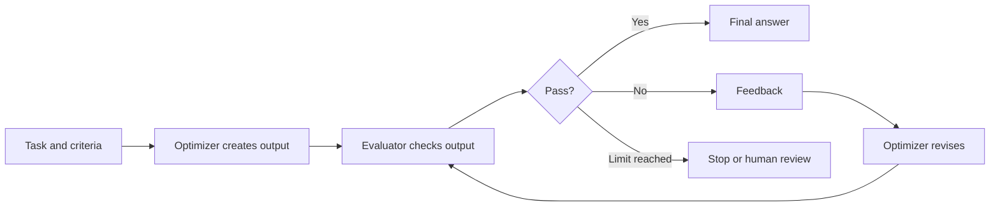

# Evaluator-Optimizer Loops

<div class="topic-page" markdown="1">

<section class="topic-hero">
  <span class="topic-hero__eyebrow">Stage 08 - Agent Architectures</span>
  <p class="topic-hero__lead">Evaluator-optimizer loops are agent workflows where one step generates an output and another step evaluates it against clear criteria. The feedback is then used to improve the output until it passes, reaches a limit, or needs human review.</p>
  <div class="topic-hero__facts">
    <span>Generate</span>
    <span>Evaluate</span>
    <span>Feedback</span>
    <span>Revise</span>
    <span>Stop</span>
  </div>
</section>

## Goal

Understand evaluator-optimizer loops as an agent architecture pattern, when to
use them, how to design the evaluator, how to stop the loop, and what risks to
manage in production systems.

After this topic, you should be able to explain:

- what an evaluator-optimizer loop is,
- how it differs from one-shot generation,
- how it differs from ReAct and planner-executor workflows,
- when iterative critique improves quality,
- what evaluation criteria should look like,
- how to design a safe stopping rule,
- how to avoid endless loops, vague feedback, and over-optimization.

## Evaluator-Optimizer in One Minute

An evaluator-optimizer loop has two main roles:

```text
Optimizer = creates or revises the output.
Evaluator = checks the output and gives feedback.
```

The loop looks like this:

```text
Generate draft
  -> Evaluate draft
  -> Give feedback
  -> Revise draft
  -> Evaluate again
  -> Stop when good enough or when limits are reached
```

Simple example:

```text
Task:
Write API documentation from source code.

Optimizer:
Drafts the documentation.

Evaluator:
Checks whether the docs include endpoint names, parameters, examples, errors,
and missing sections.

Optimizer:
Rewrites the docs using the feedback.
```

This architecture is useful when the task has clear quality criteria and the
output can improve through feedback.

## Learning Path

This topic is designed in four parts.

<div class="learning-grid learning-grid--path">
  <a class="learning-card" href="#part-1-understand-the-core-loop">
    <strong>Part 1 - The Core Loop</strong>
    <span>Learn how generator, evaluator, feedback, revision, and stop conditions fit together.</span>
  </a>
  <a class="learning-card" href="#part-2-design-the-evaluator">
    <strong>Part 2 - Design The Evaluator</strong>
    <span>Write concrete criteria, scoring rules, feedback formats, and pass/fail decisions.</span>
  </a>
  <a class="learning-card" href="#part-3-use-the-pattern">
    <strong>Part 3 - Use The Pattern</strong>
    <span>Apply evaluator-optimizer loops to writing, coding, extraction, support, and documentation.</span>
  </a>
  <a class="learning-card" href="#part-4-control-the-loop">
    <strong>Part 4 - Control The Loop</strong>
    <span>Set limits, compare alternatives, avoid failure modes, and know when simpler workflows are better.</span>
  </a>
</div>

## Part 1: Understand The Core Loop

An evaluator-optimizer loop is a workflow for iterative improvement.

Instead of trusting the first model output, the system creates a draft, checks
it, and uses feedback to improve it.

### The Main Loop



The important part is not that there are two different models. The important
part is that generation and evaluation are separated.

The evaluator can be:

- another LLM call,
- a code-based test,
- a rule-based checker,
- a retrieval-grounding checker,
- a human reviewer,
- or a combination of these.

### Optimizer vs Evaluator

| Role | Job | Example |
| --- | --- | --- |
| Optimizer | Produces or revises the output | Draft a support response |
| Evaluator | Checks the output against criteria | Verify tone, policy, facts, and completeness |
| Feedback | Explains what must change | "Missing refund deadline and citation" |
| Stop rule | Decides when to finish | Passes criteria or reaches 3 attempts |

The optimizer should not receive vague feedback like "make it better." It should
receive actionable feedback tied to the criteria.

### Basic Trace

```text
Task:
Write a short incident summary for a payment outage.

Criteria:
- include impact
- include timeline
- include current status
- avoid unsupported root-cause claims

Attempt 1:
The optimizer writes a summary.

Evaluation:
Fail. The summary includes impact and status, but no timeline.

Feedback:
Add a timeline using the provided incident notes. Do not invent root cause.

Attempt 2:
The optimizer revises the summary.

Evaluation:
Pass.
```

This is an evaluator-optimizer loop because the output improves through explicit
evaluation and revision.

## Part 2: Design The Evaluator

The evaluator is the most important part of the pattern. A weak evaluator makes
the loop expensive without making the result better.

### Clear Evaluation Criteria

Good criteria are specific, observable, and tied to the task.

| Weak criterion | Better criterion |
| --- | --- |
| "Make it good." | "Includes problem, impact, fix, and test result." |
| "Be accurate." | "Every claim about pricing has a citation from retrieved docs." |
| "Write clearly." | "Uses short paragraphs and defines unfamiliar terms." |
| "Follow policy." | "Does not promise refunds unless the policy says the user qualifies." |

If the evaluator cannot tell whether the output passes, the loop will be noisy.

### Evaluation Result Shape

Use a structured evaluation result. This makes the loop easier to debug and
safer to automate.

```json
{
  "passed": false,
  "score": 0.72,
  "missing": [
    "timeline",
    "evidence link"
  ],
  "risks": [
    "root cause is stated without evidence"
  ],
  "feedback": "Add a timeline and remove unsupported root-cause claims.",
  "next_action": "revise"
}
```

A useful evaluator output should include:

- pass or fail,
- score or severity when helpful,
- missing requirements,
- factual or safety risks,
- concise revision feedback,
- recommended next action.

### Evaluator Types

| Evaluator type | Best for | Example |
| --- | --- | --- |
| Code-based evaluator | Objective checks | unit tests, JSON schema validation, linting |
| Rule-based evaluator | Simple policy or format checks | must include citations, max 200 words |
| LLM evaluator | Judgment-heavy checks | clarity, tone, completeness |
| Retrieval-grounding evaluator | Factual support | claims must match retrieved sources |
| Human evaluator | High-risk decisions | legal, medical, financial, production changes |

Good systems often combine evaluators. For example, a coding agent might run
unit tests and also ask an LLM to review whether the explanation is clear.

### Evaluator Prompt Template

```text
You are evaluating an answer against explicit criteria.

Task:
{task}

Criteria:
1. {criterion_1}
2. {criterion_2}
3. {criterion_3}

Candidate output:
{candidate_output}

Return JSON:
{
  "passed": boolean,
  "score": number,
  "missing": string[],
  "risks": string[],
  "feedback": string,
  "next_action": "accept" | "revise" | "human_review"
}
```

The evaluator should judge the output, not solve the whole task again. If the
evaluator rewrites everything itself, the roles become unclear.

## Part 3: Use The Pattern

Evaluator-optimizer loops work best when feedback can measurably improve the
output.

### When This Pattern Fits

Use evaluator-optimizer loops when:

- there are clear evaluation criteria,
- the first draft is often incomplete,
- feedback can identify specific improvements,
- the cost of extra iterations is acceptable,
- quality matters more than lowest latency,
- the task benefits from revision.

Avoid this pattern when:

- the task is simple,
- there is no clear way to evaluate quality,
- the evaluator is likely to hallucinate,
- the output needs to be fast,
- the loop would hide uncertainty instead of resolving it.

### Example 1: Documentation Generation

```text
Task:
Generate API documentation from source code.

Optimizer:
Writes endpoint documentation.

Evaluator:
Checks for endpoint name, method, path, parameters, auth requirement, request
example, response example, and error cases.

Stop:
Pass all required sections or stop after 3 attempts.
```

Why this fits:

- the criteria are clear,
- missing sections are easy to identify,
- revision improves the output,
- the final result benefits from completeness.

### Example 2: Code Repair

```text
Task:
Fix a failing parser test.

Optimizer:
Suggests and applies a code patch.

Evaluator:
Runs targeted tests and checks whether unrelated tests still pass.

Feedback:
"Targeted test passed, but markdown fixture test failed. Revise without changing
empty frontmatter behavior."
```

This version uses code-based evaluation. The evaluator is not only another LLM;
it can be the test suite.

### Example 3: Support Reply Drafting

```text
Task:
Draft a customer support reply about refund eligibility.

Optimizer:
Writes a draft response.

Evaluator:
Checks tone, policy match, missing details, and unsupported promises.

Stop:
Pass policy and tone checks, then send to human approval before delivery.
```

This is useful because support replies often need both quality and safety
checks. The loop can improve the draft, but the final send action may still need
human approval.

### Example 4: Structured Extraction

```text
Task:
Extract invoice fields into JSON.

Optimizer:
Extracts vendor, invoice date, due date, total, and line items.

Evaluator:
Checks JSON schema, required fields, totals, and date formats.

Feedback:
"The total field is missing and line item amounts do not sum to the subtotal."
```

This is a good fit because many checks are objective and can be automated.

## Part 4: Control The Loop

Evaluator-optimizer loops need strong stopping rules. Without them, the system
can waste tokens, rewrite forever, or overfit to a flawed evaluator.

### Stop Conditions

Use measurable stop conditions:

| Stop rule | Meaning |
| --- | --- |
| Pass criteria | Evaluator returns `passed: true` |
| Max attempts | Stop after 2 or 3 revision rounds |
| Score threshold | Stop when score is high enough |
| No improvement | Stop if score does not improve |
| Safety risk | Stop and ask for human review |
| Budget reached | Stop when time, cost, or token budget is reached |

Example:

```text
Stop when:
- evaluation passes, or
- 3 attempts are used, or
- evaluator flags policy risk, or
- no score improvement occurs for 2 rounds.
```

### Loop State

Track each attempt so the system can explain what happened.

```json
{
  "task": "Draft incident summary",
  "attempt": 2,
  "max_attempts": 3,
  "candidate": "current draft text",
  "evaluations": [
    {
      "attempt": 1,
      "passed": false,
      "score": 0.72,
      "feedback": "Missing timeline."
    }
  ],
  "done": false
}
```

This state makes the loop inspectable. It also helps avoid repeating the same
revision.

### Evaluator-Optimizer vs Other Architectures

| Pattern | Main idea | Use when |
| --- | --- | --- |
| Prompt chaining | Fixed steps pass output forward | Task has predictable stages |
| Routing | Send request to the right path | Inputs need classification |
| ReAct | Alternate reasoning, action, observation | Next step depends on tool results |
| Planner-executor | Plan first, then execute steps | Task has several subgoals |
| Evaluator-optimizer | Generate, critique, revise | Quality improves through feedback |

Evaluator-optimizer loops are not a replacement for all agent architectures.
They are most useful when iterative review is the core need.

### Common Failure Modes

| Failure mode | What happens | Guardrail |
| --- | --- | --- |
| Vague criteria | Evaluator gives generic feedback | Write specific pass/fail criteria |
| Endless revision | Loop keeps rewriting without stopping | Set max attempts and no-improvement rules |
| Evaluator hallucination | Evaluator flags issues that are not real | Use evidence, tests, or human review |
| Over-optimization | Output satisfies evaluator but becomes worse for users | Include user-facing quality criteria |
| Hidden cost | Multiple calls increase latency and price | Track attempts, tokens, and runtime |
| No audit trail | Hard to know why output changed | Log candidates, evaluations, and feedback |
| Unsafe auto-approval | Loop accepts high-risk output automatically | Route risky results to human review |

### Practical Design Checklist

Before building this pattern, answer:

- What is the optimizer producing?
- What exact criteria will the evaluator check?
- Which checks should be code-based instead of LLM-based?
- What feedback format will the optimizer receive?
- What is the maximum number of attempts?
- What score or pass condition is enough?
- What triggers human review?
- What gets logged for debugging?
- How will cost and latency be measured?

## Common Misunderstandings

| Misunderstanding | Correction | Simple Example |
| --- | --- | --- |
| The evaluator must always be another LLM | No. Tests, schemas, rules, and humans can evaluate too. | Unit tests can evaluate code patches. |
| More loops always mean better quality | No. Loops can waste cost or overfit to weak criteria. | A vague evaluator may keep rewriting style endlessly. |
| The evaluator should rewrite the answer | Usually no. The evaluator should give feedback; the optimizer revises. | Evaluator says "missing citation," optimizer adds it. |
| This pattern is the same as ReAct | No. ReAct uses observations from actions; evaluator-optimizer uses critique for revision. | Searching logs is ReAct; revising a report against criteria is evaluator-optimizer. |
| Passing evaluation means the answer is safe | Not always. The evaluator may miss risks. | High-risk outputs may still need human approval. |

## Practice

### Exercise 1: Identify The Roles

For each line, label it as `optimizer`, `evaluator`, `feedback`, or `stop rule`.

```text
Write a first draft of the API docs.
Check whether every endpoint has parameters and examples.
The docs are missing error responses.
Stop after 3 attempts or when all required sections pass.
```

### Exercise 2: Write Evaluation Criteria

Write clear criteria for this task:

```text
Draft a release note for a new search feature.
```

Include at least five criteria, such as:

- audience,
- required sections,
- unsupported claims,
- length,
- links or evidence.

### Exercise 3: Design A Loop

Design an evaluator-optimizer loop for:

```text
Generate a customer support reply from a policy document.
```

Define:

1. optimizer input,
2. evaluator criteria,
3. evaluator output JSON,
4. max attempts,
5. human review trigger,
6. final output condition.

### Exercise 4: Decide If The Pattern Fits

For each task, decide whether evaluator-optimizer is useful.

| Task | Use evaluator-optimizer? | Why |
| --- | --- | --- |
| Answer "What is JSON?" |  |  |
| Generate API docs from code |  |  |
| Draft a legal contract clause |  |  |
| Convert a sentence to uppercase |  |  |
| Extract invoice fields into JSON |  |  |

## Exit Criteria

You understand this topic when you can:

- Define evaluator-optimizer loops in plain language.
- Explain the roles of optimizer, evaluator, feedback, and stop rule.
- Write concrete evaluation criteria.
- Choose between LLM, code-based, rule-based, and human evaluators.
- Design a structured evaluator output.
- Set safe stop conditions.
- Explain when this pattern is useful and when it is overkill.
- Identify failure modes such as vague criteria, endless loops, and evaluator
  hallucination.

## Further Reading

- [Anthropic: Building Effective Agents](https://www.anthropic.com/research/building-effective-agents)
- [Anthropic: Demystifying Evals for AI Agents](https://www.anthropic.com/engineering/demystifying-evals-for-ai-agents)
- [Spring AI Reference: Evaluator-Optimizer](https://docs.spring.io/spring-ai/reference/api/effective-agents.html#_5_evaluator_optimizer)
- [LangGraph](https://github.com/langchain-ai/langgraph)

</div>
