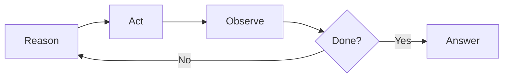
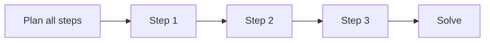
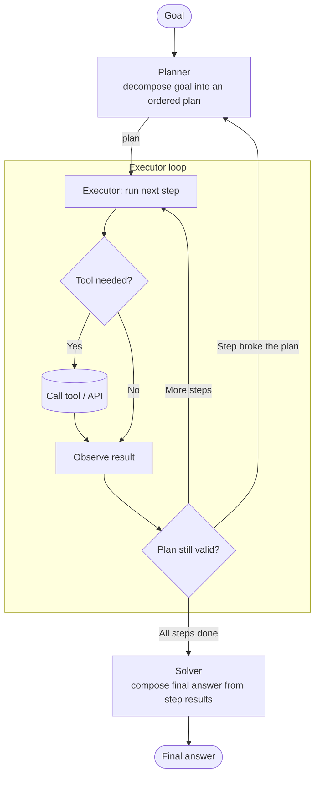
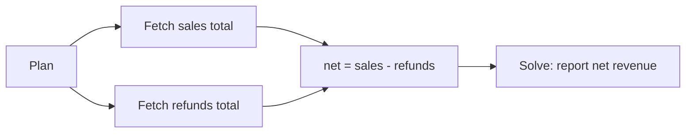

# Planner-Executor Workflows

<div class="topic-page" markdown="1">

<section class="topic-hero">
  <span class="topic-hero__eyebrow">Stage 08 - Agent Architectures</span>
  <p class="topic-hero__lead">A planner-executor workflow splits an agent into two roles: a <strong>planner</strong> that turns a goal into an ordered plan of steps, and an <strong>executor</strong> that carries out each step. Separating thinking from doing makes complex, multi-step tasks more reliable, cheaper, and easier to inspect.</p>
  <div class="topic-hero__facts">
    <span>Goal</span>
    <span>Plan</span>
    <span>Execute</span>
    <span>Re-plan</span>
    <span>Solve</span>
  </div>
</section>

## Goal

By the end of this topic, you should be able to:

- Define the planner-executor pattern and name its components.
- Explain how it differs from ReAct.
- Read a plan and its execution trace, including a re-planning step.
- Decide when a planner-executor workflow is the right architecture and when it is overkill.
- Reason about its cost, latency, and reliability tradeoffs.

## Learning Path

This page focuses only on the planner-executor pattern. Read the four parts in order.

<div class="learning-grid learning-grid--path">
  <a class="learning-card" href="#part-1-the-core-idea">
    <strong>Part 1 - The Core Idea</strong>
    <span>Understand plan-then-execute and how it contrasts with ReAct.</span>
  </a>
  <a class="learning-card" href="#part-2-the-architecture">
    <strong>Part 2 - The Architecture</strong>
    <span>Learn the Planner, Executor, and Solver roles and the re-planning loop.</span>
  </a>
  <a class="learning-card" href="#part-3-a-worked-plan-and-trace">
    <strong>Part 3 - A Worked Plan and Trace</strong>
    <span>Follow a concrete plan, its execution, and one re-plan after a failure.</span>
  </a>
  <a class="learning-card" href="#part-4-when-to-use-it">
    <strong>Part 4 - When to Use It</strong>
    <span>Choose this pattern based on task structure and tradeoffs.</span>
  </a>
</div>

## Part 1: The Core Idea

In a **planner-executor workflow**, the agent first writes a complete plan for the whole task, and only then starts doing the work.

```text
Planner:  Look at the goal and produce an ordered list of steps.
Executor: Carry out each step, one after another.
Solver:   Combine the step results into a final answer.
```

This is often called **plan-then-execute**. Its defining feature is that planning and execution are **separated**: the model that decides *what to do* is decoupled from the component that actually *does it*.

### One-Sentence Definition

```text
A planner-executor workflow decomposes a goal into an explicit plan up front,
then executes the plan step by step, re-planning only when a step makes the
original plan wrong.
```

### Planner-Executor vs ReAct

You already saw [ReAct](../../04-agent-fundamentals/react-pattern/index.md) in Stage 04, where the agent interleaves a single reason → act → observe step at a time. Planner-executor takes the opposite approach: it plans many steps in advance.

| Aspect | ReAct | Planner-Executor |
| --- | --- | --- |
| When the plan is made | One step at a time, as it goes | All steps decided up front |
| Reasoning per step | Yes, before every action | Mostly during planning |
| Visibility of the full plan | No, it emerges | Yes, the whole plan is inspectable |
| Cost | Many reasoning calls | One big planning call, then cheap execution |
| Best for | Investigative tasks where each result changes the next step | Tasks whose steps are knowable in advance |

Neither pattern is "better." ReAct shines when the next move genuinely depends on the last observation. Planner-executor shines when you can see most of the steps before starting.

### Two Shapes

The two patterns have different *shapes*. ReAct is a tight loop that grows one step at a time; planner-executor commits to a full plan and then runs it straight through.

**ReAct — decide as you go:**



**Planner-executor — plan, then run:**



### The Same Goal, Two Ways

Goal: *"Find the total revenue from last week's paid orders."*

A **ReAct** agent discovers each step only after seeing the previous result:

```text
Reason: I need last week's orders.        Act: list_orders(since="7d")
Observe: 240 orders
Reason: I only want paid ones.            Act: filter_orders(status="paid")
Observe: 180 orders
Reason: Now sum the totals.               Act: sum_field(field="amount")
Observe: 42,300
Answer: Last week's paid revenue was $42,300.
```

A **planner-executor** agent writes the whole plan first, because the steps are predictable:

```text
Plan:
1. list_orders(since="7d")          -> #E1
2. filter_orders(#E1, status="paid") -> #E2
3. sum_field(#E2, field="amount")    -> #E3
Solve: "Last week's paid revenue was {#E3}."
```

Both reach the same answer. The planner-executor version commits to the steps up front, so a human can review the plan and the cheap executor can run it without re-reasoning at each step.

## Part 2: The Architecture

A planner-executor workflow has three logical roles.

| Role | What it does | Typical model |
| --- | --- | --- |
| **Planner** | Decomposes the goal into an ordered list of subtasks | A strong reasoning model |
| **Executor** (worker) | Runs each subtask, often by calling a tool | A smaller, faster, cheaper model |
| **Solver** | Composes the final answer from the step results | A capable model, one call |



**How to read this diagram:** the **planner** runs once to produce the whole plan. The **executor** then walks the steps inside the loop, calling a tool when a step needs one and observing the result. After each step it checks whether the plan still holds: most of the time it moves to the next step, but if a result invalidates the plan it returns to the planner to **re-plan**. When every step is done, the **solver** composes the final answer.

### What the Planner Produces

The planner is just an LLM call with a prompt that asks for a structured plan. A typical planner prompt looks like this:

```text
You are the planner. Break the goal into an ordered list of steps.
Each step must name one tool and its arguments.
A step may reference an earlier step's output as #E1, #E2, etc.
Do not execute anything. Output only the plan as JSON.

Tools available: list_orders, filter_orders, sum_field, send_email
Goal: Email finance last week's paid revenue.
```

And the plan it returns:

```json
{
  "plan": [
    { "id": "E1", "tool": "list_orders",   "args": { "since": "7d" } },
    { "id": "E2", "tool": "filter_orders",  "args": { "orders": "#E1", "status": "paid" } },
    { "id": "E3", "tool": "sum_field",       "args": { "rows": "#E2", "field": "amount" } },
    { "id": "E4", "tool": "send_email",      "args": { "to": "finance", "body": "Paid revenue: #E3" } }
  ]
}
```

Because the plan is plain data, your application can validate it, show it to a user for approval, or refuse a step before any tool runs.

### Why Separate Planning From Execution

- **Cost.** The expensive reasoning happens once, in the planner. Execution steps can use a small, cheap model or even plain tool calls.
- **Inspectability.** The plan is written down before any action runs, so a human (or a guardrail) can review or approve it. This matters for governance.
- **Reliability.** Forcing a plan up front reduces aimless wandering and repeated actions that loosely-controlled agents fall into.

### Static Plans vs Re-planning

The simplest version runs the plan straight through. More robust versions **re-plan**: after a step fails or returns something the plan did not anticipate, the planner revises the remaining steps. Re-planning is what keeps the pattern from being brittle.

!!! warning "A plan is a hypothesis, not a guarantee"
    The planner writes the plan before seeing any real results. If your task has steps that can fail or return surprising data, you **must** add a re-planning path. A static plan with no recovery is the most common way planner-executor agents break.

### Weak vs Strong Plans

The quality of the whole workflow depends on the plan. A vague plan forces the executor to guess; a precise plan runs cleanly.

<div class="prompt-compare">
  <section>
    <span class="prompt-compare__label prompt-compare__label--bad">Weak plan</span>
    <pre><code>1. Get the data
2. Process it
3. Send the report</code></pre>
    <p>No tools, no arguments, no data passing. The executor cannot run these steps without re-planning each one.</p>
  </section>
  <section>
    <span class="prompt-compare__label prompt-compare__label--good">Strong plan</span>
    <pre><code>1. list_orders(since="7d")            -> #E1
2. filter_orders(#E1, status="paid")  -> #E2
3. sum_field(#E2, field="amount")     -> #E3
4. send_email(to="finance", body=#E3)</code></pre>
    <p>Each step names a tool, its arguments, and how it uses earlier results. The executor can run it directly.</p>
  </section>
</div>

### Common Variants

| Variant | Idea | Tradeoff |
| --- | --- | --- |
| **Plan-and-Execute** | Plan all steps, execute in order, re-plan as needed | Simple and inspectable |
| **ReWOO** | Plan references step outputs as variables (`#E1`, `#E2`) so steps run without re-prompting the planner | Fewer LLM calls, but the plan cannot adapt mid-run |
| **LLMCompiler** | Run independent steps in parallel | Lower latency, more orchestration complexity |
| **Orchestrator-workers** | An orchestrator delegates subtasks to worker agents | Scales to large tasks, harder to debug |

### Running Steps in Parallel

A plan is not always a straight line. When two steps do not depend on each other, the executor can run them at the same time and join the results, which is the idea behind LLMCompiler. Independent branches cut latency.



Here steps 1 and 2 have no dependency on each other, so they run concurrently. Step 3 waits for both, then the solver reports the result. A pure ReAct loop cannot do this, because it only ever takes one step at a time.

## Part 3: A Worked Plan and Trace

Goal: **"Write this week's engineering status update."**

### The Plan

The planner produces an ordered plan. Notice each step names a tool and can reuse an earlier step's result.

```text
Goal: Write this week's engineering status update.

Plan:
1. list_merged_prs(since="7d")            -> #E1
2. list_incidents(since="7d")             -> #E2
3. summarize(text=#E1, focus="features")  -> #E3
4. summarize(text=#E2, focus="reliability") -> #E4
5. draft_update(features=#E3, reliability=#E4) -> #E5
```

### Execution Trace

```text
Step 1: list_merged_prs(since="7d")
Observation: 12 merged PRs

Step 2: list_incidents(since="7d")
Observation: ERROR - incident service returned 503

Re-plan:
Step 2 failed. The incident service is down, but the update can still ship
with a note. Revise the remaining steps.

Revised plan:
2. (skipped) note "incident data unavailable"
4. summarize(text="incident data unavailable", focus="reliability") -> #E4
5. draft_update(features=#E3, reliability=#E4) -> #E5

Step 3: summarize(#E1, focus="features")
Observation: "Shipped saved-search, fixed CSV export, ..."

Step 4: summarize("incident data unavailable", ...)
Observation: "Reliability: incident data was unavailable this week."

Step 5: draft_update(...)
Observation: drafted status update

Solver:
This week we shipped saved searches and fixed CSV export across 12 PRs.
Reliability metrics were unavailable because the incident service was down;
we will include them next week.
```

### Why This Trace Works

| Trace part | Why it matters |
| --- | --- |
| Whole plan written first | A human could review the steps before anything ran. |
| Steps reference `#E1`, `#E2` | Later steps reuse earlier results without re-asking the planner. |
| Step 2 failure triggers re-plan | The plan adapted instead of crashing. |
| Solver composes the answer | Final wording is one job, separate from gathering data. |

## Part 4: When to Use It

Use a planner-executor workflow when the task has **several steps you can mostly foresee**, and value comes from doing them reliably and cheaply.

| Task | Planner-Executor? | Why |
| --- | --- | --- |
| Answer "What is a vector database?" | No | A single model call is enough. |
| Find why one deployment failed | No (use ReAct) | Each step depends on the last observation. |
| Generate a weekly report from several sources | Yes | The steps are knowable up front. |
| Migrate 30 files with the same transformation | Yes | A clear, repeatable plan over many items. |
| Research a topic across many sources, then synthesize | Yes | Plan the gathering, then solve. |

Good signs that planner-executor fits:

- Most steps are predictable before you start.
- Execution steps are cheaper than planning.
- A human may want to review or approve the plan.
- The task is long enough that an unstructured agent would wander.

!!! danger "Do not overbuild"
    Many tasks need only a single LLM call or a fixed workflow. Reach for a planner-executor agent when a simpler approach has actually failed, not by default. Added autonomy means added cost, latency, and failure modes.

## Common Misunderstandings

| Misunderstanding | Correction |
| --- | --- |
| Planning means the agent never adapts | Re-planning lets the plan change when a step fails or surprises it. |
| The planner and executor must be the same model | They are usually different: a strong planner, a cheap executor. |
| Planner-executor is always better than ReAct | It is worse when each step depends on the previous observation. |
| A plan guarantees a correct result | A plan based on wrong assumptions still fails; tools and observations can be wrong. |
| Every agent should plan first | Some tasks need a single call or a fixed workflow, not a planner. |

## Practice

### Exercise 1: Write a Plan

For the goal *"Onboard a new customer: create their account, send a welcome email, and schedule a kickoff call,"* write a 4-5 step plan in the `step -> #E` format from Part 3. Mark which steps could fail and need a re-planning path.

### Exercise 2: ReAct or Planner-Executor?

For each task, choose the better pattern and give one reason.

| Task | Pattern | Reason |
| --- | --- | --- |
| Debug why last night's build broke |  |  |
| Produce a monthly metrics summary |  |  |
| Rename a symbol across a 20-file repo |  |  |
| Answer a one-off factual question |  |  |

### Exercise 3: Add Re-planning

Take the plan from Exercise 1. Assume the "send welcome email" step fails because the email service is down. Write the revised remaining steps the planner should produce.

## Mini Project

Design (on paper, no code yet) a planner-executor workflow for a **"release notes generator"** agent.

Your design should include:

- the **goal** the agent receives
- a **planner prompt** that produces an ordered plan
- the list of **tools** the executor may call (at least three)
- the **plan format**, including how steps reference earlier results
- a **re-planning rule**: what triggers it and what the planner does
- the **solver** step that composes the final notes
- one paragraph comparing your design's cost and latency to doing the same task with a single ReAct agent

The goal is a design clear enough that another developer could implement it.

## Exit Criteria

You understand this topic when you can:

- Define a planner-executor workflow and name the planner, executor, and solver roles.
- Explain how it differs from ReAct and when each is appropriate.
- Read a plan that references earlier step results.
- Describe why and when re-planning is needed.
- Name at least two variants (Plan-and-Execute, ReWOO, LLMCompiler, orchestrator-workers).
- Explain the cost, latency, inspectability, and reliability tradeoffs.

## Resources

- [roadmap.sh: AI Agents Roadmap](https://roadmap.sh/ai-agents)
- [LangChain: Plan-and-Execute Agents](https://www.langchain.com/blog/planning-agents)
- [Anthropic: Building Effective Agents](https://www.anthropic.com/engineering/building-effective-agents)
- [Plan-and-Solve Prompting (paper)](https://arxiv.org/abs/2305.04091)
- [ReWOO: Decoupling Reasoning from Observations (paper)](https://arxiv.org/abs/2305.18323)
- [Outcome School: Plan-and-Execute Agent](https://outcomeschool.com/blog/plan-and-execute-agent)

</div>
