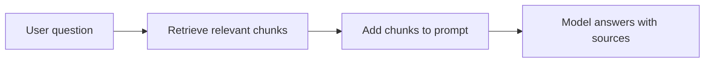
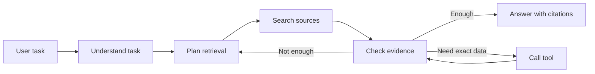
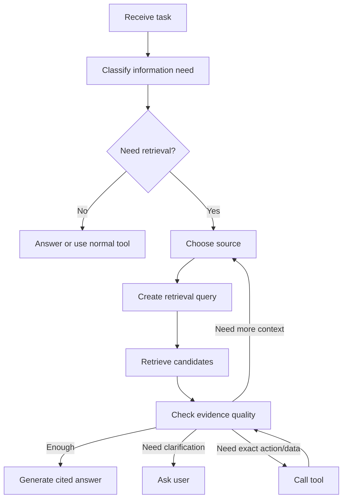
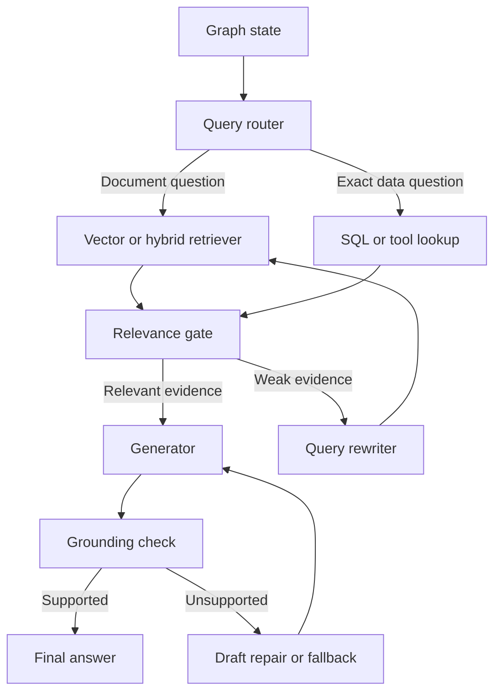
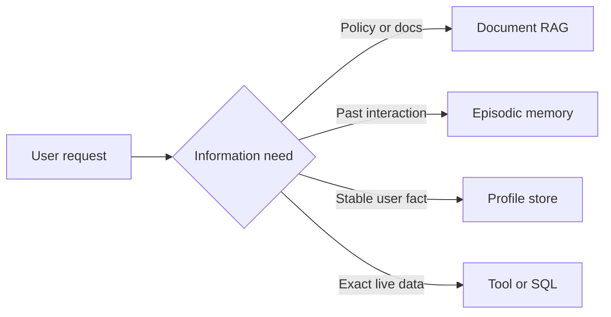
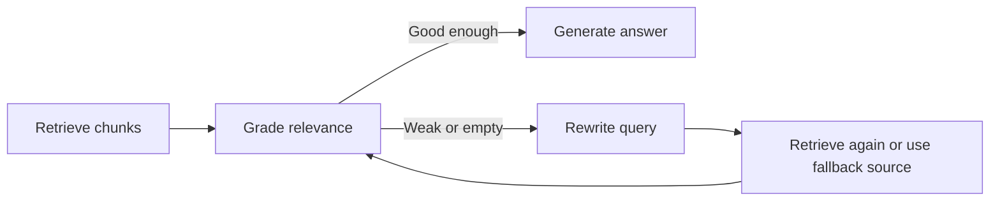

# RAG Agents

<div class="topic-page" markdown="1">

<section class="topic-hero">
  <span class="topic-hero__eyebrow">Stage 08 - Agent Architectures</span>
  <p class="topic-hero__lead">A RAG agent is an agent architecture that uses retrieval as part of its reasoning and action loop. Instead of only searching once and answering, a RAG agent can decide what to retrieve, rewrite queries, inspect sources, call tools, ask follow-up questions, and stop when the evidence is good enough.</p>
  <div class="topic-hero__facts">
    <span>RAG</span>
    <span>Agent loop</span>
    <span>Retrieval planning</span>
    <span>Citations</span>
    <span>Tradeoffs</span>
  </div>
</section>

## Goal

Understand RAG agents as an architecture pattern: when to use them, how they
compose retrieval with an agent loop, and how to avoid overbuilding a simple RAG
workflow into an unreliable autonomous system.

After this topic, you should be able to explain:

- what makes a RAG agent different from a basic RAG pipeline,
- when retrieval should be a fixed workflow and when it should be agentic,
- how a RAG agent plans, searches, evaluates evidence, and answers,
- how query rewriting, multi-step retrieval, tools, and memory fit together,
- how citations and source checks shape the architecture,
- what failure modes are common in RAG agents,
- how to compare RAG agents by cost, latency, quality, reliability, and debuggability.

## Before You Start

Stage 07 covered the retrieval and memory layer: chunks, embeddings, vector
search, stores, short-term memory, long-term memory, and user profiles. Stage 08
is about architecture.

Start with one distinction:

```text
Basic RAG is usually a fixed pipeline.
A RAG agent can decide how to retrieve and whether more work is needed.
```

Beginner example:

```text
Basic RAG:
  Search docs once -> answer from top chunks.

RAG agent:
  Understand the task -> choose a retrieval strategy -> search docs
  -> inspect evidence -> maybe search again -> maybe call a tool
  -> answer with citations or ask a clarifying question.
```

Do not use a RAG agent just because retrieval is involved. Many production
systems should stay as simple RAG workflows.

### Key Words In Plain English

| Word | Simple Meaning | Beginner Example |
| --- | --- | --- |
| Basic RAG | Search first, then answer from retrieved context | FAQ bot over product docs |
| RAG agent | Agent loop that can make retrieval decisions | support assistant that searches, checks, and escalates |
| Retrieval plan | A decision about what to search and why | search policy docs first, then ticket history |
| Query rewriting | Turning the user request into better search queries | "lost authenticator" -> "MFA recovery policy" |
| Multi-step retrieval | Searching more than once as new information appears | find product, then search product-specific policy |
| Evidence check | Deciding whether retrieved context is enough | source answers the exact question and is current |
| Citation | A reference to the source used in the answer | handbook section or document chunk ID |
| Guardrail | A rule that limits risky agent behavior | answer only from approved sources |

## Learning Path

This topic is designed in four parts. Read them in order.

<div class="learning-grid learning-grid--path">
  <a class="learning-card" href="#part-1-compare-basic-rag-and-rag-agents">
    <strong>Part 1 - Compare RAG Patterns</strong>
    <span>Learn when a fixed RAG pipeline is enough and when an agentic loop helps.</span>
  </a>
  <a class="learning-card" href="#part-2-design-the-rag-agent-loop">
    <strong>Part 2 - Design The Loop</strong>
    <span>Compose planning, retrieval, evidence checks, tool use, memory, and answer generation.</span>
  </a>
  <a class="learning-card" href="#part-3-choose-agentic-retrieval-patterns">
    <strong>Part 3 - Choose Retrieval Patterns</strong>
    <span>Use query rewriting, routing, multi-step retrieval, hybrid search, reranking, and citations.</span>
  </a>
  <a class="learning-card" href="#part-4-evaluate-tradeoffs-and-failure-modes">
    <strong>Part 4 - Evaluate Tradeoffs</strong>
    <span>Compare cost, latency, reliability, debuggability, and common RAG-agent failures.</span>
  </a>
</div>

## Part 1: Compare Basic RAG And RAG Agents

A basic RAG pipeline has a predictable shape.



**How to read this diagram:** the application always follows the same steps.
This is often enough for documentation Q&A, policy lookup, and search-backed
answering.

A RAG agent adds decision-making around retrieval.



**How to read this diagram:** the agent can loop. It can search again, change
the query, call a tool, or stop when the evidence is sufficient.

### When Basic RAG Is Enough

Use a fixed RAG workflow when:

- the user asks one clear question,
- one knowledge source usually contains the answer,
- the retrieval strategy is stable,
- the answer should always cite retrieved documents,
- latency and predictability matter,
- the system should be easy to test and debug.

Example:

```text
"What is the refund policy for annual subscriptions?"
```

The app can retrieve relevant policy chunks, pass them to the model, and ask for
a cited answer. There is no need for an autonomous loop.

### When A RAG Agent Helps

Use a RAG agent when the task requires decisions across retrieval steps.

Good cases:

- the task is broad or ambiguous,
- the answer depends on several sources,
- the agent must choose between document search, memory, SQL, and tools,
- the first retrieval may reveal what to search next,
- the agent must inspect evidence before deciding whether to answer,
- the user wants a research-style result, comparison, or investigation.

Example:

```text
"Why did our onboarding emails start failing for EU customers, and what policy
or code changes are relevant?"
```

This may require searching incident notes, policy docs, product docs, code
references, recent deployments, and customer-region constraints. A one-shot RAG
pipeline may be too shallow.

### Simple Rule

```text
If the retrieval path is known, use a workflow.
If the retrieval path must be discovered, consider a RAG agent.
```

RAG agents add power, but they also add cost, latency, and failure modes.

## Part 2: Design The RAG Agent Loop

A RAG agent is still an agent. It needs state, retrieval tools, stopping rules,
and output rules.

### Core Loop



**How to read this diagram:** retrieval is inside the agent loop. The agent
chooses sources and queries, then checks whether the result is enough before it
answers.

### Agent State

A RAG agent should track more than conversation history.

| State | Purpose |
| --- | --- |
| User task | The actual goal the user asked for |
| Retrieval plan | What the agent is searching and why |
| Search queries | Queries already tried |
| Retrieved source IDs | Which chunks, docs, or memories were found |
| Evidence notes | What each source proves or does not prove |
| Open questions | Missing information or ambiguity |
| Tool results | Exact data fetched from systems |
| Stop condition | Why the agent is ready to answer or ask for help |

Without this state, a RAG agent can repeat searches, overuse tools, or answer
from weak evidence.

Example state shape:

```python
from typing import TypedDict


class RagAgentState(TypedDict):
    original_query: str
    current_query: str
    selected_sources: list[str]
    retrieved_ids: list[str]
    evidence_notes: list[str]
    tool_results: list[dict]
    search_history: list[str]
    loop_count: int
    stop_reason: str | None
```

This state is not the model's hidden reasoning. It is application state. It lets
the system route, retry, stop, trace, and debug the workflow.

### Graph Topology

Many RAG agents are easier to reason about as a graph of nodes and conditional
edges.



**How to read this diagram:** each node performs one job and updates shared
state. The conditional edges decide whether the agent searches again, calls a
tool, repairs a draft, or stops.

Good graph nodes are narrow:

| Node | Job |
| --- | --- |
| Router | Choose the source or tool family |
| Retriever | Fetch candidate chunks, memories, or records |
| Relevance gate | Decide whether retrieved items are useful |
| Query rewriter | Create a better search query after a miss |
| Generator | Draft an answer from selected evidence |
| Grounding check | Check whether the draft is supported |
| Fallback | Ask the user, say no source was found, or escalate |

Avoid hiding all of this inside one large prompt. Separate nodes make the system
easier to trace and test.

### Core Node Contracts

In a production RAG agent, each graph node should have a clear contract: what it
reads from state, what it writes back, and which edge it can choose next.

| Node | Reads | Writes | Common Next Edge |
| --- | --- | --- | --- |
| Query router | user task, current query, user scope | selected source, sub-queries | retriever, tool, clarification |
| Retriever | current query, selected source, filters | retrieved IDs, candidate chunks | relevance gate |
| Relevance gate | query, retrieved chunks | evidence notes, rejected IDs | generator, query rewriter, fallback |
| Query rewriter | original query, search history, failed evidence | new current query, loop count | retriever |
| Generator | selected evidence, tool results, output rules | generation draft | grounding check |
| Grounding check | draft, source IDs, evidence notes | supported claims, unsupported claims | final answer, draft repair, fallback |
| Fallback | stop reason, failed searches, missing data | user-facing response or escalation | final answer |

This makes the architecture testable. You can unit test the router without
running generation, test the relevance gate with known good and bad chunks, and
test the grounding check against intentionally unsupported drafts.

### Router Output

The router should usually produce structured output, not free-form prose.

Example:

```json
{
  "route": "document_rag",
  "sources": ["policy_docs", "support_runbooks"],
  "sub_queries": [
    "MFA recovery after phone replacement",
    "authenticator app lost account recovery"
  ],
  "needs_tool": false,
  "reason": "The user asks for policy and troubleshooting guidance."
}
```

The exact schema depends on the application, but the important point is that the
next node can consume it deterministically.

### Source Selection

A RAG agent may have several retrieval sources.

| Source | Use When |
| --- | --- |
| Document RAG | User asks about policies, docs, manuals, or knowledge base content |
| Episodic memory | User asks about past work, decisions, or previous interactions |
| Semantic memory | User asks something affected by durable project or user facts |
| User profile | Personalization depends on stable preferences or settings |
| SQL/tool lookup | Exact account, order, status, metric, or permission data is needed |
| Web/search tool | The answer depends on current external information |

The architecture should route retrieval by information need. Do not search every
source on every turn.

### Evidence Check

Before answering, the agent should ask:

- Does the retrieved context directly answer the question?
- Are the sources current enough?
- Is the user allowed to see them?
- Do the sources conflict?
- Is exact data required from a tool instead of text retrieval?
- Is there enough evidence to cite the answer?
- Should the agent ask a clarifying question instead?

This evidence check is what separates a useful RAG agent from a system that just
keeps adding random chunks to the prompt.

## Part 3: Choose Agentic Retrieval Patterns

RAG agents are built from smaller retrieval patterns. Use only the patterns the
task needs.

### Query Rewriting

The agent rewrites the user request into one or more better retrieval queries.

Example:

```text
User:
  "I cannot get into the app after switching phones."

Retrieval queries:
  "MFA recovery after phone replacement"
  "account recovery authenticator app lost"
  "device change login troubleshooting"
```

Use this when users describe symptoms but documents use formal terms.

Risk:

```text
Bad rewriting can change the user's meaning.
```

The rewrite should clarify, not invent.

### Retrieval Routing

The agent chooses where to search.



**How to read this diagram:** not every question belongs in the vector database.
Some questions need structured data or memory instead.

### Multi-Step Retrieval

The first retrieval step can reveal the next one.

Example flow:

```text
1. Search broad docs for "EU onboarding email failure."
2. Find that failures relate to consent requirements.
3. Search policy docs for "EU marketing consent transactional email."
4. Search incident notes for recent onboarding email changes.
5. Answer with the relevant policy and incident evidence.
```

Use this when the question spans several concepts or source types.

Risk:

```text
Multi-step retrieval can become slow and expensive.
```

Set limits on number of searches, sources, and total context.

### Hybrid Search And Reranking

RAG agents often need both semantic and exact search.

Use hybrid search when the task includes:

- exact error codes,
- API names,
- customer names,
- file paths,
- product SKUs,
- invoice IDs,
- legal clauses,
- rare acronyms.

Use reranking when initial retrieval finds many plausible chunks and the agent
needs the best few.

Architecture pattern:

```text
Retrieve broad candidates -> rerank by relevance -> keep the smallest useful set
```

A common hybrid retrieval pattern is:

```text
Dense vector search + sparse keyword search -> merge rankings -> rerank
```

Dense retrieval helps with meaning. Sparse retrieval helps with exact terms such
as error codes, file names, legal clauses, or product IDs. Ranking fusion, such
as reciprocal rank fusion, can combine the two lists before the reranker chooses
the final context.

### Corrective RAG

Corrective RAG, often shortened to CRAG, adds a relevance gate after retrieval.
The agent does not assume the first retrieved chunks are good enough.



**How to read this diagram:** the agent treats retrieval as something that can
fail. If the evidence is weak, it changes the query, searches another source, or
stops with a clear "not found" answer.

Use this pattern when:

- users ask vague or symptom-based questions,
- the corpus is noisy,
- many chunks are semantically similar,
- the agent should avoid answering from weak evidence.

Set a hard loop budget. A corrective loop without a budget can keep rewriting
the same failed query.

### Self-Reflective RAG

Self-reflective RAG adds checks around generation. The agent asks whether the
answer is supported by the retrieved context and whether it actually satisfies
the request.

Useful checks:

| Check | Question |
| --- | --- |
| Grounding | Is each factual claim supported by retrieved context? |
| Answer relevance | Does the answer address the user's actual question? |
| Citation validity | Do citations point to retrieved source IDs? |
| Conflict handling | Did the answer mention source disagreement? |

This can be implemented with a smaller model, a rules-based verifier, a
specialized evaluator, or a second LLM call. It improves reliability but adds
latency and cost.

### Tool Use After Retrieval

Retrieved documents often explain rules, but tools provide current facts or
perform actions.

Example:

```text
Question:
  "Can this customer receive a refund?"

Retrieval:
  Refund policy and eligibility rules.

Tool:
  Current subscription status, purchase date, region, and refund history.

Answer:
  Applies the policy to live account data with citations.
```

This is a common RAG-agent pattern: retrieval gives policy; tools give exact
state.

### Memory Plus RAG

RAG agents can combine external knowledge and memory.

| Need | Retrieval Source |
| --- | --- |
| "What does the product policy say?" | RAG knowledge base |
| "What did we decide last time?" | Episodic memory |
| "What does this user usually prefer?" | Semantic memory or profile |
| "What is true right now?" | Tool or database |

Keep these separated in the architecture. A product policy and a user's
preference should not be treated as the same kind of evidence.

### Memory Across Execution Cycles

Agentic RAG uses memory at more than one level.

| Memory Layer | Where It Lives | What It Tracks |
| --- | --- | --- |
| Graph state | Current agent run | current query, searched sources, retrieved IDs, loop count |
| Short-term context | Current model call | selected evidence, recent conversation, tool results |
| Long-term memory | External store | selected user preferences, project facts, useful past events |
| Entity or graph memory | Graph or structured store | people, systems, documents, incidents, and relationships |

The graph state is execution memory. It prevents repeated searches and makes the
loop debuggable. Long-term memory is different: it should store selected useful
facts or episodes, not the entire raw execution state.

Bad memory design:

```text
Save every agent step and retrieve it forever.
```

Better memory design:

```text
Extract durable facts, decisions, preferences, or solved incidents.
Store them with source, confidence, privacy level, and timestamps.
Retrieve them only when relevant to the current task.
```

### Citation Discipline

RAG agents should cite only sources they actually used.

Good citation behavior:

- attach source labels to retrieved chunks,
- cite exact documents or sections,
- avoid citing memory as if it were external truth,
- say when no source was found,
- separate evidence from inference.

Bad citation behavior:

```text
The model invents a source name because the prompt asked for citations.
```

The architecture should pass source IDs with context and require the model to
cite from those IDs only.

## Part 4: Evaluate Tradeoffs And Failure Modes

A RAG agent should be judged as an architecture, not only as a final answer.

### Tradeoffs

| Dimension | Basic RAG | RAG Agent |
| --- | --- | --- |
| Cost | Lower and predictable | Higher and variable |
| Latency | Usually faster | Slower if it loops |
| Quality on simple questions | Often strong | Can be overcomplicated |
| Quality on complex research | May be shallow | Often better |
| Debuggability | Easier | Requires tracing |
| Reliability | More predictable | More moving parts |
| Control | Fixed path | More autonomy |

The tradeoff is not "agent is better." The tradeoff is autonomy versus control.

### Common Failure Modes

| Failure | What Happens | Architecture Fix |
| --- | --- | --- |
| Over-retrieval | Too many chunks confuse the model | Limit context and deduplicate |
| Weak evidence | Agent answers from related but non-answering chunks | Add evidence checks and reranking |
| Retrieval loop | Agent keeps searching without progress | Add search budgets and stop rules |
| Wrong source | Agent searches memory when it needs policy docs | Add retrieval routing |
| Stale source | Agent cites old policy | Track versions and freshness |
| Permission leak | Private source enters context | Filter before retrieval |
| Tool mismatch | Agent uses docs when live data is needed | Route exact questions to tools |
| Citation hallucination | Answer cites sources not retrieved | Pass source IDs and restrict citations |
| Hidden conflict | Two sources disagree but answer ignores it | Detect conflicts and report uncertainty |

### Stop Rules

A RAG agent needs explicit stop rules.

Stop and answer when:

- at least one retrieved source directly answers the question,
- required exact data has been fetched,
- conflicts are resolved or clearly reported,
- citations are available,
- the answer can stay within the user's request.

Stop and ask the user when:

- the request is ambiguous,
- the needed source depends on a missing product, region, time period, or account,
- the agent cannot access the right source,
- answering would require guessing.

Stop and refuse or escalate when:

- the user is not allowed to access the information,
- the task requires an unsafe action,
- the agent cannot verify required facts.

### Observability

Log the architecture path, not just the final answer.

Useful trace fields:

| Trace Field | Why It Helps |
| --- | --- |
| request classification | Shows why retrieval was used |
| selected sources | Shows where the agent searched |
| generated queries | Reveals bad query rewriting |
| retrieved IDs | Makes citations and misses debuggable |
| reranker scores | Shows why chunks were chosen |
| tool calls | Shows exact data dependencies |
| stop reason | Explains why the loop ended |
| final citations | Lets humans verify grounding |

Without traces, RAG-agent bugs are hard to diagnose because failure can happen in
planning, retrieval, ranking, evidence checking, generation, or tool use.

### Production Optimizations

RAG agents can become slow because one user task may trigger several model calls:
route, retrieve, grade, rewrite, generate, verify, and maybe repair. Optimize the
architecture before blaming only the final model.

| Bottleneck | Symptom | Practical Fix |
| --- | --- | --- |
| Too many grading calls | Retrieval feels slow before generation starts | Grade chunks in parallel or grade only top candidates |
| Expensive router | Every request pays for a strong model | Use a smaller model or rules for simple routing |
| Repeated failed searches | Agent loops on missing information | Track `loop_count`, searched sources, and query history |
| Oversized context | Generation is slow and distracted | Deduplicate, rerank, and trim to the smallest useful set |
| Tool calls after weak retrieval | Agent fetches live data too early | Check document evidence before expensive tools |
| Verification on every task | Simple answers cost too much | Run grounding checks only for sourced or high-risk answers |

Hard budgets should be part of the state:

```text
max_searches = 3
max_tool_calls = 2
max_context_chunks = 6
max_total_agent_steps = 8
```

When the budget is exhausted, the agent should stop gracefully:

```text
"I searched the available policy docs and support runbooks, but I could not find
a source that answers this. I would not answer this from retrieved evidence."
```

That response is better than a confident answer from weak context.

### When Not To Use A RAG Agent

Do not use a RAG agent when:

- the answer is already in the prompt,
- the task is simple rewriting or summarization,
- one fixed retrieval call solves the problem,
- the system has strict latency limits,
- the user needs deterministic workflow behavior,
- the knowledge source is small enough to inspect directly,
- the agent cannot be given safe access to the required sources.

Prefer the simplest architecture that solves the real task.

## Common RAG Agent Designs

### Design 1: Cited Documentation Assistant

Best for:

- product docs,
- internal handbooks,
- support knowledge bases,
- policy Q&A.

Architecture:

```text
Classify question -> retrieve docs -> rerank -> answer with citations
```

This is close to basic RAG. Make it agentic only if the assistant needs to
rewrite queries, search multiple collections, or handle uncertainty.

### Design 2: Support Investigation Agent

Best for:

- troubleshooting,
- customer support,
- operational diagnosis.

Architecture:

```text
Classify issue -> search docs -> fetch live account/system data
-> compare evidence -> propose next action or escalation
```

This pattern works because docs explain expected behavior while tools show
current state.

### Design 3: Research And Synthesis Agent

Best for:

- comparing options,
- gathering evidence across sources,
- producing sourced summaries.

Architecture:

```text
Plan research -> run multiple targeted searches -> group evidence
-> identify gaps/conflicts -> synthesize with citations
```

This is more expensive and slower, so it needs budgets and traceability.

### Design 4: GraphRAG Investigation Agent

Best for:

- large document collections,
- entity-heavy domains,
- contracts, compliance, investigations, or research,
- questions about relationships across many documents.

Architecture:

```text
Extract entities and relationships -> build graph summaries
-> route question to graph and document retrieval
-> synthesize evidence across connected entities
```

GraphRAG is useful when the question depends on relationships, not just nearby
text chunks. It can answer broader questions such as "What risks appear across
these contracts?" better than simple chunk similarity alone.

Do not start here for a beginner RAG agent. Graph ingestion, entity extraction,
community summaries, updates, and evaluation add significant complexity.

## Practice

### Practice 1: Choose The Architecture

For each task, choose basic RAG, RAG agent, tool workflow, or no retrieval:

1. "Summarize this paragraph."
2. "What does our PTO policy say about carryover?"
3. "Why did customer onboarding fail after yesterday's deployment?"
4. "What is my current subscription renewal date?"
5. "Compare the security guidance across our API docs and internal policy."

### Practice 2: Design A RAG Agent Loop

Design a RAG agent for this request:

```text
"A customer says they cannot reset MFA after changing phones. Find the likely
policy and troubleshooting steps, then tell the support agent what to do next."
```

Include:

- retrieval sources,
- query rewrites,
- tool calls if needed,
- evidence checks,
- stop rules,
- citation behavior.

### Practice 3: Diagnose A Failure

A RAG agent answered from an old policy and cited the wrong document.

Explain what you would inspect:

- source routing,
- retrieved chunk IDs,
- document versions,
- reranking result,
- prompt context,
- citation rules,
- trace logs,
- indexing freshness.

### Practice 4: Sketch The State Machine

Draw a state object and node graph for this request:

```text
"Compare our password reset policy with the last two support incidents where MFA
recovery failed."
```

Include:

- graph state fields,
- router choices,
- document retrieval,
- episodic memory retrieval,
- relevance gate,
- loop budget,
- grounding check,
- final stop reason.

## Summary

A RAG agent is useful when retrieval itself requires decisions. It can choose
sources, rewrite queries, search in multiple steps, inspect evidence, call tools,
and answer with citations. But this power has a cost: more latency, more model
calls, more traces to inspect, and more ways to fail.

Before moving on, you should be able to:

- distinguish basic RAG from a RAG agent,
- explain when agentic retrieval is worth the complexity,
- sketch a RAG agent loop,
- route questions to documents, memory, profiles, SQL, or tools,
- define evidence checks and stop rules,
- describe the core node contracts in a production RAG agent,
- explain how graph state differs from long-term memory,
- explain citation discipline,
- compare RAG agents against simpler workflows by cost, latency, reliability,
  and debuggability.

## Resources

### Local Roadmap Topics

- [RAG and Memory](../../07-rag-and-memory/index.md)
- [Embeddings and Vector Search](../../07-rag-and-memory/embeddings-and-vector-search/index.md)
- [Vector Databases, SQL, and Custom Stores](../../07-rag-and-memory/vector-databases-sql-custom-stores/index.md)
- [Short-Term and Long-Term Memory](../../07-rag-and-memory/short-term-and-long-term-memory/index.md)
- [Episodic and Semantic Memory](../../07-rag-and-memory/episodic-and-semantic-memory/index.md)
- [Agent Loop](../../04-agent-fundamentals/agent-loop/index.md)
- [Function Calling](../../05-tools-and-actions/function-calling/index.md)

### Framework Documentation And Tutorials

- [LangGraph: Agentic RAG](https://docs.langchain.com/oss/python/langgraph/agentic-rag)
- [LangGraph overview](https://docs.langchain.com/oss/python/langgraph/overview)
- [LlamaIndex: Agentic RAG with LlamaIndex](https://www.llamaindex.ai/blog/agentic-rag-with-llamaindex-2721b8a49ff6)
- [LlamaIndex Workflows documentation](https://developers.llamaindex.ai/python/llamaagents/workflows/)

### Structured Courses

- [DeepLearning.AI: Building Agentic RAG with LlamaIndex](https://www.deeplearning.ai/courses/building-agentic-rag-with-llamaindex)
- [DeepLearning.AI courses](https://www.deeplearning.ai/courses)
- [IBM RAG and Agentic AI Professional Certificate](https://www.coursera.org/professional-certificates/ibm-rag-and-agentic-ai)

### Papers And Advanced Concepts

- [ReAct: Synergizing Reasoning and Acting in Language Models](https://arxiv.org/abs/2210.03629)
- [Self-RAG: Learning to Retrieve, Generate, and Critique through Self-Reflection](https://arxiv.org/abs/2310.11511)
- [CRAG: Corrective Retrieval Augmented Generation](https://arxiv.org/abs/2401.15884)
- [Microsoft GraphRAG](https://microsoft.github.io/graphrag/)

</div>
