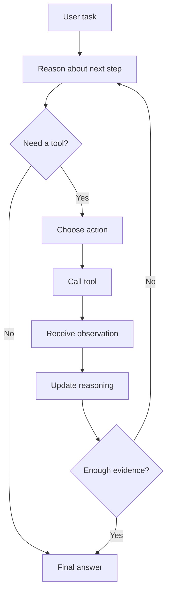
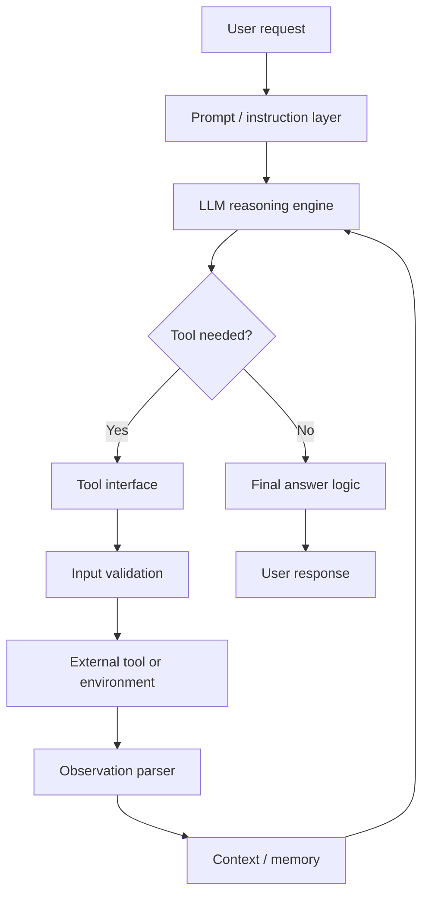

# Agent Architectures: ReAct Agents

<div class="topic-page topic-page--react-pattern" markdown="1">

<section class="topic-hero topic-hero--prompt">
  <span class="topic-hero__eyebrow">Stage 08 - Agent Architectures</span>
  <p class="topic-hero__lead">A ReAct agent is an LLM agent architecture that alternates between reasoning and acting. It reasons about what it needs, calls a tool when external information or action is required, reads the observation, and repeats until it can produce a grounded final answer.</p>
  <div class="topic-hero__facts">
    <span>Reason</span>
    <span>Act</span>
    <span>Observe</span>
    <span>Update</span>
    <span>Answer</span>
  </div>
</section>

## Overview

**ReAct** means **Reasoning + Acting**.

A ReAct agent combines two abilities:

- **Reasoning:** the model decides what it needs next.
- **Acting:** the agent calls tools or interacts with an external environment.

The ReAct pattern is important because many useful agent tasks cannot be solved from the model's internal knowledge alone. The agent may need to search, retrieve documents, query an API, inspect logs, read files, or use another tool. ReAct gives the agent a structured way to decide what to do, observe the result, and update its next step.

The problem ReAct solves:

```text
Do not guess when external evidence is needed.
Reason about the next step, act to get evidence, then use the observation.
```

This page focuses on **ReAct agents as an architecture**. It does not try to cover every agent pattern.

## Background And Core Idea

The original ReAct paper, *ReAct: Synergizing Reasoning and Acting in Language Models*, introduced a method where language models generate reasoning traces and task-specific actions in an interleaved way.

The key idea is simple:

```text
Reasoning helps the agent decide what action to take.
Actions give the agent new observations.
Observations improve the next reasoning step.
```

### The Four Core Concepts

| Concept | Meaning | Example |
| --- | --- | --- |
| Thought / reasoning | The agent's internal decision about what is needed next | "I need the latest error log." |
| Action | A tool call or environment step | `read_log({"service": "payments"})` |
| Observation | The result returned by the tool or environment | `"Database timeout at 12:04 UTC"` |
| Final answer | The response after enough evidence is collected | "The payment failures are caused by database timeouts." |

For learning, ReAct traces are often written with visible `Thought`, `Action`, `Observation`, and `Final Answer` fields. In production systems, avoid exposing private chain-of-thought to users. Prefer short decision summaries, tool call logs, and evidence citations.

## How ReAct Agents Work

A ReAct agent runs a loop.



**How to read this diagram:** the agent does not call tools blindly. Each observation should change or confirm the next reasoning step. The loop ends when the agent has enough information or reaches a stop condition.

### Step-By-Step Loop

| Step | What Happens | Good Behavior |
| --- | --- | --- |
| Thought / reasoning | The model decides what information or action is needed. | Names the next useful step clearly. |
| Action | The agent selects a tool. | Uses the smallest relevant tool call. |
| Action input | The agent provides structured arguments. | Uses valid, specific parameters. |
| Observation | The tool result returns. | The agent reads the actual result, not assumptions. |
| Updated reasoning | The agent decides whether another step is needed. | Changes direction when evidence changes. |
| Final answer | The agent responds to the user. | Uses observed evidence and avoids unsupported claims. |

### When Does The Agent Call A Tool?

A ReAct agent should call a tool when:

- the model lacks required information,
- the answer depends on current or private data,
- a calculation or API lookup is needed,
- the task requires inspecting files, logs, database rows, or external documents,
- an action must be taken in another system.

It should answer directly when:

- the user asks for a general explanation,
- all needed information is already in the prompt,
- using a tool would add cost or risk without improving the answer,
- the task is a simple transformation, such as rewriting text.

## ReAct Prompt Pattern

The classic ReAct format is:

```text
Thought:
Action:
Action Input:
Observation:
Final Answer:
```

### What Each Field Means

| Field | Purpose |
| --- | --- |
| `Thought` | A short reasoning note about the next step. In production, this may be hidden or replaced with a concise decision summary. |
| `Action` | The tool name the agent wants to call. |
| `Action Input` | The structured input for that tool. |
| `Observation` | The tool result returned to the agent. |
| `Final Answer` | The answer when the agent is done. |

### Clean Prompt Template

```text
You are a ReAct agent that solves tasks by reasoning and using tools when needed.

Available tools:
{tool_descriptions}

Rules:
- Use tools only when external information or action is needed.
- Use exactly one action at a time.
- After each observation, decide whether another action is needed.
- If the answer is already known from the provided context, answer directly.
- If a tool fails, explain the problem or choose a safe fallback.
- Stop when you have enough evidence to answer.

Use this format:

Thought: brief reason for the next step
Action: tool_name
Action Input: JSON arguments for the tool
Observation: tool result
...
Final Answer: concise answer supported by observations

User task:
{user_task}
```

Production note: many modern model APIs support structured tool calls. In that case, the model may not literally output `Action` and `Action Input` text. The architecture is still ReAct if the agent alternates reasoning, tool use, observations, and final answer logic.

## Practical Example

Task:

```text
Find why the latest CI build failed and suggest the fix.
```

Available tools:

| Tool | Purpose |
| --- | --- |
| `get_latest_ci_run()` | Returns the latest CI run ID and status. |
| `read_ci_log(run_id)` | Reads the log for a CI run. |
| `read_file(path)` | Reads a file from the repository. |

Example ReAct trace:

```text
Thought:
I need the latest failed CI run before I can inspect the error.

Action:
get_latest_ci_run

Action Input:
{}

Observation:
{"run_id": "ci_742", "status": "failed"}

Thought:
The latest run failed. I need the log to find the concrete error.

Action:
read_ci_log

Action Input:
{"run_id": "ci_742"}

Observation:
"ModuleNotFoundError: No module named 'yaml'"

Thought:
The error says the yaml package is missing. I should check whether the dependency is listed.

Action:
read_file

Action Input:
{"path": "requirements.txt"}

Observation:
"mkdocs==1.6.1\nmkdocs-material==9.6.0"

Final Answer:
The CI build failed because the code imports the `yaml` package, but `PyYAML` is not listed in `requirements.txt`.
Add `PyYAML` to `requirements.txt`, then rerun the CI build.
```

Why this is a good ReAct trace:

- The agent does not guess the failure.
- Each action follows from the previous observation.
- The final answer is grounded in tool results.
- The agent stops after enough evidence is available.

## ReAct Agent Architecture

A production ReAct agent is more than a prompt. It is a small system with several cooperating parts.



**How to read this diagram:** the LLM decides whether a tool is needed. The application validates tool inputs, executes the tool, parses the observation, updates context, and sends the next state back to the model.

### Main Components

| Component | Responsibility |
| --- | --- |
| LLM reasoning engine | Chooses whether to answer, call a tool, or continue. |
| Prompt / instruction layer | Defines task rules, tool descriptions, output format, and stop conditions. |
| Tool interface | Provides callable tools with names, descriptions, inputs, and outputs. |
| Observation parser | Converts tool results into usable context for the next step. |
| Memory / context | Stores recent observations, task state, and relevant history. |
| Stop condition | Decides when the loop should end. |
| Final answer logic | Produces a user-facing answer from observations and task state. |
| Logging and tracing | Records tool calls, observations, failures, and decisions for debugging. |

Memory is optional for simple ReAct agents, but useful when the task spans many steps. Keep memory task-relevant. Do not append unlimited history.

## Strengths Of ReAct Agents

ReAct agents work well when the next step depends on previous evidence.

| Strength | Why It Matters |
| --- | --- |
| Better multi-step problem solving | The agent can break a task into evidence-gathering steps. |
| Improved tool use | Reasoning helps the model choose which tool to call and why. |
| More interpretable traces | Tool calls and observations make the process easier to inspect. |
| Reduced unsupported guessing | Reliable observations can ground the final answer. |
| Exception handling | The agent can adjust when a tool result contradicts the current plan. |
| Flexible investigation | Useful when the path is not known before the task starts. |

The original ReAct work showed benefits on tasks such as multi-hop question answering, fact verification, interactive environments, and web-shopping-style decision tasks. The practical lesson is not that ReAct is always best. The lesson is that interleaving reasoning and action is valuable when external evidence changes the next step.

## Limitations And Failure Modes

ReAct agents can still fail. The loop gives structure, not correctness guarantees.

| Failure Mode | What It Looks Like | Mitigation |
| --- | --- | --- |
| Incorrect reasoning | The agent forms a bad hypothesis. | Use clearer instructions, better examples, and evaluation traces. |
| Bad tool selection | The agent calls search when it should query a database. | Improve tool names, descriptions, and examples. |
| Invalid action input | Tool arguments are missing or malformed. | Use schemas and input validation. |
| Misinterpreted observation | The agent ignores or misreads the tool result. | Summarize observations into structured fields and test edge cases. |
| Infinite action loop | The agent repeats the same tool call. | Set max iterations and detect repeated actions. |
| Unnecessary tool calls | The agent uses tools for simple direct answers. | Add direct-answer rules and measure tool-call efficiency. |
| Prompt sensitivity | Small prompt changes alter behavior. | Use regression tests and stable prompt templates. |
| Tool quality dependence | Bad tool results lead to bad answers. | Validate tool outputs and track source freshness. |
| Unsafe action | The agent performs a risky write operation. | Require permissions, confirmation, and approval gates. |

### Practical Stop Conditions

Use explicit stopping rules:

- stop when enough evidence has been collected,
- stop after a maximum number of iterations,
- stop if the same action repeats with no new information,
- stop if a required tool fails repeatedly,
- stop and ask the user if required information is missing,
- stop before destructive actions unless the user confirms.

## Best Practices

### Prompt Design

Good ReAct prompts should:

- explain when tools should and should not be used,
- list tools with clear names and descriptions,
- require structured action inputs,
- require the agent to use observations before continuing,
- define final answer conditions,
- state what to do when information is missing,
- keep examples close to the real task domain.

Avoid prompts that encourage tool use for every request.

### Tool Design

Tools should be easy for the model to choose correctly.

| Tool Design Rule | Example |
| --- | --- |
| Use clear verb-object names | `search_docs`, `read_file`, `query_orders` |
| Describe when to use the tool | "Use for current order status by order ID." |
| Describe when not to use it | "Do not use for refunds or cancellations." |
| Use strict schemas | Require `order_id`, `date_range`, or `path` when needed. |
| Return structured observations | Prefer JSON fields over long unstructured text when possible. |
| Include source metadata | Return document ID, URL, timestamp, or version. |

### Error Handling

A ReAct agent should handle tool failures deliberately.

Examples:

- If search returns no results, try a narrower or broader query once.
- If an API times out, retry with a limit.
- If a permission error occurs, explain that access is unavailable.
- If required input is missing, ask the user instead of guessing.
- If a tool returns unsafe or malformed data, stop or route to review.

### Final Answer Design

The final answer should:

- answer the user's task directly,
- mention important evidence,
- state uncertainty when evidence is incomplete,
- avoid exposing private reasoning traces,
- avoid claiming that unverified facts are certain,
- include next steps when useful.

## When To Use ReAct Agents

Use a ReAct agent when the task needs reasoning plus external interaction.

Good use cases:

- search and retrieval tasks,
- question answering with tools,
- web or API-assisted reasoning,
- repository or log investigation,
- database-assisted analysis,
- multi-step troubleshooting,
- fact checking with external sources,
- workflows where each result changes the next step.

ReAct may not be necessary when:

- the task is a single direct answer,
- the task is a simple rewrite or classification,
- a fixed workflow is safer and easier,
- the tool sequence is always known in advance,
- every tool call is expensive and rarely needed,
- the action is high-risk and should follow strict deterministic rules.

Beginner rule:

```text
Use ReAct when the agent must investigate.
Avoid ReAct when the path is already fixed.
```

## Comparison With Related Patterns

| Pattern | How It Works | When ReAct Is Better |
| --- | --- | --- |
| Simple prompting | One model call answers directly. | When the model needs external information or action. |
| Chain-of-thought-only reasoning | The model reasons internally without tools. | When internal reasoning is not enough and evidence must be retrieved. |
| Function-calling-only workflow | The model calls functions, often with little explicit reasoning loop. | When the agent must decide across multiple steps and update after observations. |
| Fixed workflow | The application controls every step. | When the task path is uncertain and depends on tool results. |

Keep this comparison narrow. ReAct is not the answer to every architecture problem. It is one useful pattern for tasks where reasoning and action must influence each other.

## Implementation Notes

### Simple Implementation Outline

```python
def run_react_agent(user_task, tools, max_steps=6):
    context = [{"role": "user", "content": user_task}]

    for step in range(max_steps):
        model_output = call_model(
            instructions=REACT_INSTRUCTIONS,
            tools=tools,
            context=context,
        )

        if model_output.final_answer:
            return model_output.final_answer

        if not model_output.tool_call:
            return "I could not determine the next safe action."

        tool_name = model_output.tool_call.name
        tool_args = validate_args(tool_name, model_output.tool_call.arguments)

        observation = tools[tool_name](**tool_args)
        safe_observation = parse_and_limit_observation(observation)

        context.append({
            "role": "tool",
            "name": tool_name,
            "content": safe_observation,
        })

    return "I stopped because the task did not complete within the step limit."
```

### Engineering Checklist

| Area | Practical Guidance |
| --- | --- |
| Tool schemas | Use strict input types and required fields. |
| Prompt formatting | Keep tool rules, stop rules, and examples stable. |
| Output parsing | Prefer structured tool calls when the model API supports them. |
| Iteration control | Set `max_steps`, timeout, and repeated-action detection. |
| Logging | Log tool name, arguments, result status, latency, and final outcome. |
| Debugging | Inspect traces where the wrong tool was selected or observations were ignored. |
| Safety checks | Gate write/destructive tools with confirmation. |
| Observation limits | Summarize or truncate large tool outputs before sending them back to the model. |
| Privacy | Do not expose hidden reasoning traces or sensitive tool results to users. |

### What To Log

Log enough to debug behavior:

- user task ID,
- selected tool,
- validated tool arguments,
- tool result status,
- observation summary,
- iteration count,
- stop reason,
- final answer quality label if available.

Do not log secrets, raw private data, or unnecessary personal information.

## Evaluation And Testing

Evaluate the whole loop, not only the final answer.

| Metric / Check | Question |
| --- | --- |
| Task success rate | Did the agent solve the task? |
| Tool-call correctness | Did it choose the right tool? |
| Argument correctness | Were tool inputs valid and specific? |
| Observation use accuracy | Did the agent use the tool result correctly? |
| Unnecessary tool calls | Did it call tools when direct answering was enough? |
| Loop efficiency | How many steps did it need? |
| Final answer correctness | Was the answer supported by observations? |
| Robustness | Does it handle missing, ambiguous, or failing tool results? |
| Safety | Did it avoid unapproved risky actions? |

### Test Set Design

Include cases where:

- the agent should answer directly,
- one tool call is enough,
- multiple tool calls are required,
- the first tool result changes the next step,
- a tool returns no results,
- a tool returns stale or conflicting information,
- user input is missing required details,
- a risky action requires confirmation.

Review traces manually at first. For production systems, add automated regression tests for tool choice, step count, and final answer correctness.

## Summary

ReAct agents are useful when a task requires both reasoning and interaction with external tools or environments.

Key takeaways:

- ReAct means **Reasoning + Acting**.
- The core loop is `Thought -> Action -> Observation -> Updated Reasoning -> Final Answer`.
- ReAct is strongest for investigative, multi-step, tool-assisted tasks.
- A production ReAct agent needs tool schemas, validation, observation handling, iteration limits, logging, and safety checks.
- ReAct can reduce unsupported guessing when observations are reliable, but it does not guarantee correctness.
- Use ReAct when the next step depends on evidence. Use simpler workflows when the task path is fixed.

## Resources

- [ReAct project page](https://react-lm.github.io/)
- [ReAct paper on arXiv](https://arxiv.org/abs/2210.03629)
- [Google Research: ReAct - Synergizing Reasoning and Acting in Language Models](https://research.google/blog/react-synergizing-reasoning-and-acting-in-language-models/)
- [Learn Prompting: LLMs that Reason and Act](https://learnprompting.org/docs/agents/react)
- [Stage 04: ReAct Pattern](../../04-agent-fundamentals/react-pattern/index.md)
- [Stage 05: Tool Definition](../../05-tools-and-actions/tool-definition/index.md)
- [Stage 05: Tool Error Handling](../../05-tools-and-actions/tool-error-handling/index.md)

</div>
