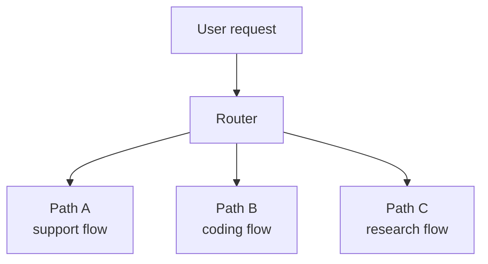
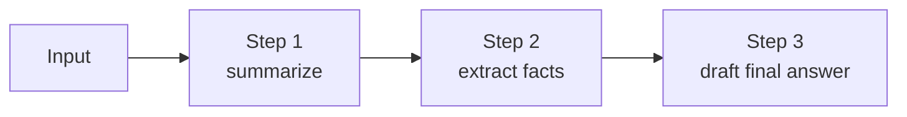
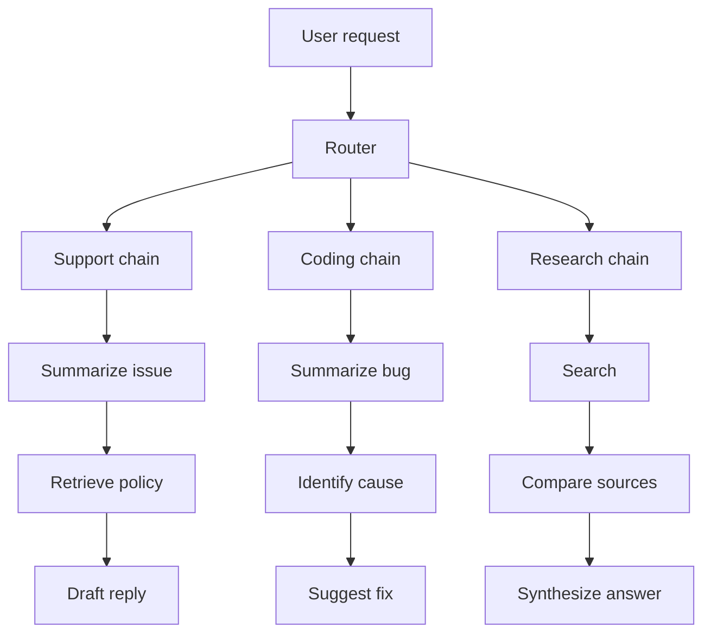
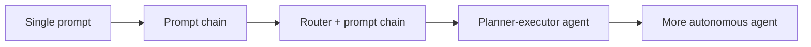

# Routing and Prompt Chaining

<div class="topic-page" markdown="1">

<section class="topic-hero">
  <span class="topic-hero__eyebrow">Stage 08 - Agent Architectures</span>
  <p class="topic-hero__lead">Routing and prompt chaining are two simple architecture patterns that help AI agents solve tasks in a controlled way. Routing chooses the right path for a request. Prompt chaining breaks one larger task into smaller prompt steps. Together they often solve problems more cleanly than one giant prompt or a fully autonomous agent.</p>
  <div class="topic-hero__facts">
    <span>Choose path</span>
    <span>Break steps</span>
    <span>Control cost</span>
    <span>Improve quality</span>
    <span>Easier debugging</span>
  </div>
</section>

## Goal

Understand how routing and prompt chaining work in agent architectures and when to use them instead of a single prompt or a more autonomous agent loop.

After this lesson, you should be able to explain:

- what routing means in AI agents,
- what prompt chaining means,
- how routing and chaining are different,
- when a simple chain is enough,
- when a router should choose between multiple paths,
- what benefits and risks these patterns have,
- how to design beginner-friendly routing and chaining workflows.

## Before You Start

Start with one simple idea:

```text
Routing chooses where the task should go.
Prompt chaining decides the order of small steps inside the task.
```

Beginner example:

```text
User asks:
  "Summarize this bug report and draft a reply."

Routing:
  Send this request to the support workflow, not the coding workflow.

Prompt chain:
  Step 1: summarize the bug
  Step 2: identify the main problem
  Step 3: draft the reply
```

These patterns are useful because they replace one big vague prompt with a clearer workflow.

### Key Words In Plain English

| Word | Simple Meaning | Beginner Example |
| --- | --- | --- |
| Routing | Choosing the right path or tool for a request | send billing questions to billing flow |
| Prompt chain | A sequence of prompt steps | summarize -> extract -> answer |
| Workflow | A fixed sequence of steps | always run step 1, 2, 3 |
| Branch | One possible route in a router | coding branch, support branch, research branch |
| Classifier | A small model or rule that labels a request | detect if user wants search or scheduling |
| Orchestrator | The app logic that runs the workflow | backend decides next step |
| Intermediate result | Output from one step used by the next | summary passed into final answer |
| Fallback | Backup path when the first path fails | ask user to clarify |

## Learning Path

This topic is designed in four parts. Read them in order.

<div class="learning-grid learning-grid--path">
  <a class="learning-card" href="#part-1-understand-routing">
    <strong>Part 1 - Understand Routing</strong>
    <span>Learn how an agent chooses the right path, tool, or workflow for a request.</span>
  </a>
  <a class="learning-card" href="#part-2-understand-prompt-chaining">
    <strong>Part 2 - Understand Prompt Chaining</strong>
    <span>Break a larger task into smaller prompt steps that are easier to control.</span>
  </a>
  <a class="learning-card" href="#part-3-combine-routing-and-chaining">
    <strong>Part 3 - Combine Routing And Chaining</strong>
    <span>Use a router to choose the correct workflow, then run the right chain.</span>
  </a>
  <a class="learning-card" href="#part-4-design-safe-and-simple-architectures">
    <strong>Part 4 - Design Safe And Simple Architectures</strong>
    <span>Choose the smallest architecture that solves the problem well.</span>
  </a>
</div>

## Part 1: Understand Routing

Routing means deciding which path a request should take.

Simple definition:

```text
Routing is the step where the system decides:
"Which workflow, tool, model, or specialist should handle this request?"
```

### Simple Routing Picture



**How to read this diagram:** the router does not solve the whole task. It only decides where the task should go next.

### Why Routing Matters

Without routing, every request may go into the same generic workflow.

That can cause:

- unnecessary tool calls,
- wrong workflows,
- higher cost,
- slower answers,
- confusing prompts,
- more failures.

With routing, the system can choose a more suitable path.

| Without Routing | With Routing |
| --- | --- |
| One workflow handles everything | Different workflows handle different tasks |
| More wasted tokens | More targeted prompts |
| Wrong tools may run | Better tool selection |
| Harder debugging | Easier to see which path was used |
| Higher average cost | Better cost control |

### Common Routing Decisions

| Request Type | Possible Route |
| --- | --- |
| Billing question | Billing workflow |
| Coding error | Coding workflow |
| Schedule request | Calendar workflow |
| Search request | Search/RAG workflow |
| General chat | Direct answer workflow |
| High-risk action | Approval workflow |

### How Routing Can Work

| Routing Method | How It Decides | Good For |
| --- | --- | --- |
| Rules | `if`/`else`, keywords, regex, metadata | Simple, predictable tasks |
| Small classifier model | Model labels the request type | Moderate complexity |
| LLM router | Stronger model chooses path from descriptions | Flexible but more expensive |
| Human routing | User or operator chooses path | High-risk or ambiguous work |
| Hybrid routing | Rules first, model second | Balanced systems |

### Example: Simple Rule Router

```text
If request contains:
  "invoice", "refund", "billing"
Then:
  billing workflow

If request contains:
  "bug", "error", "stack trace"
Then:
  coding workflow

Else:
  general assistant workflow
```

This is simple and fast, but it can fail when language is ambiguous.

### Example: Router Prompt

```text
Classify the user's request into one category:
- support
- coding
- scheduling
- research
- general

Return only the category name.
```

User request:

```text
Please summarize this stack trace and suggest the next debug step.
```

Router output:

```text
coding
```

The application can then send the task to the coding workflow.

## Part 2: Understand Prompt Chaining

Prompt chaining means splitting one large task into smaller prompt steps.

Simple definition:

```text
Prompt chaining is a workflow where
the output of one prompt step becomes input to the next step.
```

### Simple Prompt Chain Picture



**How to read this diagram:** instead of asking the model to do everything at once, the task is broken into clear smaller steps.

### Why Chaining Matters

One giant prompt often has problems:

- too many instructions,
- mixed goals,
- weak structure,
- harder debugging,
- harder evaluation,
- more prompt drift.

Prompt chaining helps because each step has one job.

| One Big Prompt | Prompt Chain |
| --- | --- |
| Everything mixed together | Each step has one clear purpose |
| Hard to debug | Easy to inspect each step |
| Hard to reuse | Steps can be reused |
| More fragile | More controlled |
| Often bigger prompt | Smaller focused prompts |

### When Chaining Helps

Prompt chaining is useful when a task has clear sub-steps.

Examples:

| Task | Possible Chain |
| --- | --- |
| Summarize a document and answer a question | summarize -> extract relevant facts -> answer |
| Write support reply | classify issue -> retrieve policy -> draft reply |
| Analyze bug report | summarize error -> identify likely cause -> propose next step |
| Research topic | search -> compare sources -> synthesize answer |
| Create report | gather data -> clean data -> explain results |

### Example: Support Reply Chain

User asks:

```text
The customer says they were charged twice. Draft a reply.
```

Prompt chain:

1. Summarize the customer's issue.
2. Extract needed facts: order ID, date, payment method.
3. Retrieve policy or billing rules.
4. Draft a polite reply.

This is easier to control than one prompt like:

```text
Understand the billing problem, extract details, search policy, and draft the final answer in one step.
```

### Chain Design Table

| Step | Goal | Output |
| --- | --- | --- |
| Step 1 | Summarize input | short issue summary |
| Step 2 | Extract fields | structured facts |
| Step 3 | Retrieve support info | policy snippet |
| Step 4 | Draft answer | final reply |

### Chain Risks

Chaining is useful, but it is not free.

| Risk | What Happens |
| --- | --- |
| More model calls | Higher cost |
| More latency | User waits longer |
| Error propagation | Wrong step 1 harms step 2 |
| Overengineering | A simple task gets too many steps |
| State complexity | More intermediate data to manage |

Beginner rule:

```text
Use a chain only when the task is clearer or more reliable as separate steps.
```

## Part 3: Combine Routing And Chaining

Many agent systems use both patterns together.

The usual design is:

```text
1. Route the request to the correct workflow.
2. Run the prompt chain inside that workflow.
```

### Routing + Chaining Architecture



This is often better than one universal chain for every task.

### Example: Learning Assistant

User asks:

```text
Explain dependency injection in simple terms and then quiz me.
```

Possible routing:

| Route | Reason |
| --- | --- |
| General coding explanation flow | Topic is educational and technical |
| Quiz chain | Follow-up requires structured teaching |

Possible chain:

1. Explain dependency injection simply.
2. Give one small example.
3. Ask one quiz question.
4. Evaluate answer and give feedback.

### Router Output Example

Structured router result:

```json
{
  "route": "coding_learning",
  "confidence": 0.93,
  "reason": "User asks for explanation of a software concept and a quiz."
}
```

This lets the app log why a branch was chosen.

### When To Use Routing Without Chaining

Sometimes routing alone is enough.

Example:

```text
User asks:
  "What is the weather in Berlin?"

Router:
  send to weather tool path

No chain needed:
  one tool call + one answer
```

### When To Use Chaining Without Routing

Sometimes every request uses the same fixed workflow.

Example:

```text
Task:
  Always summarize a transcript, extract action items, and draft follow-up email.

Same chain every time:
  no router needed
```

### Decision Table

| Situation | Best Pattern |
| --- | --- |
| Same repeated workflow every time | Prompt chain |
| Different request types need different workflows | Routing |
| Different request types and each needs multiple steps | Routing + prompt chaining |
| Very simple task | Single prompt or direct tool call |
| High uncertainty and many tools | Stronger agent architecture may be needed |

## Part 4: Design Safe And Simple Architectures

Routing and prompt chaining are useful because they give more control than a fully autonomous agent.

For beginners, that is often the right place to start.

### Beginner Architecture Ladder



**How to read this diagram:** move to a more complex architecture only when the simpler one is not enough.

### Why Start Simple

| Simpler Architecture | Benefit |
| --- | --- |
| Single prompt | Lowest complexity |
| Prompt chain | Better control and debugging |
| Router + chain | Better specialization without full agent complexity |

Advanced agent loops are powerful, but they also increase:

- latency,
- cost,
- debugging difficulty,
- safety risk,
- coordination complexity.

### Common Beginner Mistakes

| Mistake | Why It Hurts | Better Choice |
| --- | --- | --- |
| Use one giant prompt for everything | Hard to debug and inconsistent | Split into clear steps |
| Add routing too early | Unneeded complexity | Start with one chain if tasks are similar |
| Add too many chain steps | More cost and latency | Keep only valuable steps |
| Use LLM routing for obvious cases | Slower and more expensive | Use rules first |
| Hide intermediate failures | Hard to fix | Log route and step outputs |
| Route to overlapping workflows | Confusing behavior | Define route boundaries clearly |

### Weak vs Strong Design

<div class="prompt-compare">
  <section>
    <span class="prompt-compare__label prompt-compare__label--bad">Weak</span>
    <pre><code>Use one prompt that classifies the task,
searches documents,
analyzes the result,
writes the answer,
and decides whether to run tools again.</code></pre>
    <p>This mixes too many jobs into one step, which makes the system harder to control and debug.</p>
  </section>
  <section>
    <span class="prompt-compare__label prompt-compare__label--good">Strong</span>
    <pre><code>Step 1: route the request.
Step 2: run the matching workflow.
Step 3: keep each prompt step focused.
Step 4: log each route and intermediate result.</code></pre>
    <p>This separates responsibilities clearly and keeps the architecture easier to reason about.</p>
  </section>
</div>

### Cost And Latency Tradeoff

| Pattern | Cost | Latency | Control | Good For |
| --- | --- | --- | --- | --- |
| Single prompt | Low | Low | Low | very simple tasks |
| Prompt chain | Medium | Medium | Medium to high | fixed multi-step tasks |
| Router + chain | Medium to high | Medium to high | High | mixed task types |
| Autonomous agent loop | High | High | Lower unless guarded | uncertain complex tasks |

### Debugging Checklist

When routing or chaining behaves badly, inspect:

- Did the router choose the correct path?
- Were route descriptions too vague?
- Was a rule enough instead of a model router?
- Did one chain step have more than one job?
- Did a bad intermediate result pollute later steps?
- Did the chain add cost without improving quality?
- Could two steps be merged safely?
- Could one big step be split more clearly?

## Summary

Routing and prompt chaining are practical architecture patterns for building controlled AI systems.

Core rules:

```text
Routing decides where the task goes.
Prompt chaining decides what order the steps run in.
Use both only when they add clarity, reliability, or specialization.
```

Beginner shortcut:

```text
If all requests use the same workflow:
  use a chain.

If different requests need different workflows:
  use routing.

If each route has several steps:
  use routing plus chaining.
```

## Practice

Design a routing and chaining workflow for this assistant:

```text
Assistant:
  Developer productivity assistant

Possible tasks:
  - summarize meeting notes
  - explain code errors
  - schedule follow-up meetings
  - draft status updates
```

Fill this table:

| Request Type | Route | Chain Steps |
| --- | --- | --- |
| Meeting summary | note_summary | summarize -> extract action items -> draft recap |
| Code error | coding_help | summarize error -> identify cause -> suggest next debug step |
| Scheduling | calendar_flow | extract date/time -> check preferences -> draft schedule |
| Status update | update_flow | collect facts -> organize -> draft message |

Then answer:

1. Which route can use simple rules?
2. Which route may need model-based routing?
3. Which chain step is most likely to fail?
4. Which route needs human approval before sending or scheduling?
5. Which requests are simple enough for one prompt?

## Mini Project

Build a small router-plus-chain prototype.

It should support:

- classify request into one route,
- run the correct prompt chain,
- save intermediate results,
- stop if a required step fails,
- log the chosen route,
- log total model calls and step latency.

Suggested pseudo-structure:

```python
def route_request(user_message):
    if "meeting" in user_message:
        return "calendar"
    if "bug" in user_message or "error" in user_message:
        return "coding"
    if "summary" in user_message:
        return "summary"
    return "general"

def run_chain(route, user_message):
    if route == "coding":
        summary = step_summarize_error(user_message)
        cause = step_identify_cause(summary)
        return step_suggest_fix(cause)
    if route == "calendar":
        details = step_extract_schedule_details(user_message)
        return step_draft_schedule(details)
    return direct_answer(user_message)
```

Test cases:

1. A clear billing request.
2. A clear coding error request.
3. An ambiguous request that needs clarification.
4. A scheduling request that needs user approval.
5. A simple request that should skip chaining.

## Exit Criteria

You are ready to move on when you can:

- explain routing in plain English,
- explain prompt chaining in plain English,
- distinguish routing from chaining,
- choose between single prompt, chain, or router-plus-chain,
- design a simple route table,
- design a basic prompt chain,
- explain the cost and latency tradeoffs,
- identify common beginner mistakes,
- debug a bad route or a broken chain step.

## Resources

- [Agent Loop](../../04-agent-fundamentals/agent-loop/index.md)
- [Reasoning and Planning](../../04-agent-fundamentals/reasoning-and-planning/index.md)
- [Stopping Criteria](../../04-agent-fundamentals/stopping-criteria/index.md)
- [Function Calling](../../05-tools-and-actions/function-calling/index.md)
- [RAG Basics](../../02-llm-fundamentals/rag-basics/index.md)
- [User Profile Storage](../../07-rag-and-memory/user-profile-storage/index.md)

</div>
