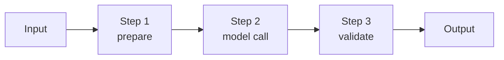
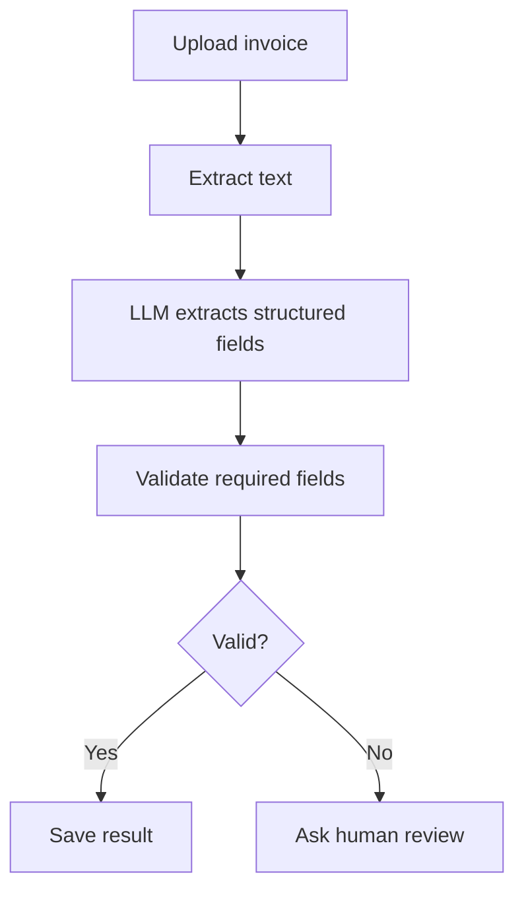
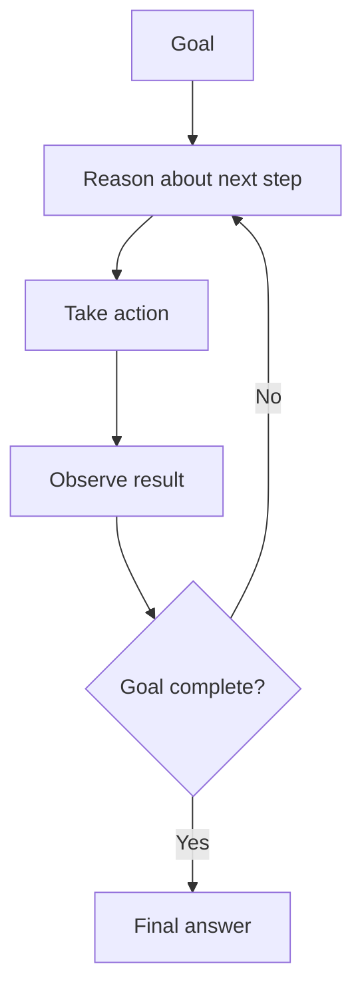
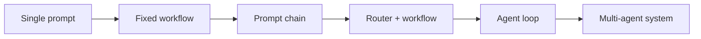
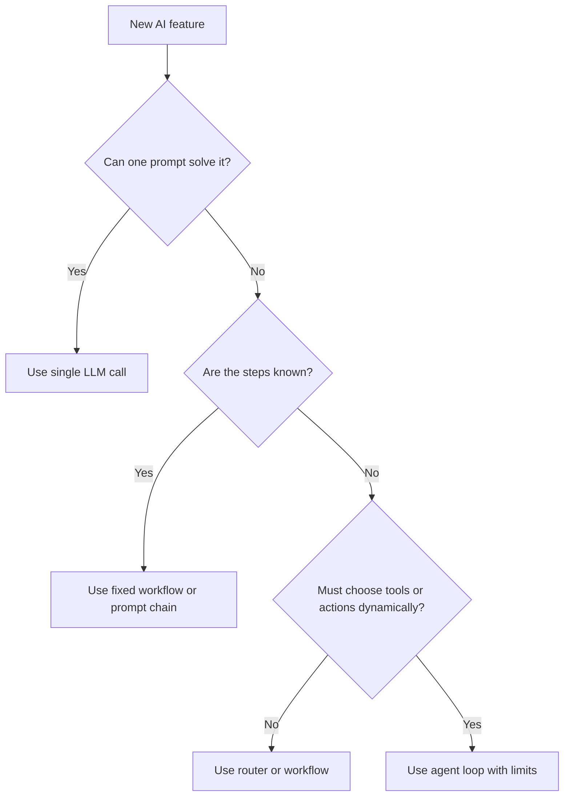
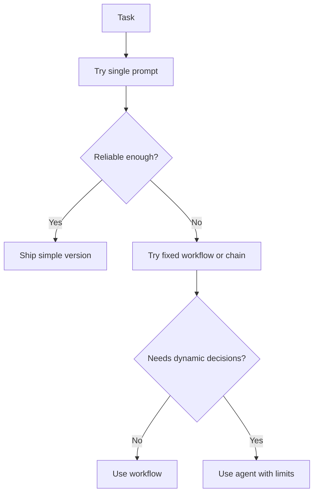

# When A Simpler Workflow Is Better Than An Agent

<div class="topic-page" markdown="1">

<section class="topic-hero">
  <span class="topic-hero__eyebrow">Stage 08 - Agent Architectures</span>
  <p class="topic-hero__lead">A full AI agent is not always the best architecture. Many useful AI systems should be a single model call, a fixed workflow, a prompt chain, or a small tool workflow. Simpler workflows are easier to test, cheaper to run, faster for users, and safer to operate.</p>
  <div class="topic-hero__facts">
    <span>Start simple</span>
    <span>Fixed steps</span>
    <span>Lower cost</span>
    <span>Less risk</span>
    <span>Easier testing</span>
  </div>
</section>

## Goal

Understand when a simple workflow is better than a full agent architecture.

After this lesson, you should be able to explain:

- what a simple workflow is,
- what makes an AI system an agent,
- why full agents are not always needed,
- when a single model call is enough,
- when a fixed workflow is better,
- when an agent is actually useful,
- how to choose the smallest architecture that solves the task.

## Quick Summary

Use this table first. It gives the short version.

| User Task | Better Architecture | Why |
| --- | --- | --- |
| Rewrite this email | Single LLM call | No tools or planning needed |
| Extract fields from an invoice | Fixed workflow | Same steps every time |
| Summarize docs with citations | RAG workflow | Retrieve, answer, cite |
| Draft support reply from policy | Prompt chain | Predictable multi-step task |
| Debug unknown production issue | Agent loop | Needs investigation and tool use |
| Plan and execute many uncertain steps | Agent | Next action depends on observations |

Beginner rule:

```text
Use the simplest architecture that reliably solves the task.
Only use an agent when the system must decide what to do next.
```

## Before You Start

Start with one simple idea:

```text
An agent is useful when the next step is uncertain.
A workflow is better when the steps are already known.
```

Example:

```text
Known steps:
  receive document -> extract fields -> validate -> save result
  Use a workflow.

Unknown steps:
  investigate failing deployment -> inspect logs -> choose next tool -> retry
  Use an agent or agent-like loop.
```

### Key Words In Plain English

| Word | Simple Meaning | Beginner Example |
| --- | --- | --- |
| Single LLM call | One prompt, one answer | summarize this paragraph |
| Workflow | Fixed sequence of steps | extract -> validate -> store |
| Prompt chain | Several model calls in order | summarize -> classify -> draft |
| Router | Chooses one path from several | billing path or coding path |
| Agent | System that decides next actions from observations | search, inspect, retry, stop |
| Autonomy | How much the system chooses by itself | agent chooses next tool |
| Control | How predictable the system is | workflow follows fixed steps |
| Overbuilding | Using a complex agent where a simpler workflow works | agent for simple formatting |

## Learning Path

This topic is designed in four parts. Read them in order.

<div class="learning-grid learning-grid--path">
  <a class="learning-card" href="#part-1-understand-simple-workflows">
    <strong>Part 1 - Understand Simple Workflows</strong>
    <span>Learn what simple workflows are and why they are often enough.</span>
  </a>
  <a class="learning-card" href="#part-2-understand-when-agents-help">
    <strong>Part 2 - Understand When Agents Help</strong>
    <span>Identify tasks where autonomous next-step decisions are actually useful.</span>
  </a>
  <a class="learning-card" href="#part-3-compare-workflows-and-agents">
    <strong>Part 3 - Compare Workflows And Agents</strong>
    <span>Compare cost, latency, reliability, testing, and safety tradeoffs.</span>
  </a>
  <a class="learning-card" href="#part-4-design-the-smallest-good-architecture">
    <strong>Part 4 - Design The Smallest Good Architecture</strong>
    <span>Use decision rules, examples, and checklists to choose the right pattern.</span>
  </a>
</div>

## Part 1: Understand Simple Workflows

A simple workflow is a predictable sequence of steps.

Simple definition:

```text
A simple workflow is an AI system where the application controls the steps,
instead of letting the model decide every next action.
```

### Simple Workflow Picture



**How to read this diagram:** the application knows the steps ahead of time. The model may help inside one step, but it does not control the whole process.

### Common Simple Patterns

| Pattern | Shape | Example |
| --- | --- | --- |
| Single prompt | input -> model -> output | rewrite an email |
| Tool then model | fetch data -> model summarizes | weather answer |
| Model then tool | model extracts JSON -> app saves | form processing |
| Prompt chain | model step 1 -> model step 2 | summarize then draft |
| RAG workflow | retrieve docs -> answer with citations | docs assistant |
| Router workflow | classify -> choose path | support or billing |

### Why Simple Workflows Are Useful

| Benefit | Explanation |
| --- | --- |
| Lower cost | Fewer model calls and tool calls |
| Lower latency | Fewer steps means faster responses |
| Easier testing | Expected steps are known |
| Easier debugging | You can inspect each step |
| Safer behavior | The model has less freedom to take risky actions |
| Better reliability | Fixed workflows are more predictable |

### Example: Invoice Extraction

Task:

```text
Read an invoice PDF and extract invoice number, date, vendor, and total.
```

Good simple workflow:



This does not need a full agent because the steps are known.

## Part 2: Understand When Agents Help

An agent is useful when the system must decide what to do next after seeing new information.

Simple definition:

```text
An agent observes the current state,
chooses the next action,
uses tools if needed,
then decides whether to continue or stop.
```

### Agent Loop Picture



### When Agents Are Worth It

Use an agent when:

- the steps are not known ahead of time,
- the next action depends on tool results,
- the task may require retries or investigation,
- the system must choose between several tools,
- the problem is open-ended,
- stopping criteria are important,
- a fixed workflow would fail too often.

Example:

```text
Goal:
  Find why the deployment failed.

Possible next steps:
  inspect CI logs
  search recent commits
  run tests
  compare configs
  ask user for missing credentials
```

The best next step depends on what the agent observes.

### When Agents Are Not Worth It

Do not start with an agent when:

- the task has fixed steps,
- the output format is predictable,
- no tools are needed,
- the action is high-risk and should be explicit,
- latency must be very low,
- the model would only add unnecessary decisions.

Beginner rule:

```text
If you can draw the whole workflow before runtime,
you probably do not need a full agent.
```

## Part 3: Compare Workflows And Agents

The main difference is control.

### Architecture Ladder



**How to read this diagram:** complexity increases from left to right. Move right only when the simpler option is not enough.

### Tradeoff Table

| Architecture | Cost | Latency | Control | Flexibility | Best For |
| --- | --- | --- | --- | --- | --- |
| Single prompt | low | low | medium | low | simple language tasks |
| Fixed workflow | low to medium | low to medium | high | low | known business processes |
| Prompt chain | medium | medium | high | medium | structured multi-step tasks |
| Router + workflow | medium | medium | high | medium | mixed request types |
| Agent loop | high | high | medium | high | uncertain tool-using tasks |
| Multi-agent system | very high | high | harder | very high | specialized collaboration |

### Decision Chart



### Common Examples

| Task | Recommended Starting Point | Reason |
| --- | --- | --- |
| Translate text | Single prompt | One clear transformation |
| Summarize transcript | Prompt chain | summarize, extract action items, draft recap |
| Answer from docs | RAG workflow | retrieve then answer |
| Process support ticket | Router + workflow | route billing, bug, or account issue |
| Fix unknown code bug | Agent loop | must inspect, act, observe, retry |
| Buy items online | Human-approved workflow | risky action needs control |

## Part 4: Design The Smallest Good Architecture

The smallest good architecture is the simplest design that meets quality, safety, and product requirements.

### Beginner Design Recipe

```text
1. Write the user task.
2. List the required steps.
3. Ask if the steps are known before runtime.
4. Ask if tools are needed.
5. Ask if the model must choose the next action.
6. Start with the simplest architecture that passes tests.
7. Add agent behavior only where it improves results.
```

### Simple Architecture Checklist

| Question | If Yes | If No |
| --- | --- | --- |
| Can one prompt solve it? | use single prompt | continue |
| Are the steps fixed? | use workflow | continue |
| Are there multiple known paths? | use router | continue |
| Does it need retrieved knowledge? | use RAG workflow | continue |
| Does it need dynamic tool choice? | use agent | avoid agent |
| Is the action risky? | require approval | proceed with normal flow |

### Weak vs Strong Design

<div class="prompt-compare">
  <section>
    <span class="prompt-compare__label prompt-compare__label--bad">Weak</span>
    <pre><code>Build an autonomous agent.
Give it all tools.
Let it decide how to solve every request.
Stop when it thinks it is done.</code></pre>
    <p>This is expensive, harder to test, and risky when the task has known steps.</p>
  </section>
  <section>
    <span class="prompt-compare__label prompt-compare__label--good">Strong</span>
    <pre><code>Use a fixed workflow for known steps.
Use a router for known request types.
Use an agent only for uncertain investigation.
Set tool, time, and approval limits.</code></pre>
    <p>This keeps the system predictable while still allowing agent behavior where it is useful.</p>
  </section>
</div>

### Safe Limits For Agent Use

If you do use an agent, add limits.

| Limit | Example |
| --- | --- |
| Max iterations | stop after 6 loops |
| Max tool calls | stop after 10 tool calls |
| Max runtime | stop after 30 seconds |
| Max cost | stop after budget is reached |
| Approval gate | ask before sending, deleting, buying, or deploying |
| No-progress rule | stop if same action repeats |

### Summary Figure



## Summary

Use this summary to remember the whole topic.

| Idea | Simple Meaning |
| --- | --- |
| Simpler workflow | App controls known steps |
| Agent | Model helps choose next actions |
| Main benefit of workflow | predictable, testable, cheaper |
| Main benefit of agent | handles uncertainty and changing observations |
| Main risk of agent | cost, latency, safety, debugging complexity |

Core rule:

```text
Start with a workflow.
Move to an agent only when the workflow cannot handle uncertainty.
```

## Practice

Choose the best architecture for each task.

| Task | Single Prompt | Workflow | Agent | Reason |
| --- | --- | --- | --- | --- |
| Rewrite email politely |  |  |  |  |
| Extract invoice fields |  |  |  |  |
| Answer docs question with citations |  |  |  |  |
| Investigate failing tests |  |  |  |  |
| Draft and send customer refund |  |  |  |  |

Starter answers:

| Task | Better Choice | Why |
| --- | --- | --- |
| Rewrite email politely | Single prompt | one language transformation |
| Extract invoice fields | Workflow | known extract and validate steps |
| Answer docs question | RAG workflow | retrieval is needed |
| Investigate failing tests | Agent | next step depends on observations |
| Send refund | Human-approved workflow | high-risk action |

## Mini Project

Design a simple architecture decision helper.

It should ask:

- Is the task a simple text transformation?
- Are the steps known ahead of time?
- Does the task need retrieved knowledge?
- Does the model need to choose tools dynamically?
- Is any action risky?
- What are the cost and latency limits?

Suggested output:

```json
{
  "recommended_architecture": "fixed_workflow",
  "reason": "The steps are known and no dynamic tool choice is needed.",
  "steps": [
    "extract text",
    "classify document",
    "extract fields",
    "validate schema",
    "return result"
  ],
  "agent_needed": false
}
```

## Exit Criteria

You are ready to move on when you can:

- explain why simpler workflows are often better than agents,
- distinguish single prompt, workflow, prompt chain, router, and agent loop,
- identify tasks that do not need agents,
- identify tasks where agents are useful,
- compare cost, latency, control, and flexibility,
- choose the smallest architecture that solves the task,
- add limits when an agent is needed,
- explain the risk of overbuilding AI systems.

## Resources

- [Routing and Prompt Chaining](../routing-and-prompt-chaining/index.md)
- [DAG Agents and Tree-of-Thought Patterns](../dag-agent-tree-of-throght-pattern/index.md)
- [Planner-Executor Workflows](../planner-executor/index.md)
- [Evaluator-Optimizer Loops](../evaluator-optimizer-loops/index.md)
- [Agent Loop](../../04-agent-fundamentals/agent-loop/index.md)
- [Stopping Criteria](../../04-agent-fundamentals/stopping-criteria/index.md)
- [Pricing and Latency](../../02-llm-fundamentals/pricing-and-latency/index.md)

</div>
