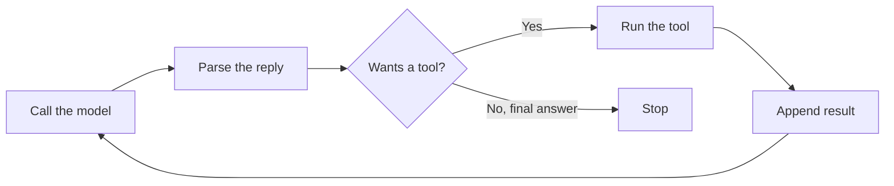

# Building an Agent Loop From Scratch

<div class="topic-page" markdown="1">

<section class="topic-hero">
  <span class="topic-hero__eyebrow">Stage 09 - Building Agents</span>
  <p class="topic-hero__lead">An agent loop is the <code>while</code> loop that turns a single model call into an agent: call the model, read what it wants, act, feed the result back, and repeat until the task is done. Writing one yourself — with no framework — is the fastest way to understand what every framework is doing underneath.</p>
  <div class="topic-hero__facts">
    <span>Call</span>
    <span>Parse</span>
    <span>Act</span>
    <span>Observe</span>
    <span>Stop</span>
  </div>
</section>

## Goal

By the end of this topic, you should be able to:

- Turn the agent-loop *concept* from Stage 04 into working code.
- Write a minimal conversation loop against a real LLM API.
- Extend it into a tool-using agentic loop that runs until the model is done.
- Add stop conditions and guardrails so the loop cannot run forever.
- Explain exactly which part of this loop a framework would replace.

## Learning Path

This page builds one loop, step by step. Read the parts in order.

<div class="learning-grid learning-grid--path">
  <a class="learning-card" href="#part-1-from-concept-to-code">
    <strong>Part 1 - From Concept to Code</strong>
    <span>Map the Stage 04 loop onto a concrete program.</span>
  </a>
  <a class="learning-card" href="#part-2-the-minimal-loop">
    <strong>Part 2 - The Minimal Loop</strong>
    <span>A multi-turn conversation loop with no tools yet.</span>
  </a>
  <a class="learning-card" href="#part-3-adding-tool-use">
    <strong>Part 3 - Adding Tool Use</strong>
    <span>React to <code>tool_use</code> and feed results back.</span>
  </a>
  <a class="learning-card" href="#part-4-stop-conditions-and-guardrails">
    <strong>Part 4 - Stop Conditions and Guardrails</strong>
    <span>Step limits, budgets, and safe failure.</span>
  </a>
  <a class="learning-card" href="#part-5-the-full-loop">
    <strong>Part 5 - The Full Loop</strong>
    <span>One annotated, runnable agent loop.</span>
  </a>
</div>

## Part 1: From Concept to Code

In [Stage 04](../../04-agent-fundamentals/agent-loop/index.md) you learned the agent loop as an idea: **perceive → plan → act → observe → repeat until stop**. This page implements that idea with real API calls and no framework.

The whole loop is small. In plain terms:

```text
1. Send the conversation to the model.
2. Read the reply.
3. If the model wants to use a tool, run it and add the result to the conversation.
4. Otherwise, the model gave a final answer: stop.
5. Go back to step 1.
```



Everything else a framework gives you — retries, memory, tracing, parallel tools — is built *around* this loop, not instead of it.

!!! note "What this page is not"
    This page is about the **control loop**. Reading the response object in detail is covered in [Parsing model output](../parsing-model-output/index.md), robust failure handling in [Error and rate-limit handling](../error-and-rate-limit-handling/index.md), and tool design in [Stage 05](../../05-tools-and-actions/tool-definition/index.md). Here we keep those parts deliberately simple so the loop stays visible.

## Part 2: The Minimal Loop

Start with the simplest possible loop: a multi-turn conversation, no tools. The key fact is that the API is **stateless** — you resend the whole conversation every turn.

```python
import anthropic

client = anthropic.Anthropic()  # reads ANTHROPIC_API_KEY from the environment
MODEL = "claude-opus-4-8"

messages = []

while True:
    user_input = input("you> ")
    if user_input.strip() in {"exit", "quit"}:
        break

    # 1. Add the user's turn and resend the whole history.
    messages.append({"role": "user", "content": user_input})

    response = client.messages.create(
        model=MODEL,
        max_tokens=1024,
        messages=messages,
    )

    # 2. The reply is a list of content blocks; pull out the text.
    reply = next((b.text for b in response.content if b.type == "text"), "")
    print(f"agent> {reply}")

    # 3. Append the assistant turn so the next request has full context.
    messages.append({"role": "assistant", "content": reply})
```

??? note "OpenAI equivalent"
    ```python
    from openai import OpenAI

    client = OpenAI()  # reads OPENAI_API_KEY from the environment
    MODEL = "gpt-4o"
    messages = []

    while True:
        user_input = input("you> ")
        if user_input.strip() in {"exit", "quit"}:
            break
        messages.append({"role": "user", "content": user_input})

        response = client.chat.completions.create(model=MODEL, messages=messages)
        reply = response.choices[0].message.content   # the reply is a plain string here
        print(f"agent> {reply}")
        messages.append({"role": "assistant", "content": reply})
    ```

Two things to notice:

- `response.content` is a **list of blocks**, not a string. You select the text block rather than printing the whole object.
- You append the assistant's reply back into `messages`. Skip that, and the model forgets everything it just said.

This is already a working chatbot. It is not yet an *agent*, because it cannot take actions — it can only talk.

## Part 3: Adding Tool Use

An agent becomes an agent when it can **act**. You give the model tool definitions; when it decides to use one, the reply's `stop_reason` is `"tool_use"` instead of `"end_turn"`. Your code runs the tool and sends the result back, then the model continues.

First, a tool definition and the function that actually runs it (tool *design* is [Stage 05](../../05-tools-and-actions/tool-definition/index.md); here it is just a stand-in):

```python
tools = [{
    "name": "get_weather",
    "description": "Get the current weather for a city. Use when the user asks about weather.",
    "input_schema": {
        "type": "object",
        "properties": {"city": {"type": "string"}},
        "required": ["city"],
    },
}]

def run_tool(name, tool_input):
    if name == "get_weather":
        return f"18°C and clear in {tool_input['city']}."
    return f"Unknown tool: {name}"
```

Now the agentic loop. The structure is: call → if the model wants tools, run them and loop again → otherwise stop.

```python
messages = [{"role": "user", "content": "What's the weather in Paris?"}]

while True:
    response = client.messages.create(
        model=MODEL,
        max_tokens=1024,
        tools=tools,
        messages=messages,
    )

    # The model gave a final answer — we're done.
    if response.stop_reason == "end_turn":
        break

    # Otherwise it asked for one or more tools.
    tool_uses = [b for b in response.content if b.type == "tool_use"]

    # Append the assistant turn *including* the tool_use blocks.
    messages.append({"role": "assistant", "content": response.content})

    # Run each tool and collect the results.
    results = []
    for call in tool_uses:
        output = run_tool(call.name, call.input)
        results.append({
            "type": "tool_result",
            "tool_use_id": call.id,   # must match the tool_use block
            "content": output,
        })

    # Send the results back as the next user turn.
    messages.append({"role": "user", "content": results})

final = next(b.text for b in response.content if b.type == "text")
print(final)
```

??? note "OpenAI equivalent"
    ```python
    import json

    tools = [{
        "type": "function",
        "function": {
            "name": "get_weather",
            "description": "Get the current weather for a city.",
            "parameters": {
                "type": "object",
                "properties": {"city": {"type": "string"}},
                "required": ["city"],
            },
        },
    }]

    messages = [{"role": "user", "content": "What's the weather in Paris?"}]

    while True:
        response = client.chat.completions.create(model=MODEL, messages=messages, tools=tools)
        msg = response.choices[0].message

        if response.choices[0].finish_reason != "tool_calls":
            break

        messages.append(msg)  # assistant turn, including its tool_calls
        for call in msg.tool_calls:
            args = json.loads(call.function.arguments)   # OpenAI args are a JSON string
            output = run_tool(call.function.name, args)
            messages.append({
                "role": "tool",
                "tool_call_id": call.id,
                "content": output,
            })

    print(response.choices[0].message.content)
    ```
    Differences from Claude: tool calls live on `message.tool_calls`, `arguments` arrive as a **JSON string** you must `json.loads`, results go back as messages with `role: "tool"`, and you loop until `finish_reason != "tool_calls"`.

The three rules that make this work:

| Rule | Why it matters |
| --- | --- |
| Append `response.content` verbatim | The `tool_use` blocks must stay in history, or the model loses track of what it asked for. |
| Each `tool_result` carries the matching `tool_use_id` | This is how the model pairs a result with its request. |
| Loop until `stop_reason == "end_turn"` | The model may need several tool rounds before it can answer. |

!!! warning "Trust the result, not your guess"
    Send back what the tool actually returned. If a tool fails, return the error text (and mark it as an error) instead of pretending it succeeded — the model can recover from a real error but not from a fabricated success. Tool-result error handling is covered in [Stage 05](../../05-tools-and-actions/tool-error-handling/index.md).

## Part 4: Stop Conditions and Guardrails

The loop above has a dangerous flaw: if the model keeps asking for tools, it **never stops**. Every real agent loop needs limits. The cheapest and most important one is a step cap.

```python
MAX_STEPS = 8

for step in range(MAX_STEPS):
    response = client.messages.create(
        model=MODEL, max_tokens=1024, tools=tools, messages=messages,
    )
    if response.stop_reason == "end_turn":
        break
    # ... run tools, append results ...
else:
    # The for-loop finished without breaking: we hit the cap.
    print("Stopped: reached the step limit without a final answer.")
```

Stage 04 listed the stop conditions every loop should consider. In code they become concrete checks:

| Stop condition | How you implement it |
| --- | --- |
| Goal satisfied | `stop_reason == "end_turn"` |
| Max steps reached | A loop counter, as above |
| Cost/token budget | Sum `response.usage` tokens; stop past a threshold |
| Repeated failure | Detect the same tool failing twice; stop or change approach |
| Unsafe action | Require approval before running a destructive tool |

Two more guardrails worth adding early:

- **A token/cost budget.** Each response carries `response.usage`; accumulate it and stop when the run gets too expensive.
- **Approval for risky tools.** Before running a tool that writes, sends, or deletes, pause and ask. Read-only tools can run freely.

A loop without a stop rule is the single most common way a from-scratch agent goes wrong — it burns tokens in circles. Treat the step cap as mandatory, not optional.

## Part 5: The Full Loop

Putting Parts 2–4 together gives a complete, framework-free agent in about 40 lines.

```python
import anthropic

client = anthropic.Anthropic()
MODEL = "claude-opus-4-8"
MAX_STEPS = 8

tools = [{
    "name": "get_weather",
    "description": "Get the current weather for a city. Use when the user asks about weather.",
    "input_schema": {
        "type": "object",
        "properties": {"city": {"type": "string"}},
        "required": ["city"],
    },
}]

def run_tool(name, tool_input):
    if name == "get_weather":
        return f"18°C and clear in {tool_input['city']}."
    return f"Unknown tool: {name}"

def run_agent(goal: str) -> str:
    messages = [{"role": "user", "content": goal}]

    for step in range(MAX_STEPS):
        response = client.messages.create(
            model=MODEL, max_tokens=1024, tools=tools, messages=messages,
        )

        if response.stop_reason == "end_turn":
            return next(b.text for b in response.content if b.type == "text")

        tool_uses = [b for b in response.content if b.type == "tool_use"]
        messages.append({"role": "assistant", "content": response.content})

        results = []
        for call in tool_uses:
            output = run_tool(call.name, call.input)
            results.append({
                "type": "tool_result",
                "tool_use_id": call.id,
                "content": output,
            })
        messages.append({"role": "user", "content": results})

    return "Stopped: reached the step limit without a final answer."

print(run_agent("What's the weather in Paris, and should I take a jacket?"))
```

??? note "OpenAI equivalent (full loop)"
    ```python
    import json
    from openai import OpenAI

    client = OpenAI()
    MODEL = "gpt-4o"
    MAX_STEPS = 8

    tools = [{
        "type": "function",
        "function": {
            "name": "get_weather",
            "description": "Get the current weather for a city.",
            "parameters": {
                "type": "object",
                "properties": {"city": {"type": "string"}},
                "required": ["city"],
            },
        },
    }]

    def run_tool(name, args):
        if name == "get_weather":
            return f"18°C and clear in {args['city']}."
        return f"Unknown tool: {name}"

    def run_agent(goal: str) -> str:
        messages = [{"role": "user", "content": goal}]
        for _ in range(MAX_STEPS):
            response = client.chat.completions.create(model=MODEL, messages=messages, tools=tools)
            msg = response.choices[0].message
            if response.choices[0].finish_reason != "tool_calls":
                return msg.content
            messages.append(msg)
            for call in msg.tool_calls:
                args = json.loads(call.function.arguments)
                messages.append({
                    "role": "tool",
                    "tool_call_id": call.id,
                    "content": run_tool(call.function.name, args),
                })
        return "Stopped: reached the step limit without a final answer."

    print(run_agent("What's the weather in Paris, and should I take a jacket?"))
    ```

That is the whole thing. When you adopt a framework later, this is the loop it runs for you — the value it adds is everything *around* it (tracing, retries, memory, parallel tools), not the loop itself.

## Common Misunderstandings

| Misunderstanding | Correction |
| --- | --- |
| You need a framework to build an agent | The core loop is ~40 lines. Frameworks add convenience, not the loop. |
| The API remembers the conversation | It is stateless — you resend the full `messages` list every call. |
| The reply is a string | It is a list of content blocks; text and tool calls are separate blocks. |
| The loop ends when the model returns text | It ends on `stop_reason == "end_turn"`; a `tool_use` turn can also contain text. |
| A step cap is optional | Without it, a tool-happy model can loop forever and burn budget. |

## Practice

### Exercise 1: Trace the Loop

For the goal *"What's the weather in Paris?"*, write out the `messages` list after each step: the user goal, the assistant `tool_use`, the `tool_result`, and the final assistant answer.

### Exercise 2: Add a Second Tool

Add a `get_forecast(city, days)` tool to the full loop. Confirm the model can call `get_weather` and `get_forecast` in the same run and that each `tool_result` uses the correct `tool_use_id`.

### Exercise 3: Break the Loop on Purpose

Make `run_tool` always return `"Service unavailable"`. Watch the agent loop until the step cap. Then add a rule: if the same tool fails twice, stop early and report the failure.

## Mini Project

Build a small **"repo question" agent** from scratch (no framework):

- one read-only tool, `read_file(path)`, that returns a file's contents
- a loop that lets the agent read up to `MAX_STEPS` files to answer a question about a small project
- a step cap and a token budget using `response.usage`
- a final answer that cites which files it read

The goal is a single file you fully understand — every line of the loop should be one you could explain.

## Exit Criteria

You understand this topic when you can:

- Map perceive/act/observe/stop onto concrete lines of code.
- Write a stateless multi-turn conversation loop.
- React to `stop_reason == "tool_use"` and feed `tool_result` blocks back with matching IDs.
- Add a step cap and at least one other stop condition.
- Explain which part of the loop a framework replaces and which parts it wraps.

## Resources

- [roadmap.sh: AI Agents Roadmap](https://roadmap.sh/ai-agents)
- [Anthropic: Building Effective Agents](https://www.anthropic.com/engineering/building-effective-agents)
- [Anthropic Docs: Tool use overview](https://platform.claude.com/docs/en/agents-and-tools/tool-use/overview)
- [Anthropic Docs: Handling stop reasons](https://platform.claude.com/docs/en/build-with-claude/handling-stop-reasons)
- [Stage 04: Agent Loop (the concept)](../../04-agent-fundamentals/agent-loop/index.md)

</div>
