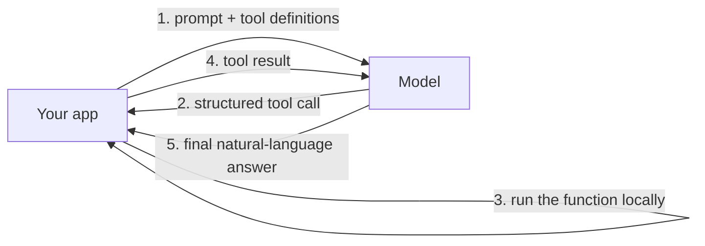

# Provider-Native Function Calling and Tool Use

<div class="topic-page" markdown="1">

<section class="topic-hero">
  <span class="topic-hero__eyebrow">Stage 09 - Building Agents</span>
  <p class="topic-hero__lead">Modern models can emit a structured, machine-readable tool call instead of plain text. The provider builds this into the model and the API, so the model returns clean JSON arguments your code can run — no regex parsing of prose required. This is what "provider-native" function calling means.</p>
  <div class="topic-hero__facts">
    <span>Declare</span>
    <span>Detect</span>
    <span>Execute</span>
    <span>Synthesize</span>
  </div>
</section>

## Goal

By the end of this topic, you should be able to:

- Explain what "provider-native" function calling is and how it differs from prompting a model to "reply in JSON".
- Trace the declare → detect → execute → synthesize loop.
- Recognize how the major providers expose the same capability under different names.
- Say why native tool calling is more reliable than legacy prompt engineering.

## Learning Path

<div class="learning-grid learning-grid--path">
  <a class="learning-card" href="#part-1-what-provider-native-means">
    <strong>Part 1 - What Provider-Native Means</strong>
    <span>Structured tool calls baked into the model and API.</span>
  </a>
  <a class="learning-card" href="#part-2-the-call-loop">
    <strong>Part 2 - The Call Loop</strong>
    <span>Declare, detect, execute, synthesize.</span>
  </a>
  <a class="learning-card" href="#part-3-across-providers">
    <strong>Part 3 - Across Providers</strong>
    <span>The same capability in OpenAI, Anthropic, and Google.</span>
  </a>
  <a class="learning-card" href="#part-4-why-it-beats-prompt-engineering">
    <strong>Part 4 - Why It Beats Prompt Engineering</strong>
    <span>Latency, valid JSON, and parallel calls.</span>
  </a>
</div>

## Part 1: What Provider-Native Means

A plain language model only produces text. To make it *act*, you give it tools. **Provider-native function calling** is the capability — trained into the model and exposed in the API — to output a structured tool call (a function name plus JSON arguments) instead of a sentence.

Before providers supported this, developers faked it with prompt engineering:

> "You are a computer. Always reply only in JSON like `{"tool": "...", "args": {...}}`."

That works until the model adds a friendly preamble, forgets a closing brace, or invents a field — and your parser breaks. Native function calling removes the guesswork: the API has a dedicated channel for tool calls, and the model is trained to use it.

!!! note "How this fits the stage"
    Writing a good tool *definition* is [Stage 05](../../05-tools-and-actions/tool-definition/index.md). Wiring tool calls into a working loop is [Building an agent loop from scratch](../agent-loop-from-scratch/index.md). This page is about the **native capability itself** — what it is, and how it looks across providers.

## Part 2: The Call Loop

Native function calling runs as a precise loop between your app and the model:



1. **Declare.** You send the prompt plus a list of tools, each described with a JSON Schema (parameters, types, descriptions).
2. **Detect & extract.** If the model decides a tool is needed, it stops writing prose and emits a structured object: the function name and the exact arguments.
3. **Execute & synthesize.** Your app runs the function (or calls the real API), passes the result back, and the model turns that result into a final answer.

In the Anthropic SDK, declaring a tool and reading the native tool call looks like this:

```python
import anthropic

client = anthropic.Anthropic()

tools = [{
    "name": "get_stock_price",
    "description": "Get the real-time price for a ticker symbol. Use when the user asks what a stock is trading at.",
    "input_schema": {
        "type": "object",
        "properties": {"ticker": {"type": "string", "description": "e.g. AAPL, GOOG"}},
        "required": ["ticker"],
    },
}]

response = client.messages.create(
    model="claude-opus-4-8",
    max_tokens=1024,
    tools=tools,
    messages=[{"role": "user", "content": "How much is GOOG trading at right now?"}],
)

for block in response.content:
    if block.type == "tool_use":
        print(block.name)   # "get_stock_price"
        print(block.input)  # {"ticker": "GOOG"} — already a parsed dict
```

The model returns the call as a structured `tool_use` block; `block.input` is **already a parsed object**, not a string you have to repair.

??? note "OpenAI equivalent"
    ```python
    import json
    from openai import OpenAI

    client = OpenAI()
    tools = [{
        "type": "function",
        "function": {
            "name": "get_stock_price",
            "description": "Get the real-time price for a ticker symbol.",
            "parameters": {
                "type": "object",
                "properties": {"ticker": {"type": "string"}},
                "required": ["ticker"],
            },
        },
    }]

    response = client.chat.completions.create(
        model="gpt-4o",
        messages=[{"role": "user", "content": "How much is GOOG trading at right now?"}],
        tools=tools,
        tool_choice="auto",
    )

    for call in response.choices[0].message.tool_calls or []:
        print(call.function.name)                    # "get_stock_price"
        print(json.loads(call.function.arguments))   # {"ticker": "GOOG"}
    ```
    The shape is the same, with one difference: OpenAI returns `tool_calls` whose `arguments` are a **JSON string** you must `json.loads`, whereas Claude's `tool_use` block gives you `input` as a dict directly.

## Part 3: Across Providers

Every major provider exposes the same three-step capability — only the field names differ.

| Provider | You declare with | The model returns | Notable strength |
| --- | --- | --- | --- |
| **Anthropic** | a `tools` block (`input_schema`) | `tool_use` content blocks | Holds up well with large, complex schemas. |
| **OpenAI** | the `tools` parameter | `tool_calls` on the message | `strict: true` mode for guaranteed schema adherence. |
| **Google** | `FunctionDeclaration` / `Tool` | a `functionCall` part | Strong reasoning over complex schemas. |

The lessons carry across all of them:

- You describe tools with **JSON Schema**.
- The model returns a **structured call**, not prose.
- The arguments come back as a **parsed object** — read them directly; never raw-string-match the serialized JSON (escaping varies). Reading these blocks is covered in [Parsing model output](../parsing-model-output/index.md).

## Part 4: Why It Beats Prompt Engineering

Native function calling is not just more convenient — it is measurably more reliable than asking a model to "reply in JSON".

<div class="visual-checklist">
  <div>
    <strong>Legacy prompt-engineered JSON:</strong>
    <ul>
      <li>Wastes tokens on conversational padding before the JSON</li>
      <li>Breaks syntax — missing brackets, trailing commas, stray prose</li>
      <li>One tool at a time, awkwardly</li>
      <li>You write fragile regex to extract it</li>
    </ul>
  </div>
  <div>
    <strong>Provider-native function calling:</strong>
    <ul>
      <li>Jumps straight to structured arguments — lower latency</li>
      <li>Uses constrained decoding, so the JSON is valid by construction</li>
      <li>Supports <strong>parallel tool calls</strong> in one turn</li>
      <li>Returns parsed arguments through a dedicated channel</li>
    </ul>
  </div>
</div>

**Parallel tool calls** are worth highlighting: if a user asks to compare the weather in two cities, the model can emit two tool calls in a single response, and your app runs both before replying.

!!! warning "Native does not mean correct"
    The provider guarantees *valid JSON in the right shape* — not *correct values*. The model can still pass a wrong ticker or a malformed date. Validate arguments before acting (see [Stage 05: Tool Schemas](../../05-tools-and-actions/tool-schemas/index.md)) and return real errors when a call fails.

## Practice

### Exercise 1: Spot the Failure Mode

Take a prompt that asks a model to "respond only with JSON". Write three realistic ways that output could break a naive `json.loads`. Then explain which one native function calling prevents and how.

### Exercise 2: Read the Native Call

Run the Part 2 example with a request that needs the tool. Print `block.type`, `block.name`, and `block.input` for every block. Confirm `block.input` is a dict, not a string.

### Exercise 3: Map the Providers

For `get_stock_price`, write the tool declaration as each provider expects it: an Anthropic `tools` block, an OpenAI `tools` entry, and a Google `FunctionDeclaration`. Note what stays identical (the JSON Schema) and what changes (the wrapper).

## Mini Project

Build a **two-tool weather agent** that exercises native function calling end to end:

- declare `get_current_weather(city)` and `get_forecast(city, days)`
- send a prompt that needs both ("Compare today's weather in Paris and Tokyo")
- confirm the model emits parallel tool calls in one turn
- run each tool, return results, and let the model write the comparison

The goal is to see native, parallel tool calling work — something legacy prompt-JSON cannot do cleanly.

## Exit Criteria

You understand this topic when you can:

- Define provider-native function calling and contrast it with prompt-engineered JSON.
- Walk through the declare → detect → execute → synthesize loop.
- Name the equivalent feature in OpenAI, Anthropic, and Google APIs.
- Explain why native calling gives lower latency, valid JSON, and parallel calls — and why it still does not guarantee correct arguments.

## Resources

- [roadmap.sh: AI Agents Roadmap](https://roadmap.sh/ai-agents)
- [Anthropic Docs: Tool use](https://platform.claude.com/docs/en/agents-and-tools/tool-use/overview)
- [OpenAI Docs: Function calling](https://platform.openai.com/docs/guides/function-calling)
- [Google Gemini API: Function calling](https://ai.google.dev/gemini-api/docs/function-calling)
- [Stage 05: Function Calling](../../05-tools-and-actions/function-calling/index.md)

</div>
