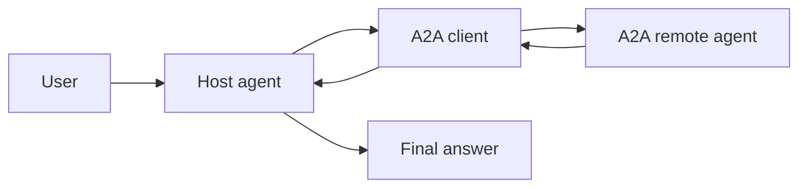
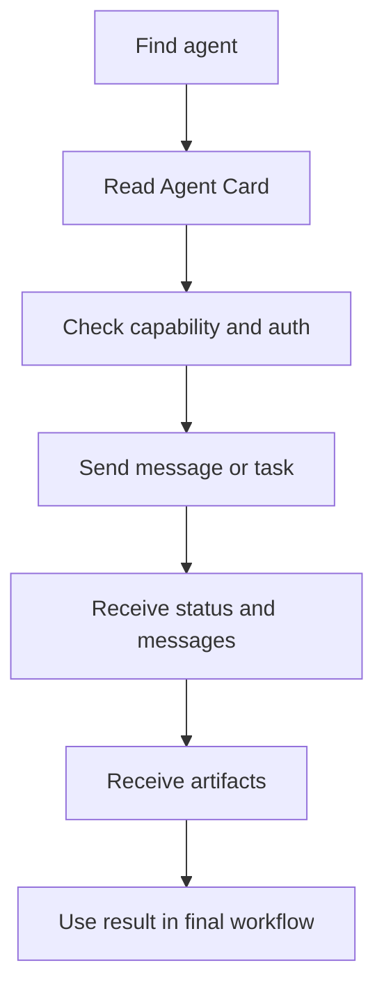

# A2A Protocol

<div class="topic-page" markdown="1">

<section class="topic-hero">
  <span class="topic-hero__eyebrow">Stage 10 - Multi-Agent Systems</span>
  <p class="topic-hero__lead">A2A, or Agent2Agent, is a protocol for communication between agents. It helps one agent discover another agent, understand what it can do, send it a task, receive updates, and use the final result.</p>
  <div class="topic-hero__facts">
    <span>Agent-to-agent</span>
    <span>Discovery</span>
    <span>Tasks</span>
    <span>Messages</span>
    <span>Artifacts</span>
  </div>
</section>

## Goal

Understand A2A as a beginner-friendly protocol for multi-agent systems.

After this lesson, you should be able to explain:

- what A2A is,
- why agent-to-agent communication needs a protocol,
- how A2A differs from MCP,
- what Agent Cards, tasks, messages, parts, and artifacts mean,
- when A2A is useful,
- when A2A adds unnecessary complexity,
- how to design a simple A2A-style workflow.

## Before You Start

You already know that an agent can use tools.

For example:

```text
Agent
  -> search tool
  -> result
  -> final answer
```

A2A is different. It is for one agent talking to another agent:

```text
Host agent
  -> remote specialist agent
  -> task updates and result
  -> host agent continues
```

The important rule:

```text
MCP helps agents connect to tools and resources.
A2A helps agents connect to other agents.
```

## Part 1: The Core Idea

**A2A** means **Agent2Agent**.

It is a protocol that gives agents a shared way to communicate even when they are built by different teams, frameworks, or vendors.

Simple definition:

```text
A2A is a standard communication layer that lets one agent discover another
agent, send it work, exchange messages, track progress, and receive outputs.
```

Without a protocol, every agent-to-agent connection can become a custom integration:

```text
Sales agent -> custom API for finance agent
Sales agent -> custom API for legal agent
Sales agent -> custom API for support agent
Support agent -> custom API for finance agent
```

A2A tries to make the interaction shape more consistent:

```text
Client agent
  -> read remote agent capability information
  -> send message or task
  -> receive status, messages, and artifacts
```

### Simple Picture



**How to read this diagram:** the user talks to the host agent. The host agent uses A2A to communicate with a remote agent. The remote agent does its part and sends useful output back.

## Part 2: Why A2A Exists

Multi-agent systems become difficult when agents cannot understand how to work with each other.

A useful agent-to-agent protocol should answer questions like:

- How does an agent advertise what it can do?
- How does another agent find the right endpoint?
- How should work be sent?
- How is progress tracked?
- How are files, structured data, or final outputs returned?
- How does authentication work?
- How can long-running work send updates?

A2A gives names and structures to these problems.

| Problem | What A2A Helps Define |
| --- | --- |
| Discovery | How a client finds a remote agent and reads its capabilities |
| Capability description | What the remote agent can do and how to call it |
| Task management | How work is created, tracked, updated, and completed |
| Collaboration | How agents exchange messages during the task |
| Output handling | How final results are returned as artifacts |
| Security | How authentication and authorization requirements are advertised |
| Long-running work | How agents can stream or push updates while work continues |

Beginner shortcut:

```text
A2A is useful when "call another agent" should be more structured than
"send a vague prompt to another chatbot."
```

## Part 3: A2A vs MCP And Core Concepts

A2A and MCP solve different connection problems.

| Question | MCP | A2A |
| --- | --- | --- |
| Main purpose | Connect models or agents to tools, data, prompts, and resources | Connect agents to other agents |
| Common direction | Agent -> tool server | Agent -> remote agent |
| What is being called | A tool, resource, or prompt | Another agentic system |
| Output shape | Tool result, resource content, prompt content | Messages, task state, artifacts |
| Best for | Files, databases, APIs, search, local capabilities | Delegation, collaboration, remote specialist agents |

Example with MCP:

```text
Research agent
  -> MCP server
  -> read private documents
  -> summarize findings
```

Example with A2A:

```text
Manager agent
  -> A2A research agent
  -> asks for a competitor summary
  -> receives a report artifact
```

They can be used together:

```text
Host agent
  -> A2A remote research agent
       -> MCP document server
       -> MCP search server
       -> creates research artifact
  -> host agent writes final answer
```

The remote agent may use MCP internally, but the host agent does not need to know every tool the remote agent used.

### Core A2A Concepts

A2A has a few key building blocks.

| Concept | Simple Meaning | Beginner Example |
| --- | --- | --- |
| A2A client | The app or agent that starts the request | A host agent asking for help |
| A2A server | The remote agent that receives and processes work | A specialist research agent |
| Agent Card | A JSON description of the remote agent | "I can summarize legal contracts" |
| Skill | A capability the remote agent offers | `contract_summary` |
| Message | A communication turn between client and remote agent | "Please review this contract" |
| Part | One piece of content inside a message or artifact | Text, file reference, or JSON data |
| Task | A unit of work tracked by the protocol | `task_123` for contract review |
| Artifact | A final or useful output from the task | Summary report, spreadsheet, image, JSON result |

### Agent Card

An Agent Card is like a public profile for an agent.

It can describe:

- the agent name,
- what the agent does,
- available skills,
- service endpoint,
- supported protocols or transports,
- authentication requirements,
- whether streaming or push updates are supported.

Simple Agent Card shape:

```json
{
  "name": "Contract Review Agent",
  "description": "Reviews contracts and returns risk summaries.",
  "url": "https://agents.example.com/contract-review",
  "skills": [
    {
      "id": "summarize_contract",
      "description": "Summarize a contract and identify important risks."
    }
  ]
}
```

The exact schema can evolve, so treat this as a learning example, not a copy-paste production card.

### Task

A task is the work item.

```text
Task:
  Review this vendor contract and return the top risks.
```

A task lets both sides track progress:

```text
submitted -> working -> input required -> completed
```

The remote agent may finish quickly, or it may need time, more messages, tool calls, or human approval.

### Message, Part, and Artifact

A message is a communication turn.

A part is one unit inside a message.

An artifact is an output from the task.

Example:

```text
Message:
  "Review this contract."

Parts:
  - text instructions
  - file reference to contract.pdf

Artifact:
  risk_summary.md
```

This matters because agents do not only exchange plain text. They may exchange files, structured JSON, images, forms, or reports.

## Part 4: Basic Flow, Design, And Failure Modes

A simple A2A flow has six steps.



| Step | What Happens | Example |
| --- | --- | --- |
| 1. Discover | Host finds a remote agent | Read an Agent Card URL |
| 2. Select | Host checks whether the agent fits the task | Agent offers `market_research` |
| 3. Authenticate | Host uses the required auth method | API key, OAuth, or enterprise identity |
| 4. Send work | Host sends a message or task | "Compare these three competitors" |
| 5. Track progress | Remote agent sends state or messages | "Collecting pricing pages" |
| 6. Use output | Host receives artifact and continues | Comparison table becomes part of final answer |

### Trace Example

```text
User:
  Compare these three vendors and recommend one.

Host agent:
  I need a specialist that can perform vendor research.

A2A discovery:
  Read Agent Card for Vendor Research Agent.

Agent Card:
  Skills: vendor_research, pricing_comparison, risk_summary

Host agent:
  Send task: compare vendors A, B, and C for price, features, and risks.

Remote agent:
  Status: working.

Remote agent:
  Artifact: vendor_comparison_table.json

Host agent:
  Uses the artifact to write the final recommendation for the user.
```

### When To Use A2A

Use A2A when the other side is truly another agent, not just a function.

Good use cases:

- a company has specialist agents owned by different teams,
- one product needs to delegate work to another agent platform,
- a host agent needs long-running specialist work,
- agents need to exchange structured outputs or files,
- different vendors or frameworks need to interoperate,
- a remote agent should hide its internal tools and workflow,
- a task needs progress updates, artifacts, or multi-turn collaboration.

| Situation | A2A Fit? | Why |
| --- | --- | --- |
| Call a calculator | No | A normal tool is simpler |
| Query a database | Usually no | MCP or a database tool fits better |
| Ask a specialist agent to perform research | Yes | The remote agent has its own workflow |
| Route support from one specialist to another | Maybe | A2A can carry the task, but a handoff pattern may also be needed |
| Coordinate agents across vendors | Yes | Interoperability is the point |
| Run a fixed three-step workflow | Usually no | A normal workflow is easier to control |

Beginner rule:

```text
Use A2A when you need agent collaboration.
Do not use A2A just to avoid writing a normal API or tool schema.
```

### Design A Simple A2A Interaction

Before you build an A2A-style connection, define the interaction clearly.

| Design Question | Why It Matters | Example |
| --- | --- | --- |
| Which agent is the client? | Someone must start and own the request | Host planning agent |
| Which agent is remote? | The remote side must expose capabilities | Compliance review agent |
| What skill is needed? | Prevents vague delegation | `review_policy_change` |
| What input is required? | Avoids missing context | Policy draft, jurisdiction, audience |
| What output is expected? | Makes the artifact usable | Risks, required edits, confidence |
| How is progress tracked? | Supports long-running work | Task status updates |
| What requires approval? | Keeps high-impact actions controlled | Publishing policy changes |
| What happens on failure? | Prevents silent broken workflows | Retry once, then escalate |

### Example Interaction Contract

```yaml
remote_agent: Compliance Review Agent
skill: review_policy_change
purpose: Review a draft policy change before publication.
input:
  policy_draft: markdown
  region: string
  intended_audience: string
output_artifact:
  type: application/json
  fields:
    summary: string
    risks: array
    required_changes: array
    confidence: number
limits:
  timeout_minutes: 10
  max_follow_up_messages: 3
approval:
  required_before: publish_policy
failure_behavior:
  - If the remote agent cannot review the region, ask for a different reviewer.
  - If the artifact is missing required fields, request one correction.
```

### Common Failure Modes

A2A makes communication more structured, but it does not automatically make a multi-agent system reliable.

| Failure Mode | What It Looks Like | Guardrail |
| --- | --- | --- |
| Wrong agent selected | Host sends legal work to a finance agent | Check Agent Card skills before sending |
| Vague task | Remote agent returns a generic answer | Send clear goal, context, and output format |
| Missing authentication | Request fails or leaks implementation details | Validate auth requirements before sending work |
| Over-sharing context | Host sends private data the remote agent does not need | Minimize input data |
| No task tracking | Host cannot tell whether work is still running | Use task IDs and status states |
| Duplicate work | Retry creates two real-world actions | Use idempotency keys for important operations |
| Unsafe remote action | Remote agent changes systems without approval | Require approval for high-impact actions |
| Artifact mismatch | Remote output cannot be parsed | Validate artifact schema before using it |
| Infinite delegation | Agents keep forwarding tasks to each other | Set delegation depth and time limits |

### Security Checklist

Use this checklist before connecting real agents:

- authenticate both sides,
- authorize which skills can be used,
- read and validate the Agent Card,
- send only necessary context,
- validate messages and artifacts,
- log task IDs, status changes, and final artifacts,
- set timeouts and retry limits,
- require human approval for external side effects,
- do not treat remote agent output as automatically true,
- monitor failed, slow, or repeated tasks.

## End Example: Support Agent Uses A2A Billing Agent

User says:

```text
I returned my headphones last week, but I still do not see the refund.
Can you check what happened?
```

Step-by-step A2A workflow:

```text
1. Support host agent receives the user request.

2. It decides the task needs billing expertise.

3. It reads the Billing Agent Card.

4. It checks that the billing agent has a refund_status skill.

5. It sends a task with only the needed context:
   - order ID
   - return date
   - user's account reference

6. Billing agent works on the task and sends status updates.

7. Billing agent returns an artifact:
   refund_status_report.json

8. Support host agent reads the artifact and answers the user.
```

The user does not need to know every protocol detail. The value is that the host agent can ask the right specialist agent in a structured, trackable way.

## Practice

### Exercise 1: MCP or A2A

Choose whether each situation is better described as MCP or A2A.

| Situation | MCP or A2A? | Reason |
| --- | --- | --- |
| An agent reads local files through a file server |  |  |
| A planner agent asks a remote travel agent to build an itinerary |  |  |
| A model calls a database query tool |  |  |
| A support agent sends a refund-status task to a billing agent |  |  |
| A research agent retrieves documents from a vector database |  |  |

### Exercise 2: Design An Agent Card

Write a simple Agent Card for a "Security Review Agent."

Include:

- agent name,
- short description,
- two skills,
- endpoint,
- authentication requirement,
- one expected artifact type.

### Exercise 3: Spot The Weak A2A Task

Improve this task request:

```text
Can you look at this and tell me what you think?
```

Make it include:

- goal,
- relevant context,
- expected output,
- deadline or timeout,
- what the remote agent should not do.

## Exit Criteria

You understand this topic when you can:

- define A2A as agent-to-agent communication,
- explain how it differs from MCP,
- describe what an Agent Card is,
- explain tasks, messages, parts, and artifacts,
- draw a simple A2A flow,
- identify when A2A is useful,
- identify when a normal tool or workflow is simpler,
- name at least three guardrails for safe A2A use.

## Further Reading

- [A2A Protocol Specification](https://github.com/a2aproject/A2A/blob/main/docs/specification.md)
- [Google Developers Blog: Announcing the Agent2Agent Protocol](https://developers.googleblog.com/en/a2a-a-new-era-of-agent-interoperability/)
- [A2A Protocol Project](https://github.com/a2aproject/A2A)

</div>
