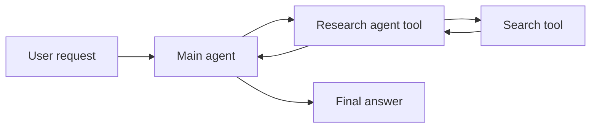

# Agents As Tools

<div class="topic-page" markdown="1">

<section class="topic-hero">
  <span class="topic-hero__eyebrow">Stage 10 - Multi-Agent Systems</span>
  <p class="topic-hero__lead">Agents as tools is a design where a main agent calls a specialist agent the same way it would call a calculator, search tool, or API. The specialist agent does focused work internally and returns a result. It does not take over the conversation.</p>
  <div class="topic-hero__facts">
    <span>Main agent</span>
    <span>Tool-agent</span>
    <span>Focused prompt</span>
    <span>Input/output</span>
    <span>No takeover</span>
  </div>
</section>

## Goal

Understand how one agent can use another agent as a tool.

After this lesson, you should be able to explain:

- what "agents as tools" means,
- how it differs from handoffs,
- why a specialist agent can be useful,
- what input and output should look like,
- when this pattern is appropriate,
- when a normal tool or function is enough.

## Before You Start

You already know that agents can call tools.

For example:

```text
Main agent
  -> calculator tool
  -> result
  -> final answer
```

In "agents as tools", the tool is itself an agent:

```text
Main agent
  -> research agent as a tool
  -> research result
  -> final answer
```

The important rule:

```text
The main agent stays in control.
The tool-agent only returns an output.
```

## Part 1: The Core Idea

A normal tool is usually a function:

```text
calculate_total(items) -> number
```

A tool-agent is more flexible. It can reason, use its own tools, and perform a small workflow internally.

```text
research_topic(topic) -> concise research notes
```

Simple definition:

```text
Agents as tools means the main agent can call a specialist agent through a
tool-like interface and receive a result without giving up control.
```

### Simple Picture



**How to read this diagram:** the user talks to the main agent. The main agent calls the research agent as a tool. The research agent may do internal work, then returns a result to the main agent.

## Part 2: Agents As Tools vs Handoffs

This is the most important distinction.

| Pattern | Who controls the conversation? | What does the specialist return? |
| --- | --- | --- |
| Agents as tools | Main agent | A result |
| Handoff | Specialist agent | The specialist continues the task |

Agents as tools:

```text
Main agent:
  "Research this topic and return five facts."

Research agent:
  "Here are five facts."

Main agent:
  Writes final answer to the user.
```

Handoff:

```text
Main agent:
  "This is a billing issue. Billing agent, take over."

Billing agent:
  Continues the conversation with the user.
```

Beginner shortcut:

```text
Agents as tools means "do this and report back."
Handoff means "you are now in charge."
```

## Part 3: Why Use An Agent Instead Of A Normal Tool

Use a normal tool when the task is deterministic.

Examples:

- add numbers,
- fetch an order,
- search a database,
- send an email,
- create a ticket.

Use an agent as a tool when the subtask needs judgment.

Examples:

- compare several sources,
- inspect a bug report and suggest likely causes,
- turn raw notes into a structured summary,
- review a draft against a checklist,
- choose which internal tools to call for a narrow task.

| Use A Normal Tool When | Use An Agent Tool When |
| --- | --- |
| The steps are fixed | The subtask needs reasoning |
| The output is simple data | The output needs synthesis |
| No model judgment is needed | The agent must decide how to solve the subtask |
| You need maximum reliability | You need flexible specialist behavior |

Beginner rule:

```text
Do not wrap every function as an agent.
Use an agent tool only when the subtask benefits from its own reasoning loop.
```

## Part 4: Designing A Good Agent Tool

A tool-agent should still feel like a tool to the main agent.

That means it needs:

- a clear name,
- a short description,
- simple input fields,
- a predictable output format,
- boundaries on what it may do,
- limits on cost, time, and retries.

Example tool-agent interface:

```json
{
  "name": "review_draft",
  "description": "Review a draft for clarity, missing facts, and unsafe claims.",
  "input_schema": {
    "draft": "string",
    "audience": "string",
    "checklist": "array of strings"
  },
  "output_schema": {
    "summary": "string",
    "issues": "array of strings",
    "recommended_changes": "array of strings"
  }
}
```

The main agent should not need to know how `review_draft` works internally. It only needs to know what input to send and what output to expect.

### Common Beginner Mistakes

| Mistake | What Goes Wrong | Better Choice |
| --- | --- | --- |
| Tool-agent has no clear output | Main agent cannot use the result | Return structured data |
| Tool-agent can do too much | It becomes unpredictable | Give it one narrow job |
| Main agent exposes all context | More tokens and more risk | Send only relevant context |
| Tool-agent talks to user | Confusing ownership | Main agent owns user conversation |
| Normal tool would be enough | Extra cost and latency | Use a function when steps are fixed |

## End Example: Writer Agent Using A Research Agent Tool

User asks:

```text
Write a short article explaining why backups matter for small businesses.
```

The main agent is a writing agent. It can write clearly, but it wants a few facts first.

It calls a research agent tool:

```text
Tool call:
  research_agent(
    topic="why backups matter for small businesses",
    audience="beginners",
    output="5 practical facts and 3 common risks"
  )
```

The research agent works internally:

```text
Research agent:
  - searches relevant material,
  - compares the notes,
  - removes weak claims,
  - returns concise facts.
```

Tool result:

```text
Facts:
  1. Backups help recover from accidental deletion.
  2. Backups reduce downtime after device failure.
  3. Offsite backups help when a laptop or office system is lost.

Risks:
  1. Backups that are never tested may fail when needed.
  2. One local backup can be lost with the original device.
  3. Sensitive backup data needs access control.
```

Then the main writing agent uses those notes to write the article.

The key idea is simple:

```text
The research agent does focused work in the background.
The writing agent still owns the final answer.
```

</div>
