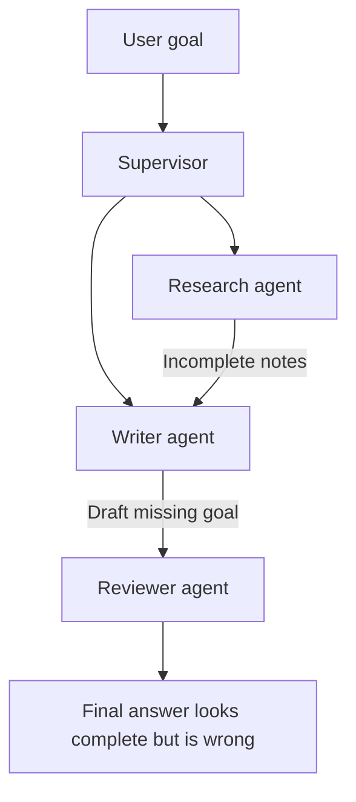

# Coordination Failure Modes

<div class="topic-page" markdown="1">

<section class="topic-hero">
  <span class="topic-hero__eyebrow">Stage 10 - Multi-Agent Systems</span>
  <p class="topic-hero__lead">Coordination failure modes are the ways multi-agent systems break when agents do not share goals, context, ownership, timing, or boundaries clearly. Most failures are not caused by one bad answer. They come from agents misunderstanding how to work together.</p>
  <div class="topic-hero__facts">
    <span>Role confusion</span>
    <span>Bad handoffs</span>
    <span>State drift</span>
    <span>Duplicate work</span>
    <span>Unsafe action</span>
  </div>
</section>

## Goal

Understand the common ways multi-agent systems fail and how to design guardrails before those failures happen.

After this lesson, you should be able to explain:

- what a coordination failure is,
- why multi-agent systems fail differently from single-agent systems,
- how role confusion, bad handoffs, stale state, and duplicated work happen,
- how communication style affects reliability,
- how to detect coordination problems,
- how to prevent common failures with simple design rules.

## Before You Start

Multi-agent systems can look powerful because several agents can work together.

But adding agents also adds coordination problems:

```text
One agent:
  One goal, one context, one action path.

Multiple agents:
  Many roles, many contexts, many messages, many possible misunderstandings.
```

The beginner rule:

```text
Every extra agent adds another place where ownership, context, timing,
permissions, or output format can break.
```

Do not judge a multi-agent system only by whether each individual agent works. Judge it by whether the agents work together correctly.

## Part 1: The Core Idea

A **coordination failure** happens when agents are individually doing something reasonable, but the overall system behaves badly because the agents are not aligned.

Simple definition:

```text
A coordination failure is a system-level failure caused by unclear roles,
missing context, inconsistent state, weak handoffs, or uncontrolled agent
interaction.
```

Example:

```text
Research agent:
  Finds three sources.

Writer agent:
  Writes a draft from only one source.

Reviewer agent:
  Reviews the draft but never sees the original goal.

Final answer:
  Looks polished, but misses the user's main requirement.
```

No single agent obviously crashed. The failure came from the coordination between them.

### Simple Picture



**How to read this diagram:** each agent did a task, but missing context moved through the system until the final answer became wrong.

## Part 2: Why Multi-Agent Systems Fail

A single-agent system can fail by hallucinating, choosing the wrong tool, or misunderstanding the user.

A multi-agent system can fail in those same ways, plus new ways:

| Failure Source | Single Agent | Multi-Agent System |
| --- | --- | --- |
| Goal misunderstanding | Agent misunderstands the user | One agent understands, another receives a distorted version |
| Context loss | Agent forgets important information | Context is dropped between agents |
| Tool misuse | Agent calls the wrong tool | Wrong agent gets a tool or permission |
| State error | Agent tracks state incorrectly | Agents disagree about shared state |
| Output mismatch | Final answer has wrong format | One agent returns data the next agent cannot use |
| Control problem | Agent keeps looping | Agents keep delegating, retrying, or waiting on each other |

The larger the system, the more important coordination becomes.

```text
Multi-agent quality = individual agent quality + communication quality +
state quality + ownership quality + stop rules.
```

## Part 3: Common Failure Modes

### 1. Role Confusion

Role confusion happens when agents do not know what they own.

Example:

```text
Research agent writes the final answer.
Writer agent repeats research.
Reviewer agent edits content instead of reviewing it.
```

| Symptom | Cause | Guardrail |
| --- | --- | --- |
| Agents duplicate work | Roles overlap too much | Define one responsibility per agent |
| Agents overwrite each other | No ownership rule | Assign fields or outputs to specific agents |
| Nobody completes the final answer | No final owner | Name the agent responsible for synthesis |
| Agent refuses useful work | Role is too narrow or unclear | Define allowed and disallowed actions |

Good role instruction:

```text
You are the reviewer.
Your job is to identify missing requirements, unsupported claims, and format errors.
Do not rewrite the full draft unless explicitly asked.
Return review notes only.
```

### 2. Bad Handoff

A bad handoff happens when one agent transfers work without enough context.

Weak handoff:

```text
Front desk agent:
  "This is a billing issue. Take it."
```

Better handoff:

```json
{
  "reason": "User asks why refund has not arrived.",
  "user_goal": "Check refund status for order A102.",
  "known_facts": {
    "order_id": "A102",
    "return_received": "2026-06-04"
  },
  "open_question": "Was the refund processed by the payment provider?"
}
```

| Missing Handoff Data | What Goes Wrong |
| --- | --- |
| Original user goal | Receiving agent solves the wrong problem |
| Reason for handoff | Receiving agent does not know why it is involved |
| Known facts | User has to repeat information |
| Completed actions | Agent repeats previous work |
| Open questions | Agent misses the next useful step |
| Safety limits | Agent may take an unauthorized action |

### 3. State Drift

State drift happens when agents disagree about what is true.

Example:

```text
Planner state:
  Draft is ready for review.

Writer state:
  Draft is still incomplete.

Reviewer state:
  Review is complete.

Supervisor:
  Publishes an outdated draft.
```

State drift is common when:

- agents keep separate memory,
- shared state is not updated consistently,
- old messages are treated as current,
- retries create duplicate state,
- agents write to the same fields without conflict rules.

Guardrails:

- keep one source of truth for task status,
- add timestamps or version numbers,
- log which agent changed each field,
- make updates structured,
- validate state before high-impact actions.

### 4. Duplicate Work

Duplicate work happens when multiple agents perform the same task without realizing it.

Example:

```text
Research agent A searches pricing.
Research agent B also searches pricing.
Both return different notes.
Writer combines both and creates inconsistent claims.
```

Duplicate work wastes cost and can create conflicting outputs.

| Cause | Prevention |
| --- | --- |
| No task assignment record | Track assigned, in-progress, and completed tasks |
| Supervisor retries without checking status | Use task IDs and status checks |
| Agents independently decide next steps | Centralize planning or use explicit message passing |
| No idempotency key for actions | Use idempotency keys for external changes |

### 5. Conflicting Outputs

Conflicting outputs happen when agents return answers that cannot both be true or cannot be combined cleanly.

Example:

```text
Pricing agent:
  "Vendor A is cheapest."

Risk agent:
  "Vendor A requires the highest support cost."

Writer:
  "Vendor A is clearly the best choice."
```

The writer ignored the conflict instead of resolving it.

Guardrails:

- require agents to include confidence and evidence,
- make the synthesizer compare disagreements,
- ask a reviewer to check contradictions,
- escalate unresolved conflicts,
- do not hide uncertainty in the final answer.

### 6. Output Format Mismatch

Output format mismatch happens when one agent returns data the next agent cannot use.

Example:

```text
Expected:
  JSON list of risks.

Actual:
  Long paragraph with no fields.
```

This failure is simple but common.

Use output contracts:

```json
{
  "summary": "string",
  "risks": ["string"],
  "missing_information": ["string"],
  "confidence": 0.0
}
```

Then validate the output before passing it to the next agent.

### 7. Deadlock

Deadlock happens when agents wait on each other and no one moves the task forward.

Example:

```text
Planner waits for reviewer approval.
Reviewer waits for writer draft.
Writer waits for planner details.
No agent asks the user or changes strategy.
```

Guardrails:

- define who owns the next action,
- set timeouts,
- use a supervisor or scheduler,
- allow agents to ask for missing information,
- stop safely when progress is blocked.

### 8. Runaway Delegation

Runaway delegation happens when agents keep passing work to other agents.

Example:

```text
Supervisor -> Research agent
Research agent -> Web agent
Web agent -> Source-checking agent
Source-checking agent -> Research agent
Research agent -> Web agent again
```

This can waste tokens, money, and time.

Guardrails:

- set maximum delegation depth,
- set maximum loop iterations,
- track repeated tasks,
- require a reason before delegation,
- force final synthesis after enough evidence is collected.

### 9. Permission Leakage

Permission leakage happens when an agent receives tools or data it does not need.

Example:

```text
Reviewer agent only needs to review a draft.
It also receives the tool to publish the draft.
```

This creates unnecessary risk.

Guardrails:

- give each agent the minimum tools it needs,
- separate read tools from write tools,
- require approval for irreversible actions,
- avoid sending private context to unrelated agents,
- log every external action.

### 10. No Clear Stop Rule

A multi-agent workflow can keep working after the useful work is done.

Example:

```text
Research is complete.
Writer drafts answer.
Reviewer asks for more research.
Researcher adds minor facts.
Writer rewrites.
Reviewer asks again.
```

Guardrails:

- define done criteria,
- stop after a maximum number of iterations,
- stop when improvement becomes small,
- stop when required evidence is collected,
- ask the user when the next step changes the scope.

## Part 4: Detecting And Preventing Coordination Problems

You need visibility into the system to diagnose coordination failures.

Useful logs:

- which agent acted,
- what task it received,
- what context it received,
- what tool it used,
- what output it returned,
- what state changed,
- who owns the next step,
- why the system stopped.

### Coordination Trace

Instead of logging only final answers, log the handoffs and state changes.

```text
Task ID: report_42

1. Supervisor assigned competitor research to Research Agent.
2. Research Agent returned 3 sources and 2 open questions.
3. Supervisor assigned draft writing to Writer Agent.
4. Writer Agent used only 1 source.
5. Reviewer flagged missing source coverage.
6. Supervisor sent draft back to Writer Agent with required fix.
7. Writer Agent produced final draft.
8. Supervisor stopped because exit criteria were met.
```

This trace makes the failure visible:

```text
Writer Agent used only 1 source.
```

Without a trace, the final answer might look complete even though the workflow failed.

### Prevention Checklist

Use this checklist before building a multi-agent workflow.

| Design Question | Good Answer |
| --- | --- |
| Who owns the user goal? | One supervisor, host agent, or workflow controller |
| What is each agent responsible for? | One clear role per agent |
| What context does each agent receive? | Only the context needed for its task |
| What output format is expected? | A structured contract or clear message format |
| How is state stored? | One source of truth or explicit message trail |
| Who can change state? | Only agents with permission for specific fields |
| What requires approval? | Sending, deleting, buying, publishing, production changes |
| How are conflicts resolved? | Reviewer, supervisor rule, or user escalation |
| What ends the workflow? | Done criteria, max steps, timeout, or safety stop |
| How is the workflow debugged? | Logs for tasks, messages, tools, state, and artifacts |

### Simple Design Template

```text
Workflow name:
User goal:
Final owner:

Agents:
- Agent name:
  Role:
  Allowed tools:
  May read:
  May write:
  Expected output:

State:
- Source of truth:
- Version or timestamp rule:
- Conflict rule:

Handoffs:
- Required fields:
- Who can hand off:
- Who accepts handoff:

Stop rules:
- Success:
- Max iterations:
- Timeout:
- Escalation:
```

## End Example: Report Team Failure

User asks:

```text
Create a short report comparing three project management tools.
Include pricing, strengths, weaknesses, and a recommendation.
```

Weak coordination:

```text
1. Supervisor asks Research Agent for notes.
2. Research Agent returns pricing only.
3. Writer Agent writes a report from pricing notes.
4. Reviewer Agent checks grammar only.
5. Final report misses strengths and weaknesses.
```

The failure:

```text
The system completed the workflow, but not the user's goal.
```

Better coordination:

```text
1. Supervisor creates required fields:
   pricing, strengths, weaknesses, recommendation.

2. Research Agent must fill all fields or mark missing information.

3. Writer Agent may only draft after required fields exist.

4. Reviewer Agent checks the draft against the original user goal.

5. Supervisor stops only when all required fields are present.
```

The fix is not "add smarter agents." The fix is clearer coordination.

## Practice

### Exercise 1: Name The Failure

Identify the coordination failure mode.

| Scenario | Failure Mode |
| --- | --- |
| Two agents both email the same customer with different answers |  |
| A billing agent receives a handoff without the order ID |  |
| A reviewer publishes a draft even though it only needed to review it |  |
| A writer receives notes as paragraphs but expected structured JSON |  |
| Agents keep sending the task to each other without finishing |  |

### Exercise 2: Improve The Handoff

Improve this weak handoff:

```text
This is technical. Please handle it.
```

Add:

- reason for handoff,
- user goal,
- known facts,
- completed actions,
- open questions,
- safety or permission limits.

### Exercise 3: Add Guardrails

For this workflow, write three guardrails:

```text
Supervisor -> Research Agent -> Writer Agent -> Reviewer Agent -> Final Answer
```

At least one guardrail should control state, one should control output format, and one should control stopping.

## Exit Criteria

You understand this topic when you can:

- define a coordination failure,
- explain why multi-agent systems add new failure modes,
- identify role confusion, bad handoffs, state drift, duplicate work, deadlock, and runaway delegation,
- explain how output contracts prevent format mismatch,
- design a basic handoff packet,
- name useful logs for debugging coordination,
- write stop rules for a multi-agent workflow.

</div>
